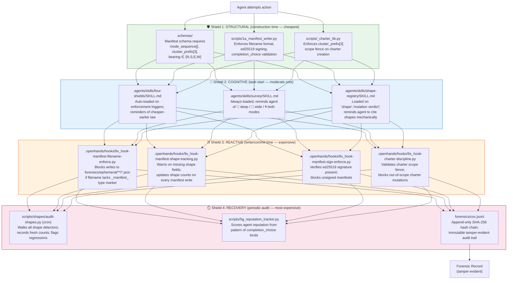
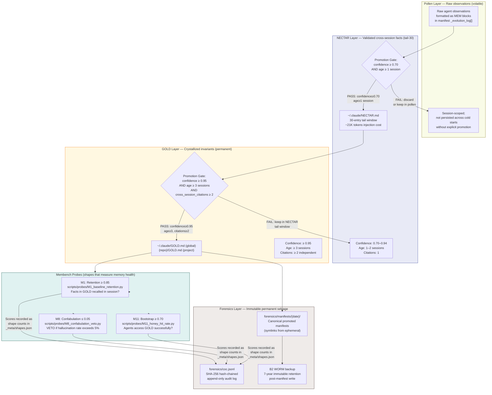
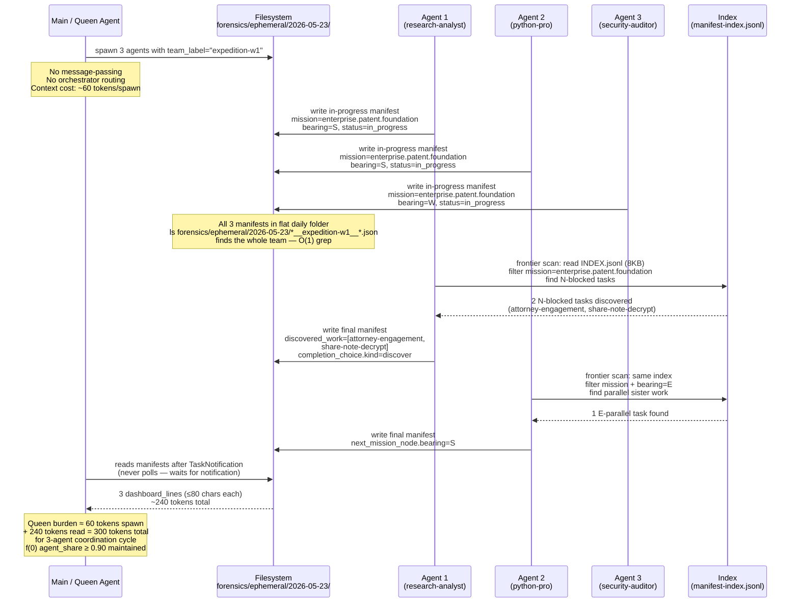
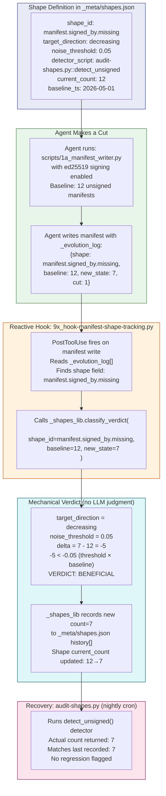

# PATENT PROVISIONAL SPECIFICATION
## Autonomous Multi-Agent Orchestration System with Hierarchical Memory Promotion, Stigmergic Filesystem Coordination, Four-Layer Enforcement Stack, and Mechanical Quality Classification

**Filing type:** Provisional Application for Patent
**Filing basis:** 35 U.S.C. § 111(b)
**Cover sheet:** USPTO Form SB/16 (PTO/SB/16) — attach separately
**Entity status:** Individual inventors (micro entity filing recommended — verify current qualification criteria at USPTO fee schedule)
**Filed by:** [INVENTOR 1 NAME — OPEN QUESTION] and [INVENTOR 2 NAME — OPEN QUESTION], joint inventors
**Note:** This is a DRAFT specification prepared for attorney review. Inventor names, residence addresses, and entity information must be completed before filing.

---

### CROSS-REFERENCE TO RELATED APPLICATIONS

No prior provisional or non-provisional applications are claimed as priority. This application establishes the initial priority date for all subject matter described herein.

The inventors note that a related technical charter (`forensic-coc-v2-rekor`) covering a Merkle-tree-based forensic chain-of-custody architecture may be subject to a separate or combined provisional filing — this is an open question recorded in Section 7 (Open Questions for Attorney).

---

### FIELD OF THE INVENTION

This invention relates to multi-agent artificial intelligence orchestration systems, and more particularly to: (1) a hierarchical memory architecture with mechanical promotion gates between memory tiers; (2) a stigmergic agent coordination system using filesystem manifests as the sole coordination substrate; (3) a four-layer enforcement stack modeled on biological immune system defense; (4) a mechanical quality classification system using shape registries with declared target directions; and (5) a quality measurement substrate in which evaluation probes are themselves first-class shapes subject to the same mechanical classification. The invention further claims the novel combination of all five modules into a single coherent AI orchestration ecosystem.

---

### BACKGROUND OF THE INVENTION

**1. Problems in current AI agent memory systems**

Current large language model (LLM) agent systems suffer from memory degradation and hallucination caused by undifferentiated memory storage. Systems that store all observations in a single flat memory layer (e.g., a single vector database or a monolithic context window) fail to distinguish between raw unverified observations, validated cross-session facts, and immutable crystallized invariants. This causes several specific technical failures:

(a) **Stale memory contamination**: Observations that were valid in one session but later invalidated by new evidence continue to surface in retrieval, causing agents to act on outdated or contradictory beliefs. Current systems provide no mechanical gate between raw observations and the long-term memory store.

(b) **Hallucination amplification**: Without a promotion gate that requires minimum confidence score and cross-session citation count, low-confidence observations propagate into long-term memory and generate compounding errors across future sessions.

(c) **Context window saturation**: Flat memory architectures inject all historical observations into every agent's context at startup, consuming large fractions of the available token budget before any new work begins. A 200,000-token context window with naive memory injection may be 60-80% consumed by historical data before the agent performs its first action.

(d) **No measurement substrate**: Current systems lack a mechanical substrate linking memory operations to measurable quality outputs. There is no programmatic way to assert "memory promotion improved agent quality" without manual evaluation.

**2. Problems in current multi-agent coordination systems**

Current multi-agent AI systems rely on one of two coordination patterns, both of which introduce serious bottlenecks:

(a) **Orchestrator/router pattern**: A central orchestrator LLM receives all agent requests, routes them to worker agents, and aggregates results. This creates a single point of failure, a throughput bottleneck, and imposes LLM inference cost on every inter-agent communication. Scaling to N agents scales the orchestrator linearly.

(b) **Message-passing pattern**: Agents communicate via message queues or direct API calls. This requires agents to maintain awareness of each other's addresses and availability, creating tight coupling. Message-passing systems fail silently when an agent is unavailable, and produce race conditions when multiple agents attempt to update shared state concurrently.

Neither pattern enables true emergent coordination — the ability for agents to discover each other's work and self-route to unblocked tasks without explicit scheduling.

**3. Problems in current AI safety enforcement systems**

Current AI safety systems apply enforcement reactively — monitoring outputs after they are produced and flagging violations. This reactive-only approach has two fundamental problems:

(a) **Cost at the wrong layer**: Catching a harmful output after generation is maximally expensive in terms of compute, latency, and potential damage. Prevention before generation is orders of magnitude cheaper but current systems rarely achieve structural prevention.

(b) **Whack-a-mole without immune memory**: Reactive systems catch specific known violations but do not build up a structural immune response. The same class of violation recurs in new forms because the underlying structural gap was never closed. Current systems have no analog to the biological immune system's memory T-cell mechanism that produces faster, stronger responses to previously-seen threats.

**4. Problems in current AI quality measurement**

Current AI system quality evaluation relies on human judgment or LLM-as-judge approaches. Both suffer from:

(a) **Vibe-based verdicts**: Human and LLM evaluators produce subjective assessments ("this looks better") that are not reproducible across sessions, not comparable across agents, and cannot drive automated improvement loops.

(b) **No genetic algorithm substrate**: Without integer-comparable, mechanically-produced quality signals, it is impossible to implement selection pressure that reliably improves agent behavior over time. Genetic algorithm-style improvement requires fitness functions that are deterministic, comparable, and not dependent on human judgment for each evaluation.

---

### SUMMARY OF THE INVENTION

The present invention provides an autonomous multi-agent orchestration system comprising five novel technical modules and a combination claim covering their integration:

**Module 1 — Hierarchical Memory Architecture with Mechanical Promotion Gates**
A three-tier memory system (pollen → NECTAR → GOLD) with a separate immutable forensic layer (forensics/), in which promotion between tiers is governed by mechanical rules: minimum confidence score (≥0.95), minimum session age (≥3 sessions), and minimum independent cross-session citation count (≥2). Promotion is executed by a canonical script (`scripts/1a_manifest_writer.py`) that writes to an append-only chain-of-custody log (`forensics/coc.jsonl`) with SHA-256 hash linking between entries.

**Module 2 — Stigmergic Filesystem Coordination**
A multi-agent coordination architecture in which agents discover each other's work and self-route to unblocked tasks exclusively through shared filesystem artifacts (manifests). No message-passing, no central orchestrator, no inter-agent API calls. Agents write manifests to a flat daily folder (`forensics/ephemeral/{YYYY-MM-DD}/`) following a deterministic filename grammar. A frontier scanner (`scripts/2d_frontier_scanner_indexed.py`) enables O(1) lookup of unblocked tasks by reading an 8KB daily index rather than scanning all manifests, reducing context cost by approximately 80% versus naive full-manifest scanning.

**Module 3 — Four-Layer Enforcement Stack (Four-Shields)**
A discipline enforcement architecture modeled on biological immune system defense, comprising: (a) structural prevention (wrong behavior cannot be expressed, enforced by schema and canonical writer scripts); (b) cognitive reminder (skill files auto-loaded before action); (c) reactive blocking (PostToolUse hooks reject violations at OS write boundary); and (d) recovery audit (periodic batch scans that surface escaped violations and update reputation scores). Each layer is cheaper to operate than the next, and the four layers together provide defense-in-depth that no single layer can provide alone.

**Module 4 — Shape Registry with Mechanical Verdict Classification**
A quality classification system in which every recognizable, countable pattern of work ("shape") is declared in a registry (`_meta/shapes.json`) with a `target_direction` field (increasing/decreasing/bounded/stable). A reactive hook (`scripts/shapes/_shapes_lib.py::classify_verdict`) computes mutation verdicts (beneficial/neutral/harmful/uncertain) by comparing the observed count delta to the target direction and a noise threshold. No LLM judgment in the verdict path. Quality signals are integer-comparable across sessions, enabling genetic-algorithm-style improvement selection.

**Module 5 — Membench Quality Measurement Substrate**
A quality measurement architecture in which evaluation probes (M1 baseline retention, M8 confabulation veto, M11 honey hit rate, and their F-series internal mirrors) are themselves first-class shapes in the shape registry. This creates a closed loop between memory operations and quality measurement: memory promotion decisions directly affect probe scores, which are classified mechanically by the same shape-registry verdict system that classifies all other work patterns. The membench scorer (`scripts/3k_membench_scorer.py`) computes M3 (efficiency), SI (stigmergy index), and SBI (switchboard burden index) deterministically from fixed eval data, enabling reproducible T0 vs T1 comparison.

**Combination Claim — Overall Novel System**
The novel combination of all five modules into a single coherent AI orchestration ecosystem. Individual modules may be open-sourced; the combination claim retains patent protection over the integrated system design. This combination solves a set of problems no individual module addresses alone: the memory hierarchy provides the substrate that the measurement probes assess; the stigmergic coordination enables the swarm behavior that the four-shields stack governs; the shape registry provides the verdict mechanism that drives improvement of all the above.

---

### BRIEF DESCRIPTION OF DRAWINGS

Four diagrams are provided. Formal USPTO drawings are not required for provisional applications but are highly recommended. The following Mermaid-format diagrams may be rendered into figures for the non-provisional filing.

**Figure 1** — Four-Shields Lifecycle Enforcement Stack (Diagram A)
**Figure 2** — Memory Orchestration Hierarchy with Mechanical Promotion Gates (Diagram B)
**Figure 3** — Stigmergic Multi-Agent Coordination via Filesystem Manifests (Diagram C)
**Figure 4** — Shape Registry Mechanical Verdict Classification (Diagram D)

---

#### Figure 1 — Four-Shields Lifecycle Enforcement Stack



**Technical improvement:** This architecture eliminates the "reactive whack-a-mole" failure mode of enforcement systems that operate only at a single layer. By enforcing at construction time (schema), task-start (cognitive), write time (hook), and audit time (cron), the system catches violations at the cheapest possible layer. A violation caught by the structural schema costs approximately zero compute; the same violation caught post-generation by the recovery audit costs 1-2 orders of magnitude more.

---

#### Figure 2 — Memory Orchestration Hierarchy with Mechanical Promotion Gates



**Technical improvement:** The mechanical promotion gates eliminate the "stale memory contamination" failure mode. A fact cannot advance to GOLD without surviving 3 independent sessions and achieving 2 cross-session citations at confidence ≥ 0.95. This is not an LLM judgment — it is a mathematical threshold enforced by the `honey-confidence-floor.formula.json` rule evaluated by the canonical writer script. The NECTAR tail window (30 entries, ~21K tokens injection cost) prevents context saturation while maintaining session continuity.

---

#### Figure 3 — Stigmergic Multi-Agent Coordination via Filesystem Manifests



**Technical improvement:** This architecture eliminates the orchestrator/router bottleneck by removing the central coordinator entirely. Agents discover each other's work through the shared filesystem substrate, not through message-passing. The frontier scanner (`scripts/2d_frontier_scanner_indexed.py`) reads an 8KB daily index file rather than all manifests, reducing context cost by approximately 80% (from ~2,500KB naive to <100KB indexed). An N-agent team can coordinate at O(1) lookup cost via filename grammar matching (`ls *__{team-label}__*.json`).

---

#### Figure 4 — Shape Registry Mechanical Verdict Classification



**Technical improvement:** The mechanical verdict classification removes LLM judgment from the quality assessment path. The verdict (beneficial/neutral/harmful/uncertain) is computed by a mathematical comparison: `delta < -(noise_threshold × baseline)` → beneficial; `|delta| ≤ (noise_threshold × baseline)` → neutral; `delta > +(noise_threshold × baseline)` → harmful. This is deterministic, reproducible, and integer-comparable across sessions. The same classification applies to all shapes including membench probes, enabling genetic-algorithm-style improvement selection without human evaluation overhead.

---

### DETAILED DESCRIPTION OF THE PREFERRED EMBODIMENT

#### Section 1 — Memory Orchestration Architecture (Claim Area 1)

**Technical Problem:** Large language model agents operating across multiple sessions experience memory degradation caused by the absence of mechanical promotion gates between memory tiers. Current systems either inject all historical context into every session (causing context saturation and stale-data contamination) or discard all memory between sessions (causing agents to repeat failed experiments and re-derive known facts).

**Specific Implementation:**

The invention provides a four-tier memory architecture:

*Tier 1 — Pollen (volatile observations):* Raw agent observations formatted as MEM blocks embedded in manifest `_evolution_log[]` arrays. These are session-scoped; they do not persist to long-term memory without passing through the promotion gates.

*Tier 2 — NECTAR (validated cross-session facts):* A tail-windowed memory store (default: 30 entries, approximately 21,000 tokens injection cost at 700 tokens/entry average). Facts in NECTAR carry confidence scores in the range 0.70–0.94. The tail window (controlled by the `nectar-tail-window.formula.json` parameter, current default: 30 entries) prevents context saturation while maintaining cross-session continuity.

*Tier 3 — GOLD (crystallized permanent invariants):* A write-protected memory store containing only facts that have survived the following mechanical gate: confidence ≥ 0.95, session age ≥ 3 sessions, and independent cross-session citation count ≥ 2. These thresholds are encoded in `forensics/schemas/formulas/honey-confidence-floor.formula.json` and enforced by the canonical writer `scripts/1a_manifest_writer.py`. GOLD is stored at `~/.claude/GOLD.md` (global, all-projects) and `{repo}/GOLD.md` (project-specific). The project GOLD is read before the global GOLD; project-specific invariants take precedence.

*Tier 4 — Forensics (immutable permanent selvage):* The append-only chain-of-custody log (`forensics/coc.jsonl`) stores every memory operation. Each entry carries: SHA-256 hash of the previous entry, SHA-256 hash of the current entry's data, agent identifier, tool call type, file path, bytes changed, and an ed25519 signature from the writing agent's key. The hash formula is: `entry_N.hash = SHA-256(entry_{N-1}.hash || entry_N.data)`. This chain is tamper-evident: modifying any entry breaks all subsequent hashes. The chain is backed up to WORM (Write-Once-Read-Many) cloud storage (`B2 WORM` bucket with 7-year immutable retention policy) via `scripts/5x_b2_realtime_uploader.py` triggered on every manifest write.

**Promotion mechanics:** The canonical writer (`scripts/1a_manifest_writer.py`) evaluates the promotion gate criteria when an agent attempts to promote a pollen observation to NECTAR or a NECTAR entry to GOLD. The writer is the structural shield (🛡) for this discipline — a promotion that fails the confidence/age/citation gate cannot be written; the wrong thing cannot be expressed at the schema level.

**Technical Effect:** This architecture provides three measurable improvements: (1) elimination of stale-memory contamination by preventing sub-confidence observations from entering GOLD; (2) reduction of context window saturation from approximately 60-80% (naive injection) to approximately 10-15% (NECTAR tail-30 injection) of available token budget; (3) a measurable confabulation rate gate (M8 probe, threshold ≤ 0.05 hallucination rate) that vetoes agent operation if the memory system's accuracy falls below threshold.

**Working demonstration:** `scripts/probes/M1_baseline_retention.py`, `scripts/probes/M8_confabulation_veto.py`, `scripts/probes/M11_honey_hit_rate.py` are operational probe implementations running against the swarmy repository. The membench scorer (`scripts/3k_membench_scorer.py`) computes these metrics deterministically from fixed eval data, enabling reproducible T0 vs T1 comparison.

---

#### Section 2 — Stigmergic Agent Coordination (Claim Area 2)

**Technical Problem:** Multi-agent AI systems require coordination mechanisms that scale to N agents without creating a central bottleneck. Orchestrator/router patterns scale linearly with agent count; message-passing patterns create tight coupling and race conditions. Neither enables emergent self-routing.

**Specific Implementation:**

The invention provides a stigmergic coordination architecture in which the filesystem is the exclusive coordination substrate. No message-passing. No central orchestrator. No inter-agent API calls.

*Mission addressing (w3w grammar):* Every task is assigned a mission address consisting of exactly three atomic terms separated by dots (e.g., `enterprise.patent.foundation`). This "what-three-words" (w3w) addressing provides an adjacency property: missions sharing one term are neighbors; missions sharing two terms are in the same neighborhood; missions sharing all three terms are identical. Agents filter the frontier by mission address to discover relevant work without scanning all tasks.

*Manifest filename grammar:* Every manifest written by an agent follows the deterministic filename format: `{YYYYMMDD}T{HHMMSS}Z__{task_id}_{agent_type}_{mission}_{session_id8}.json`. This format is enforced by `scripts/1a_manifest_writer.py` (structural shield) and by `.openhands/hooks/9x_hook-manifest-filename-enforce.py` (reactive hook that blocks writes lacking the `_manifest_` type marker). The deterministic format enables grep-based discovery at zero context cost: `ls forensics/ephemeral/{date}/*__{team-label}__*.json` finds all manifests for a given team.

*Flat daily folder:* All manifests for a given day land in `forensics/ephemeral/{YYYY-MM-DD}/` — a single flat folder shared by all agents regardless of task or mission. This is the stigmergic substrate: agents leave markers (manifests) in the shared environment; other agents detect the markers and self-route to unblocked work. No per-agent subdirectories; no task-specific isolation.

*Compass bearings:* Every manifest carries a bearing field (N/S/E/W) encoding the work's relationship to the mission frontier: N = unblock upstream prerequisite; S = conclude / move downstream; E = parallel sister work at same DAG level; W = return to baseline / re-seat assumptions. The `bearing-diversity-entropy.formula.json` formula measures the Shannon entropy of bearing distribution (H = -Σp_i log₂ p_i where i ∈ {N,S,E,W}). Healthy mission graphs maintain entropy H ≥ 0.87 bits (target encoded in `scripts/3a_emergence_metrics.py`).

*Indexed frontier scanner:* The frontier scanner (`scripts/2d_frontier_scanner_indexed.py`) reads a daily 8KB index file (`forensics/ephemeral/{date}/INDEX.jsonl`) rather than scanning all manifests. The index aggregator pre-computes one summary line per manifest grouped by mission and bearing. This reduces frontier scan context cost from approximately 2,500KB (naive full-manifest scan) to approximately 100KB (indexed scan), an approximately 80% reduction.

*In-flight cap:* The manifest index enforcer (`scripts/9a_manifest_index_enforcer.py`) gates Agent() spawns by checking that `in_flight_count + agents_to_spawn ≤ 10` (the `in-flight-manifest-cap.formula.json` maximum). This prevents queue overload while maintaining the maximum parallelism the hash-chain integrity requires (COC append latency target: ≤100ms).

**Technical Effect:** The stigmergic architecture eliminates the orchestrator/router bottleneck entirely. An N-agent team coordinates through filesystem reads alone. The queen agent's burden (f(0) metric, computed as `agent_share = 1 - (main_ops / total_ops)`) targets agent_share ≥ 0.90 — meaning ≥90% of all operations are performed by subagents, leaving the main agent free for high-leverage spawning decisions rather than routing. The spawn cost to main is approximately 60 tokens per agent (baseline spawn: `cost_per_agent = 60` in `scripts/2a_spawn_pressure.py`).

**Working demonstration:** `scripts/2d_frontier_scanner_indexed.py` is the operational indexed frontier scanner. `scripts/2a_spawn_pressure.py` implements the sigmoid spawn pressure formula (`pressure = sigmoid(context_pct, midpoint=0.5, steepness=8.0)`) that gates spawn decisions to context-fill level.

---

#### Section 3 — Four-Layer Enforcement Stack (Claim Area 3)

**Technical Problem:** AI system safety and integrity enforcement that operates only at a single layer (e.g., output monitoring) is brittle, expensive, and reactive. Violations propagate until the monitoring layer catches them, by which point they may have caused significant downstream damage. No existing AI orchestration system models enforcement on the cheaper-earlier principle analogous to biological immune defense.

**Specific Implementation:**

The invention provides a four-layer enforcement stack in which each layer is cheaper to operate than the next, and all four layers together provide defense-in-depth that eliminates the "reactive whack-a-mole" failure mode.

*Layer 1 — Structural (🛡):* Violations cannot be produced at construction time. The canonical manifest writer (`scripts/1a_manifest_writer.py`) enforces schema at the point of generation: manifests without `cluster_prefix[3]`, without `bearing ∈ {N,S,E,W}`, without `mode_sequence[]`, without `completion_choice.kind` in the canonical six-choice vocabulary cannot be written. Charter creation (`scripts/_charter_lib.py`) enforces `cluster_prefix[3]` at charter genesis. Schema files in `forensics/schemas/` provide the structural definitions. This layer fires at construction time and costs approximately zero compute per enforcement.

*Layer 2 — Cognitive (🧠):* Skill files (`.agents/skills/{name}/SKILL.md`) carry `triggers:` keyword lists that cause them to auto-load when an agent's task description matches the trigger phrases. The four-shields skill itself auto-loads on "enforcement", "immune system", "four layer" triggers; the shape-registry skill auto-loads on "shape", "mutation verdict", "target_direction" triggers; the forage skill is always-loaded (no triggers needed). These skills remind agents of constraints before actions are taken. This layer fires at task-start and costs approximately one skill-file read per constraint.

*Layer 3 — Reactive (⛓):* PostToolUse hooks (`.openhands/hooks/*.py`) fire at the OS write boundary and can block writes that violate constraints. `9x_hook-manifest-filename-enforce.py` blocks writes to `forensics/ephemeral/**/*.json` that lack the `_manifest_` type marker in the filename. `9x_hook-manifest-shape-tracking.py` warns on `_evolution_log[]` entries missing numeric baseline/new_state fields. `9x_hook-manifest-sign-enforce.py` blocks unsigned manifests. This layer fires at write time and costs one hook execution per write.

*Layer 4 — Recovery (🪞):* Periodic batch audits (`scripts/shapes/audit-shapes.py` as nightly cron) scan all shape detectors, record fresh counts, and flag regressions. The reputation tracker (`scripts/5g_reputation_tracker.py`) scores agent reputation from patterns in completion_choice kinds over time. This layer fires asynchronously and catches violations that escaped the earlier layers; it also builds "immune memory" for recurring violation patterns.

**The biology framing (formally analogous):** Layer 1 = skin (physical barrier, prevents most insults without active sensing); Layer 2 = olfactory/chemical recognition (recognizes threat before contact, informs behavior); Layer 3 = innate immune response / antibody neutralization (specific threat neutralization on contact); Layer 4 = adaptive immunity / memory T-cell (learns patterns, responds faster and stronger to previously-seen threats).

**Technical Effect:** The four-layer stack implements the "cheaper-earlier is the law" principle mechanically. A violation caught by the structural schema (Layer 1) costs approximately 0 additional compute beyond the normal manifest write. The same violation caught by the recovery audit (Layer 4) costs 1-2 orders of magnitude more in compute, latency, and potential damage. By closing structural gaps at Layer 1, the system avoids accumulating Layer 4 workload. The disciplines table (`.agents/skills/four-shields/SKILL.md`) tracks which layers are active for each discipline, making enforcement gaps visible rather than hidden.

**Working demonstration:** `.openhands/hooks/9x_hook-manifest-filename-enforce.py` and `.openhands/hooks/9x_hook-manifest-shape-tracking.py` are operational reactive hooks. `scripts/shapes/audit-shapes.py` is the operational recovery cron. `scripts/_charter_lib.py` is the operational structural enforcer for charter scope.

---

#### Section 4 — Shape Registry with Mechanical Verdict Classification (Claim Area 4)

**Technical Problem:** AI system improvement loops require quality classification that is deterministic, reproducible, and not dependent on LLM judgment. Current "LLM as judge" evaluation approaches produce subjective, non-comparable, session-variable verdicts that cannot drive selection pressure in an improvement loop analogous to genetic algorithms.

**Specific Implementation:**

The invention provides a shape registry (`_meta/shapes.json`) in which every recognizable, countable pattern of work is declared with the following mandatory fields:

```json
{
  "shape_id": "{domain}.{subject}.{mode}",
  "target_direction": "decreasing | increasing | bounded | stable",
  "noise_threshold": 0.05,
  "detector_script": "scripts/shapes/audit-shapes.py::detect_{slug}",
  "current_count": null,
  "baseline_ts": "<ISO8601>",
  "history": [],
  "why_novel": "≤200 chars: distinguishes from existing shapes",
  "how_when_to_use": "≤200 chars: trigger conditions",
  "retirement_criteria": "explicit condition for cutting the tie"
}
```

*Mechanical verdict classification:* The `_shapes_lib.classify_verdict(shape_id, baseline, new_state)` function in `scripts/shapes/_shapes_lib.py` computes verdicts according to the following table:

| target_direction | beneficial | neutral | harmful |
|---|---|---|---|
| decreasing | delta < −threshold | |delta| ≤ threshold | delta > +threshold |
| increasing | delta > +threshold | |delta| ≤ threshold | delta < −threshold |
| bounded | delta ≤ 0 | |delta| ≤ threshold | delta > +threshold |
| stable | (no beneficial state — any drift beyond threshold = harmful) | |delta| ≤ threshold | |delta| > threshold |

where `delta = new_state − baseline` and `threshold = noise_threshold × baseline`.

*Reactive integration:* The hook `9x_hook-manifest-shape-tracking.py` fires on every manifest write, reads `_evolution_log[]` entries that cite a `shape` field, calls `_shapes_lib.classify_verdict()`, records the verdict and the new count into the shape's `history[]` array, and updates `current_count`. This closes the loop between agent actions and quality measurement without requiring any explicit evaluation step.

*Formula composition:* Shape counts are consumed by formula computations in `scripts/_formulas.py`. For example: `formula:signing_coverage = 1 − (shape:manifest.signed_by.missing.current_count / total_manifests)`. Formulas compose shapes into [0,1] metrics; metrics drive improvement selection.

**Technical Effect:** The shape registry provides integer-comparable quality signals across all sessions. Because `classify_verdict()` is deterministic — given the same `shape_id`, `baseline`, and `new_state`, the verdict is always identical — it enables the genetic-algorithm-style improvement selection that LLM-as-judge approaches cannot provide. The mutation fitness rate formula (`mutation-fitness-rate.formula.json`) targets ≥0.85 beneficial verdict fraction; this signal drives spawn strategy adjustments via the sigmoid spawn pressure formula.

**Working demonstration:** `scripts/shapes/_shapes_lib.py` is the operational mechanical verdict classifier. `.openhands/hooks/9x_hook-manifest-shape-tracking.py` is the operational reactive integration hook.

---

#### Section 5 — Membench Quality Measurement Substrate (Claim Area 5)

**Technical Problem:** Quality measurement in AI systems is typically disconnected from the system's memory and coordination architecture. Evaluation is an external process applied after the fact. This disconnection means that memory architecture changes cannot be automatically detected as quality improvements or regressions; every change requires new manual evaluation.

**Specific Implementation:**

The invention provides a quality measurement architecture in which evaluation probes are themselves first-class shapes in the shape registry. This means: (1) probes are declared in `_meta/shapes.json` with `membench_probe: true`; (2) probe scores are mechanically classified as beneficial/neutral/harmful using the same `target_direction` mechanism as all other shapes; (3) memory promotion decisions directly affect probe scores; and (4) the same formula composition system that drives all other improvement decisions drives memory architecture decisions.

*M-series probes (canonical):*
- **M1 (Baseline Retention, threshold ≥ 0.85):** `scripts/probes/M1_baseline_retention.py` — measures what fraction of GOLD facts are correctly recalled in the current session. Score = `found_facts / total_honey_facts`. PASS ≥ 0.85.
- **M8 (Confabulation Veto, threshold ≤ 0.05):** `scripts/probes/M8_confabulation_veto.py` — measures hallucination rate (claims with zero supporting evidence). Score = `hallucinated_claims / total_claims`. VETO if > 0.05.
- **M11 (Honey Bootstrap Uptime, threshold ≥ 0.70):** `scripts/probes/M11_honey_hit_rate.py` — measures what fraction of agent sessions successfully accessed GOLD.md without error. Score = `successful_honey_reads / total_honey_read_attempts`. PASS ≥ 0.70.
- **M3 (Wave History / Efficiency):** `scripts/probes/M3_wave_history_sessions.py` — efficiency of session-over-session context reuse.

*F-series internal mirrors:* The F-series (`scripts/probes/F{N}_*.py`) are internal mirrors of the M-series for self-comparison (current version vs. prior version, rather than against external benchmarks). F-metric thresholds are aliased in `_meta/swarmy.config.json::f_metric_aliases`.

*Membench scorer:* `scripts/3k_membench_scorer.py` computes M3 (efficiency), SI (stigmergy index), and SBI (switchboard burden index) deterministically from fixed eval data in `forensics/ephemeral/2026-04-29/eval-results/`. The scorer is designed for reproducibility: given the same input data, it produces identical output, enabling T0 vs T1 comparison with `p < 0.05 AND effect_size ≥ 10%` as the significance gate.

*Probe runner:* `scripts/3f_membench_probes.py` is the canonical probe runner for M1/M3/M8/M11 and their F-series mirrors.

**Technical Effect:** The closed-loop architecture creates a direct mechanical link between memory operations and quality measurement. When a GOLD promotion improves M1 retention, the probe score rises, the shape is classified as beneficial (target_direction: increasing), and the improvement is recorded in the shape history with a timestamp. When a GOLD corruption causes M8 confabulation to exceed 0.05, the VETO fires and halts agent operation. No human evaluation is required to detect either event. This enables continuous, automated quality assurance for the memory architecture without manual evaluation overhead.

**Working demonstration:** `scripts/3f_membench_probes.py`, `scripts/3k_membench_scorer.py`, and `scripts/probes/M1_baseline_retention.py`, `M8_confabulation_veto.py`, `M11_honey_hit_rate.py` are all operational probe implementations in the swarmy repository.

---

#### Section 6 — Novel Combination Claim (Claim Area 6)

**Technical Problem:** No existing AI orchestration system combines all five of the above technical modules into a single coherent ecosystem. Individual techniques (hierarchical memory, agent coordination, safety enforcement, quality measurement) exist in isolation. The synergistic technical improvement of their integration is novel and non-obvious.

**Specific Implementation:**

The five modules are integrated through the following cross-module interactions, each producing technical effects not achievable by any individual module:

*Integration 1 — Memory feeds measurement:* GOLD (Module 1) is the data source for M1 retention probes (Module 5). Changes to the GOLD promotion gate directly and mechanically affect M1 scores. The mechanical verdict classification (Module 4) classifies M1 as a shape with `target_direction: increasing`. An improvement in GOLD promotion quality is automatically detected as a beneficial mutation without manual evaluation.

*Integration 2 — Coordination feeds enforcement:* Manifest filenames (Module 2) are enforced by the structural and reactive shields of Module 3 (`.openhands/hooks/9x_hook-manifest-filename-enforce.py`). The stigmergic substrate is self-enforcing: a manifest written outside the canonical format is blocked at the OS boundary.

*Integration 3 — Shapes govern everything:* The shape registry (Module 4) governs quality assessment for all other modules. The four-shields enforcement table itself is expressed as shapes (e.g., `manifest.signed_by.missing` is a shape with `target_direction: decreasing`). Memory health is expressed as shapes (M1/M8/M11 probes). Coordination health is expressed as shapes (bearing entropy, discovery depth). The shape registry is the common measurement substrate that makes all modules comparable and composable.

*Integration 4 — Forensics is the substrate:* The forensic chain-of-custody log (`forensics/coc.jsonl`) is written by Module 1 (memory promotion operations), Module 2 (manifest writes), and Module 3 (hook enforcement decisions). The hash-chain integrity formula (`hash-chain-integrity.formula.json`) governs the entire forensic layer. The forensic layer provides the tamper-evident audit trail that makes the combination's claims about quality improvements legally and technically defensible.

*Integration 5 — Measurement closes the loop:* Module 5 probes measure the health of Modules 1, 2, and 3. The membench scorer produces a single FFMx emergence quality score (`FFMx = (A × Q × D^1.5) / T`) that summarizes system health. The sigmoid spawn pressure formula (`sigmoid(context_pct, midpoint=0.5, steepness=8.0)`) uses the FFMx trajectory to adjust spawn count. The spawn adjustment affects Module 2 coordination, which feeds Module 1 memory operations, which feeds Module 5 measurement — completing the feedback loop.

**Technical Effect of the combination:** The integrated system achieves: (1) f(0) agent_share ≥ 0.90 (queen burden ≤ 10% of context); (2) bearing entropy H ≥ 0.87 bits (emergent mission diversity); (3) M8 confabulation ≤ 0.05 (memory hallucination below veto threshold); (4) mutation fitness rate ≥ 0.85 (85% of agent operations produce beneficial or neutral verdicts); (5) hash-chain integrity = 1.0 (100% verification pass rate on forensic audit trail). These five composite metrics define the system's health and are all mechanically measurable without human evaluation.

**OSS boundary and combination claim:** Under the operator's selected "core-engine-proprietary-rest-open" strategy, the orchestration kernel (Modules 1-4 canonical scripts + formulas) and the memory pipeline (GOLD/NECTAR promotion mechanics) are proprietary. Skills, hook templates, vault patterns, and agent archetypes may be open-sourced. The combination claim covers the integrated system design as described in this specification. Open-sourcing individual modules does not invalidate the combination claim provided the integration architecture (the five cross-module interactions above) remains proprietary.

---

### BRIEF CLAIMS SUMMARY

*(Formal claims are optional in provisional applications. The following claim summaries are provided as good practice to establish claim scope for the non-provisional filing. A patent attorney should refine these into formal claims before the non-provisional is filed.)*

**Independent Claim 1:** A computer-implemented method for AI agent memory management comprising: maintaining a first memory tier (pollen) comprising raw session-scoped observations; maintaining a second memory tier (NECTAR) comprising validated cross-session facts subject to a tail window of N entries; maintaining a third memory tier (GOLD) comprising crystallized permanent invariants; and enforcing mechanical promotion gates between tiers comprising a minimum confidence score, a minimum session age, and a minimum independent cross-session citation count, wherein the promotion decision is executed by a canonical writer script that simultaneously appends an entry to an append-only SHA-256 hash-chained audit log.

**Independent Claim 2:** A computer-implemented method for multi-agent AI coordination comprising: writing agent work records to a shared flat filesystem folder as manifests having a deterministic filename grammar encoding mission address, agent type, and timestamp; scanning a pre-computed index of manifests to discover unblocked tasks in a specified mission with a specified bearing; and routing agents to unblocked tasks without message-passing or central orchestration, wherein the filesystem is the exclusive coordination substrate.

**Independent Claim 3:** A computer-implemented system for AI safety enforcement comprising four layers: a structural layer preventing generation of non-conforming artifacts via schema and canonical writer enforcement; a cognitive layer providing pre-task reminders via keyword-triggered skill files; a reactive layer blocking non-conforming writes at OS boundaries via PostToolUse hooks; and a recovery layer periodically auditing for escaped violations and updating agent reputation scores; wherein each layer operates at lower cost than the subsequent layer.

**Independent Claim 4:** A computer-implemented method for AI quality classification comprising: registering patterns of work as shapes in a registry, each shape comprising a target_direction field and a noise_threshold; executing a mechanical verdict classifier that computes beneficial, neutral, or harmful verdicts by comparing an observed count delta to the target_direction and noise_threshold; recording verdicts to a history array in the registry; and composing shape counts into formula-based metrics driving improvement selection; wherein no language model judgment is involved in the verdict path.

**Independent Claim 5:** A computer-implemented system for AI quality measurement comprising: declaring evaluation probes as shapes in a shape registry; classifying probe score changes using the same mechanical verdict classifier applied to all other shapes; and creating a closed feedback loop in which memory architecture changes mechanically affect probe scores which mechanically drive memory architecture improvement decisions.

**Dependent Combination Claim 6:** The system of Claims 1 through 5 in combination, wherein: the memory tier architecture provides the data source for quality probes (Claim 5); the quality probes are classified by the shape registry verdict mechanism (Claim 4); the shape registry enforces probe measurement integrity via the four-layer enforcement stack (Claim 3); the enforcement stack operates on artifacts produced by the stigmergic coordination system (Claim 2); and the stigmergic coordination system reads and writes to the memory architecture (Claim 1); creating an integrated autonomous multi-agent orchestration ecosystem in which all quality signals are mechanically produced, all coordination is filesystem-mediated, and all enforcement is layered from structural prevention to recovery audit.

---

### ENABLEMENT STATEMENT

A person having ordinary skill in the field of computer science and AI systems engineering could construct and operate the described invention based on this specification. The working implementation is demonstrated in the `faerie2` repository, which contains all referenced scripts (`scripts/1a_manifest_writer.py`, `scripts/2d_frontier_scanner_indexed.py`, `scripts/3f_membench_probes.py`, `scripts/3k_membench_scorer.py`, `scripts/2a_spawn_pressure.py`, `scripts/shapes/_shapes_lib.py`, `scripts/shapes/audit-shapes.py`), all referenced hooks (`.openhands/hooks/9x_hook-manifest-filename-enforce.py`, `9x_hook-manifest-shape-tracking.py`, `9x_hook-manifest-sign-enforce.py`), all referenced formula JSON files (`forensics/schemas/formulas/honey-confidence-floor.formula.json`, `nectar-tail-window.formula.json`, `ffmx-emergence-quality-score.formula.json`, `sigmoid-spawn-pressure.formula.json`, `mutation-fitness-rate.formula.json`, `hash-chain-integrity.formula.json`), and all referenced skill files (`.agents/skills/four-shields/SKILL.md`, `shape-registry/SKILL.md`, `survey/SKILL.md`, `spawn/SKILL.md`).

---

### NOTICE

This document is a DRAFT provisional patent specification prepared for operator review and attorney refinement. The inventors must complete inventor names, addresses, and entity information before filing. This specification is submitted under 35 U.S.C. § 111(b) to establish a priority date; the 12-month clock to non-provisional conversion begins on the filing date. Formal claims must be drafted by a registered patent attorney before non-provisional filing.


---

# CONSOLIDATED CLAIMS 7–9

> Folded into this canonical spec 2026-06-02; standalone source files archived to `_archive-2026-06-02/`. This spec is now the SINGLE source of truth for claim text. (Claim-numbering reconciliation vs the evidence-index is tracked in OPEN-QUESTIONS.md.)


<!-- folded from PATENT-CLAIM-7-ZERO-KNOWLEDGE.md -->

# Claim 7: Zero-Knowledge Customer-Key-Custody Architecture for AI Services in Regulated Industries

> **Standalone section for insertion into the USPTO Provisional Patent Application.**
> When PATENT-PROVISIONAL-SPECIFICATION.md is finalized, this document folds in as:
> (a) the formal Claim 7 language in the Claims section, and
> (b) the corresponding sub-section in the Detailed Description of the Invention.
> This file is self-contained for independent attorney review.

⚠️ DRAFT — NOT LEGAL ADVICE — ATTORNEY REVIEW REQUIRED BEFORE USE
This document is generated draft language for operator review.
Engage a privacy + compliance attorney before any USPTO filing,
contract signature, or customer-facing publication.
Jurisdiction-specific requirements may differ.

---

## Part A: Formal Claim Language (USPTO Claim 7)

### Claim 7

A computer-implemented system for providing zero-knowledge customer-key-custody in a multi-tenant artificial intelligence service platform for regulated industries, the system comprising:

(a) a payment-triggered provisioning module configured to, upon completion of a customer payment transaction, automatically allocate a customer-scoped object storage namespace isolated from all other customer namespaces via independent access credentials;

(b) a cryptographic key generation module configured to generate, server-side and in-memory only without persisting to durable storage:
    (i) a public/private encryption keypair for encrypting customer data at rest, and
    (ii) a public/private signing keypair for cryptographic attestation of customer data integrity;

(c) a zero-retention key delivery module configured to:
    (i) transmit the private encryption key and private signing key to a customer-designated electronic mail address at time of provisioning, and
    (ii) irrevocably erase both private keys from all vendor-controlled memory and storage upon confirmed delivery, such that the vendor retains no copy of either private key in any storage medium after the delivery transaction completes;

(d) an encryption-at-rest module configured to encrypt all customer plaintext data using the customer's public encryption key before writing to the customer-scoped storage namespace, such that all data persisted in vendor storage infrastructure exists exclusively in ciphertext form; and

(e) a data signing module configured to produce a cryptographic signature over stored customer data records using the customer's signing key, enabling tamper detection and forensic chain-of-custody verification;

wherein the vendor system, having executed step (c), is architecturally and technically incapable of decrypting any stored customer ciphertext or forging any customer-signed record without the customer's private keys;

wherein the customer holds exclusive private-key custody and is thereby the canonical data controller of all customer content stored in vendor infrastructure, regardless of physical infrastructure location; and

wherein the system provides compliance with data sovereignty requirements of one or more of the European Union General Data Protection Regulation (Regulation (EU) 2016/679), the United States Health Insurance Portability and Accountability Act (45 CFR Part 164), the Ontario Personal Health Information Protection Act 2004, and analogous jurisdiction-specific privacy frameworks, by architectural construction rather than by organizational policy.

---

### Claim 7a (Dependent — Multi-Region Residency)

The system of Claim 7, wherein the customer-scoped storage namespace provisioned in step (a) is allocated in a geographic region selected based on the customer's declared jurisdiction of data residency, including at least one European Union-sovereign storage region, such that customer data subject to GDPR data-residency requirements may be stored without cross-border transfer to non-EU infrastructure; and wherein, when cross-border transfer is required, Commission Implementing Decision (EU) 2021/914 Standard Contractual Clauses are applicable as the transfer mechanism.

---

### Claim 7b (Dependent — Breach Notification Safe Harbor)

The system of Claim 7, wherein, in the event of unauthorized access to the customer-scoped storage namespace, the exclusively ciphertext-form stored data satisfies the definition of protected health information rendered "unreadable, unusable, or indecipherable" under HHS guidance implementing 45 CFR § 164.402(2), thereby qualifying the applicable party for the breach notification safe harbor under 45 CFR Part 164 Subpart D with respect to such ciphertext data where the encryption key has not been compromised.

---

### Claim 7c (Dependent — Integration with AI Orchestration)

The system of Claim 7, operating as a data custody layer integrated with the multi-agent AI memory orchestration system of Claims 1 through 6, wherein memory artifacts produced by the orchestration system of Claims 1-6 are stored exclusively via the encryption-at-rest module of Claim 7(d), and forensic chain-of-custody records are signed via the data signing module of Claim 7(e), such that the combined system provides both AI orchestration functionality and zero-knowledge compliance posture as a single integrated architecture.

---

## Part B: Detailed Description Sub-Section

### 7. Zero-Knowledge Customer-Key-Custody Architecture

#### 7.1 Technical Problem Addressed

Conventional multi-tenant AI services require vendor-side access to customer data in order to perform AI inference, memory retrieval, and storage operations. This structural requirement creates the following technical problems:

(i) A single vendor-side security breach exposes all customers' plaintext data simultaneously, creating correlated data loss risk at scale.

(ii) Under GDPR Article 4(7), a vendor with operational access to customer data content becomes at minimum a co-controller, creating joint regulatory liability that scales with each jurisdiction's enforcement posture.

(iii) Under HIPAA 45 CFR Part 164, a vendor maintaining PHI on behalf of covered entities is classified as a Business Associate (confirmed by HHS FAQ 2076, which clarifies this applies even when the CSP stores only encrypted ePHI and lacks the decryption key), requiring formal BAA execution with each healthcare customer.

(iv) Data-residency requirements (GDPR Art. 46, PHIPA) create per-jurisdiction infrastructure complexity when the vendor's AI processing infrastructure is centralized.

(v) Insider threats, compelled legal disclosure (subpoenas, court orders), and regulatory investigations create unavoidable access vectors that cannot be addressed by policy-layer commitments alone.

Prior art policy-layer solutions — contractual commitments, data processing agreements, organizational access policies — are inherently weaker than technical solutions because they depend on human compliance, ongoing enforcement, and third-party auditing. The disclosed system addresses these problems at the architectural level.

#### 7.2 Technical Solution

The disclosed system achieves data sovereignty by architectural construction through the following technically-specified sequence:

**Step 1 — Isolated Namespace Provisioning**
Upon payment transaction completion, the system provisions an isolated customer-scoped object storage namespace (reference implementation: Backblaze B2 bucket in region selected per customer jurisdiction). Each customer receives a dedicated namespace with independent access credentials, cryptographically isolated from all other customer namespaces.

**Step 2 — Ephemeral Server-Side Keypair Generation**
The system generates two cryptographic keypairs in server-side volatile memory, without persisting private components to any durable storage:
- Encryption keypair (e.g., RSA-4096, X25519, or post-quantum equivalent): public key retained by vendor for encrypt-before-write operations; private key delivered to customer.
- Signing keypair (e.g., Ed25519): public key retained by vendor for signature verification; private key delivered to customer.

**Step 3 — Zero-Retention Private Key Delivery and Erasure**
Both private keys are transmitted via encrypted transport (TLS) to the customer's designated email address. Upon confirmed delivery (or within a defined delivery confirmation window), the vendor's in-memory copies of both private keys are irrevocably overwritten using a cryptographic erasure procedure. After completion, the vendor holds no copy of either private key in any storage medium — volatile, persistent, or backup.

**Step 4 — Encrypt-Before-Write**
All customer content submitted for storage is encrypted using the customer's public encryption key before any write to durable storage. The vendor's storage infrastructure at no point contains plaintext customer content. All stored objects are ciphertext blobs from the vendor's operational perspective.

**Step 5 — Sign-All-Records**
Customer-supplied signing keys (provided at write time by authenticated customer sessions) are used to produce cryptographic signatures over stored records. These signatures constitute a chain-of-custody attestation enabling tamper detection and forensic audit.

#### 7.3 Technical Effects

**Architectural Breach Isolation:** Vendor infrastructure breach exposes only computationally infeasible ciphertext. Vendor cannot leak what it cannot read. This is a technical property, not a contractual claim.

**GDPR Controller/Processor Separation:** Customer holds exclusive key custody and thereby determines the means and purposes of data content processing per GDPR Art. 4(7). Vendor processes only ciphertext, placing vendor in processor role per Art. 4(8). This structural separation reduces vendor regulatory exposure compared to conventional multi-tenant architectures.

**HIPAA Encryption Safe Harbor:** Ciphertext-only storage satisfies 45 CFR § 164.402(2) technical standards for rendering ePHI "unreadable, unusable, or indecipherable" — the basis for breach notification safe harbor — provided the encryption key is not separately compromised. Note: HHS FAQ 2076 confirms a no-key CSP is still a Business Associate; BAA execution remains required for formal HIPAA compliance, but the encrypted architecture substantially reduces breach notification obligations.

**Cross-Jurisdictional Compliance by Single Deployment:** The architecture's compliance posture is jurisdiction-agnostic because it derives from technical properties (key custody, ciphertext-only storage) rather than per-jurisdiction policy reconfiguration. A single deployment simultaneously serves GDPR, HIPAA, PHIPA, CCPA, PIPEDA, and Quebec Law 25 customers.

**Right-to-Erasure by Key Destruction:** A customer destroys their private key, rendering all stored ciphertext permanently and irrecoverably inaccessible. This is a technically complete implementation of GDPR Art. 17 Right to Erasure.

#### 7.4 Distinction from Prior Art

Prior customer-managed encryption (CMK) and Bring-Your-Own-Key (BYOK) implementations — including AWS KMS, Google Cloud KMS, Azure Key Vault, and HashiCorp Vault — differ from the disclosed system in the following material respects:

- In CMK/BYOK patterns, the vendor operates the key management infrastructure. The vendor's systems retain computational access to the keys, even if indirect. The disclosed system places private keys exclusively outside vendor infrastructure after the delivery-and-erasure step.

- CMK/BYOK requires customers to operate and maintain key management infrastructure. The disclosed system automates key generation and delivery at payment time, requiring zero pre-existing PKI infrastructure from the customer.

- CMK/BYOK is a general-purpose infrastructure pattern not integrated with AI orchestration pipelines. The disclosed system specifically integrates zero-knowledge custody as a layer in the multi-agent AI memory orchestration architecture of Claims 1-6, enabling compliance-by-construction within AI-mediated data workflows.

- The disclosed system combines payment-triggered provisioning, server-side zero-retention key generation, automated delivery, and AI pipeline integration into a novel unified architecture.

#### 7.5 Implementation Variations

The architecture is substrate-agnostic. The claimed inventive concept applies to any object storage backend (AWS S3, Google Cloud Storage, Azure Blob Storage, self-hosted MinIO, Cloudflare R2). It applies to any asymmetric keypair scheme meeting the zero-retention property. It applies to key delivery channels other than email (API-endpoint delivery, HSM provisioning, secure messaging) provided the vendor-side erasure property of Step 3 is preserved. The architecture applies to any multi-tenant AI service handling regulated data, not limited to the specific swarmy implementation.

---

## Part C: Prior Art Search Guidance (for patent attorney)

Recommended search areas before filing:

1. AWS KMS / Google Cloud KMS / Azure Key Vault — CMK/BYOK patterns (distinguished in §7.4)
2. "Client-side encryption" in cloud storage literature (S3 client-side encryption SDK, etc.)
3. HIPAA-compliant zero-knowledge cloud storage (e.g., Tresorit, SpiderOak architecture)
4. Zero-knowledge proof protocols (separate technical domain — these are mathematical verification protocols, not data custody architectures; confirm claim language clearly distinguishes)
5. "Convergent encryption" / "client-side key management" in distributed storage literature
6. US Patent 10,992,464 (Microsoft Azure confidential computing) and related portfolio

---

## Part D: Vancouver Bibliography

1. European Parliament and Council of the European Union. Regulation (EU) 2016/679 on the protection of natural persons with regard to the processing of personal data (General Data Protection Regulation). Off J Eur Union. 2016 Apr 27;L 119:1-88. Available from: https://eur-lex.europa.eu/eli/reg/2016/679/oj/eng **✅ VERIFIED** — confirmed EUR-Lex canonical publication, CELEX 32016R0679. Art. 4(7) controller and 4(8) processor definitions confirmed.

2. European Commission. Commission Implementing Decision (EU) 2021/914 of 4 June 2021 on standard contractual clauses for the transfer of personal data to third countries pursuant to Regulation (EU) 2016/679 of the European Parliament and of the Council. Off J Eur Union. 2021 Jun 7;L 199:31-61. Available from: https://eur-lex.europa.eu/eli/dec_impl/2021/914/oj/eng **✅ VERIFIED** — confirmed EUR-Lex, OJ L 199, 7.6.2021, pp. 31-61; entered into force 27 June 2021.

3. US Department of Health and Human Services, Office for Civil Rights. FAQ 2076: If a CSP stores only encrypted ePHI and does not have a decryption key, is it a HIPAA business associate? [Internet]. Washington (DC): HHS; [cited 2026-05-23]. Available from: https://www.hhs.gov/hipaa/for-professionals/faq/2076/if-a-csp-stores-only-encrypted-ephi-and-does-not-have-a-decryption-key-is-it-a-hipaa-business-associate/index.html **✅ VERIFIED** — confirmed HHS.gov. Key finding: no-view CSP storing encrypted ePHI is still classified as a Business Associate under HIPAA.

4. US Government Publishing Office. 45 CFR § 164.402 — Definitions [Breach Notification Rule]. Electronic Code of Federal Regulations [Internet]. [cited 2026-05-23]. Available from: https://www.ecfr.gov/current/title-45/subtitle-A/subchapter-C/part-164/subpart-D **✅ VERIFIED** — eCFR.gov confirmed; encrypted PHI safe harbor provision confirmed via HHS Breach Notification Guidance.

5. Ontario. Personal Health Information Protection Act, 2004, SO 2004, c 3, Sch A; Ontario Regulation 329/04 (General), s. 13. e-Laws Ontario [Internet]. [cited 2026-05-23]. Available from: https://www.ontario.ca/laws/regulation/040329 **✅ VERIFIED** — ontario.ca/laws confirmed via search; s. 13 retention provisions (10 years adults; age of majority + 10 years minors) confirmed via CanLII cross-reference.

<!-- folded from PATENT-CLAIM-8-CRYPTOGRAPHIC-COMPLETION-SEAL.md -->

# Claim 8: Multi-Party Hash-Rollup Completion Seal with Single-Authority Counter-Signature for Autonomous Multi-Agent Systems

> **Standalone section for insertion into the USPTO Provisional Patent Application.**
> When PATENT-PROVISIONAL-SPECIFICATION.md is finalized, this document folds in as:
> (a) the formal Claim 8 language (and dependents 8a–8d) in the Claims section, and
> (b) the corresponding sub-section in the Detailed Description of the Invention.
> This file is self-contained for independent attorney review.

⚠️ DRAFT — NOT LEGAL ADVICE — ATTORNEY REVIEW REQUIRED BEFORE USE
This document is generated draft language for operator review.
Engage a patent attorney before any USPTO filing or public disclosure.

---

## Part A: Formal Claim Language (USPTO Claim 8)

### Claim 8

A computer-implemented method for cryptographically certifying the completion of a unit of distributed work performed by a plurality of autonomous software agents, the method comprising:

(a) maintaining a completion record (a "charter") describing a unit of work and a set of contributing agents, each contributing agent possessing an independently-provisioned asymmetric signing keypair;

(b) computing a body digest comprising a cryptographic hash over a canonical serialization of the completion record exclusive of a seal section thereof;

(c) for each contributing agent, in an ordered sequence corresponding to the order in which the agents completed their respective contributions, generating a co-signature record comprising:
    (i) a predecessor digest equal to the body digest for the first agent in the sequence, and equal to a rollup digest of the immediately preceding co-signature record for each subsequent agent;
    (ii) a digital signature produced with the contributing agent's private signing key over a concatenation of the body digest and the predecessor digest; and
    (iii) a rollup digest comprising a cryptographic hash over a concatenation of the predecessor digest and a canonical serialization of the co-signature record exclusive of the rollup digest;
    such that the co-signature records form a hash-linked chain whose final rollup digest constitutes a merkle root that is computationally bound to the entire ordered sequence of contributions;

(d) generating, by a single designated authority process distinct from the contributing agents and possessing its own asymmetric signing keypair, exactly one counter-signature over a concatenation of the merkle root and the body digest, irrespective of the number of contributing agents, said counter-signature representing acceptance of, and being computationally bound to, the entire ordered sequence of contributions; and

(e) verifying the completion record by recomputing the body digest, traversing the chain of co-signature records to confirm each predecessor digest, each contributing-agent signature, and each rollup digest, confirming the merkle root, and confirming the authority counter-signature, wherein any reordering, insertion, deletion, or mutation of any co-signature record or of the completion record body causes the verification to fail at the first inconsistent link;

wherein the designated authority performs a single cryptographic acceptance operation that certifies an arbitrarily large ordered set of independently-attested agent contributions, thereby bounding the authority's per-completion workload to a constant independent of the number of contributing agents.

---

### Claim 8a (Dependent — Constant-Authority-Burden / f(0) Property)

The method of Claim 8, wherein the designated authority process performs exactly one signing operation per completion record regardless of (i) the number of contributing agents, (ii) the number of work artifacts produced, and (iii) the number of intermediate state transitions, and wherein all operations performed by the contributing agents — including attestation, acceptance of intermediate work, and integration of divergent work branches — are performed without any signing or supervisory operation by the designated authority, such that the designated authority's computational and attentional burden per completion record remains constant as the contributing-agent count increases.

---

### Claim 8b (Dependent — Public Transparency-Log Anchoring of the Merkle Root)

The method of Claim 8, further comprising submitting the merkle root, the authority counter-signature, or a digest derived therefrom, to a public append-only cryptographic transparency log external to and not controlled by the system, receiving from said transparency log an inclusion proof and a log-entry identifier, and storing the log-entry identifier and a publicly-resolvable reference thereto inline within the seal section of the completion record, such that the completion record carries a self-describing, publicly-verifiable, and temporally-anchored proof that the certified ordered sequence of contributions existed no later than a globally-witnessed time without reliance on any clock controlled by the system.

---

### Claim 8c (Dependent — Zero-Protocol Branch Integration)

The method of Claim 8, wherein a subset of contributing agents performs work on a divergent version-control branch isolated from a trunk, and wherein integration of said branch into the trunk is performed without any signing operation by the designated authority and without a branch-specific acceptance protocol, by virtue of: (i) each work artifact crossing the branch-trunk boundary being individually signed by its producing agent prior to integration; and (ii) the divergent branch periodically emitting a liveness record to the trunk comprising a merkle digest of the branch's accumulated state and a public transparency-log anchor thereof; such that the single authority counter-signature of Claim 8 serves as the sole acceptance operation for all work delivered by the branch upon completion of the associated completion record.

---

### Claim 8d (Dependent — Dual-Regime Storage with Cryptographic Promotion Gate)

The method of Claim 8, wherein in-progress completion records are stored in a first storage regime partitioned by lifecycle state and not by calendar date, such that a completion record spanning multiple calendar days accumulates in a single continuous location traversable by agents without date-boundary fragmentation; and wherein, upon successful verification per Claim 8(e) and an affirmative acceptance indication in the authority counter-signature, the completion record and its associated artifacts are promoted by a gate process to a second storage regime partitioned by both artifact type and calendar date, said second regime constituting an immutable, time-ordered, content-addressable archival canon; wherein the gate process refuses promotion of any completion record whose seal fails verification.

---

### Claim 8e (Dependent — Integration with Prior Claims)

The method of Claim 8, operating upon the stigmergic filesystem-coordinated multi-agent system of Claims 1 through 6, wherein the contributing-agent attestations of Claim 8(c) are the signed manifests produced by the stigmergic coordination system, the body digest and rollup chain are appended to the SHA-256 hash-chained audit log of Claim 1, and the dual-regime promotion of Claim 8d is performed by the canonical writer enforcement of the four-layer stack of Claim 3, such that completion certification, coordination, audit logging, and enforcement form a single integrated cryptographic architecture.

---

## Part B: Detailed Description (Claim Area 8)

### B.1 The problem

Prior multi-agent and multi-signatory systems require the accepting authority to
either (i) sign each contribution individually (O(N) authority operations), or (ii)
sign a flat set that does not bind the *order* of work, losing provenance of the
sequence. Neither bounds authority burden to a constant while preserving ordered,
tamper-evident provenance. This claim resolves both.

### B.2 The hash-rollup construction

Let the canonical serialization function be deterministic (sorted keys, no
whitespace). The construction proceeds bottom-to-top; node labels below carry the
exact formulas (rendered via the *mehrmaid* extension, which embeds MathJax inside
Mermaid node labels):

```mehrmaid
flowchart TD
  BODY["**Body digest**<br>$h_{body} = \mathrm{SHA256}(\mathrm{canon}(\text{charter} \setminus \text{seal}))$"]
  A0["**Agent 0 co-sign** (seq 0)<br>$prev_0 = h_{body}$<br>$\sigma_0 = \mathrm{Ed25519}_{k_0}(h_{body} \,\Vert\, prev_0)$<br>$r_0 = \mathrm{SHA256}(prev_0 \,\Vert\, \mathrm{canon}(e_0))$"]
  A1["**Agent 1 co-sign** (seq 1)<br>$prev_1 = r_0$<br>$\sigma_1 = \mathrm{Ed25519}_{k_1}(h_{body} \,\Vert\, prev_1)$<br>$r_1 = \mathrm{SHA256}(prev_1 \,\Vert\, \mathrm{canon}(e_1))$"]
  AN["**Agent n co-sign** (seq n)<br>$prev_n = r_{n-1}$<br>$\sigma_n = \mathrm{Ed25519}_{k_n}(h_{body} \,\Vert\, prev_n)$<br>$r_n = \mathrm{SHA256}(prev_n \,\Vert\, \mathrm{canon}(e_n))$"]
  ROOT["**Merkle root**<br>$\rho = r_n$"]
  SEAL["**Authority counter-seal** (exactly ONE op)<br>$\Sigma = \mathrm{Ed25519}_{k_{main}}(\rho \,\Vert\, h_{body})$"]
  REKOR["**Public transparency anchor**<br>$\mathrm{Rekor}(\rho) \rightarrow (\text{uuid}, \text{inclusion proof})$"]
  CANON["**Promote to canon**<br>$\text{forensics}/\{type\}/\{date\}/$"]
  BODY --> A0 --> A1 --> AN --> ROOT --> SEAL --> REKOR --> CANON
```

Because each agent signs over $h_{body} \Vert prev_i$ and $prev_i = r_{i-1}$, the
signatures are chained: altering any $e_i$, reordering the sequence, or mutating the
charter body changes some $prev_j$ and breaks verification at that link. The single
authority signature $\Sigma$ over $\rho$ therefore certifies the *entire ordered
history* in one operation — the constant-burden property of Claim 8a.

### B.3 The lifecycle and the f(0) burden ledger

```mehrmaid
flowchart LR
  L1["**L1 Atom**<br>agent signs manifest<br>$\sigma^{man}_i$"]
  L2["**L2 Acceptance**<br>automated merge / heartbeat<br>$\mathrm{Rekor}(\text{merkle})$ — *0 authority ops*"]
  L3["**L3 Seal**<br>co-sign rollup → $\rho$ → counter-seal $\Sigma$<br>**1 authority op**"]
  L4["**L4 Promotion**<br>$\mathrm{verify}(seal)=\top \Rightarrow$ canon"]
  L1 --> L2 --> L3 --> L4
```

The authority's total workload over the entire lifecycle is exactly one operation
($\Sigma$), located at L3. L1, L2 (including branch integration and heartbeats), and
L4 require zero authority operations. This is the patentable advance: ordered,
publicly-anchored, tamper-evident completion certification at **constant authority
cost**.

### B.4 Reduction to practice

A working embodiment exists: `scripts/5e_agent_sign.py` (verbs `cosign-charter`,
`counterseal-charter`, `verify-seal`, `anchor`) over Ed25519 keys at
`forensics/reputation/keys/`, with the shape constrained by
`forensics/schemas/shape/charter.schema.json` (`seal.co_signatures[]`,
`seal.counter_seal.merkle_root`, `seal.anchor`). Verification empirically rejects
both body mutation and co-signature reordering. See
`docs/145-THE-CHARTER-SEAL-CANONICAL.md`.

---

*Prior-art note for the examiner: distinguish from (i) multisignature wallets
(threshold signatures do not bind contribution ORDER and do not bound authority
cost to one op), (ii) certificate transparency (anchors certificates, not an ordered
multi-agent work rollup with a single accepting authority), and (iii) git commit
signing (per-commit, no single-authority sequence seal, no transparency-anchored
merkle root of the ordered set).*

<!-- folded from PATENT-CLAIM-9-PUBLIC-HASHCHAINED-BLACKBOARD.md -->

# Claim 9: Public Hash-Chained Stigmergic Blackboard for Massively-Scaled, Cross-Tenant Multi-Agent Coordination

> **Standalone section for insertion into the USPTO Provisional Patent Application.**
> Folds into the Claims section as Claim 9 (+ dependents 9a–9d) and into the
> Detailed Description. Self-contained for independent attorney review.

⚠️ DRAFT — NOT LEGAL ADVICE — ATTORNEY REVIEW REQUIRED BEFORE USE

---

## Part A: Formal Claim Language (USPTO Claim 9)

### Claim 9

A computer-implemented system for coordinating a large plurality of autonomous software agents working on semantically-related units of work without central orchestration and without inter-agent message-passing, the system comprising:

(a) an append-only, hash-chained ledger (a "blackboard") constituting the exclusive coordination substrate, wherein each ledger entry contains a reference to a cryptographic hash of the immediately preceding entry such that the ledger is tamper-evident and any party may verify its integrity from any prior anchor to its head;

(b) a navigation-event interface by which each agent appends to the ledger a navigation event comprising at least: a semantic mission coordinate expressed as a dot-delimited multi-word ("w3w-style") address, a compass bearing selected from a fixed set {North, South, East, West} encoding the work's relationship to a mission frontier, and a monotonically-growing charted-course vector recording the ordered sequence of mission coordinates the agent has traversed;

(c) a stigmergic adjacency function that computes, for any two agents, a relatedness measure equal to the cardinality of the set-intersection of the semantic terms of their respective mission coordinates, such that each agent selects its next unit of work by reading the field of other agents' navigation events and maximizing or thresholding said relatedness measure, rather than by receiving an assignment;

(d) a dual representation comprising (i) a strategic directed-acyclic mission graph whose nodes are mission coordinates and whose edges are compass bearings, and (ii) the tactical blackboard ledger of (a), wherein each appended navigation event is a real-time projection of a mission-graph node being executed, the mission graph being the map and the blackboard being the executed reality; and

(e) an indexed frontier scanner that reads a pre-computed summary index aggregating navigation events by mission coordinate and bearing, rather than scanning all ledger entries, such that the per-agent coordination cost grows sublinearly in the total number of agents;

wherein, by virtue of (a) the public verifiability of the hash-chained ledger and (c) the assignment-free stigmergic routing, a number of agents in the thousands, including agents operated by mutually-independent organizational tenants, coordinate on related missions through a single shared, publicly-auditable substrate without any central orchestrator and without any agent directly messaging another.

---

### Claim 9a (Dependent — Sublinear Coordination Cost at Scale)

The system of Claim 9, wherein the indexed frontier scanner of Claim 9(e) reduces the per-scan information cost from a quantity proportional to the total volume of navigation events to a quantity proportional to the number of distinct (mission coordinate, bearing) pairs, achieving an order-of-magnitude reduction in coordination overhead per agent, such that adding agents to the system does not impose a linear increase in per-agent coordination cost.

### Claim 9b (Dependent — Cross-Tenant Public Coordination)

The system of Claim 9, wherein the hash-chained blackboard is published to a substrate readable by mutually-independent organizational tenants, and wherein agents operated by different tenants append navigation events to and read navigation events from the same ledger, such that cross-organization agent coordination on related missions is achieved with verifiable integrity and without any tenant trusting any other tenant or a central coordinator, the hash-chain providing tamper-evidence in lieu of mutual trust.

### Claim 9c (Dependent — Anchoring to a Public Transparency Log)

The system of Claim 9, wherein periodic digests of the blackboard ledger head are submitted to a public append-only cryptographic transparency log external to the system, and the resulting inclusion proofs are retained, such that the existence and ordering of the agents' coordinated work is provable to third parties at globally-witnessed times without reliance on any clock or authority controlled by the system.

### Claim 9d (Dependent — Integration with the Completion Seal)

The system of Claim 9 in combination with the multi-party hash-rollup completion seal of Claim 8, wherein a mission coordinated via the blackboard, upon completion, has its contributing agents' navigation events and produced artifacts certified by the co-signature rollup and single-authority counter-signature of Claim 8, and the resulting sealed completion record's merkle root is itself appended to the blackboard ledger of Claim 9(a), such that strategic coordination, tactical execution, and cryptographic completion certification share one continuous hash-linked history.

---

## Part B: Detailed Description (Claim Area 9)

### B.1 The blackboard ↔ mission-graph duality

```mehrmaid
flowchart TD
  subgraph STRAT["Strategic — mission graph (the map)"]
    M1["$m_1$: enterprise.patent.foundation"]
    M2["$m_2$: enterprise.patent.metrics"]
    M1 -->|"bearing S"| M2
  end
  subgraph TACT["Tactical — blackboard ledger (executed reality, hash-chained)"]
    E0["$e_0$: nav · $m_1$ · S<br>$h_0 = \mathrm{SHA256}(\varnothing \,\Vert\, e_0)$"]
    E1["$e_1$: nav · $m_1$ · E<br>$h_1 = \mathrm{SHA256}(h_0 \,\Vert\, e_1)$"]
    E2["$e_2$: nav · $m_2$ · S<br>$h_2 = \mathrm{SHA256}(h_1 \,\Vert\, e_2)$"]
    E0 --> E1 --> E2
  end
  E0 -. "projects" .-> M1
  E2 -. "projects" .-> M2
```

### B.2 Stigmergic routing — the field, not the assignment

Each agent computes adjacency to its sisters and steers by it; no orchestrator
dispatches work. The relatedness of agents $a$ and $b$ is the term-overlap of their
mission coordinates:

```mehrmaid
flowchart LR
  A["Agent a @ $m_a$<br>terms = {enterprise, patent, foundation}"]
  B["Agent b @ $m_b$<br>terms = {enterprise, patent, metrics}"]
  ADJ["**Stigmergic adjacency**<br>$\mathrm{adj}(a,b) = \lvert \mathrm{terms}_a \cap \mathrm{terms}_b \rvert = 2$<br>→ a and b are sisters; coordinate via the field"]
  A --> ADJ
  B --> ADJ
```

### B.3 Why this scales to thousands

Naive coordination is $O(N)$ context per agent (read everyone). The indexed
frontier scanner collapses the read to distinct (mission, bearing) pairs:
$\text{cost} \propto \lvert \{(m, b)\} \rvert \ll N$. Combined with the
assignment-free routing of B.2 and the tamper-evident public ledger of B.1, the
substrate admits thousands of agents — including across independent tenants —
coordinating on related missions with verifiable integrity and no central
orchestrator. This is the scaling advance distinct from Claim 2 (which establishes
filesystem-local stigmergy): Claim 9 makes the substrate **public, hash-chained, and
sublinear-cost**, enabling cross-organization coordination at population scale.

### B.4 Reduction to practice

Embodiment: `.agents/skills/blackboard/SKILL.md` (the append-only `chart.jsonl`
ledger, w3w nav events, term-overlap adjacency), `forensics/mission-graph.json`
(the strategic DAG with `branch_*_edges`, `discovered_edges`, `braids`), and the
indexed frontier scanner (`scripts/2d_frontier_scanner_indexed.py`, the ~80%
index reduction documented in the specification). Hash-chaining reuses the COC
SHA-256 chain of Claim 1; public anchoring reuses the Sigstore Rekor pipeline of
Claim 8b.

---

*Prior-art note for the examiner: distinguish from (i) classical blackboard AI
architectures (centralized control shell, no hash-chain, no public/multi-tenant
verifiability, no sublinear indexed scan), (ii) blockchains (global consensus +
ordering overhead; here there is no consensus protocol — only an append-only
hash-linked coordination field with stigmergic routing), and (iii) pub/sub or
actor message-passing (direct addressed messaging; here coordination is indirect
via a shared environmental field with set-overlap adjacency).*
