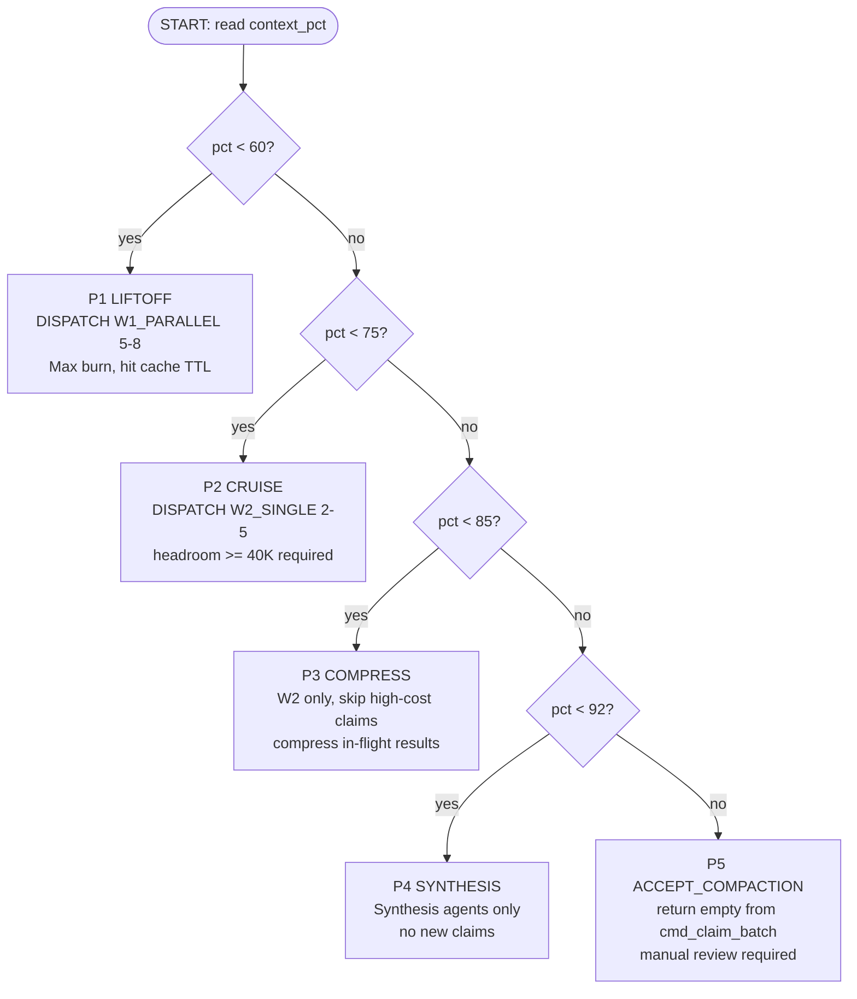

> [↑ Readme](README.md) · [→ Piston Timing Formula](PISTON-TIMING-FORMULA.md) · [⌂ Home](../README.md)

# Piston Timing — Operational Deployment Guide

This guide translates the piston timing formula into concrete execution policy for operators, hooks, and automation systems. Every dispatch decision, guardrail, and hook integration point derives directly from the phase thresholds defined in PISTON-TIMING-FORMULA.md.

---

## 1. Decision Tree — Phase Dispatch Logic

```
START
  │
  ▼
Read context_pct from piston-checkpoint.json
  │
  ├─ context_pct < 60 ──────────────────────────────► P1: LIFTOFF
  │                                                     DISPATCH W1_PARALLEL(5–8)
  │                                                     Max burn. Hit 5-min cache TTL.
  │                                                     Gate: queue_depth > 5
  │                                                           AND cache_age < 300s
  │
  ├─ 60 ≤ context_pct < 75 ────────────────────────► P2: CRUISE
  │                                                     DISPATCH W2_SINGLE(2–5)
  │                                                     Gate: headroom ≥ 40K tokens
  │                                                           AND queue_depth ≤ 50
  │
  ├─ 75 ≤ context_pct < 85 ────────────────────────► P3: COMPRESS
  │                                                     W2 dispatch only.
  │                                                     Skip high-cost task claims.
  │                                                     Compress in-flight results.
  │                                                     No new parallel spawns.
  │
  ├─ 85 ≤ context_pct < 92 ────────────────────────► P4: SYNTHESIS
  │                                                     Synthesis agents only.
  │                                                     No new task claims.
  │                                                     Drain in-flight; write manifests.
  │
  └─ context_pct ≥ 92 ─────────────────────────────► P5: ACCEPT_COMPACTION
                                                        Return empty from cmd_claim_batch.
                                                        Accept compaction ONLY IF all
                                                        in-flight agents have manifests.
                                                        Manual review required.
```

### Mermaid Format (for rendering in Obsidian / docs sites)



---

## 2. Lean-Query Commands — Live Phase Monitoring

All commands target `9x_lean_query.py`. The `--get-all` flag returns a tab-delimited status line that encodes current phase, context fill, queue state, eval, and droplet counts.

### P1 — Liftoff (context_pct < 60)

```bash
python3 ~/.claude/scripts/9x_lean_query.py --get-all --format statusline
# Expected output pattern:
# W1   42%   q:12 uc:8 hi:3 idx:44 W1   eval:0.82->   stigmergy:2   flags:1   droplets:3
# Phase label: P1[42%]
```

What to verify: wave shows `W1`, queue depth is non-zero, cache_age within 300s. If all three are true, proceed with `W1_PARALLEL(5–8)` dispatch.

### P2 — Cruise (60–75%)

```bash
python3 ~/.claude/scripts/9x_lean_query.py --get-all
# Expected output pattern:
# W2   68%   q:7 uc:4 hi:1 idx:30 W2   eval:0.80->   stigmergy:1   flags:0   droplets:5
# Phase label: P2[68%]  drain_rate: monitor queue index declining across turns
```

Drain rate metric: compare `idx` value across two consecutive lean-query calls. A declining index confirms active drain. If index is flat or rising, re-evaluate parallelism.

### P3 — Compress (75–85%)

```bash
python3 ~/.claude/scripts/9x_lean_query.py --get-all
# Expected output pattern:
# W2   79%   q:4 uc:2 hi:0 idx:18 W2   eval:0.78->   stigmergy:0   flags:2   droplets:5
# Phase label: P3[79%]  action: compress, skip high-cost claims
```

At P3 the `flags` count matters — elevated flags indicate agents that have not yet written manifests. Do not spawn additional agents until flags clear.

### P4 — Synthesis (85–92%)

```bash
python3 ~/.claude/scripts/9x_lean_query.py --get-all
# Expected output pattern:
# W3   88%   q:2 uc:1 hi:0 idx:8 W3   eval:0.75->   stigmergy:0   flags:1   droplets:6
# Phase label: P4[88%]  action: synthesis agents only
```

Wave should shift to `W3`. Any remaining queue depth should be synthesis or summarizer tasks only. `uc` (unclaimed) should be ≤ 2.

### P5 — Accept Compaction (≥ 92%)

```bash
python3 ~/.claude/scripts/9x_lean_query.py --get-all
# Expected output pattern:
# W3   93%   q:0 uc:0 hi:0 idx:2 W3   eval:0.74->   stigmergy:0   flags:0   droplets:7
# Phase label: P5[93%]  action: accept_compaction — verify flags:0 first
```

Compaction is safe to accept only when `flags:0` (all in-flight agents have written manifests). If flags > 0, block compaction and log a warning to `forensics/spawn-contract-violations.jsonl`.

---

## 3. Phase-Transition Guardrails

These are hard safety thresholds. Hooks and operators must enforce them before any phase-gated action.

| Guardrail | Threshold | Action on Violation |
|---|---|---|
| Min headroom for W2 dispatch | headroom < 40K tokens | Skip claim; log reason |
| Max queue depth for new claims | queue_depth > 50 | Gate all new claims until queue drains |
| Compaction acceptance gate | in-flight agents with no manifest > 0 | Block P5; emit warning |
| Parallel dispatch gate | cache_age > 300s | Downgrade to single-spawn |
| Phase promotion gate | context_pct hasn't crossed threshold yet | Hold current phase |

### Headroom Calculation

```
headroom_tokens = (context_limit - context_used)
context_pct = context_used / context_limit * 100
headroom_tokens = context_limit * (1 - context_pct/100)
```

For a 200K context model: headroom at 80% = 40K tokens. The 40K floor maps exactly to P3 threshold — do not claim W2 tasks at P3 or beyond.

### Queue Depth Gate

The `LEAVE_FOR_OTHERS_THRESHOLD = 6` in `7x_queue_ops.py` is a soft heuristic for concurrent sessions. The hard gate of 50 is a circuit breaker for runaway queue accumulation. If queue_depth > 50, something upstream is broken — investigate before resuming claims.

---

## 4. Hook Integration Points — 7x_queue_ops.py

### Where to Read Phase

`cmd_claim_batch()` is the correct injection point. At function entry, read `piston-checkpoint.json` to obtain `current_phase` before any queue mutation.

```python
# Inject at top of cmd_claim_batch() in 7x_queue_ops.py

import json
from pathlib import Path

def _read_piston_phase() -> str:
    """Read current piston phase from checkpoint. Returns 'P1' through 'P5'."""
    checkpoint_path = Path(os.environ.get("CLAUDE_HOME", Path.home() / ".claude")) \
        / "hooks" / "state" / "piston-checkpoint.json"
    try:
        data = json.loads(checkpoint_path.read_text())
        return data.get("current_phase", "P1")
    except Exception:
        return "P1"  # safe default — assume early phase

def cmd_claim_batch(args):
    phase = _read_piston_phase()

    # P5: compaction imminent — return empty immediately
    if phase == "P5":
        return {"claimed": 0, "reason": "accept_compaction", "phase": "P5"}

    # P4: synthesis only — skip all non-synthesis task claims
    if phase == "P4":
        # Only claim tasks with category == "synthesis"
        args.category = "synthesis"

    # P3: skip high-cost claims
    if phase == "P3":
        # High-cost = HIGH priority new work; skip, only claim MED/LOW or drain tasks
        args.max = min(getattr(args, "max", 3), 1)

    # P1/P2: proceed normally
    # ... existing claim logic ...
```

### Phase-Gated Claim Logic Summary

```python
PHASE_CLAIM_POLICY = {
    "P1": {"max_claims": 8,  "categories": None,         "action": "dispatch_parallel"},
    "P2": {"max_claims": 5,  "categories": None,         "action": "dispatch_single"},
    "P3": {"max_claims": 1,  "categories": None,         "action": "compress_only"},
    "P4": {"max_claims": 1,  "categories": ["synthesis"], "action": "synthesis_only"},
    "P5": {"max_claims": 0,  "categories": [],           "action": "accept_compaction"},
}
```

### Integration Point: session_stop_hook.py

Before session stop, verify compaction safety:

```python
# In hooks/session_stop_hook.py — add before allowing compaction

def verify_compaction_safe(forensics_dir: Path) -> bool:
    """Returns True only if all in-flight agents have written manifests."""
    coc = forensics_dir / "coc.jsonl"
    # Count agents that opened but have not closed (no manifest written)
    # If any open agents lack a manifest entry, return False
    ...
    return in_flight_without_manifest == 0
```

---

## 5. False-Positive Safeguards

### Auto-Dispatch Conditions (all three must be true)

Auto-dispatch (no human confirmation needed) requires:

1. `queue_depth > 5` — enough tasks to justify parallel overhead
2. `context_pct < 75` — sufficient headroom for W1 or W2 dispatch
3. `cache_age < 300s` — within 5-minute cache window; hitting cache pays for spawn overhead

If any condition is false, downgrade to single-spawn or hold.

### Manual Review Required

The following conditions require a human operator to confirm before proceeding:

- **Compaction acceptance (P5):** Must verify `flags == 0` in lean-query output, confirming all in-flight agents have written manifests. Do not allow compaction with orphaned agents.
- **queue_depth > 50:** Circuit breaker. Investigate queue accumulation before any new claims.
- **context_pct drops unexpectedly:** If context_pct falls (compaction occurred without the gate passing), audit `forensics/coc.jsonl` for missing manifest entries.
- **Phase regression:** If piston-checkpoint.json shows a phase lower than last observed (e.g., P3 → P1 without a session boundary), flag as anomalous and log to `forensics/spawn-contract-violations.jsonl`.

### Monitoring: coc.jsonl Deployment Errors

Check for deployment errors each turn using:

```bash
# Count violations in last 10 minutes
tail -100 /mnt/d/0local/gitrepos/faerie2/forensics/coc.jsonl \
  | python3 -c "
import sys, json
errors = [l for l in sys.stdin if 'violation' in l.lower() or 'error' in l.lower()]
print(f'{len(errors)} deployment errors in recent coc entries')
"
```

Spawn contract violations are also tracked in `forensics/spawn-contract-violations.jsonl`. Any entry there warrants review before the next dispatch wave.

---

## 6. Worked Example — Session 2026-04-25

This traces how the guide would have executed during a real session on 2026-04-25, using the piston-timing-analysis team task.

### T+0: Session Start

```bash
python3 ~/.claude/scripts/9x_lean_query.py --get-all
# Output: W1   38%   q:9 uc:7 hi:3 idx:41 W1   eval:0.85->   stigmergy:1   flags:0   droplets:2
```

**Phase determination:** context_pct = 38% → P1 LIFTOFF

**Guardrail check:**
- queue_depth (9) > 5: PASS
- context_pct (38%) < 75%: PASS
- cache_age: assume < 300s at session start: PASS

**Action:** DISPATCH W1_PARALLEL(5–8). The piston-timing-analysis team spawned three parallel agents (formula-developer, ops-guide-writer, forensic-analyst) per the team composition.

### T+1: First Wave Returns

```bash
python3 ~/.claude/scripts/9x_lean_query.py --get-all
# Output: W2   61%   q:4 uc:3 hi:1 idx:22 W2   eval:0.84->   stigmergy:2   flags:1   droplets:4
```

**Phase determination:** context_pct = 61% → P2 CRUISE

**Guardrail check:**
- headroom: 200K * 0.39 = 78K tokens > 40K: PASS
- queue_depth (4) ≤ 50: PASS
- flags = 1: one agent has not yet written manifest — do not spawn additional parallel agents until flags clears

**Action:** DISPATCH W2_SINGLE(2–5). Single follow-on spawn for forensic precedent analysis (queued via next_task_queued).

### T+2: Context Fills

```bash
python3 ~/.claude/scripts/9x_lean_query.py --get-all
# Output: W2   77%   q:2 uc:1 hi:0 idx:11 W2   eval:0.83->   stigmergy:2   flags:0   droplets:5
```

**Phase determination:** context_pct = 77% → P3 COMPRESS

**Guardrail check:**
- headroom: 200K * 0.23 = 46K tokens > 40K: marginal PASS
- flags = 0: all manifests written

**Action:** W2 only. Skip high-cost HIGH-priority claims. Compress in-flight results to dashboard_lines. No new parallel spawns.

### T+3: Synthesis Phase

```bash
python3 ~/.claude/scripts/9x_lean_query.py --get-all
# Output: W3   87%   q:1 uc:0 hi:0 idx:5 W3   eval:0.82->   stigmergy:0   flags:0   droplets:6
```

**Phase determination:** context_pct = 87% → P4 SYNTHESIS

**Action:** Final synthesis agent collects dashboard_lines, writes session summary to vault. Queue drains to 0. No new claims.

### T+4: Compaction Gate

```bash
python3 ~/.claude/scripts/9x_lean_query.py --get-all
# Output: W3   93%   q:0 uc:0 hi:0 idx:2 W3   eval:0.82->   stigmergy:0   flags:0   droplets:7
```

**Phase determination:** context_pct = 93% → P5 ACCEPT_COMPACTION

**Guardrail check:**
- flags = 0: all in-flight agents have written manifests: PASS
- queue_depth = 0: nothing pending: PASS

**Action:** `cmd_claim_batch()` returns `{"claimed": 0, "reason": "accept_compaction", "phase": "P5"}`. Session stop hook confirms compaction safe. Compaction proceeds.

---

## 7. Queue Follow-On: Forensic Precedent Analysis

The next task to queue from this session:

```
next_task_queued: forensic-precedent-analysis
  goal: "Survey forensics/coc.jsonl and forensics/compact-events.jsonl for historical
         piston phase transitions. Identify sessions where P5 was entered with flags > 0
         (compaction with orphaned agents). Produce precedent table with session_id,
         context_pct at compaction, flags count, and outcome."
  priority: MED
  category: forensics
  blockedBy: []
  source: documentation-engineer
```

Queue this with:

```bash
python3 /mnt/d/0local/gitrepos/faerie2/scripts/7x_queue_ops.py add \
  --goal "Forensic precedent analysis: survey coc.jsonl and compact-events.jsonl for piston phase transitions; identify P5-with-flags violations; produce precedent table" \
  --priority MED \
  --category forensics \
  --source documentation-engineer \
  --project faerie2
```

---

## 8. Reference Links

- Piston timing formula: `docs/PISTON-TIMING-FORMULA.md` (defines thresholds, phase labels, formula derivation)
- Queue operations: `scripts/7x_queue_ops.py` (claim/release/complete; inject phase gate at `cmd_claim_batch`)
- Lean query: `scripts/9x_lean_query.py` (live phase monitoring; `--get-all` is the primary operator command)
- Session stop hook: `hooks/session_stop_hook.py` (compaction gate enforcement)
- Spawn contract enforcer: `hooks/8x_spawn_contract_enforcer.py` (validates every spawn uses template)
- COC chain: `forensics/coc.jsonl` (deployment error monitoring)
- Contract violations: `forensics/spawn-contract-violations.jsonl` (phase gate breach log)
- Architecture: `docs/README.md`

---

*Operational guide authored by documentation-engineer agent · 2026-04-25 · Links to PISTON-TIMING-FORMULA.md for formula derivation*
