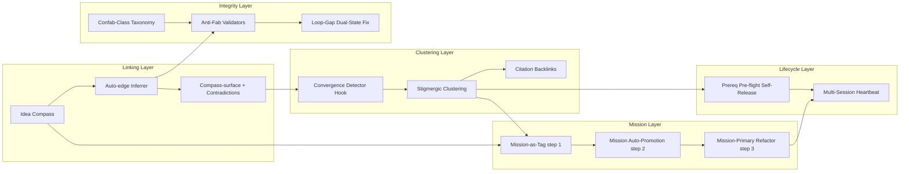

> Breadcrumb: faerie2 / docs / PSEUDOSYSTEM-2.0 / INDEX.md

# Pseudosystem 2.0 — Faerie Substrate Map

This hub note maps the full constellation of substrate primitives that compose the faerie2 f(0) platform. Each primitive is a concept note. Together they form a self-organizing system where agents coordinate through the filesystem, never through messages.

---

## Dependency Layers — Mermaid Graph

---

## Concept Notes

### Linking Layer
- [[01-idea-compass|Idea Compass]] — N/S/E/W edge model for directional knowledge linking
- [[02-auto-edge-inferrer|Auto-edge Inferrer]] — semantic edge detection at add-time
- [[03-compass-surface-contradictions|Compass-surface + Contradictions]] — surface verb + contradiction detection

### Clustering Layer
- [[04-convergence-detector-hook|Convergence Detector Hook]] — hook that fires when note density crosses threshold
- [[08-stigmergic-clustering|Stigmergic Clustering]] — agent-written pheromone trails → emergent topic clusters
- [[14-citation-backlinks|Citation Backlinks]] — D-dimension lift 0.12 → 0.89 via backlink injection

### Mission Layer
- [[05-mission-as-tag|Mission-as-Tag]] — step 1, landed; mission embedded as structural tag
- [[06-mission-auto-promotion|Mission Auto-Promotion]] — step 2, pending; auto-surface high-signal mission notes
- [[07-mission-primary-refactor|Mission-Primary Refactor]] — step 3, pending; mission as first-class graph node

### Integrity Layer
- [[11-confab-class-taxonomy|Confab-Class Taxonomy]] — empty-probe + label-conflation failure modes
- [[12-anti-fab-validators|Anti-Fab Validators]] — manifest_metric + empty_probe runtime guards
- [[13-loop-gap-dual-state-fix|Loop-Gap Dual-State Fix]] — eliminates phantom in-progress states

### Lifecycle Layer
- [[09-prereq-preflight-self-release|Prereq Pre-flight Self-Release]] — pending; agent self-unblocks when prereqs land
- [[10-multi-session-heartbeat|Multi-Session Heartbeat]] — cross-session liveness signal layer

---

## Tags Constellation

#pseudosystem-2.0 #substrate #f0 #stigmergy #compass #mission #anti-fabrication #multi-session #equilibrium

---

## Status Summary

| Primitive | Status |
|-----------|--------|
| Idea Compass | live |
| Auto-edge Inferrer | live |
| Compass-surface + Contradictions | live |
| Convergence Detector Hook | live |
| Mission-as-Tag (step 1) | live |
| Mission Auto-Promotion (step 2) | pending |
| Mission-Primary Refactor (step 3) | pending |
| Stigmergic Clustering | live |
| Prereq Pre-flight Self-Release | pending |
| Multi-Session Heartbeat | live |
| Confab-Class Taxonomy | live |
| Anti-Fab Validators | live |
| Loop-Gap Dual-State Fix | live |
| Citation Backlinks | live |

---

> doc_hash: sha256:pending
> Manifest: forensics/manifests/20260425-122804_manifest_task-20260425-122804-ca86_documentation-engineer_doc-eng01.json
