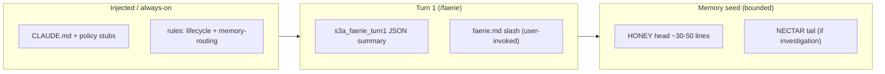

# Design questions — hooks vs scripts, token budget, crystallization order

> **LEGACY:** This document predates the 2026-04-05 overhaul.
> For current docs, see [README.md](../README.md) or the vault LAUNCH/ folder.
> Kept for historical reference.

**Audience:** Operators and agents maintaining faerie. **Canonical budgets:** `.claude/rules/memory-routing.md` (tables are source of truth; numbers here are **estimates** for planning).

---

## 1. Why hooks first, scripts second?

**Default:** `settings.json` wires **SessionStart**, **Stop**, **PostToolUse**, etc. to small Python/shell entrypoints. Those entrypoints are the **product**; humans should not memorize parallel “run this `.py` by hand” paths for the happy path.

**Scripts appear in docs** for four reasons only:

| Reason | Example |
|--------|---------|
| **No hook exists yet** for that trigger | Release build (`s2`), one-off migration |
| **Recovery** | Hooks disabled, wrong profile, debugging |
| **Explicit discretion** | Operator chooses timing (e.g. optional vault export cadence) |
| **CI / packaging** | Runs outside a Claude session |

**Anti-pattern:** README or slash commands that teach “always run `dashboard.py`” before stating that **Turn 1 / launcher hooks already try** to spawn the dashboard. **Correct story:** hooks try → if no frame, open Window 2 (`docs/DASHBOARD-QUICKSTART.md`).

---

## 2. Estimated token pressure by stage (main session)

Rough **order-of-magnitude** for planning. Actual counts depend on file versions and compaction.

| Stage | What loads | Est. tokens (order of mag.) | Constraint |
|-------|------------|----------------------------|------------|
| Base rules | `agent-lifecycle.md`, `memory-routing.md` | **1.5k-4k each** if read in full; **target &lt;2k combined** effective via crystallization + pointers | Highest fan-out — crystallize **before** adding prose |
| `CLAUDE.md` | Step zero + pointers | **~400-900** | Keep short; link out |
| `/faerie` | `commands/faerie.md` only (Turn 1) | **Crystalline** slash; long prose in **`docs/FAERIE-HUMAN-GUIDE.md`** (humans only) | Priority 3 after universal rules |
| Turn-1 machine | `s3a_faerie_turn1.py` output JSON | **~300-1.2k** (brief) | Script output, not raw rule text |
| HONEY seed | First chunk only | **~600-1.5k** | Hard caps in `memory-routing.md` |
| Subagent spawn | **Card slice only** | **≤~800-1k** effective | **Never** full AGENTS / ARCHITECTURE |

**Subagents:** Bounded reads are mandatory — see `memory-routing.md` § “Bounded context reads”.

---

## 3. Hot files — crystallize in this order before adding bulk

When you need to add instructions, **shrink or split existing heat first** (same meaning, fewer tokens). Order = **read frequency × blast radius**.

| Priority | Path / artifact | Why | Budget cue |
|:--------:|-----------------|-----|------------|
| 1 | `~/.claude/memory/HONEY.md` | Every session, every agent | **≤200 lines / ~4k tok** (hard) |
| 2 | `.claude/rules/memory-routing.md` | Universal rule | **&lt;2k tok** effective when cached/read |
| 3 | `.claude/rules/agent-lifecycle.md` | Universal rule | **&lt;2k tok** effective |
| 4 | `.claude/commands/faerie.md` | Every `/faerie` | **~120–180 lines** target; narrative in **`docs/FAERIE-HUMAN-GUIDE.md`**, not commands |
| 5 | Core skills (`faerie`, `run`, `memory`, `train`) | Frequent slash | **~2k tok/skill** ceiling per `memory-routing.md` |
| 6 | `~/.claude/agents/{type}.md` | Per spawn | **~1k tok** |
| 7 | `hooks/state/*` narrative `.md` (FLOW, SPRINT_QUEUE) | On-demand | **~500 tok** per state doc when relevant |
| 8 | `docs/WIKI.md`, `README.md` | Human hub | Tight tables + links, not duplicate protocols |

**Adding knowledge:** Prefer **code docstrings** (queue, orchestrator), **one canonical `.md`**, and **pointers** elsewhere. See **`docs/CONTEXT-CRYSTALLIZATION.md`** (stub) + **`memory-routing.md`** § Crystallization Law.

---

## 4. Related

- **`docs/FAERIE-HUMAN-GUIDE.md`** — human-only high-level faerie narrative (not an agent load).
- **`docs/CONTEXT-CRYSTALLIZATION.md`** — short checklist + links (this file + `memory-routing.md`).
- **`docs/DASHBOARD-QUICKSTART.md`** — dashboard; hooks first, watcher second.
- **`docs/OBSIDIAN-COLLAB-STARTUP.md`** — vault mirror; prefer automation/cron wrapping `export_queue_to_vault.py` when possible.
- **`hooks/state/SPRINT_QUEUE.md`** — queue truth = JSON; scripts implement contract.
