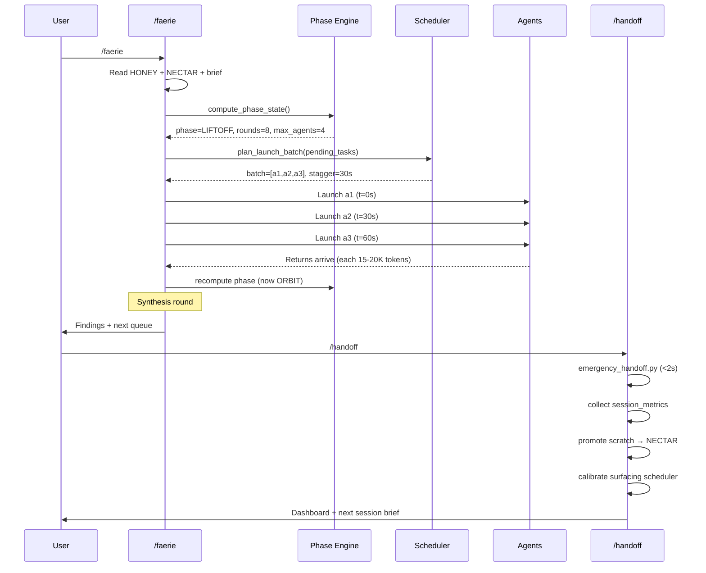
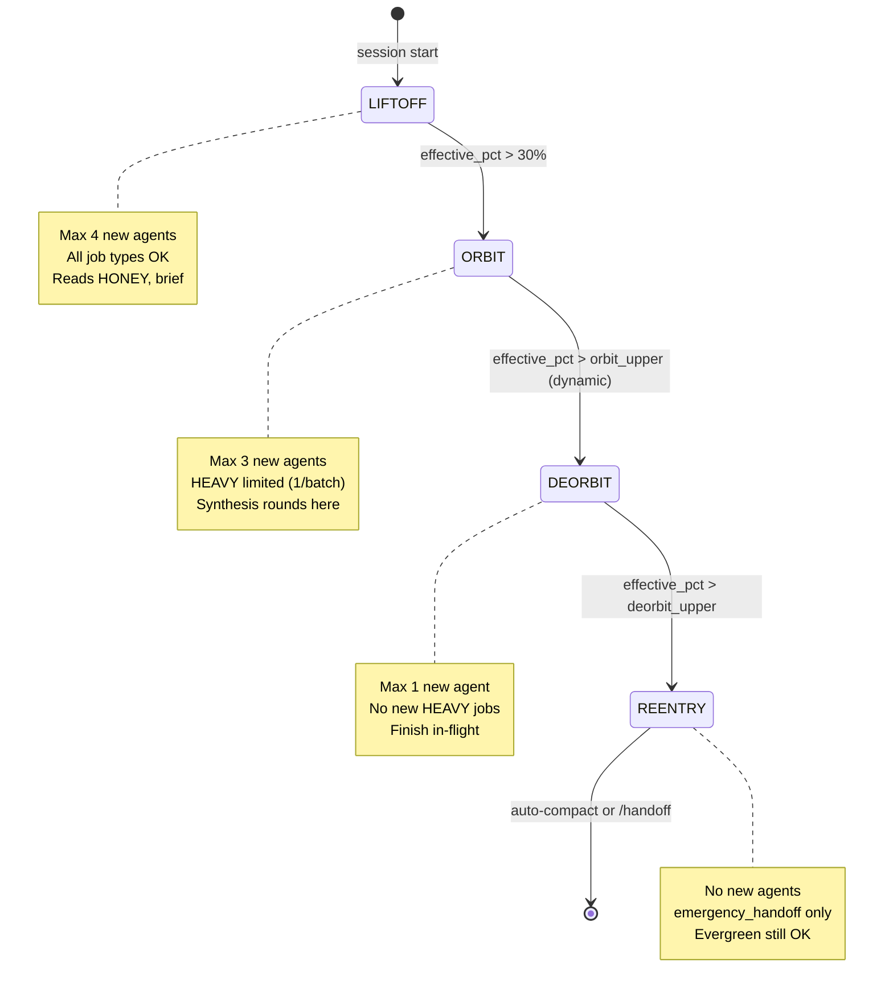
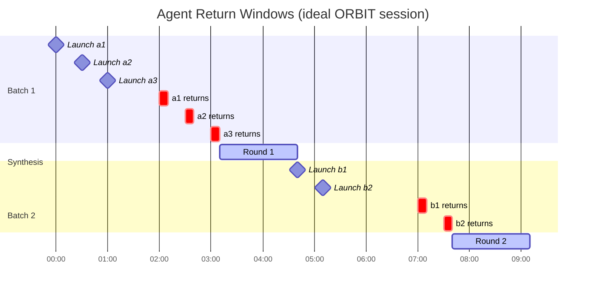
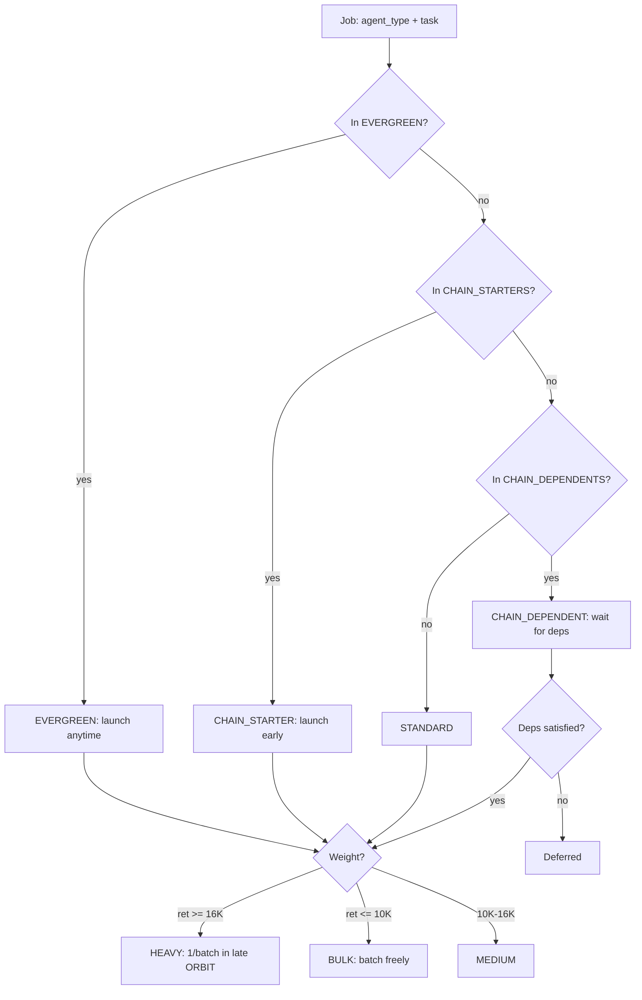
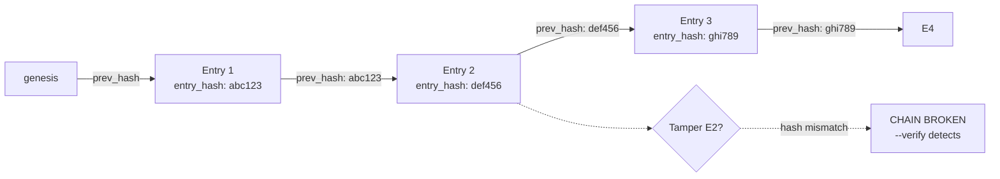

# SYSTEM.md — Faerie Orchestration System

> **LEGACY:** This document predates the 2026-04-05 overhaul.
> For current docs, see [README.md](../README.md) or the vault LAUNCH/ folder.
> Kept for historical reference.

Complete architecture reference. Standalone — no external files required to understand.
Install path: `$CLAUDE_HOME/` (default: `~/.claude/`). All paths use `CLAUDE_HOME` env var.

---

## What This Is

Faerie is a session orchestration layer for Claude CLI. It solves three problems:

1. **Context blindness** — Claude does not know how close it is to the compaction wall,
   or how much invisible debt is building from in-flight subagents.
2. **Timing chaos** — Launching agents without accounting for when their returns arrive
   leads to context explosions and premature compaction.
3. **Session amnesia** — Without structured handoffs, each session starts cold.

Faerie solves these with three interlocking systems:

```
┌─────────────────────────────────────────────────────┐
│                  FAERIE CORE LOOP                   │
│                                                     │
│   /faerie                            /handoff       │
│      │                                  │           │
│      v                                  v           │
│  Read brief ──────────────────── Write brief        │
│  Phase check                    Collect metrics     │
│  Launch plan                    Calibrate sched     │
│      │                                  │           │
│      └──────────── SESSION ─────────────┘           │
│                       │                             │
│           ┌───────────┴───────────┐                 │
│           │   Phase Engine        │                 │
│           │   LIFTOFF→ORB→DRB→REN │                 │
│           └───────────┬───────────┘                 │
│           ┌───────────┴───────────┐                 │
│           │  Surfacing Scheduler  │                 │
│           │  batch+stagger+calib  │                 │
│           └───────────┬───────────┘                 │
│           ┌───────────┴───────────┐                 │
│           │  Session Metrics      │                 │
│           │  hash-chained KPIs    │                 │
│           └───────────────────────┘                 │
└─────────────────────────────────────────────────────┘
```

---

## Three Interlocking Systems

### System 1 — Phase Engine (`scripts/context_phase.py`)

Determines current session phase based on context window usage, adjusted for
in-flight agent debt, burn rate, and queue depth.

**Phases:**

| Phase    | Raw %    | Character |
|----------|----------|-----------|
| LIFTOFF  | 0–30%    | Orient, launch agents freely |
| ORBIT    | 30–70%   | Peak productivity, synthesis rounds |
| DEORBIT  | 70–85%   | Finish in-flight, no new heavy jobs |
| REENTRY  | 85–100%  | Emergency handoff only |

**Dynamic threshold adjustment (applied to ORBIT upper boundary):**

```
adjustment = 0
- 5% per in-flight agent (max -20%)
- 5% if burn rate > 10K tokens/min
- 10% if burn rate > 20K tokens/min
+ 5% if queue depth >= 5
+ 10% if max_tokens >= 800K (1M context models)
```

**Effective usage** = raw usage + (in_flight × 15K tokens estimated returns) / max_tokens

This prevents the "phase cliff" where launching 3 heavy agents at 65% raw usage
causes reentry at 65%+45K = ~87% effective before any response arrives.

**Round budgeting:**
```
tokens_per_round = 3K overhead + 15K subagent return + 8K synthesis = 26K
rounds_remaining = (max_tokens - current_tokens) / 26K
```

Goal: 2+ synthesis rounds between auto-compacts.

---

### System 2 — Surfacing Scheduler (`scripts/surfacing_scheduler.py`)

Controls WHEN to launch agents so returns arrive in productive windows.

**Job classification:**

```
EVERGREEN       Anytime, no deps — always safe to launch
CHAIN_STARTER   Starts dependency chains — launch early in ORBIT
CHAIN_DEPENDENT Requires upstream output — wait for deps
HEAVY           ~20K token returns — limited to 1 per batch in late ORBIT
BULK            ~8K token returns — batch freely in ORBIT
```

**Launch batch rules by phase:**

| Phase    | Max batch | Heavy jobs | Evergreen |
|----------|-----------|------------|-----------|
| LIFTOFF  | 4         | Yes        | Yes       |
| ORBIT    | 3 (calib) | 1 per batch| Yes       |
| DEORBIT  | 1         | No         | Yes       |
| REENTRY  | 0         | No         | No        |

**Stagger:** Each agent in a batch launches `stagger_sec` seconds apart (default 30s).
This prevents all returns from arriving simultaneously.

**Self-calibration closed loop:**

```
┌─────────────────────────────────────────────────────┐
│              SELF-CALIBRATION LOOP                  │
│                                                     │
│  surfacing-log.jsonl (observed returns)             │
│          │                                          │
│          v                                          │
│  calibrate() — needs 3+ observations                │
│          │                                          │
│     ┌────┴────────────────────┐                     │
│     │  return_sizes[agent]    │ ← 60% obs + 40% prior│
│     │  stagger_sec            │ ← widen if >30% near-│
│     │  compaction_threshold   │   compact            │
│     │  batch_size             │ ← shrink if >40% near│
│     └────────────────────────┘                     │
│          │                                          │
│          v                                          │
│  surfacing-config.json (updated defaults)           │
└─────────────────────────────────────────────────────┘
```

---

### System 3 — Session Metrics (`scripts/session_metrics.py`)

SHA256 hash-chained KPI record across sessions.

**KPIs:**

| KPI | Formula |
|-----|---------|
| tasks_completed | sprint-queue done count |
| findings_produced | NECTAR additions today |
| synthesis_rounds_achieved | compactions + 1 if any work |
| cost_per_finding | session_cost / findings |
| cost_per_task | session_cost / tasks |
| context_efficiency | outputs / (tokens_used / 1K) |
| subagent_leverage | outputs / agents_launched |
| surfacing_score | productive_returns / total_returns |

**Hash chain (court-grade integrity):**
```python
entry["prev_hash"] = hash of previous entry ("genesis" if first)
entry["entry_hash"] = SHA256(JSON.dumps(entry_without_entry_hash, sort_keys=True))
```

Any tampering breaks the chain. `--verify` detects it.

---

## Session Lifecycle



---

## Context Phases



---

## Surfacing Timing



---

## Job Classification



---

## Hash Chain Integrity



---

## Hook Wiring

Wire these in `$CLAUDE_HOME/settings.json` hooks block:

| Hook event | Script | Purpose |
|-----------|--------|---------|
| `PreToolUse` | `hooks/statusline.py` | Print status bar before every tool |
| `PromptStart` | `hooks/statusline.py` | Print status bar at session start |
| `SubagentStart` | `hooks/agent_tracker.py start $TYPE $ID` | Track agent launch |
| `SubagentStop` | `hooks/agent_tracker.py stop $TYPE $ID $TOKENS` | Track return + log surfacing |
| `PostToolUse` | `forensic_coc.py` (if available) | Hash-chain audit log |
| `SessionStop` | `emergency_handoff.py` | Automatic snapshot on exit |

Example `settings.json` hooks section:

```json
{
  "hooks": {
    "PreToolUse": [
      {
        "type": "command",
        "command": "python3 ${CLAUDE_HOME:-$HOME/.claude}/hooks/statusline.py"
      }
    ],
    "SubagentStart": [
      {
        "type": "command",
        "command": "python3 ${CLAUDE_HOME:-$HOME/.claude}/hooks/agent_tracker.py start "$SUBAGENT_TYPE" "$SUBAGENT_ID""
      }
    ],
    "SubagentStop": [
      {
        "type": "command",
        "command": "python3 ${CLAUDE_HOME:-$HOME/.claude}/hooks/agent_tracker.py stop "$SUBAGENT_TYPE" "$SUBAGENT_ID" "${SUBAGENT_RETURN_TOKENS:-0}""
      }
    ],
    "SessionStop": [
      {
        "type": "command",
        "command": "python3 ${CLAUDE_HOME:-$HOME/.claude}/scripts/emergency_handoff.py"
      }
    ]
  }
}
```

---

## File Map

```
$CLAUDE_HOME/
├── commands/
│   ├── faerie.md           /faerie command (session start)
│   └── handoff.md          /handoff command (session end)
├── scripts/
│   ├── context_phase.py    Phase engine (LIFTOFF→ORBIT→DEORBIT→REENTRY)
│   ├── surfacing_scheduler.py  Launch planner + self-calibration
│   ├── session_metrics.py  Hash-chained KPI collector
│   └── emergency_handoff.py  Mechanical snapshot (<2s)
├── hooks/
│   ├── statusline.py       Real-time status bar
│   └── agent_tracker.py    Subagent lifecycle tracker
├── hooks/state/
│   ├── context-phase.json          Current phase state
│   ├── context-phase-history.jsonl Burn rate history
│   ├── sprint-queue.json           Task queue
│   ├── subagent-roster.json        In-flight agent registry
│   ├── surfacing-log.jsonl         Agent return observations
│   ├── surfacing-config.json       Calibrated scheduler settings
│   ├── session-metrics.jsonl       Hash-chained KPI record
│   ├── handoff-snapshot.json       Full mechanical roundup
│   └── faerie-brief.json           Cold-start fuel
└── memory/
    ├── HONEY.md            Crystallised prefs (≤200 lines)
    ├── NECTAR.md           Validated findings (unbounded, append-only)
    └── REVIEW-INBOX.md     HIGH-priority flags (unbounded, append-only)
```

---

## Porting to a New Environment

1. **Set env var:** `export CLAUDE_HOME=/path/to/your/claude/home`
   Or accept the default: `~/.claude/`

2. **Copy scripts:** Place `scripts/`, `hooks/`, `commands/` under `$CLAUDE_HOME/`

3. **Wire hooks:** Add hook entries to `$CLAUDE_HOME/settings.json` (see above)

4. **Create state dir:** `mkdir -p $CLAUDE_HOME/hooks/state/`

5. **Create memory dir:** `mkdir -p $CLAUDE_HOME/memory/`

6. **Seed HONEY.md:** Copy or write your crystallised prefs to `$CLAUDE_HOME/memory/HONEY.md`

7. **Test:** `python3 $CLAUDE_HOME/scripts/context_phase.py --force-pct 50`

**No hardcoded paths anywhere.** Every script uses:
```python
def _claude_home() -> Path:
    if "CLAUDE_HOME" in os.environ:
        return Path(os.environ["CLAUDE_HOME"])
    return Path.home() / ".claude"
```

---

## Statusline Format

```
[########] 65% | ctx:42%~ ORB r:3 d:2 Opus $1.23 | 2hi 5q (main) | >> next task
^^^^^^^^^  ^^^   ^^^^^^^^^^^^^^^^^^^^^^^^^^^^^^^^^   ^^^^^^^^^^^^^^^^  ^^^^^^^^^^^^^
sprint bar done  context section (phase+rounds+debt)  queue+flags       next task
```

Columns:
- `[########] 65%` — sprint bar (done/total) + pct
- `ctx:42%` — raw context percentage
- `~` — phase glyph: `^`=LIFTOFF `~`=ORBIT `v`=DEORBIT `!`=REENTRY
- `ORB` — phase abbreviation
- `r:3` — rounds remaining
- `d:2` — subagent debt (in-flight agents)
- `Opus` — model name abbreviated
- `$1.23` — session cost
- `2hi` — HIGH-priority flags in REVIEW-INBOX
- `5q` — pending queue depth
- `(main)` — active project
- `>> next task` — preview of next pending task

---

## Design Principles

**1. Context debt is real debt.**
Every in-flight agent that will return tokens is already "spent" context. The phase
engine accounts for this via effective usage, not raw usage.

**2. Self-calibration beats manual tuning.**
The surfacing scheduler starts with conservative defaults and adjusts from observed
history. After 3+ sessions, estimates converge to actual values.

**3. Mechanical handoff before LLM handoff.**
`emergency_handoff.py` runs in <2s with zero LLM reads. It captures all state before
any LLM-mediated memory promotion. This is the safety net.

**4. Hash chains for integrity.**
Session metrics are hash-chained. Any retroactive modification is detectable.
This matters for forensic and audit use cases.

**5. Path agnosticism as a first-class feature.**
Every file in this package resolves paths via `CLAUDE_HOME`. No Windows paths, no
user-specific paths, no hardcoded `/mnt/c/Users/amand` anywhere.
