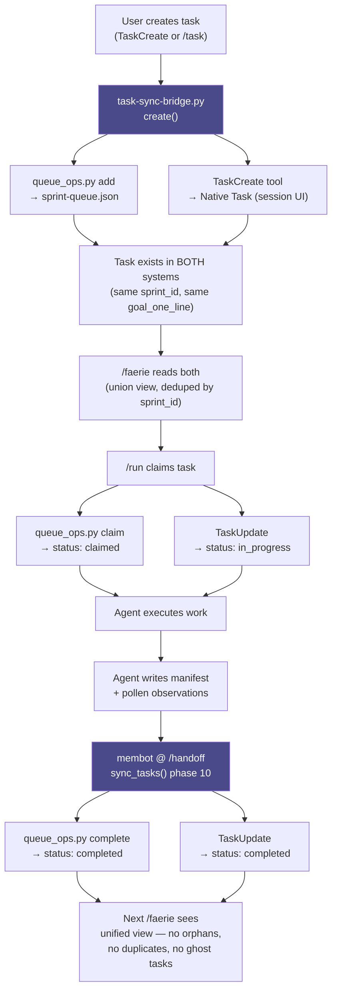

# Faerie Task Sync Bridge — Design Narrative

**Date:** 2026-04-07
**Author:** documentation-engineer (agent)
**Status:** Design proposal — pre-implementation
**Target audience:** faerie maintainers, membot contributors, any agent reading this to understand task lifecycle

---

## 1. The Pain

Two task systems coexist in this environment, and they do not speak to each other. The friction compounds every session.

**Claude Code TaskCreate** is session-scoped. When you create a task through the native UI or via the TaskCreate tool, it appears in the Claude Code task list for that CLI run. It is visible in the IDE pane. It can be ticked off. But it is ephemeral — when the CLI session ends, when `/compact` fires, when you close the terminal, that task state is gone. The next `/faerie` invocation has no memory it ever existed. If the task was in-flight when the session closed, it is now an orphan: the work may be half-done, the context may be in a pollen file somewhere, but from Claude Code's perspective, the task never happened.

**Faerie's sprint-queue.json** is the opposite. It is persistent, cross-CLI, and structured. It carries priority, hypothesis tags, agent type, wave category, context bundles, and a full dependency graph. It survives compact, survives session boundaries, survives reboots. `/run` claims tasks from it atomically. `queue_ops.py` enforces state transitions. The queue is the authoritative record of what this investigation needs done.

The problem is that these two systems have no awareness of each other. A task queued in sprint-queue.json does not appear in Claude Code's task list. A task created through TaskCreate does not write to sprint-queue.json. When `/run` claims a task and an agent completes it, `queue_ops.py complete` marks it done in the queue, but the native Task remains untouched — either stuck in its original state or simply absent. When `/faerie` reads the queue at the start of the next session, it cannot tell the user "three tasks you started in the last session were completed" because the session-scoped completion events were never persisted.

The human cost is real. After a compact event, the user must manually reconcile: which queue tasks were claimed before compact? Which native tasks were created and then lost? The `sprint-queue.json` shows `status: claimed` on tasks that were actually finished; the agent that finished them wrote its manifest, but no hook walked back and called `queue_ops.py complete`. The next `/faerie` re-reports those tasks as in-flight, spawns agents to pick them up again, and the work gets duplicated. Context is lost. Sprint velocity looks artificially low. The human has to audit.

This is not a rare edge case. It is the default behavior of every session that touches both systems, which is every real investigation session.

---

## 2. The Solution

The fix is a lightweight sync bridge — a single Python module (`task-sync-bridge.py`) that sits between both systems and keeps them in agreement without either system knowing the other exists.

TaskCreate becomes a thin wrapper: when a task is created through the Claude Code UI or tool, the bridge immediately writes a corresponding entry to sprint-queue.json via `queue_ops.py add`, stamping it with the same `sprint_id` and `goal_one_line` so the two records are deduplicable. When `/run` claims a task from the queue, it simultaneously calls TaskUpdate to mark the native Task as in-progress. At `/handoff`, membot runs a sync phase that walks both systems, detects any discrepancy between their state machines, and resolves it — completing stale claimed tasks, creating missing Task records for queue-only entries, and retiring orphaned native tasks whose queue counterparts were already resolved. Faerie reads both at session start and presents a single unified view, deduplicated by sprint_id, with no user-visible seam.

---

## 3. How They Interoperate



The bridge module is the centerline in this architecture diagram:

```
┌─────────────────────────────────────────────────────────────────┐
│                         USER / FAERIE                           │
│              (sees one unified task queue)                      │
└───────────────────────────┬─────────────────────────────────────┘
                            │
              ┌─────────────▼──────────────┐
              │     task-sync-bridge.py     │  ← the centerline
              │   create() · claim()        │
              │   complete() · sync_all()   │
              └──────┬──────────────┬───────┘
                     │              │
        ┌────────────▼───┐   ┌──────▼──────────────┐
        │ sprint-queue   │   │  Claude Code Tasks   │
        │ .json          │   │  (native, session UI)│
        │ (persistent,   │   │  (ephemeral,         │
        │  structured,   │   │   visible in IDE,    │
        │  cross-CLI)    │   │   session-scoped)    │
        └────────────────┘   └──────────────────────┘
                     │              │
              ┌──────▼──────────────▼───────┐
              │    membot @ /handoff         │
              │    sync_tasks() phase 10     │
              │    (reconciles both systems) │
              └──────────────────────────────┘
```

---

## 4. Edge Cases and Resolution

Four failure modes are likely in practice, and each has a clean resolution path.

The first is a task that was claimed in the queue but for which no corresponding native Task exists. This happens when `/run` is invoked after a compact event wiped the session-scoped task records, or when a task was added to sprint-queue.json directly via `queue_ops.py add` without going through the bridge. The sync bridge detects this during `sync_all()` by walking the queue for any entry with `status: claimed` or `status: in_progress` that has no matching `sprint_id` in the native task list. When found, it calls TaskCreate to reconstruct the native record, sets its status to in-progress, and logs the reconciliation event to pollen. The user sees the task appear in the IDE pane on the next turn. No data is lost because the queue entry already carries the full context bundle.

The second failure mode is a stale claim: a task that was claimed more than two hours ago and has no manifest written, no agent still running, and no pollen activity since the claim timestamp. This is the most common failure mode — it happens when an agent crashes, when compact fires mid-agent-run, or when the user manually kills a session. The resolution is symmetric: `sync_all()` calls `queue_ops.py reset` to return the task to `queued` status, calls TaskUpdate to mark the native Task as open again, and writes a brief HANDOFF MEM block to pollen noting that the claim was stale and the task is ready for retry. The next `/faerie` picks it up in the normal queue drain without any manual intervention.

The third case is a task that was completed in the native system (TaskUpdate status: completed) but whose sprint-queue.json entry is still showing `status: claimed`. This happens when an agent updates the native Task at the end of its run but fails to call `queue_ops.py complete` before the session ends — for example, if the agent's shutdown sequence was interrupted. Membot detects this by comparing native completed tasks against queue entries with `status: claimed`. When the native record shows completion, membot calls `queue_ops.py complete` with a synthetic completion timestamp derived from the native Task's last-modified time. The queue entry is closed, and the completion is treated as authoritative.

The fourth case is duplicate task creation: two entries in the queue, or one in each system, describing the same work. This happens when the user creates a task through TaskCreate and also adds it via `/task` before the bridge was installed, or when a retry creates a second entry alongside an uncleaned original. Deduplication logic in the bridge compares the tuple of `(project, hypothesis, goal_one_line[:80])` — a 80-character prefix of the goal is long enough to catch semantic duplicates while tolerating minor rephrasing. When a duplicate is found, the entry with the older timestamp is retired (status: `deduplicated`), the newer entry inherits any context bundle from the older one, and the native Task for the older entry is closed. The user sees one task in each system, with the richer context of both.

---

## 5. Integration Points

The bridge touches four places in the existing codebase, each as a thin wrapper rather than a replacement.

In `faerie.py`, the `context_roundup` function currently reads sprint-queue.json directly. It gains a call to `task-sync-bridge.get_unified_view()`, which returns a merged, deduplicated list of active tasks from both systems. The native task list and the queue are both read, joined on `sprint_id`, and conflicts are resolved conservatively (completed beats in-progress beats claimed beats queued). The unified view is what faerie presents in the session dashboard and what populates the Wave assignments.

In the `/run` command, the claim sequence gains one additional call: after `queue_ops.py claim` succeeds, the bridge calls `TaskUpdate` to set the corresponding native Task to in-progress. If no matching native Task exists (the task was added directly to the queue), the bridge calls TaskCreate first. This is the only change to `/run`; the rest of the claim logic is unchanged.

In membot, a new `sync_tasks` module runs at phase 10 of the `/handoff` sequence — after pollen promotion, before vault push. It calls `task-sync-bridge.sync_all()`, which performs the four reconciliation checks described above. Any reconciliation events are written as MEM blocks to the session's pollen file before promotion, so the human can see what was reconciled in the NECTAR entry for that session.

The bridge module itself (`task-sync-bridge.py`) is stateless between calls. It reads sprint-queue.json and the native task list on each invocation, computes the diff, applies it, and exits. It writes no persistent state of its own — the two source systems are the state. This means the bridge is safe to remove at any time: both systems continue functioning independently, just without synchronization.

---

## 6. Success Criteria

The bridge is working when four conditions hold across three consecutive full faerie cycles. First, every task that an agent marks complete is reflected as complete in both sprint-queue.json and the native task list within one `/handoff` cycle. Second, no task is stuck in `status: claimed` for more than two hours without a manifest or an active agent registered in `agent_state.json`. Third, after three full cycles, the union of both task systems contains no duplicate entries (same goal, same project) and no orphaned entries (present in one system, unknown to the other). Fourth, the user perceives a single queue — they do not need to check sprint-queue.json separately from the IDE task panel to know what is in flight.

---

## 7. Why This Works

The design rests on a simple division of authority. Faerie owns persistence and structure: sprint-queue.json is the system of record for what this investigation needs done, in what order, by what agent, with what context. It is the document that survives a reboot and tells the next session's faerie exactly where to pick up. Claude Code owns session visibility and user experience: the native task list is what the human sees in the IDE pane, what they can tick off, what gives them the feeling of progress during a live session.

Neither system is trying to replace the other, and the bridge does not try to merge them into a single database. It is a sync protocol — a thin translation layer that speaks both languages and keeps the two records in agreement. If the bridge fails or is removed, both systems degrade gracefully to their independent behavior. Sprint-queue.json keeps working for faerie. Native tasks keep working for the session UI. The only thing lost is the automatic reconciliation at `/handoff`.

This makes the bridge optional and removable — a property that matters for a forensic investigation environment where every component needs a clear chain of custody and the ability to be audited independently. The bridge itself is not evidence; it is infrastructure. It earns its place by eliminating the manual reconciliation step that currently costs the human five to ten minutes at the start of every session following a compact event. That is the metric: after three cycles with the bridge running, the human should not need to ask "which tasks were actually finished last session?"

The bridge is minimal because minimal is correct here. The two systems exist for different reasons, serve different principals (faerie and the IDE respectively), and have different failure modes. A heavier integration — a shared database, a unified API, a single task manager — would couple two things that are better kept independent. The bridge is a wire between two rooms. It carries signals, not load.

---

*Generated: 2026-04-07 | Agent: documentation-engineer | Design: faerie-task-sync-bridge v0.1*
