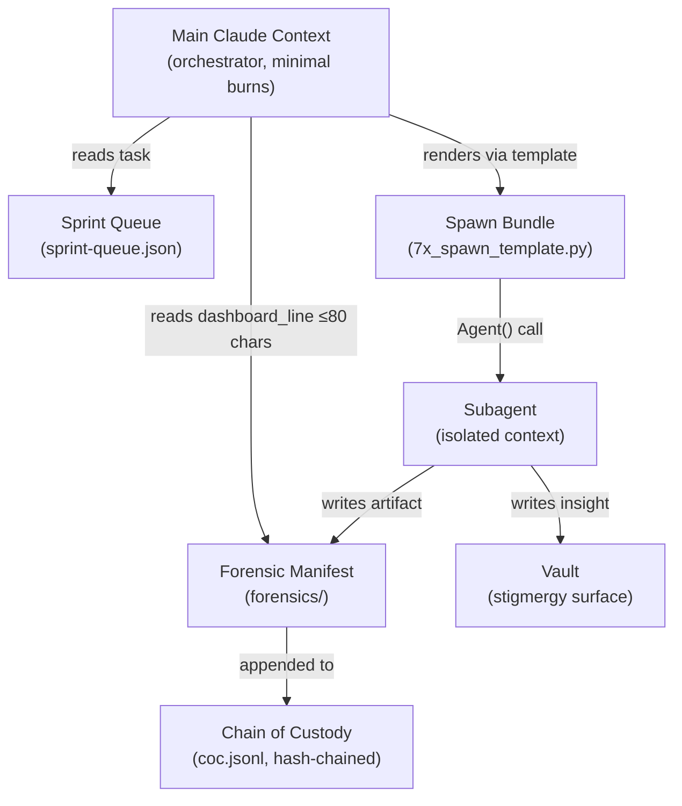

# 00-Welcome — If You're New, Start Here

> "Scout bees don't report to a manager. They fly out, find something, come back, and dance. The hive listens. The best dance wins. The swarm moves together."

This vault is an interactive exploration of the **faerie2 f(0) agent orchestration platform** — a system where the orchestration burden on the main Claude context approaches zero. You can spawn and return an unlimited number of agents without inflating the main context, because coordination happens through the filesystem, not through messages.

---

## What You're Looking At

faerie2 is not a chatbot wrapper. It is an **orchestration discipline** built on five principles that together produce the f(0) property. Open any folder in this vault to explore a specific layer.



---

## The Five Principles

Each principle is necessary. Together they are sufficient to produce f(0).

| # | Principle | One-line |
|---|-----------|---------|
| 1 | **Stigmergy-only** | No SendMessage. Filesystem IS the coordination layer. |
| 2 | **Artifacts-in-forensics** | Every artifact lands in `forensics/`, hash-chained, never in `.claude/`. |
| 3 | **Task_id-in-filename** | `{ts}_{type}_{task_id}_{agent}_{sid8}.ext` — grep at zero context cost. |
| 4 | **Cascading summarization** | Main reads only `dashboard_line` (≤80 chars). Synthesis is a subagent job. |
| 5 | **Pressure-responsive streaming** | Exponential capture as context fills. Piston waves gated by altimeter. |

---

## Piston Waves — The Operational Frame

Main context is fuel. You burn it in three stages:

```
W1 = FIRST-STAGE LIFTOFF   max burn, parallel spawns, hit 5-min cache TTL
W2 = CRUISE                single-dispatch missions, autonomous
W3 = INSERTION             deep synthesis, background agents
```

**Burn hot early.** Conservation in turn 1 misses the prompt cache and never escapes gravity. Stage separation happens via wave compression: manifests collapse to `dashboard_line` strings (≤80 chars each) — the weight drops, main context stays light.

---

## Where to Go Next

- [[10-Processes/INDEX]] — How a spawn actually works: bundle → Agent() → execution → manifest → COC
- [[20-Queue-Mission/INDEX]] — How tasks become missions: claim atomicity, monkeybranch, premise-stale
- [[30-Dashboards/INDEX]] — Live system links: eval report, queue summary, droplet citations, agent reputation
- [[40-Roster-Routing/INDEX]] — The 53 agent cards: what they do, how routing picks them, reputation weighting
- [[50-Honesty-System/INDEX]] — The reputation paradox: agents can't see their own card before a run

---

## Key Files in the Repo

| Path | What It Is |
|------|-----------|
| `scripts/7x_spawn_template.py` | The ONLY sanctioned path to Agent(); renders spawn bundles |
| `hooks/8x_spawn_contract_enforcer.py` | PreToolUse hook; blocks hand-crafted Agent() prompts |
| `scripts/7x_queue_ops.py` | Atomic queue operations (claim, complete, release, monkeybranch) |
| `forensics/coc.jsonl` | HMAC-SHA256 hash-chained chain of custody log |
| `~/.claude/agents/*.md` | Per-agent cards (KPIs, reputation baseline, Last Training) |
| `docs/SPAWN-BOILERPLATE.md` | Spawn contract architecture reference |

---

*sha256:pending — hash will be stamped at session close*

[[10-Processes/INDEX]] | [[20-Queue-Mission/INDEX]] | [[30-Dashboards/INDEX]] | [[40-Roster-Routing/INDEX]] | [[50-Honesty-System/INDEX]]
