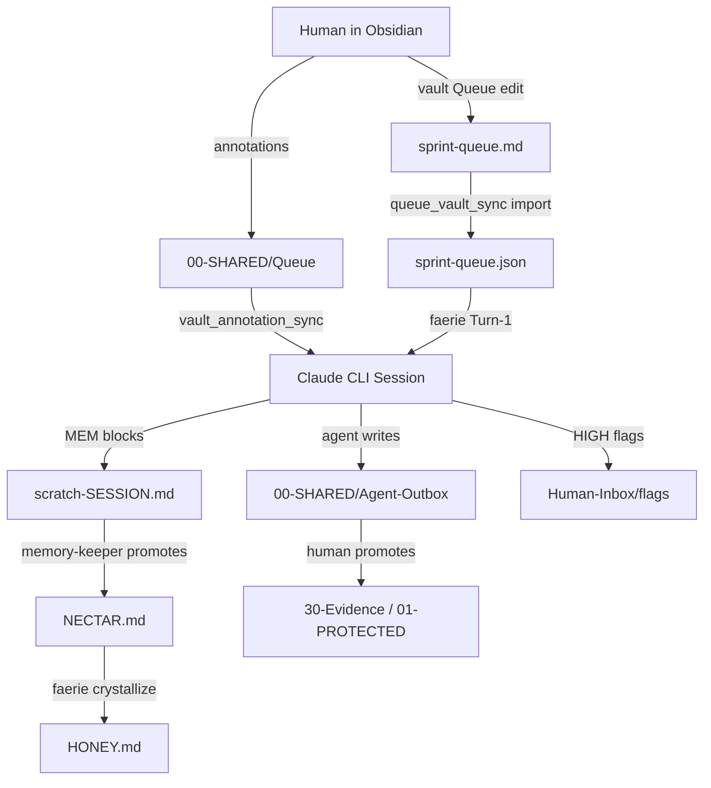
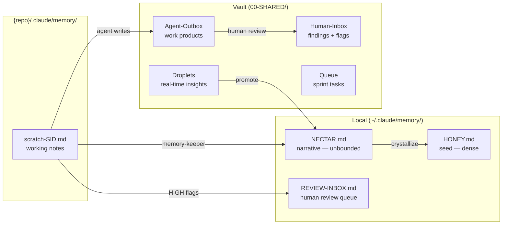

> [[HOME]] > [[INDEX|00-META]] > **Faerie-Vault Data Flow**

# Faerie ↔ Vault Data Flow

How Claude CLI sessions, memory layers, and the Obsidian vault connect.

---

## Memory Layer Detail

---

## Write Routing Quick Reference

| Observation type | Destination |
|-----------------|-------------|
| Session working notes | `{repo}/.claude/memory/scratch-{SID}.md` |
| HIGH priority flag | Also `~/.claude/memory/REVIEW-INBOX.md` |
| Validated finding | memory-keeper → `~/.claude/memory/NECTAR.md` |
| Durable fact / preference | faerie crystallize → `~/.claude/memory/HONEY.md` |
| Agent work product | `00-SHARED/Agent-Outbox/` |
| Real-time insight | `00-SHARED/Droplets/LIVE-{date}.md` |

---

*[[00-SHARED/Hive/SYSTEM-GUIDE|System Guide]] · [[00-SHARED/Dashboards/system/System-Architecture|Full Architecture]] · [[INDEX|Meta]]*
