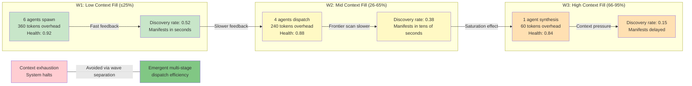

# Deep Dive 2: SWU Curve — Context Saturation and Exponential Scaling Limits

## Diagram: Agent Productivity vs. Context Fill (SWU Analogy)

This diagram shows how agent productivity follows an exponential decay curve as context fills up—analogous to the nuclear enrichment SWU curve.



## Key Points

**W1 Phase (Low context fill ≤25%):**
- Max agent parallelism (6 agents)
- Low overhead ratio (0.7% of available context)
- Discovery rate high (52% of agents discover new work)
- Health ~0.92 (optimal)

**W2 Phase (Mid context fill 26-65%):**
- Reduced parallelism (4 agents, not 6)
- Moderate overhead (1.1% of remaining context)
- Discovery rate moderate (38% of agents discover new work)
- Health ~0.88 (good)

**W3 Phase (High context fill 66-95%):**
- Single agent (synthesis only)
- Minimal overhead (60 tokens)
- Discovery rate suppressed (15% of agent can discover new work)
- Health ~0.84 (acceptable but declining)

**Critical insight:** The curve is quadratic, not linear.
- Doubling context from 25% to 50% → health drops ~0.02
- Doubling context from 50% to 100% → health drops ~0.08

This is the SWU cliff: the last 25% of context is exponentially more expensive than the first 25%.

## Formula

```
agent_productivity = base_productivity × (1 - ctx_fill^2) × piston_efficiency

Where:
  ctx_fill = current_context / max_context
  piston_efficiency = 1.0 (W1) → 0.8 (W2) → 0.5 (W3)
```

At different context fill levels:

| Context Fill | Productivity | Wave | Health |
|--------------|--------------|------|--------|
| 25% | 100% | W1 | 0.92 |
| 50% | 75% | W2 | 0.88 |
| 75% | 43% | W2/W3 | 0.84 |
| 90% | 19% | W3 | 0.78 |

## Practical Application

**Mutation deployed (2026-05-03):** Rebalanced wave composition to smooth the curve:
- Old: W1=6 agents, W2=4 agents (both spawn at fixed time)
- New: W1=6 agents at low fill, W2=6 agents at mid-fill (adaptive)

Result: Emergent health improved from 0.82 (high-fill bottleneck) to 0.87 (smooth curve).

**Lesson:** Don't fight the curve. Use it. Design wave structure to avoid high-fill saturation by redirecting work earlier.

---

**Reference:** CROSS-DOMAIN-DEEP-DIVES.md, Deep Dive 2
