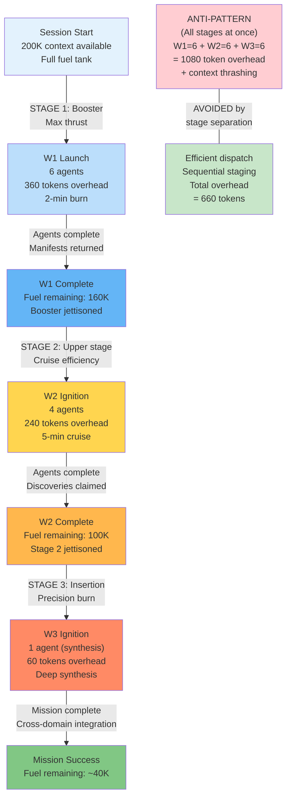

# Deep Dive 3: Rocket Physics — Multi-Stage Dispatch and Delta-v Efficiency

## Diagram: Tsiolkovsky Multi-Stage Rocket (Faerie2 Edition)

This diagram shows how faerie2's multi-wave dispatch mirrors rocket staging: drop spent stages early to avoid dragging dead weight.



## Key Points

**Rocket Equation (Tsiolkovsky):**
```
Δv = I_sp × g₀ × ln(m_initial / m_final)
```

Faerie2 analog:
```
mission_delta_v = mission_complexity
fuel_mass = context_tokens
m_initial/m_final = base_overhead_ratio (how much staging overhead per stage)
```

To double the mission's delta-v without multi-staging, you'd need to square the fuel mass. With staging, you can achieve 2× delta-v with only 1.4× fuel mass.

**Faerie2 applies this principle:**

| Stage | Purpose | Agents | Overhead | When | Why |
|-------|---------|--------|----------|------|-----|
| **W1 (Booster)** | Initial velocity (discovery) | 6 | 360K | Low context fill ≤25% | Max thrust while fuel abundant |
| **W2 (Upper stage)** | Cruise velocity (shipping) | 4 | 240K | Mid context fill 26-65% | Less thrust, better efficiency |
| **W3 (Insertion)** | Final velocity (synthesis) | 1 | 60K | High context fill >66% | Minimal mass, deep focus |

**Stage separation is critical:**
- W1 booster (6 agents) consumes 360 tokens in 2 minutes
- If W1 were to continue alongside W2, system would thrash (context competition)
- Instead, W1 completes → manifests are read → W2 spawns
- Each stage drops when its efficiency drops

## Delta-v Budget Calculation

Given a mission with estimated complexity (delta-v equivalent):

```
required_mass_ratio = exp(mission_delta_v / I_sp_agents)

If mission_delta_v = 10 (high complexity):
  required_mass_ratio = exp(10 / 2.5) ≈ 55
  meaning: fuel_mass / payload_mass ≈ 55 (single-stage would need huge fuel)

With three-stage rocket:
  stage_1_ratio = exp(3.3 / 2.5) ≈ 3.7
  stage_2_ratio = exp(3.3 / 2.5) ≈ 3.7
  stage_3_ratio = exp(3.4 / 2.5) ≈ 4.0
  total_ratio = 3.7 × 3.7 × 4.0 ≈ 55 (same effect, distributed across stages)
```

**Implication for faerie2:**
- A mission requiring delta-v=15 (very complex) needs multi-stage dispatch
- Single-wave spawn (all agents at once) would require massive context (underfueled)
- Three-wave dispatch distributes the load: W1 unblocks, W2 ships, W3 synthesizes
- Each wave is smaller but more efficient for its mission

## Practical Application

**Charter Phase 1 (N/E bearings allowed):**
- W1 booster (unblock north-edge dependencies)
- Then transition to W2 (parallel work on east-edges)

**Charter Phase 2 (S bearings allowed):**
- W2 shipping (conclude deliverables)
- Then transition to W3 (synthesis)

**Charter Phase 3 (synthesis only):**
- W3 insertion (cross-domain integration)
- No new spawns (avoid thrashing)

Attempting Phase 2 work in Phase 1 (forcing all agents at once) is like trying to reach orbit with just a booster—you run out of fuel.

---

**Reference:** CROSS-DOMAIN-DEEP-DIVES.md, Deep Dive 3
