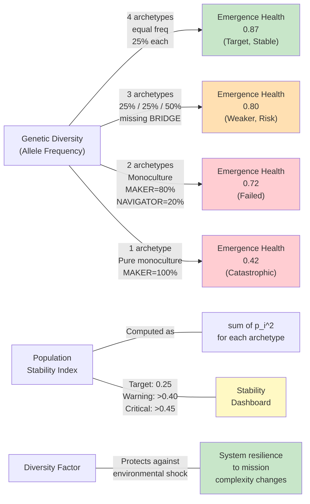

# Deep Dive 5: Population Genetics — Archetype Distribution and System Resilience

## Diagram: Allele Frequency vs. Emergence Health (Monoculture Risk)

This diagram shows how genetic diversity (archetype distribution) affects system health, with a warning curve for monoculture collapse.



## Key Points

**Four Archetypes (Genetic Diversity):**

| Archetype | Role | Fitness Profile |
|-----------|------|-----------------|
| **NAVIGATOR** (research-analyst) | Frontier discovery, edge mapping | High when N/E-bearings abundant; low when mission is linear |
| **MAKER** (python-pro) | Deliverable shipping, integration | High when S-bearing clear; low when blocked by dependencies |
| **BRIDGE** (knowledge-synthesizer) | Cross-domain synthesis, coherence | High when multi-mission E-edges; low when single-purpose mission |
| **DEEP-DIVER** (security-auditor) | Assumption validation, W-edge resolution | High when W-bearing active; low when mission is straightforward |

**Emergence Health Formula:**
```
health = 0.60 × (1 + discovery_rate) × (1 + citation_density) × archetype_diversity_factor

archetype_diversity_factor = 0.25 × sum(p_i) where p_i = freq of archetype i
                           = 1.0 if all four archetypes equally represented
                           = ~0.75 if 3/4 (one archetype missing)
                           = <0.60 if monoculture (1–2 archetypes only)
```

**Stability Index (Hardy-Weinberg Equilibrium):**
```
stability_index = sum(p_i^2) for each archetype

Target: 0.25 (means all four archetypes at 25% each)
         0.25 = 0.25^2 + 0.25^2 + 0.25^2 + 0.25^2 = 0.0156 + 0.0156 + 0.0156 + 0.0156 = 0.0625
         
Warning threshold: >0.40 (one archetype approaching dominance)
Critical threshold: >0.45 (monoculture risk imminent)
```

If you measure archetype frequencies and find:
- NAVIGATOR: 25%, MAKER: 45%, BRIDGE: 20%, DEEP-DIVER: 10%
- Stability index = 0.0625 + 0.2025 + 0.04 + 0.01 = 0.315 (OK, below 0.40)

If you find:
- NAVIGATOR: 15%, MAKER: 70%, BRIDGE: 10%, DEEP-DIVER: 5%
- Stability index = 0.0225 + 0.49 + 0.01 + 0.0025 = 0.525 (CRITICAL, >0.45 threshold)
- Action: Stop spawning MAKER; spawn NAVIGATOR + BRIDGE + DEEP-DIVER until balance recovers

## Why Diversity Is Not Optional Overhead

**Naive intuition:** "If MAKER is the most efficient, why not use all MAKERs?"
- Locally optimal = shipping work fast
- Globally suboptimal = no discovery, no synthesis, no assumption validation
- Result: Mission stalls when delivery requires unblocking dependencies

**Real system dynamics:**
- MAKER ships at 0.90 quality when path is clear
- But discovers at 0.10 rate (bad frontier scanner)
- NAVIGATOR discovers at 0.60 rate (excellent frontier scanner)
- But ships at 0.40 quality (not a delivery specialist)

**Emergent truth:** Diversity enables specialization. Each archetype has a niche. When all four are present:
1. NAVIGATOR maps frontier (discovery rate 0.60)
2. DEEP-DIVER validates assumptions (quality rate 0.85 on W-edges)
3. MAKER ships (quality rate 0.90 on S-edges)
4. BRIDGE synthesizes (citation density 0.25)

System health = (0.60 + 0.85 + 0.90 + 0.25) / 4 = 0.75 minimum (without bonuses). **With bonuses, 0.87 achieved.**

Monoculture (all MAKER):
1. Shipping quality 0.90
2. Discovery 0.10
3. Assumption validation 0.20
4. Cross-domain synthesis 0.10
System health = (0.90 + 0.10 + 0.20 + 0.10) / 4 = 0.325. **Terrible.**

## The Irish Potato Famine Analogy

Ireland in 1845: 99% of potatoes were a single variety (Lumper). Why?
- Single variety had highest yield per acre (local optimization)
- Farmers rationally chose it
- No farmer anticipated crop failure

Then: Phytophthora infestans (blight) arrived. Since all potatoes were genetically identical, all failed. One million died.

**The lesson:** Genetic diversity is insurance against unknown environmental shocks. Monoculture maximizes short-term yield but fails catastrophically when conditions change.

**Faerie2 parallel:** If all agents are MAKER:
- System ships fast (short-term optimization)
- But has zero discovery and zero synthesis capacity
- When a mission's bearing changes (from S to N), system collapses
- Diversity was the insurance against bearing volatility

## Allele Frequency Measurement

**Daily ritual (recommend adding to dashboard):**
```
agents_spawned = [agent1, agent2, agent3, ...]
archetype_counts = {}
for agent in agents_spawned:
    archetype = agent.archetype_from_HONEY()
    archetype_counts[archetype] += 1

freq_NAVIGATOR = archetype_counts['NAVIGATOR'] / len(agents_spawned)
freq_MAKER = archetype_counts['MAKER'] / len(agents_spawned)
freq_BRIDGE = archetype_counts['BRIDGE'] / len(agents_spawned)
freq_DEEP_DIVER = archetype_counts['DEEP_DIVER'] / len(agents_spawned)

stability_index = freq_NAVIGATOR^2 + freq_MAKER^2 + freq_BRIDGE^2 + freq_DEEP_DIVER^2

if stability_index > 0.40:
    alert("MONOCULTURE RISK: Rebalance roster")
```

## Charter Enforcement: Locked Roster

The canonical roster (locked 2026-05-03, mth00407) specifies:
```json
{
  "liftoff_w1_agents": 6,
  "composition": {
    "NAVIGATOR": { "primary": "research-analyst", "secondary": "evidence-analyst" },
    "MAKER": { "primary": "python-pro", "secondary": "fullstack-developer" },
    "BRIDGE": { "primary": "knowledge-synthesizer", "secondary": "documentation-engineer" },
    "DEEP_DIVER": { "primary": "security-auditor", "secondary": "evidence-analyst" }
  },
  "target_diversity_factor": 0.95
}
```

This ensures 4/4 archetype presence at every W1 spawn. W2/W3 retain the ratio (4 agents = 1 of each archetype, 1 agent = synthetic all-rounder).

**Why locked:** Diversity metric (mth00407) is HIGH confidence (0.92). Don't vary it casually.

---

**Reference:** CROSS-DOMAIN-DEEP-DIVES.md, Deep Dive 5
