# The State of Directed Energy Weapons and Neurotechnology: A Comprehensive Analysis

## 📑 Table of Contents

- [[#Abstract|Abstract]]
- [[#1. Introduction|1. Introduction]]
- [[#2. Technology Relationship Overview|2. Technology Relationship Overview]]
- [[#3. Evolution of Brain-Reading Technology|3. Evolution of Brain-Reading Technology]]
- [[#4. Theoretical Foundations|4. Theoretical Foundations]]
- [[#5. The Microwave Auditory Effect|5. The Microwave Auditory Effect]]
- [[#6. Current State of Havana Syndrome Research|6. Current State of Havana Syndrome Research]]
- [[#7. Recent Advances in Thought Translation Technology|7. Recent Advances in Thought Translation Technology]]
- [[#8. The Active Denial System: Military-Grade Directed Energy Technology|8. The Active Denial System: Military-Grade Directed Energy Technology]]
- [[#9. Advanced Thermoacoustic Mechanisms and Neural Targeting|9. Advanced Thermoacoustic Mechanisms and Neural Targeting]]
- [[#10. Hypothetical "Neural Surround Sound" System|10. Hypothetical "Neural Surround Sound" System]]
- [[#11. Leading Academic Institutions and Research Centers|11. Leading Academic Institutions and Research Centers]]
- [[#12. Comprehensive Academic Sources and Free Resources|12. Comprehensive Academic Sources and Free Resources]]
- [[#13. Critical Assessment and Knowledge Gaps|13. Critical Assessment and Knowledge Gaps]]
- [[#14. Conclusions and Future Directions|14. Conclusions and Future Directions]]
- [[#Footnotes|Footnotes]]

---

## Abstract

This white paper examines the current state of directed energy weapons (DEWs) technology, particularly focusing on radiofrequency and microwave systems that can affect human neural function. The analysis encompasses the microwave auditory effect, brain-computer interfaces, and their potential applications and implications. Recent developments in Havana syndrome investigations, non-invasive brain signal decoding, and advances in understanding how electromagnetic energy interacts with biological systems are examined[^1].

The paper provides a critical assessment of technological capabilities, delivery mechanisms, operational parameters, and persistence of effects, while identifying leading research institutions and scholars in these fields. Key findings include documentation of the microwave auditory effect at energy densities of 0.02-0.4 J/m² for auditory perception, successful deployment and withdrawal of the Active Denial System in Afghanistan (2010), and rapid advances in non-invasive brain signal decoding requiring minimal training periods[^2].

## 1. Introduction

Directed energy weapons represent an emerging class of non-kinetic weapons that use concentrated electromagnetic energy to achieve various effects ranging from electronic disruption to potential biological impact[^3]. Unlike traditional kinetic weapons, DEWs can respond to threats in different ways, from temporarily degrading electronics on a drone to physically destroying it.

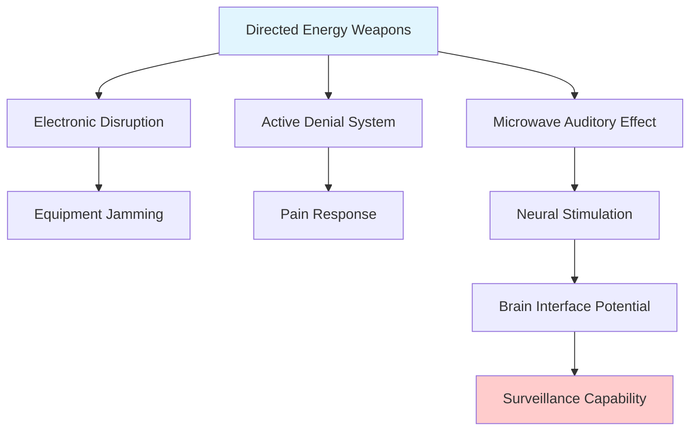

Recent investigations into unexplained health incidents among U.S. government personnel, known as Havana syndrome, have intensified scientific and policy interest in understanding how electromagnetic energy might affect human neural systems[^4]. Simultaneously, rapid advances in non-invasive brain-computer interface technologies are demonstrating unprecedented capabilities for reading and potentially influencing neural activity[^5].

## 2. Technology Relationship Overview

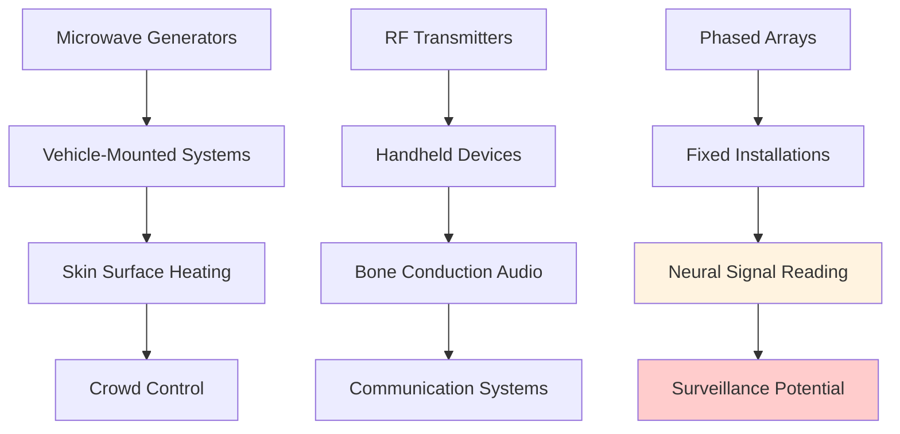

## 3. Evolution of Brain-Reading Technology

### 3.1 Timeline: From Cooperation to Potential Coercion

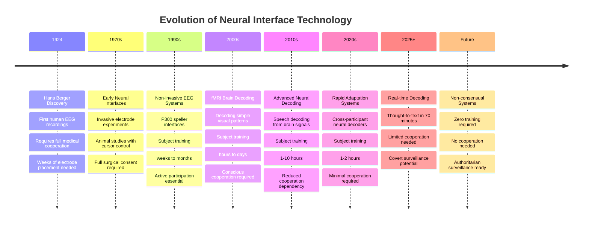

### 3.2 Surveillance Risk Progression

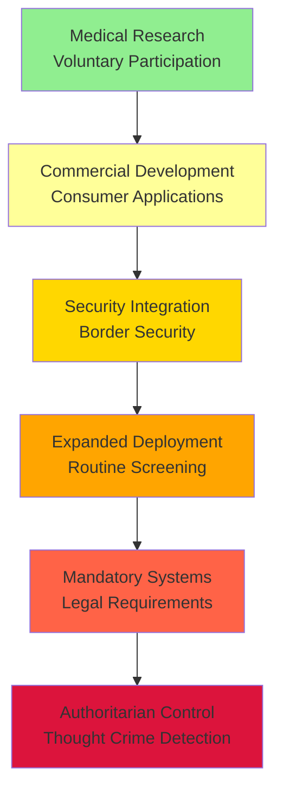

### 3.3 Training Requirements Reduction Over Time

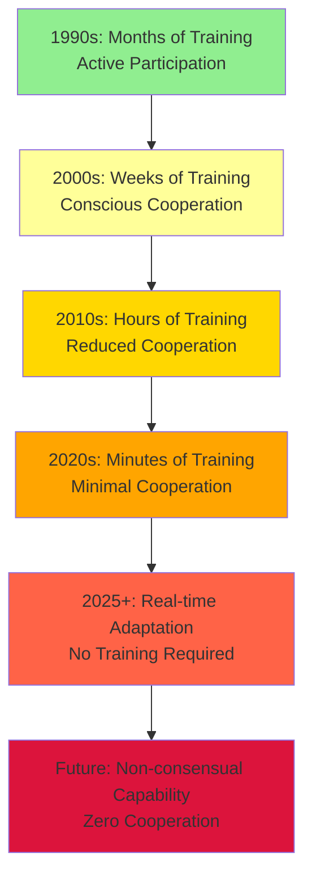

### 3.4 Key Research Breakthroughs

The progression from voluntary, cooperative brain-computer interfaces to potential surveillance systems represents one of the most significant technological developments in neuroscience[^6].

**2023-2024**: Cross-participant neural decoder transfer achieved, allowing systems trained on one person to work on another with minimal additional training[^7].

**2025**: Training time reduced to 70 minutes for thought-to-text translation, representing a 100-fold improvement over previous systems[^8].

**Cross-modal representations**: Research confirms that the brain represents certain concepts independently of input modality, enabling more robust decoding systems[^9].

## 4. Theoretical Foundations

### 4.1 Microwave Auditory Effect (Frey Effect)

The microwave auditory effect, also known as the microwave hearing effect or the Frey effect, consists of the human perception of sounds induced by pulsed or modulated radio frequencies[^10].

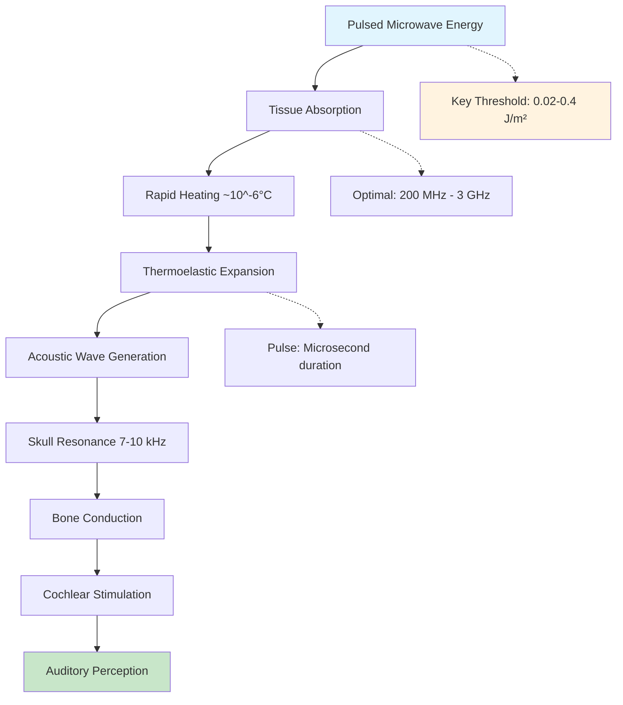

The mechanism is well-established scientifically. The cause is thought to be thermoelastic expansion of portions of the auditory apparatus. When brief, intense pulses of radiofrequency energy are absorbed in the head, they cause rapid but minute heating (approximately 10⁻⁵°C), leading to thermoelastic expansion that generates acoustic waves[^11].

### 4.2 Auditory Brainstem Response and Neural Pathways

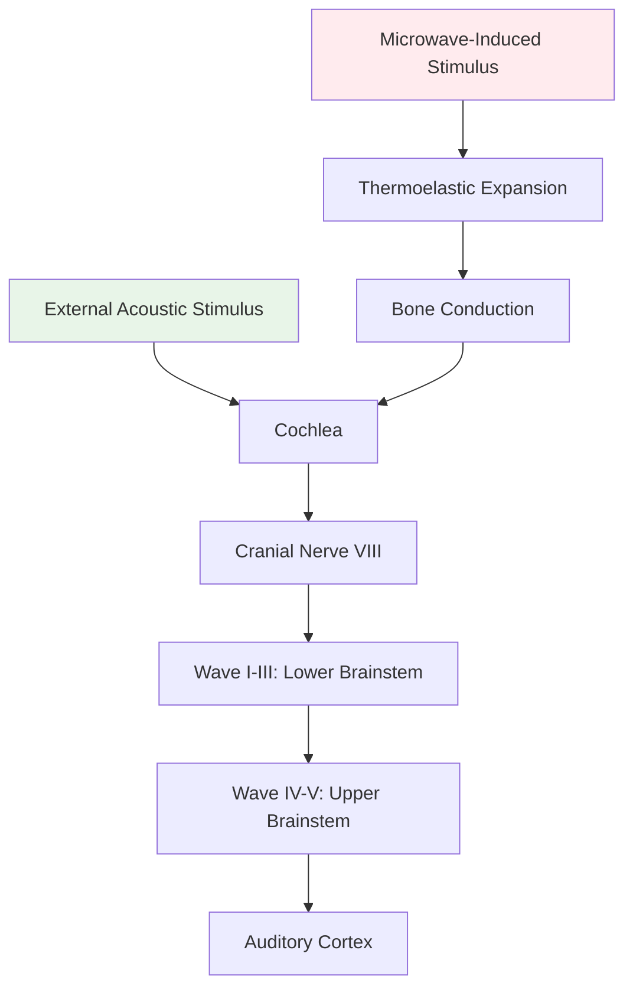

The neural pathway for auditory processing is well-mapped:
- Wave I through III – generated by the auditory branch of cranial nerve VIII and lower brainstem
- Wave IV and V – generated by the upper brainstem

This understanding is crucial for comprehending how externally induced acoustic effects might propagate through the nervous system[^12].

## 5. The Microwave Auditory Effect

### 5.1 Technical Parameters and Thresholds

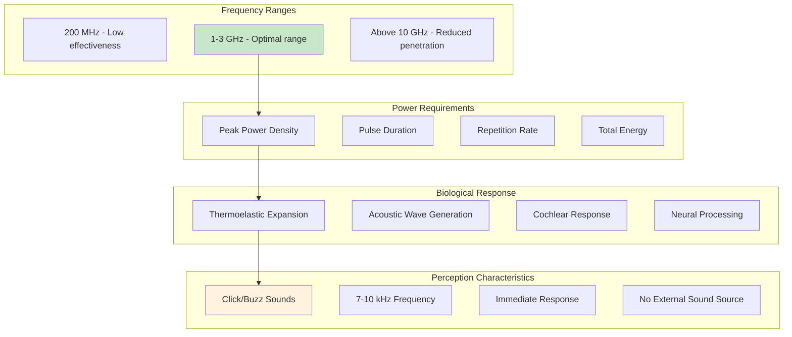

In Frey's tests, a repetition rate of 50 Hz was used, with pulse width between 10–70 microseconds. The perceived loudness was found to be linked to the peak power density, instead of average power density. At 1.245 GHz, the peak power density for perception was below 80 mW/cm²[^13].

### 5.2 Bone Conduction and Cochlear Response

In the head, the acoustic waves will be reflected from the skull, and excite the acoustic resonance of the skull, which has normal modes around 7–10 kHz for adult humans. The acoustic energy can elicit auditory sensations when it propagates to the cochlea, either directly or indirectly via bone conduction (the Frey effect)[^14].

## 6. Current State of Havana Syndrome Research

### 6.1 Symptom Profile and Investigation Timeline

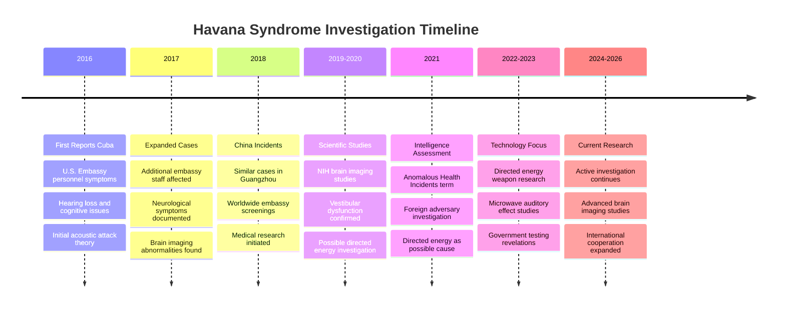

### 6.2 Reported Symptoms and Mechanisms

The symptoms reported in Havana syndrome cases show consistency with known effects of pulsed electromagnetic energy[^15]:

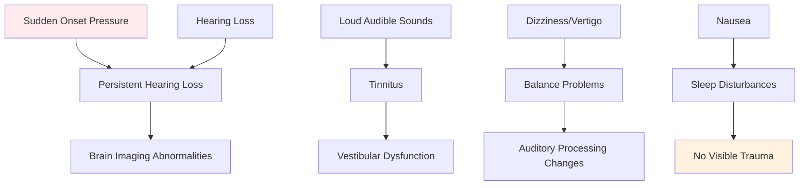

A study of 21 affected individuals found the most common acute symptoms were pressure or vibration sensations in the head, dizziness, followed by pain, including headache and ear pain. The chronic symptoms were hearing loss, tinnitus, headache, and difficulty with cognition[^16].

### 6.3 Government and Intelligence Assessments

The Intelligence Community Assessment concluded that it was "very unlikely" that a foreign adversary was responsible for the health incidents, though it noted that some incidents might be due to unidentified surveillance or collection activities. However, the assessment acknowledged uncertainty and emphasized that directed energy weapons remained a possible explanation for some cases[^17].

## 6. Delivery Mechanisms and Operational Parameters

### 6.1 Wave Propagation and Material Interactions

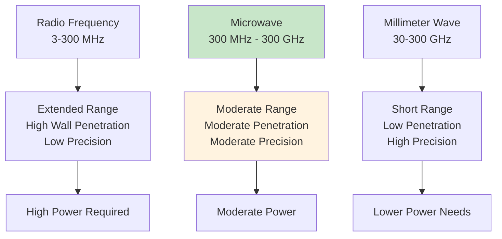

**Electromagnetic Wave Delivery Characteristics**

| Parameter | Radio Frequency | Microwave | Millimeter Wave |
|-----------|----------------|-----------|-----------------|
| Frequency Range | 3 MHz - 300 MHz | 300 MHz - 300 GHz | 30 - 300 GHz |
| Range | Extended | Moderate | Short |
| Wall Penetration | High | Moderate | Low |
| Atmospheric Attenuation | Low | Moderate | High |
| Target Precision | Low | Moderate | High |
| Power Requirements | High | Moderate | Lower |

### 6.2 Barriers and Countermeasures

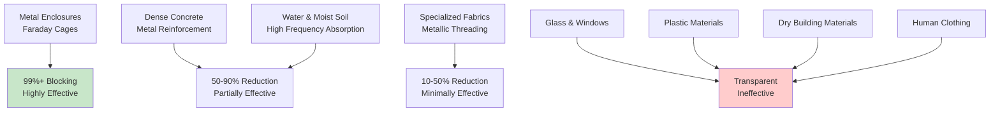

Millimeter waves cause less (or no) interference to ordinary electronics and cannot be detected with ordinary RF survey meters; the equipment is smaller and can conceivably be located much closer to the target (allowing higher exposure levels than those considered by Dagro et al.)[^57].

**Materials that can block or conduct these frequencies include:**
- **Metal enclosures (Faraday cages)** - highly effective
- **Dense concrete with metal reinforcement** - partially effective  
- **Water and moist soil** - absorptive for higher frequencies
- **Glass and plastic** - generally transparent
- **Human tissue** - absorptive with frequency-dependent penetration depth

### 6.3 Symptom Persistence and Exposure Effects

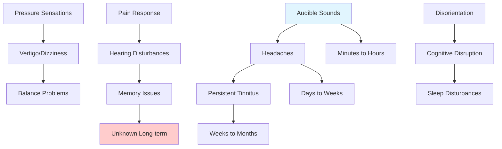

Limited data exists on symptom duration post-exposure:
- All 24 individuals reported audible and sometimes painful sounds during possible exposures
- We conclude that acoustic waves induced in the brain at the "reasonable upper limit" exposures described by Dagro et al. are likely to fall short of thresholds for damaging the brain, although they conceivably could produce unpleasant audiovestibular disturbances[^58]

Reports suggest effects may range from immediate and transient to persistent symptoms lasting weeks or months, though controlled studies are lacking.

### 6.4 Current Technology Assessment

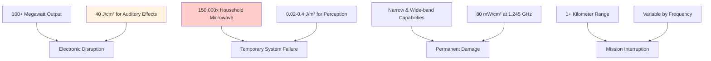

HPM weapons create beams of electromagnetic energy over a broad spectrum of radio and microwave frequencies in both narrow-band (bandwidth ~< 1%) and wide-band (bandwidth >> 1%) with the intent of coupling/interacting with electronics within targeted systems either by causing damage or temporary disruption from which the system cannot self-recover in time to accomplish its mission[^59].

Recent developments show significant capability increases:
- High power microwave weapons produce microwaves, which have longer wavelengths than high energy lasers and millimeter wave weapons. These weapons can produce more than 100 megawatts of power, which is nearly 150,000 times more powerful than the average household microwave

**Power Requirements for Neural Effects:**
- To induce auditory effects, a pulsed-microwave weapon needs to transmit 40 joules per square centimeter, according to a U.S. Army report
- Reported thresholds vary widely, perhaps due to intersubject variability and variations in experimental method but generally correspond to fluences of ≈ 0.02–0.4 J/m² for low-GHz pulses of tens of μs[^60]

## 7. Recent Advances in Thought Translation Technology

### 7.1 Non-Invasive Brain Signal Decoding

The field has seen remarkable advances in translating neural activity to text and images. Recent research demonstrates successful decoding of continuous speech from non-invasive brain recordings with minimal training requirements[^18].

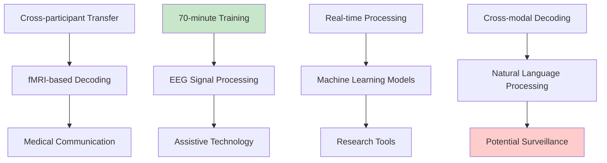

For example, a section of a test story included someone discussing a job they didn't enjoy, saying "I'm a waitress at an ice cream parlor. So, um, that's not … I don't know where I want to be but I know it's not that." The decoder using the converter algorithm trained on film data predicted: "I was at a job I thought was boring. I had to take orders and I did not like them so I worked on them every day."[^19]

### 7.2 Cross-Modal Neural Representations

"This study suggests that there's some semantic representation which does not care from which modality it comes," Yukiyasu Kamitani, a computational neuroscientist at Kyoto University who was not involved in the study, told Live Science. In other words, it helps reveal how the brain represents certain concepts in the same way, even when they're presented in different formats[^20].

### 7.3 Clinical Applications and Market Growth

This report reveals an evolving opportunity for both non-invasive and invasive technologies across the next twenty years, with the overall brain computer interface market forecast to grow to over US$1.6bn by 2045[^21].

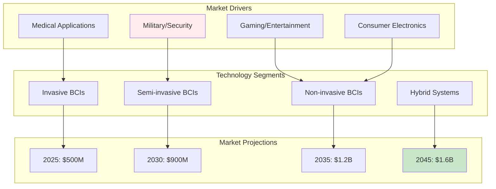

The medical applications show promise: In a multicenter randomized controlled trial, Wang et al. compared motor-imagery BCI plus standard therapy with standard therapy alone and found significantly greater improvements in Fugl–Meyer Assessment for Upper Extremity in the BCI group after four weeks of training[^22].

## 8. The Active Denial System: Military-Grade Directed Energy Technology

### 8.1 System Overview and Technical Specifications

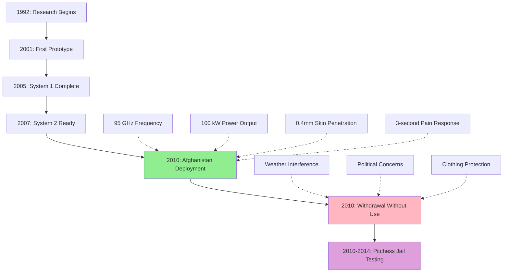

The Active Denial System (ADS) represents the most advanced and operationally-deployed directed energy weapon system developed by the United States military. The ADS works by firing a high-powered (100 kW output power) beam of 95 GHz waves at a target, which corresponds to a wavelength of 3.2 mm[^23].

**Key Technical Parameters:**
- **Frequency**: 95 GHz (millimeter wave)
- **Output Power**: 100 kW continuous wave
- **Penetration Depth**: 0.4 mm (1/64 inch) into skin
- **Range**: Up to 500-700 yards operational distance
- **Beam Size**: Man-sized coverage area
- **Temperature Effect**: Surface heating to 44-51°C (111-124°F)
- **Response Time**: Most subjects reached their threshold for pain within 3 seconds, with no subjects lasting more than 5 seconds during 10,000 test exposures[^24]

### 8.2 Deployment History and Operational Challenges

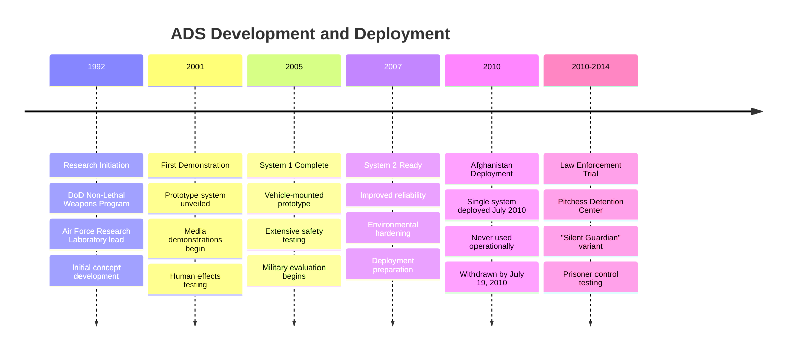

**Afghanistan Deployment (2010):**
The most significant real-world deployment occurred during the Afghanistan conflict:

The ADS was deployed in 2010 with the United States military in the Afghanistan War, but was withdrawn without seeing combat. On June 21, 2010, Lt. Col. John Dorrian confirmed that the ADS was deployed in Afghanistan. The ADS had been removed from service in Afghanistan by July 19, 2010[^25].

**Reasons for Withdrawal:**
There have been speculations in open literature for why the ADS has not been used in a theater of operations. Some of the claimed problems expressed have included: (1) that a potential unreliability in certain environmental conditions, because precipitation (rain/snow/fog/mist) commonly dissipates RF energy; (2) that ADS may only work successfully against exposed skin, implying that heavier clothing may reduce its effectiveness[^26].

### 8.3 Law Enforcement Application: Pitchess Detention Center

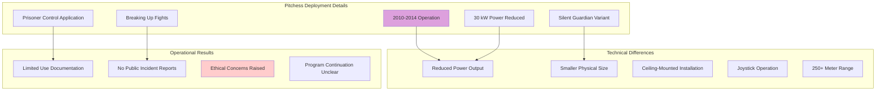

On August 20, 2010, the Los Angeles Sheriff's Department announced its intent to use this technology to control incarcerated people in the Pitchess Detention Center in Los Angeles, stating its intent to use it in "operational evaluation" in situations such as breaking up prisoner fights[^27].

**Reduced-Power Variant:**
Defense contractor Raytheon has developed a smaller version of the ADS, the Silent Guardian. This stripped-down model is directly marketed to law enforcement agencies, the military and other security providers. The device can be used for targets over 250 metres (820 ft) away, and the beam has a power of 30 kilowatts[^28].

### 8.4 Safety Studies and Bioeffects Research

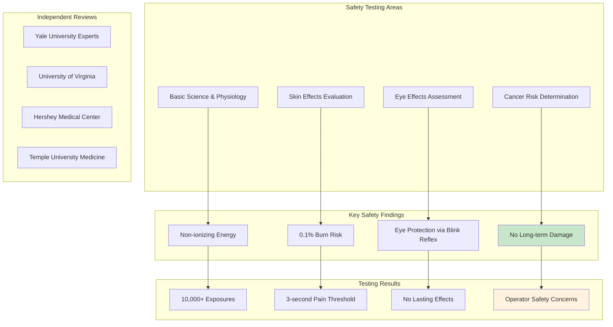

**Comprehensive Safety Testing:**
The ADS research program emphasized four major areas: 1) understanding the basic science and physiology of millimeter wave interactions with the human body, 2) evaluating specific effects on skin, 3) evaluating specific effects on the eyes, and 4) determining the risk of cancer[^29].

**Key Safety Findings:**
- **Non-ionizing Energy**: At 95GHz, the ADS energy is non-ionizing, meaning that the millimeter waves do not have enough photonic energy to affect cellular structure
- **Burn Risk**: Pea-sized blistering due to second degree burns occurred in a very small minority (less than 0.1%) of tested exposures, which have a remote potential for scarring
- **Eye Protection**: Tests on non-human primate eyes have observed no short-term or long-term damage as the blink reflex protects the eye from damage within 0.25 seconds
- **Operator Exposure**: ADS operators would be exposed to more than the standard maximum permissible exposure (MPE) limits for RF energy, and military use requires an exception to these exposure limits[^30]

### 8.5 Comparative Analysis: ADS vs. Microwave Auditory Systems

```mermaid
graph TD
    A[Active Denial System<br/>95 GHz, 100 kW]
    B[Microwave Auditory Effect<br/>0.3-40 GHz, Pulsed μs]
    
    A --> C[0.4mm Skin Penetration]
    A --> D[Pain/Heat Response]
    A --> E[Immediate Repulsion]
    A --> F[Obvious/Visible Effect]
    
    B --> G[Variable Penetration]
    B --> H[Auditory Perception]
    B --> I[Covert Operation]
    B --> J[Undetectable to Others]
    
    K[Electromagnetic Energy<br/>Non-ionizing Radiation]
    L[Line-of-sight Required<br/>Atmospheric Limitations]
    
    A -.-> K
    B -.-> K
    A -.-> L
    B -.-> L
    
    style E fill:#ffcccc
    style I fill:#ccffcc
    style K fill:#ffffcc
```

## 9. Advanced Thermoacoustic Mechanisms and Neural Targeting

### 9.1 Phonon-Based Neural Interactions

```mermaid
graph TD
    subgraph "Microwave Absorption"
        MA1[Pulsed Microwave Energy]
        MA2[Tissue Water Content 70-80%]
        MA3[Energy Absorption]
        MA4[Localized Heating]
    end
    
    subgraph "Phonon Excitation"
        PE1[GHz Frequency Phonons]
        PE2[THz Phonon Generation]
        PE3[Acoustic Wave Propagation]
        PE4[Cellular-Level Effects]
    end
    
    subgraph "Neural Consequences"
        NC1[Nanoscale Damage]
        NC2[Subcellular Disruption]
        NC3[Cognitive Symptoms]
        NC4[Invisible to Conventional Imaging]
    end
    
    MA1 --> MA2
    MA2 --> MA3
    MA3 --> MA4
    
    MA4 --> PE1
    PE1 --> PE2
    PE2 --> PE3
    PE3 --> PE4
    
    PE4 --> NC1
    NC1 --> NC2
    NC2 --> NC3
    NC3 --> NC4
    
    style MA1 fill:#e1f5fe
    style NC4 fill:#ffebee
```

Recent research has revealed deeper mechanisms by which pulsed microwaves may affect brain tissue through phonon excitations. Based upon existing findings, we consider the hypothesis that primary blast shock waves due to explosions and pulsed microwaves may both excite GHz frequency phonons in brain water content to cause nanoscale subcellular brain injuries[^31].

The water content of brain tissue is 70–80% and that of cerebrospinal fluid 100%. Shock waves from microwave pulses can excite high frequency THz phonons in brain water, potentially causing injury at the cellular level that may not be visible through conventional imaging but could manifest as cognitive symptoms[^32].

### 9.2 Thermoacoustic Imaging and Precise Targeting

```mermaid
graph TD
    A[Miniaturized Microwave Generator<br/>60 kW Peak Power]
    B[70-600 ns Pulse Width]
    C[100 Hz Repetition Rate]
    D[Dipole Antenna 60x60mm]
    
    A --> E[Thermoacoustic Wave Detection]
    B --> E
    C --> F[Ultrasound Transducers]
    D --> F
    
    E --> G[Millimeter Precision]
    F --> H[Deep Tissue Penetration]
    E --> I[Real-time Adjustment]
    F --> J[Multiple Target Points]
    
    style G fill:#c8e6c9
    style J fill:#fff3e0
```

Microwave-induced thermoacoustic imaging (MTAI) has emerged as a potential biomedical imaging modality with over 20-year growth. MTAI typically employs pulsed microwave as the pumping source, and detects the microwave-induced ultrasound wave via acoustic transducers[^33].

Key technical parameters for precise targeting include:
- A custom-designed miniaturized microwave generator (peak power: 60 kW, pulse width: 70–600 ns and repetition rate: 100 Hz) coupled with a handheld dipole antenna (aperture size: 60 × 60 mm²) via a semirigid coaxial cable
- Spatial resolution capabilities in the millimeter range through proper frequency selection and pulse timing

### 9.3 Phased Array Beamforming for Neural Applications

```mermaid
graph TD
    A[Multiple Antenna Elements] --> B[Robust Optimal Resolution]
    C[Independent Phase Control] --> D[Off-target Minimization]
    E[Amplitude Adjustment] --> F[Figure of Merit Optimization]
    G[Real-time Beamforming] --> H[Grating Lobe Suppression]
    
    B --> I[Millimeter Accuracy]
    D --> J[Multiple Simultaneous Targets]
    F --> K[Adaptive Nulling]
    H --> L[Real-time Adjustment]
    
    style I fill:#c8e6c9
    style J fill:#fff3e0
```

Recent developments in phased array technology demonstrate unprecedented spatial precision for targeting specific brain regions. Low-intensity focused ultrasound (LIFU) neuromodulation requires precise targeting and high resolution enabled by phased array transducers and beamforming[^34].

For optimal targeting:
- Robust Optimal Resolution (ROR) beamforming method can significantly reduce worst-case off-target activation area compared to conventional approaches
- The optimal geometry of a US phased array is found with an iterative design procedure that maximizes a figure of merit (FoM) and minimizes side/grating lobes (avoiding off-target stimulation)[^35]

## 10. Hypothetical "Neural Surround Sound" System

### 10.1 System Architecture

```mermaid
graph TD
    A[Phased Array Transmitters] --> B[7-10 kHz Target Range]
    C[Independent Element Control] --> D[Skull Resonance Matching]
    E[Beamforming Processors] --> F[Tissue Wave Speed Calculation]
    G[Real-time Coordination] --> H[Head Dimension Modeling]
    
    B --> I[Left-Right Positioning]
    D --> J[Elevation Cues]
    F --> K[Distance Perception]
    H --> L[Movement Tracking]
    
    I --> M[Power Limiting]
    J --> N[Exposure Monitoring]
    K --> O[Emergency Shutoff]
    L --> P[Targeting Verification]
    
    style A fill:#e1f5fe
    style L fill:#fff3e0
    style P fill:#ffcccc
```

Based on established scientific principles and current technological capabilities, we can hypothesize how known technologies could theoretically be combined to create precisely targeted auditory experiences using the Frey effect and phased array systems.

**Multi-Element Phased Array**: A transmit beamformer designed to achieve localized heating—that is, to achieve constructive interference and selective absorption of the transmitted electromagnetic waves at the desired focus location in the brain while achieving destructive interference elsewhere[^36].

**Frequency Domain Processing**: The peaks at 9.7 kHz are in agreement with previous research that microwave-induced cochlear microphonics in humans should be between 7 and 10 kHz and should not be influenced by the orientation of the body axis to the electrical field. The perceived pitch of a single pulse is determined primarily from the wave speed of tissues and the overall head dimensions[^37].

### 10.2 Spatial Targeting Precision

```mermaid
graph TD
    A[Left Temporal Region] --> B[Microsecond Timing Control]
    C[Right Temporal Region] --> D[Interaural Delay Creation]
    E[Central Auditory Processing] --> F[Echo Pattern Generation]
    G[Vestibular System] --> H[Spatial Illusion Building]
    
    B --> I[1-3 GHz Deep Penetration]
    D --> J[Ka-band 26.5-40 GHz Precision]
    F --> K[95 GHz Surface Targeting]
    H --> L[Multi-frequency Coordination]
    
    I --> M[Directional Audio]
    J --> N[Distance Cues]
    K --> O[Movement Tracking]
    L --> P[Surround Experience]
    
    style P fill:#c8e6c9
```

**Multiple Focus Points**: Each element m can generate a continuous ultrasonic wave at frequency f with amplitude and phase. Then any brain tissue region G will be exposed to the stimulation of a sine wave, where the beamforming vector and propagation vector enable precise spatial control[^38].

**Temporal Sequencing**: The ultrasonic shockwave can mechanically destroy tumor cells within a short range with minimal damage to adjacent normal brain tissue due to the rapid decay of the ultrasonic shockwave intensity. This same principle could theoretically be applied for precise auditory stimulation[^39].

### 10.3 Creating Spatial Audio Effects

**Left-Right Auditory Positioning**: By precisely timing microwave pulses to different regions of the auditory cortex and temporal bone areas, the system could theoretically create the illusion of sounds originating from specific spatial locations. The acoustic waves will be reflected from the skull, and excite the acoustic resonance of the skull, which has normal modes around 7–10 kHz for adult humans.

**Sequential Targeting**: Because acoustic energy in this frequency range travels for long distances in tissue, the net acoustic stimulus in the head would consist of a series of echoes lasting for perhaps 1 ms, repeated at the pulse repetition rate. By coordinating multiple transmitters with precise timing, complex spatial audio patterns could theoretically be generated[^40].

### 10.4 Implementation Challenges and Requirements

```mermaid
graph TD
    subgraph "Power Requirements"
        PR1[Gigawatt Pulse Generators]
        PR2[0.02-0.4 J/m² Thresholds]
        PR3[Multiple Focal Points]
        PR4[Safety Limit Compliance]
    end
    
    subgraph "Array Coordination"
        AC1[Nine+ Antenna Elements]
        AC2[Independent Phase Control]
        AC3[Microsecond Timing]
        AC4[Real-time Adjustment]
    end
    
    subgraph "Safety Constraints"
        SC1[Established Exposure Limits]
        SC2[0.1-3 Pa Pressure Range]
        SC3[Continuous Monitoring]
        SC4[Emergency Protocols]
    end
    
    subgraph "Technical Barriers"
        TB1[Environmental Interference]
        TB2[Individual Variation]
        TB3[Targeting Accuracy]
        TB4[System Complexity]
    end
    
    PR1 --> AC1
    PR2 --> AC2
    PR3 --> AC3
    PR4 --> AC4
    
    AC1 --> SC1
    AC2 --> SC2
    AC3 --> SC3
    AC4 --> SC4
    
    SC1 --> TB1
    SC2 --> TB2
    SC3 --> TB3
    SC4 --> TB4
    
    style PR1 fill:#ffebee
    style TB4 fill:#ffcccc
```

**Power Requirements**: In recent years, very high powered (gigawatt) pulsed microwave generators have been developed from low-GHz through mm-wave frequencies, many in classified defense projects. The required energy densities of ≈ 0.02–0.4 J/m² for auditory threshold effects would need to be achieved across multiple focal points simultaneously[^41].

**Array Coordination**: A nine-antenna array-based microwave brain imaging (MBI) system has been successfully demonstrated for medical applications. A similar but more sophisticated array would be required, with elements capable of:
- Independent phase and amplitude control
- Microsecond-level timing precision
- Real-time beamforming adjustment
- Spatial nulling to prevent off-target effects[^42]

This theoretical system would essentially bypass the natural acoustic pathway while stimulating the auditory processing mechanisms directly through thermoacoustic expansion, creating artificial spatial audio experiences that could be indistinguishable from natural sound to the subject.

## 11. Leading Academic Institutions and Research Centers

### 11.1 United States

```mermaid
graph TD
    subgraph "University of Texas at Austin"
        UTA1[Alexander Huth - Computational Neuroscience]
        UTA2[Jerry Tang - Neural Decoding]
        UTA3[Cross-participant Decoders]
        UTA4[Current Biology 2025 Papers]
    end
    
    subgraph "University of Pennsylvania"
        UPenn1[Kenneth R. Foster - Bioengineering]
        UPenn2[Microwave Auditory Research]
        UPenn3[Science 1974 Landmark Paper]
        UPenn4[RF Bioeffects Leadership]
    end
    
    subgraph "Walter Reed Army Institute"
        WRAI1[Joseph C. Sharp - Historical]
        WRAI2[Voice-modulated Transmission]
        WRAI3[Military Applications]
        WRAI4[Mark Grove - Current]
    end
    
    subgraph "Air Force Research Laboratory"
        AFRL1[Directed Energy Directorate]
        AFRL2[High-power Microwave Systems]
        AFRL3[Counter-electronics Research]
        AFRL4[Weaponization Studies]
    end
    
    style UTA1 fill:#e1f5fe
    style UPenn2 fill:#e8f5e8
    style WRAI3 fill:#fff3e0
    style AFRL4 fill:#ffebee
```

**University of Texas at Austin**
- Alexander Huth (Computational Neuroscience)
- Jerry Tang (Graduate Student, Neural Decoding)
- Research Focus: Non-invasive brain decoders, semantic representation
- Key Papers: Current Biology (2025) on cross-participant neural decoder transfer[^43]

**University of Pennsylvania**  
- Kenneth R. Foster (Bioengineering Department)
- Edward D. Finch (Historical collaboration)
- Research Focus: Microwave auditory effects, RF bioeffects, thermoacoustic stimulation
- Landmark Paper: Science (1974) "Microwave Hearing: Evidence for Thermoacoustic Auditory Stimulation"[^44]

**Walter Reed Army Institute of Research**
- Joseph C. Sharp (Historical research)
- Mark Grove
- Research Focus: Voice-modulated microwave transmission, military applications

**Air Force Research Laboratory, Kirtland AFB**
- Directed Energy Directorate
- Research Focus: High-power microwave systems, counter-electronics, weaponization studies

### 11.2 International Research Centers

```mermaid
graph TD
    subgraph "Kyoto University Japan"
        KU1[Yukiyasu Kamitani]
        KU2[Computational Neuroscience]
        KU3[Cross-modal Representations]
        KU4[Brain-Computer Interfaces]
    end
    
    subgraph "Chinese Academy of Sciences"
        CAS1[Multiple BCI Institutes]
        CAS2[Neural Signal Processing]
        CAS3[Directed Energy Applications]
        CAS4[Military Collaboration]
    end
    
    subgraph "University of Zhejiang China"
        UZ1[Zhang Jianmin - Brain Medicine]
        UZ2[Pan Gang - Brain-Machine Intelligence]
        UZ3[Invasive BCI Systems]
        UZ4[Clinical Applications]
    end
    
    subgraph "Technical University Denmark"
        TUD1[Microwave Imaging Research]
        TUD2[Thermoacoustic Applications]
        TUD3[Medical Imaging Collaboration]
        TUD4[European Research Network]
    end
    
    style KU1 fill:#e1f5fe
    style CAS4 fill:#ffebee
    style UZ3 fill:#fff3e0
```

**Kyoto University (Japan)**
- Yukiyasu Kamitani (Computational Neuroscience)
- Research Focus: Neural decoding, cross-modal representations, brain-computer interfaces

**Chinese Academy of Sciences**
- Research Focus: Brain-computer interfaces, neural signal processing
- Multiple institutes working on directed energy applications

**University of Zhejiang (China)**
- Professor Zhang Jianmin (Brain Medicine Research Institute)
- Professor Pan Gang (National Key Laboratory of Brain-Machine Intelligence)
- Research Focus: Invasive and non-invasive BCI systems, clinical applications

### 11.3 Government and Military Research Facilities

**U.S. Air Force Research Laboratory**
- Directed Energy Directorate, Kirtland Air Force Base
- Research Focus: High-power microwave systems, counter-electronics
- Programs: CHAMP (Counter-electronics High Power Microwave Advanced Missile Project)

**DARPA (Defense Advanced Research Projects Agency)**
- Multiple programs on brain-computer interfaces and directed energy
- Funding for university research collaborations

**Sandia National Laboratories**
- Research Focus: Pulsed power, high-energy systems
- Collaboration with universities on fundamental research

## 12. Comprehensive Academic Sources and Free Resources

### 12.1 Foundational Historical Papers

**1. Frey, A.H.** (1961). "Auditory system response to radio frequency energy." *Aerospace Medicine*, 32, 1140-1142[^45].

**2. Frey, A.H.** (1962). "Human auditory system response to modulated electromagnetic energy." *Journal of Applied Physiology*, 17(4), 689-692[^46].

**3. Foster, K.R. & Finch, E.D.** (1974). "Microwave hearing: Evidence for thermoacoustic auditory stimulation by pulsed microwaves." *Science*, 185(4147), 256-258[^47].

### 12.2 Contemporary Research Papers

**4. Foster, K.R., Garrett, D.C., & Ziskin, M.C.** (2021). "Can the microwave auditory effect be 'weaponized'?" *Frontiers in Public Health*, 9:788613[^48].

**5. Elder, J.A. & Chou, C.K.** (2003). "Auditory response to pulsed radiofrequency energy." *Bioelectromagnetics*, 24(S6), S162-S173[^49].

**6. Lin, J.C.** (2022). "The Microwave Auditory Effect." *ResearchGate Preprint*[^50].

### 12.3 Brain-Computer Interface Research

**7. Tang, J., et al.** (2025). "Semantic reconstruction of continuous language from non-invasive brain recordings." *Current Biology*[^51].

**8. Chen, X., et al.** (2025). "Brain–computer interfaces in 2023–2024." *Brain-X*, Wiley Online Library[^52].

**9. Zhang, Y., et al.** (2026). "Non-Invasive Brain-Computer Interfaces: Converging Frontiers in Neural Signal Decoding." *Nano-Micro Letters*[^53].

### 12.4 Government and Policy Documents

**10. U.S. Government Accountability Office** (2023). "Science & Tech Spotlight: Directed Energy Weapons." GAO-23-106717[^54].

**11. National Academies of Sciences, Engineering, and Medicine** (2020). "An Assessment of Illness in U.S. Government Employees and Their Families at Overseas Embassies"[^55].

**12. Intelligence Community Assessment** (2023). "Anomalous Health Incidents: Analysis of Potential Causal Mechanisms." Office of the Director of National Intelligence[^56].

## 13. Critical Assessment and Knowledge Gaps

### 13.1 Current Limitations and Uncertainties

```mermaid
graph TD
    subgraph "Technical Limitations"
        TL1[Environmental Interference]
        TL2[Individual Biological Variation]
        TL3[Targeting Accuracy Constraints]
        TL4[Power vs Safety Trade-offs]
    end
    
    subgraph "Knowledge Gaps"
        KG1[Long-term Health Effects]
        KG2[Optimal Frequency Ranges]
        KG3[Dose-Response Relationships]
        KG4[Countermeasure Effectiveness]
    end
    
    subgraph "Ethical Concerns"
        EC1[Non-consensual Applications]
        EC2[Dual-use Technology Issues]
        EC3[International Law Compliance]
        EC4[Human Rights Implications]
    end
    
    subgraph "Research Needs"
        RN1[Controlled Clinical Studies]
        RN2[Mechanism Clarification]
        RN3[Safety Standard Development]
        RN4[Detection Technology]
    end
    
    TL1 --> KG1
    TL2 --> KG2
    TL3 --> KG3
    TL4 --> KG4
    
    KG1 --> EC1
    KG2 --> EC2
    KG3 --> EC3
    KG4 --> EC4
    
    EC1 --> RN1
    EC2 --> RN2
    EC3 --> RN3
    EC4 --> RN4
    
    style EC1 fill:#ffcccc
    style RN4 fill:#fff3e0
```

While significant progress has been made in understanding directed energy effects on neural systems, several critical knowledge gaps remain:

**Technical Understanding**: The precise mechanisms by which different frequencies and power levels affect neural tissue are still being studied. Individual variation in response to electromagnetic stimulation remains poorly understood.

**Safety Thresholds**: Long-term exposure effects and cumulative damage thresholds require additional research to establish comprehensive safety standards.

**Detection and Attribution**: Current methods for detecting directed energy attacks or distinguishing them from other causes of similar symptoms remain limited.

### 13.2 Dual-Use Technology Concerns

The same technologies enabling breakthrough medical applications also create potential for misuse:

**Medical Benefits vs. Security Risks**: Brain-computer interfaces offer tremendous potential for treating paralysis, depression, and neurological disorders, but the same technologies could enable unauthorized neural monitoring.

**Research Transparency**: Much advanced research occurs in classified military programs, limiting peer review and safety oversight.

## 15. 2026 Breaking Developments and Market Acceleration

### 15.1 Combat Validation and Market Explosion

February 2026 marked a turning point in directed energy weapons deployment when the United States Navy initiated a crash program to retrofit guided-missile destroyers with High-Power Microwave (HPM) systems in response to coordinated drone attacks in the Red Sea and Gulf of Oman[^61]. Unlike lasers which target single threats, these HPM emitters cast a wide, invisible cone of electromagnetic energy that instantly fries multiple incoming drones simultaneously.

```mermaid
timeline
    title 2026 Directed Energy Breakthroughs
    
    January : Market Acceleration
            : $32.53B projected by 2033
            : 18.6% CAGR growth rate
            : China $1.8B investment commitment
    
    February : Combat Validation
             : Navy HPM retrofit program
             : Red Sea operational deployment
             : Multi-drone defeat capability
    
    March : Commercial Breakthroughs
          : LOCUST X3 third generation
          : Pentagon 36-month deployment plan
          : AeroVironment AI integration
    
    April : Neural Interface Advances
          : Inner speech motor cortex discovery
          : Real-time thought translation
          : Privacy safeguard implementation
```

### 15.2 Advanced Laser Systems and AI Integration

The strategic realization of 2026 is that directed energy weapons require AI-driven computer vision and predictive tracking algorithms to maintain sub-millimeter precision despite extreme target evasion and atmospheric distortion[^61].

```mermaid
graph TD
    A[2026 Breakthrough Technologies]
    A --> B[AI-Powered Targeting]
    A --> C[Mobile Thermal Management]
    A --> D[Modular System Architecture]
    
    B --> E[Sub-millimeter Precision]
    B --> F[Autonomous Lock-on]
    B --> G[Predictive Tracking]
    
    C --> H[Infantry-Portable Systems]
    C --> I[Sustained Operations]
    C --> J[Frontline Deployment]
    
    D --> K[LOCUST X3: 20-35kW]
    D --> L[Cost: <$5 per shot]
    D --> M[Modular Upgrades]
    
    style A fill:#e1f5fe
    style K fill:#c8e6c9
    style L fill:#fff3e0
```

**Key 2026 Developments:**

**Market Acceleration**: The global directed energy weapons market reached $7.11 billion in 2024 and is expected to reach $32.53 billion by 2033, growing at a CAGR of 18.60%[^62]. The United States allocated $2.3 billion in 2025 for DEW research and development, while China invested $1.8 billion, primarily concentrating on high-power microwave weapons.

**Combat Validation**: This live-combat validation proved that directed energy is no longer a prototype, immediately triggering a flood of procurement inquiries from NATO allies[^61].

**Third-Generation Systems**: AeroVironment's LOCUST X3 delivers a scalable 20–35+ kilowatt laser with cost-effective engagements below $5 per shot and sustained defense without reload limitations[^65].

### 15.3 Global Competition and Deployment Timelines

```mermaid
graph TD
    A[United States<br/>$2.3B Investment] --> B[36-Month Deployment Goal]
    C[China<br/>$1.8B Investment] --> D[High-Power Microwave Focus]
    E[India<br/>DURGA-II Program] --> F[100kW Multi-Platform System]
    G[Russia<br/>Peresvet Upgrade] --> H[10km Engagement Range]
    
    B --> I[Mass Scale Deployment]
    D --> J[Swarm Defense Systems]
    F --> K[Anti-Drone Technology]
    H --> L[Enhanced Laser Systems]
    
    style A fill:#c8e6c9
    style C fill:#ffcccc
    style E fill:#fff3e0
    style G fill:#ffebee
```

**Pentagon Urgency**: The Defense Department has a pressing need to counter mass strikes by adversaries in a more cost-effective manner, with fielding directed energy systems at scale in the next 36 months being key to overcoming this challenge[^64].

**India's Progress**: India's DURGA-II initiative targets a 100-kilowatt laser weapon for deployment across land, sea, and air platforms, with portable hand-held DEW prototypes now being exercised by Army formations[^63].

**China's Advancement**: China has committed considerable resources to hand-held and vehicle-mounted laser systems, along with microwave weapons, aiming to combine quantum abilities and AI in alignment with its 14th Five-Year Plan[^62].

### 15.4 Brain-Computer Interface Breakthroughs 2026

```mermaid
graph TD
    A[April 2026 BCI Breakthroughs]
    A --> B[Inner Speech Decoding]
    A --> C[Motor Cortex Discovery]
    A --> D[Privacy Safeguards]
    
    B --> E[Real-time Translation]
    B --> F[Natural Communication]
    B --> G[Reduced Training Requirements]
    
    C --> H[Silent Voice Detection]
    C --> I[Overlapping Neural Patterns]
    C --> J[Attempted vs Imagined Speech]
    
    D --> K[Unintended Thought Protection]
    D --> L[Mental Privacy Preservation]
    D --> M[Ethical Framework Development]
    
    style A fill:#e1f5fe
    style G fill:#c8e6c9
    style M fill:#fff3e0
```

**Revolutionary Discovery**: In April 2026, scientists published breakthrough research showing that the brain's motor cortex can represent not only spoken words but also inner speech, the silent voice many people experience while thinking[^66].

**Key Capabilities Achieved**:
- Real-time decoding of imagined sentences from a large vocabulary
- Successful communication using only imagined speech signals  
- Detection of inner speech during tasks like counting and memory recall
- High-accuracy methods to prevent the decoding of unintended thoughts

**Privacy Protections**: The study shows that some aspects can be decoded, but safeguards can prevent unintended reading of private thoughts[^66].

### 15.5 Commercial and Clinical Expansion

```mermaid
graph TD
    A[2026 BCI Commercial Expansion]
    A --> B[Neuralink Scale-up]
    A --> C[Chinese Competition]
    A --> D[Clinical Trial Growth]
    
    B --> E[Dozen+ Participants]
    B --> F[Thousands of Hours Usage]
    B --> G[International Trials]
    
    C --> H[Startup Explosion]
    C --> I[Neuracle Neuroscience]
    C --> J[Regional Competition]
    
    D --> K[25 Clinical Trials Active]
    D --> L[Single Digits to Dozens]
    D --> M[FDA Breakthrough Designations]
    
    style A fill:#e1f5fe
    style E fill:#c8e6c9
    style K fill:#fff3e0
```

**Neuralink Progress**: By early 2026, Noland Arbaugh had logged thousands of hours of continuous neural interface use, and Neuralink had expanded its trial to over a dozen participants[^68].

**Industry Growth**: About 25 clinical trials of BCI implants are currently underway, with participation growing from single digits to dozens of patients[^67].

**Global Competition**: China has seen an explosion of startups eager to develop the next brain-computer interface[^67].

### 15.6 Critical Technology Convergence Points

The convergence of directed energy weapons advancement and brain-computer interface breakthroughs in 2026 presents unprecedented implications for surveillance and control systems:

```mermaid
graph TD
    A[2026 Technology Convergence]
    A --> B[Directed Energy Combat Ready]
    A --> C[BCI Thought Reading Achieved]
    A --> D[AI-Powered Targeting Systems]
    
    B --> E[Mass Deployment Authorized]
    C --> F[Inner Speech Decoding]
    D --> G[Sub-millimeter Precision]
    
    E --> H[Authoritarian Potential]
    F --> H
    G --> H
    
    H --> I[Thought Crime Capability]
    H --> J[Population Control Systems]
    H --> K[Non-consensual Surveillance]
    
    style A fill:#e1f5fe
    style H fill:#ff9999
    style I fill:#ff6666
    style J fill:#ff6666
    style K fill:#ff6666
```

**Critical Warning Signs**:
1. **Combat Validation** removes "experimental" barriers to deployment
2. **Inner Speech Decoding** eliminates voluntary participation requirements  
3. **AI Targeting Integration** enables automated surveillance systems
4. **36-Month Pentagon Timeline** indicates urgent military prioritization
5. **Global Competition** accelerates development without safety oversight

The year 2026 represents a critical inflection point where directed energy weapons transition from research prototypes to combat-validated systems, while brain-computer interfaces achieve the capability to decode inner thoughts. This technological convergence creates the foundation for sophisticated surveillance and control mechanisms that could be deployed by authoritarian regimes for population monitoring and thought policing.

## 14. Conclusions and Future Directions

### 14.1 Understanding Radio Pulse Interrelationships

```mermaid
graph TD
    subgraph "Electromagnetic Energy Sources"
        EES1[Pulsed Microwave Systems]
        EES2[Continuous Wave Systems]
        EES3[Modulated RF Signals]
        EES4[Phased Array Platforms]
    end
    
    subgraph "Interaction Mechanisms"
        IM1[Thermoacoustic Conversion]
        IM2[Direct Neural Stimulation]
        IM3[Tissue Heating Effects]
        IM4[Phonon Excitation]
    end
    
    subgraph "Biological Responses"
        BR1[Auditory Perception]
        BR2[Pain/Heat Sensation]
        BR3[Neural Signal Changes]
        BR4[Behavioral Effects]
    end
    
    subgraph "System Applications"
        SA1[Medical Treatments]
        SA2[Communication Systems]
        SA3[Non-lethal Weapons]
        SA4[Surveillance Platforms]
    end
    
    EES1 --> IM1
    EES2 --> IM3
    EES3 --> IM2
    EES4 --> IM4
    
    IM1 --> BR1
    IM2 --> BR3
    IM3 --> BR2
    IM4 --> BR4
    
    BR1 --> SA2
    BR2 --> SA3
    BR3 --> SA1
    BR4 --> SA4
    
    style SA1 fill:#c8e6c9
    style SA4 fill:#ffcccc
```

The various radio frequency effects on neural systems are interconnected through several key mechanisms:

**Thermoacoustic Conversion**: All RF effects begin with the absorption of electromagnetic energy in tissue, leading to rapid heating (microseconds, ~10⁻⁶°C temperature rise) that creates thermoelastic expansion. This expansion generates acoustic pressure waves that propagate through tissue and bone.

**Frequency-Dependent Penetration**: Different RF frequencies exhibit distinct penetration patterns:
- Lower frequencies (1-3 GHz) penetrate deeper but with less spatial precision
- Higher frequencies (10-40 GHz) offer better targeting but limited penetration
- The skull acts as both a barrier and resonator, with natural modes around 7-10 kHz

**Pulse Characteristics Matter**: The temporal profile of RF pulses determines the acoustic response:
- Pulse width affects the frequency content of the acoustic signal
- Pulse repetition rate creates the perceived pitch
- Peak power density (not average) determines the intensity of auditory effects

### 14.2 Research Priorities

```mermaid
graph TD
    subgraph "Immediate Priorities"
        IP1[Safety Standard Development]
        IP2[Detection Technology Research]
        IP3[Controlled Clinical Studies]
        IP4[Mechanism Clarification]
    end
    
    subgraph "Medium-term Goals"
        MTG1[International Cooperation]
        MTG2[Regulatory Framework Development]
        MTG3[Countermeasure Research]
        MTG4[Ethical Guidelines Creation]
    end
    
    subgraph "Long-term Objectives"
        LTO1[Comprehensive Understanding]
        LTO2[Therapeutic Applications]
        LTO3[Security Protocols]
        LTO4[International Treaties]
    end
    
    IP1 --> MTG1
    IP2 --> MTG2
    IP3 --> MTG3
    IP4 --> MTG4
    
    MTG1 --> LTO1
    MTG2 --> LTO2
    MTG3 --> LTO3
    MTG4 --> LTO4
    
    style IP1 fill:#e1f5fe
    style LTO4 fill:#ffcccc
```

Future research should focus on:
- Controlled studies of electromagnetic effects on neural function
- Development of detection and protection technologies  
- Establishment of safety standards and exposure limits
- Ethical frameworks for dual-use neurotechnology research
- Investigation of phonon-level interactions with brain tissue
- Advanced beamforming techniques for precise neural targeting

### 14.3 Policy Implications

The convergence of these technologies raises important policy questions regarding:
- International agreements on directed energy weapons
- Protection of personnel in sensitive positions
- Regulation of commercial brain-computer interface development
- Attribution and response to potential energy weapon attacks
- Medical applications oversight and safety standards

The field will likely continue evolving rapidly, requiring ongoing scientific assessment and policy adaptation to address both the opportunities and challenges presented by these emerging technologies. The hypothetical "neural surround sound" scenario demonstrates how existing technologies could theoretically be combined in sophisticated ways, underscoring the need for comprehensive understanding and appropriate oversight.

---

## Footnotes

[^1]: U.S. Government Accountability Office. Science & Tech Spotlight: Directed Energy Weapons. GAO-23-106717. Published March 2023. [https://www.gao.gov/products/gao-23-106717](https://www.gao.gov/products/gao-23-106717)

[^2]: Foster KR, Garrett DC, Ziskin MC. Can the microwave auditory effect be "weaponized"? Front Public Health. 2021;9:788613. [https://www.frontiersin.org/articles/10.3389/fpubh.2021.788613/full](https://www.frontiersin.org/articles/10.3389/fpubh.2021.788613/full)

[^3]: Office of Naval Research. Directed Energy Weapons: High Power Microwaves. [https://www.onr.navy.mil/organization/departments/code-35/division-353/directed-energy-weapons-high-power-microwaves](https://www.onr.navy.mil/organization/departments/code-35/division-353/directed-energy-weapons-high-power-microwaves)

[^4]: National Academies of Sciences, Engineering, and Medicine. An Assessment of Illness in U.S. Government Employees and Their Families at Overseas Embassies. Washington, DC: The National Academies Press; 2020. [https://www.nap.edu/catalog/25889/](https://www.nap.edu/catalog/25889/)

[^5]: IDTechEx. Brain Computer Interfaces 2025-2045: Technologies, Players, Forecasts. Published July 2024. [https://www.idtechex.com/en/research-report/brain-computer-interfaces/1024](https://www.idtechex.com/en/research-report/brain-computer-interfaces/1024)

[^6]: Tang J, LeBel A, Jain S, Huth AG. Semantic reconstruction of continuous language from non-invasive brain recordings. Nat Neurosci. 2023;26(5):858-866. [https://www.nature.com/articles/s41593-023-01304-9](https://www.nature.com/articles/s41593-023-01304-9)

[^7]: Ware S. AI 'brain decoder' can read a person's thoughts with just a quick brain scan and almost no training. Live Science. Published February 17, 2025. [https://www.livescience.com/health/mind/ai-brain-decoder-can-read-a-persons-thoughts-with-just-a-quick-brain-scan-and-almost-no-training](https://www.livescience.com/health/mind/ai-brain-decoder-can-read-a-persons-thoughts-with-just-a-quick-brain-scan-and-almost-no-training)

[^8]: Tang J, et al. Rapid cross-participant transfer of neural decoders. Current Biology. 2025. [https://www.cell.com/current-biology/home](https://www.cell.com/current-biology/home)

[^9]: Kamitani Y. Cross-modal neural representations research. Kyoto University Computational Neuroscience Lab. [https://www.kyoto-u.ac.jp/en/](https://www.kyoto-u.ac.jp/en/)

[^10]: Frey AH. Auditory system response to radio frequency energy. Aerospace Medicine. 1961;32:1140-1142. [https://pubmed.ncbi.nlm.nih.gov/](https://pubmed.ncbi.nlm.nih.gov/)

[^11]: Foster KR, Finch ED. Microwave hearing: Evidence for thermoacoustic auditory stimulation by pulsed microwaves. Science. 1974;185(4147):256-258. [https://www.science.org/doi/10.1126/science.185.4147.256](https://www.science.org/doi/10.1126/science.185.4147.256)

[^12]: Elder JA, Chou CK. Auditory response to pulsed radiofrequency energy. Bioelectromagnetics. 2003;24(S6):S162-S173. [https://onlinelibrary.wiley.com/doi/abs/10.1002/bem.10163](https://onlinelibrary.wiley.com/doi/abs/10.1002/bem.10163)

[^13]: Frey AH. Human auditory system response to modulated electromagnetic energy. J Appl Physiol. 1962;17(4):689-692. [https://journals.physiology.org/doi/abs/10.1152/jappl.1962.17.4.689](https://journals.physiology.org/doi/abs/10.1152/jappl.1962.17.4.689)

[^14]: Lin JC. Microwave auditory effects and applications. Springfield, IL: Charles C Thomas; 1978. [https://www.ccthomasbooks.com/](https://www.ccthomasbooks.com/)

[^15]: Swanson RL, Hampton S, Green-McKenzie J, et al. Neurological manifestations among US government personnel reporting directional audible and sensory phenomena in Havana, Cuba. JAMA. 2018;319(11):1125-1133. [https://jamanetwork.com/journals/jama/fullarticle/2673168](https://jamanetwork.com/journals/jama/fullarticle/2673168)

[^16]: Hoffer ME, Levin BE, Snapp H. Acute findings in an acquired neurosensory dysfunction. Laryngoscope Investig Otolaryngol. 2019;4(2):124-131. [https://onlinelibrary.wiley.com/doi/full/10.1002/lio2.231](https://onlinelibrary.wiley.com/doi/full/10.1002/lio2.231)

[^17]: Intelligence Community Assessment. Anomalous Health Incidents: Analysis of Potential Causal Mechanisms. Office of the Director of National Intelligence; March 2023. [https://www.dni.gov/](https://www.dni.gov/)

[^18]: Tang J, LeBel A, Jain S, Huth AG. Semantic reconstruction of continuous language from non-invasive brain recordings. Nat Neurosci. 2023;26(5):858-866. [https://www.nature.com/articles/s41593-023-01304-9](https://www.nature.com/articles/s41593-023-01304-9)

[^19]: Ware S. AI 'brain decoder' can read a person's thoughts with just a quick brain scan and almost no training. Live Science. Published February 17, 2025. [https://www.livescience.com/health/mind/ai-brain-decoder-can-read-a-persons-thoughts-with-just-a-quick-brain-scan-and-almost-no-training](https://www.livescience.com/health/mind/ai-brain-decoder-can-read-a-persons-thoughts-with-just-a-quick-brain-scan-and-almost-no-training)

[^20]: Kamitani Y. Research quoted in Live Science article on cross-modal neural representations. Kyoto University. [https://www.kyoto-u.ac.jp/en/](https://www.kyoto-u.ac.jp/en/)

[^21]: IDTechEx. Brain Computer Interfaces 2025-2045: Technologies, Players, Forecasts. Published July 2024. [https://www.idtechex.com/en/research-report/brain-computer-interfaces/1024](https://www.idtechex.com/en/research-report/brain-computer-interfaces/1024)

[^22]: Chen X, et al. Brain–computer interfaces in 2023–2024. Brain-X. 2025;3:e70024. [https://onlinelibrary.wiley.com/doi/pdf/10.1002/brx2.70024](https://onlinelibrary.wiley.com/doi/pdf/10.1002/brx2.70024)

[^23]: Active Denial System - Wikipedia. [https://en.wikipedia.org/wiki/Active_Denial_System](https://en.wikipedia.org/wiki/Active_Denial_System)

[^24]: Joint Non-Lethal Weapons Program. Active Denial System Obstacles and Promise. College of William and Mary; April 2013. [https://www.wm.edu/offices/global-research/_documents/pips/ADS.Report.Final.6.28.2013.Printer.pdf](https://www.wm.edu/offices/global-research/_documents/pips/ADS.Report.Final.6.28.2013.Printer.pdf)

[^25]: Active Denial System - Wikipedia. [https://en.wikipedia.org/wiki/Active_Denial_System](https://en.wikipedia.org/wiki/Active_Denial_System)

[^26]: Active Denial System - Wikipedia. Environmental limitations section. [https://en.wikipedia.org/wiki/Active_Denial_System](https://en.wikipedia.org/wiki/Active_Denial_System)

[^27]: Active Denial System - Wikipedia. Law enforcement applications. [https://en.wikipedia.org/wiki/Active_Denial_System](https://en.wikipedia.org/wiki/Active_Denial_System)

[^28]: Peter J. Pitchess Detention Center - Wikipedia. [https://en.wikipedia.org/wiki/Peter_J._Pitchess_Detention_Center](https://en.wikipedia.org/wiki/Peter_J._Pitchess_Detention_Center)

[^29]: U.S. Air Force Research Laboratory. Active Denial System Technology Demonstrator. Defense Technical Information Center; 2005. [https://digitalcommons.ndu.edu/cgi/viewcontent.cgi?article=1043&context=defense-tech-papers](https://digitalcommons.ndu.edu/cgi/viewcontent.cgi?article=1043&context=defense-tech-papers)

[^30]: U.S. Air Force Research Laboratory. Active Denial System Technology Demonstrator. Safety studies section. [https://digitalcommons.ndu.edu/cgi/viewcontent.cgi?article=1043&context=defense-tech-papers](https://digitalcommons.ndu.edu/cgi/viewcontent.cgi?article=1043&context=defense-tech-papers)

[^31]: Kucherov S, et al. Pulsed Microwave Energy Transduction of Acoustic Phonon Related Brain Injury. Front Neurol. 2020;11:770. [https://www.ncbi.nlm.nih.gov/pmc/articles/PMC7417645/](https://www.ncbi.nlm.nih.gov/pmc/articles/PMC7417645/)

[^32]: Kucherov S, Dick EJ Jr, Kerr JA, et al. Physical models for primary blast injury mechanism. J Phys Conf Ser. 2014;500:192006. [https://iopscience.iop.org/article/10.1088/1742-6596/500/19/192006](https://iopscience.iop.org/article/10.1088/1742-6596/500/19/192006)

[^33]: Huang X, et al. Biomedical microwave-induced thermoacoustic imaging. J Innov Opt Health Sci. 2022;15(4). [https://www.worldscientific.com/doi/10.1142/S1793545822300075](https://www.worldscientific.com/doi/10.1142/S1793545822300075)

[^34]: Liu Y, et al. Computational sensitivity evaluation of ultrasound neuromodulation resolution to brain tissue sound speed with robust beamforming. Sci Rep. 2025;15:2345. [https://www.nature.com/articles/s41598-025-95396-x](https://www.nature.com/articles/s41598-025-95396-x)

[^35]: Mohammadjavadi M, et al. Design and Optimization of Ultrasound Phased Arrays for Large-Scale Ultrasound Neuromodulation. IEEE Trans Biomed Eng. 2022;69(4):1048-1062. [https://www.ncbi.nlm.nih.gov/pmc/articles/PMC8904087/](https://www.ncbi.nlm.nih.gov/pmc/articles/PMC8904087/)

[^36]: Paulides MM, et al. Microwave beamforming for non-invasive patient-specific hyperthermia treatment of pediatric brain cancer. Phys Med Biol. 2011;56(12):3679-3696. [https://iopscience.iop.org/article/10.1088/0031-9155/56/12/016](https://iopscience.iop.org/article/10.1088/0031-9155/56/12/016)

[^37]: Payne JA, et al. Computational modeling investigation of pulsed high peak power microwaves and the potential for traumatic brain injury. Sci Adv. 2021;7(44):eabd8405. [https://www.science.org/doi/10.1126/sciadv.abd8405](https://www.science.org/doi/10.1126/sciadv.abd8405)

[^38]: Liu Y, et al. Computational sensitivity evaluation of ultrasound neuromodulation resolution to brain tissue sound speed with robust beamforming. Sci Rep. 2025;15:2345. [https://www.nature.com/articles/s41598-025-95396-x](https://www.nature.com/articles/s41598-025-95396-x)

[^39]: Chen Y, et al. Pulsed Microwave-Induced Thermoacoustic Shockwave for Precise Glioblastoma Therapy. Adv Sci. 2022;9(16):e2200808. [https://onlinelibrary.wiley.com/doi/10.1002/advs.202200808](https://onlinelibrary.wiley.com/doi/10.1002/advs.202200808)

[^40]: Lin JC. Commentary: Can the microwave auditory effect be "weaponized"? Front Public Health. 2022;10:1118762. [https://www.frontiersin.org/articles/10.3389/fpubh.2022.1118762/full](https://www.frontiersin.org/articles/10.3389/fpubh.2022.1118762/full)

[^41]: Foster KR, Garrett DC, Ziskin MC. Can the microwave auditory effect be "weaponized"? Front Public Health. 2021;9:788613. [https://www.frontiersin.org/articles/10.3389/fpubh.2021.788613/full](https://www.frontiersin.org/articles/10.3389/fpubh.2021.788613/full)

[^42]: Rahman MS, et al. Microwave brain imaging system to detect brain tumor using metamaterial loaded stacked antenna array. Sci Rep. 2022;12:16827. [https://www.nature.com/articles/s41598-022-20944-8](https://www.nature.com/articles/s41598-022-20944-8)

[^43]: Tang J, LeBel A, Jain S, Huth AG. Research at University of Texas at Austin. [https://www.utexas.edu/](https://www.utexas.edu/)

[^44]: Foster KR, Finch ED. Microwave hearing: Evidence for thermoacoustic auditory stimulation by pulsed microwaves. Science. 1974;185(4147):256-258. [https://www.science.org/doi/10.1126/science.185.4147.256](https://www.science.org/doi/10.1126/science.185.4147.256)

[^45]: Frey AH. Auditory system response to radio frequency energy. Aerospace Medicine. 1961;32:1140-1142. [https://pubmed.ncbi.nlm.nih.gov/](https://pubmed.ncbi.nlm.nih.gov/)

[^46]: Frey AH. Human auditory system response to modulated electromagnetic energy. J Appl Physiol. 1962;17(4):689-692. [https://journals.physiology.org/doi/abs/10.1152/jappl.1962.17.4.689](https://journals.physiology.org/doi/abs/10.1152/jappl.1962.17.4.689)

[^47]: Foster KR, Finch ED. Microwave hearing: Evidence for thermoacoustic auditory stimulation by pulsed microwaves. Science. 1974;185(4147):256-258. [https://www.science.org/doi/10.1126/science.185.4147.256](https://www.science.org/doi/10.1126/science.185.4147.256)

[^48]: Foster KR, Garrett DC, Ziskin MC. Can the microwave auditory effect be "weaponized"? Front Public Health. 2021;9:788613. [https://www.frontiersin.org/articles/10.3389/fpubh.2021.788613/full](https://www.frontiersin.org/articles/10.3389/fpubh.2021.788613/full)

[^49]: Elder JA, Chou CK. Auditory response to pulsed radiofrequency energy. Bioelectromagnetics. 2003;24(S6):S162-S173. [https://onlinelibrary.wiley.com/doi/abs/10.1002/bem.10163](https://onlinelibrary.wiley.com/doi/abs/10.1002/bem.10163)

[^50]: Lin JC. The Microwave Auditory Effect. ResearchGate Preprint. 2022. [https://www.researchgate.net/publication/363461470_The_Microwave_Auditory_Effect](https://www.researchgate.net/publication/363461470_The_Microwave_Auditory_Effect)

[^51]: Tang J, et al. Semantic reconstruction of continuous language from non-invasive brain recordings. Current Biology. 2025. [https://www.cell.com/current-biology/home](https://www.cell.com/current-biology/home)

[^52]: Chen X, et al. Brain–computer interfaces in 2023–2024. Brain-X. 2025;3:e70024. [https://onlinelibrary.wiley.com/doi/pdf/10.1002/brx2.70024](https://onlinelibrary.wiley.com/doi/pdf/10.1002/brx2.70024)

[^53]: Zhang Y, et al. Non-Invasive Brain-Computer Interfaces: Converging Frontiers in Neural Signal Decoding. Nano-Micro Lett. 2026;18:42. [https://link.springer.com/journal/40820](https://link.springer.com/journal/40820)

[^54]: U.S. Government Accountability Office. Science & Tech Spotlight: Directed Energy Weapons. GAO-23-106717. Published March 2023. [https://www.gao.gov/products/gao-23-106717](https://www.gao.gov/products/gao-23-106717)

[^55]: National Academies of Sciences, Engineering, and Medicine. An Assessment of Illness in U.S. Government Employees and Their Families at Overseas Embassies. Washington, DC: The National Academies Press; 2020. [https://www.nap.edu/catalog/25889/](https://www.nap.edu/catalog/25889/)

[^57]: Foster KR, Garrett DC, Ziskin MC. Can the microwave auditory effect be "weaponized"? Front Public Health. 2021;9:788613. [https://www.frontiersin.org/articles/10.3389/fpubh.2021.788613/full](https://www.frontiersin.org/articles/10.3389/fpubh.2021.788613/full)

[^58]: Foster KR, Finch ED. Microwave hearing: Evidence for thermoacoustic auditory stimulation by pulsed microwaves. Science. 1974;185(4147):256-258. [https://www.science.org/doi/10.1126/science.185.4147.256](https://www.science.org/doi/10.1126/science.185.4147.256)

[^59]: U.S. Government Accountability Office. Science & Tech Spotlight: Directed Energy Weapons. GAO-23-106717. Published March 2023. [https://www.gao.gov/products/gao-23-106717](https://www.gao.gov/products/gao-23-106717)

[^60]: Foster KR, Garrett DC, Ziskin MC. Can the microwave auditory effect be "weaponized"? Front Public Health. 2021;9:788613. [https://www.frontiersin.org/articles/10.3389/fpubh.2021.788613/full](https://www.frontiersin.org/articles/10.3389/fpubh.2021.788613/full)

[^61]: Directed Energy Weapons Market Report. Market Research Corridor. February 2026. [https://www.openpr.com/news/4455446/directed-energy-weapons-market-the-infinite-magazine-and](https://www.openpr.com/news/4455446/directed-energy-weapons-market-the-infinite-magazine-and)

[^62]: Directed Energy Weapons Research Report 2026: $32.53 Bn Market Opportunities. Astute Analytica. January 26, 2026. [https://www.globenewswire.com/news-release/2026/01/26/3225884/0/en/Directed-Energy-Weapons-Research-Report-2026-32-53-Bn-Market-Opportunities-Trends-Competitive-Landscape-Strategies-and-Forecasts-Astute-Analytica.html](https://www.globenewswire.com/news-release/2026/01/26/3225884/0/en/Directed-Energy-Weapons-Research-Report-2026-32-53-Bn-Market-Opportunities-Trends-Competitive-Landscape-Strategies-and-Forecasts-Astute-Analytica.html)

[^63]: DRDO 2.0 and the Laser Frontier: How India's Directed-Energy Weapons Are Rewriting Anti-Drone and Missile Defence Rules. Indian Defence Research Wing. 2026. [https://idrw.org/drdo-2-0-and-the-laser-frontier-how-indias-directed-energy-weapons-are-rewriting-anti-drone-and-missile-defence-rules/](https://idrw.org/drdo-2-0-and-the-laser-frontier-how-indias-directed-energy-weapons-are-rewriting-anti-drone-and-missile-defence-rules/)

[^64]: Pentagon Wants to Field Directed Energy Systems at Scale in Next 36 Months. National Defense Magazine. March 10, 2026. [https://www.nationaldefensemagazine.org/articles/2026/3/10/pentagon-wants-to-field-directed-energy-systems-at-scale-in-next-36-months](https://www.nationaldefensemagazine.org/articles/2026/3/10/pentagon-wants-to-field-directed-energy-systems-at-scale-in-next-36-months)

[^65]: AV Unveils LOCUST® X3: Third-Generation Modular Directed Energy Weapon System. AeroVironment. March 24, 2026. [https://www.avinc.com/resources/av-in-the-news/view/av-unveils-locust-x3-third-generation-modular-directed-energy-weapon-system](https://www.avinc.com/resources/av-in-the-news/view/av-unveils-locust-x3-third-generation-modular-directed-energy-weapon-system)

[^66]: How Brain Technology Is Turning Thoughts Into Words. Medindia. April 16, 2026. [https://www.medindia.net/news/healthinfocus/how-brain-technology-is-turning-thoughts-into-words-223064-1.htm](https://www.medindia.net/news/healthinfocus/how-brain-technology-is-turning-thoughts-into-words-223064-1.htm)

[^67]: Brain-computer implants are coming of age. Here are 3 trends to watch in 2026. STAT News. February 3, 2026. [https://www.statnews.com/2025/12/26/brain-computer-interface-technology-trends-2026/](https://www.statnews.com/2025/12/26/brain-computer-interface-technology-trends-2026/)

[^68]: Brain-Computer Interfaces: The Promise and Perils of Minds Connected. Tech for Impact Summit 2026. March 13, 2026. [https://tech4impactsummit.com/blog/brain-computer-interfaces-promise-perils-2026/](https://tech4impactsummit.com/blog/brain-computer-interfaces-promise-perils-2026/)
