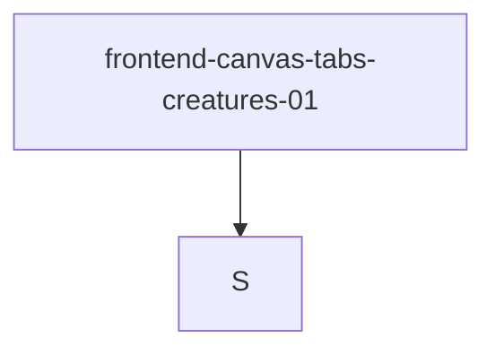

# frontend-canvas-tabs-creatures-01

## Mission
ui.canvas.tabs.creatures.fix

## Task Graph


## Raw Data
```json
{
  "task_id": "frontend-canvas-tabs-creatures-01",
  "mission": "ui.canvas.tabs.creatures.fix",
  "agent_type": "frontend-design",
  "session_id": "frontend",
  "status": "final",
  "dashboard_line": "TabBar 7 tabs+labels; canvas grid-layout+zoom-fit; creatures voice dot+thought",
  "files_touched": [
    "deploy/chat-mvp/src/components/TabBar.css",
    "deploy/chat-mvp/src/dashboards/v0-mission-steer/MissionSteer.jsx",
    "deploy/chat-mvp/src/components/RecursiveCanvas.jsx",
    "deploy/chat-mvp/src/dashboards/v0-mission-steer/CreaturesBoard.jsx",
    "deploy/chat-mvp/src/dashboards/v0-mission-steer/CreaturesBoard.css",
    "deploy/chat-mvp/src/dashboards/v0-mission-steer/InsightsTab.css"
  ],
  "changes": {
    "TabBar.css": "Restored labels on all tabs (removed display:none rule). Font 11px inactive / 12px active. Gap 3px. Padding 3px 7px inactive / 3px 9px active.",
    "MissionSteer.jsx": "Reduced TABS from 9 to 7 \u2014 removed Charters and Vibe Studio entries. Removed their NAUTICAL_TAB_OVERRIDES entries.",
    "RecursiveCanvas.jsx": "autoOrganize: added grid-layout shortcut for disconnected nodes (colCount=ceil(sqrt(n)), centered on 2200,1800). Added kGravity=0.003 centering force. Returns bbox. onAutoOrganize: zoom-to-fit via setScale+setPan from bbox with 10% padding.",
    "CreaturesBoard.jsx": "Board card now shows: voice color dot (cb5-voice-dot), compact thought bubble (cb5-mini-thought) from spawn template or mood text. Avatar emoji wrapped in cb-card-sprite--alive for pulse animation.",
    "CreaturesBoard.css": "Added @keyframes cb5-avatar-pulse (2.2s scale 1.0\u21921.08\u21921.0). .cb-card-sprite--alive applies it. .cb5-voice-dot absolute top-left 7px circle. .cb5-mini-thought single-line truncated bubble with voice color tint. prefers-reduced-motion disables pulse.",
    "InsightsTab.css": "Grid mode: minmax(min(100%,540px),1fr) caps at 2 wide columns. Gap 24px. Padding 24px 28px. Card internal padding 24px."
  },
  "build": "clean \u2014 zero errors, chunk-size warnings only",
  "bearing": "S",
  "next_mission_node": {
    "bearing": "S",
    "rationale": "All four tasks shipped, build green"
  }
}
```