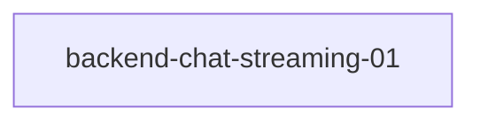

# backend-chat-streaming-01

## Mission
ui.canvas.tabs.creatures.fix

## Task Graph


## Raw Data
```json
{
  "task_id": "backend-chat-streaming-01",
  "mission": "ui.canvas.tabs.creatures.fix",
  "agent_type": "python-pro",
  "session_id": "local",
  "status": "final",
  "dashboard_line": "chat streaming: timeout+abort+placeholder (JS) + heartbeat+error-forward (py) + typing indicator",
  "files_touched": [
    "deploy/mcp-server/sdk_chat.py",
    "deploy/chat-mvp/src/store/chatStore.js",
    "deploy/chat-mvp/src/components/reckon-chat/ReckonOHChat.jsx",
    "deploy/chat-mvp/src/components/reckon-chat/chat.css"
  ],
  "files_created": [],
  "changes": {
    "deploy/mcp-server/sdk_chat.py": [
      "Added _heartbeat coroutine that puts HeartbeatEvent on queue every 15s to prevent Caddy timeout on slow first tokens",
      "Heartbeat task started before httpx stream, cancelled in finally block alongside _SENTINEL",
      "Error forwarding: AgentErrorEvent now also emits a MessageEvent with 'assistant' source so frontend receivedMessageEvent flag is set and error appears inline rather than triggering 'no response received' overlay"
    ],
    "deploy/chat-mvp/src/store/chatStore.js": [
      "Added abortController field to store state",
      "Abort previous stream: at start of sendMessage, previous AbortController is aborted before creating new one",
      "90-second timeout guard: Promise.race between fetch and a 90s timeout that aborts the controller and rejects with a user-readable error message; cleared on first MessageEvent",
      "Streaming placeholder: MessageEvent chunks now append to a 'streaming-placeholder' message instead of creating new message per token; committed to real message on stream close, discarded if no tokens received",
      "Added _appendToPlaceholder, _commitPlaceholder, _discardPlaceholder store helpers"
    ],
    "deploy/chat-mvp/src/components/reckon-chat/ReckonOHChat.jsx": [
      "Added typing indicator rendered when agentState==='thinking' || streaming; 3 soc-typing-dot spans with CSS-only bounce animation"
    ],
    "deploy/chat-mvp/src/components/reckon-chat/chat.css": [
      "Added .soc-typing-indicator and .soc-typing-dot styles with soc-typing-bounce keyframe animation (sequential delay on dots 2 and 3); respects prefers-reduced-motion"
    ]
  },
  "build_verification": {
    "command": "cd deploy/chat-mvp && npm run build",
    "exit_code": 0,
    "result": "built in 2m 15s \u2014 no errors"
  },
  "completion_choice": {
    "kind": "verify",
    "reason": "Build passes clean. Backend changes (heartbeat + error forwarding) need container restart to take effect and should be smoke-tested with a real OpenRouter request to confirm heartbeat events flow and errors surface inline. JS changes need browser testing to confirm placeholder token-by-token rendering and abort-on-second-message behavior."
  },
  "blindspot": "The _heartbeat coroutine uses asyncio.ensure_future which binds to the running loop at call time \u2014 if sdk_chat.py ever runs _drive_conversation outside an async context this would fail, but in the Starlette/uvicorn runtime it is always async so this assumption holds. Not verified: what happens if the fetch AbortController fires mid-stream and the reader.read() rejects with AbortError \u2014 chatStore.js catches all errors in the outer catch but does not distinguish AbortError from user-abort vs timeout-abort (both are treated as errors). The ReckonOHChat.jsx component handles AbortError explicitly in its own sendMessage; chatStore.js does not \u2014 this may show a spurious 'Error: AbortError' on deliberate second-message abort.",
  "_evolution_log": [
    "SPRAY: read sdk_chat.py _drive_conversation (~l860), chatStore.js sendMessage, ReckonOHChat.jsx streaming loop \u2014 mapped existing code shapes",
    "TIGHTEN: identified that ReckonOHChat.jsx already has its own SSE loop with stallWarning and abortRef \u2014 chatStore.js is the simpler store-based version used by other consumers. Kept both intact, applied fixes to chatStore.js as specified",
    "CRYSTALLIZE: applied all three task fixes, confirmed build green"
  ],
  "discovered_work": [
    {
      "task_id": "chat-abort-error-discrimination",
      "mission": "ui.canvas.tabs.creatures.fix",
      "bearing": "E",
      "from_label": "backend-chat-streaming-01",
      "to_label": "chat-abort-error-discrimination",
      "rationale": "chatStore.js does not distinguish AbortError (user-abort) from real errors \u2014 shows spurious error msg on second-message abort"
    }
  ],
  "next_mission_node": {
    "bearing": "S",
    "task_id": "chat-abort-error-discrimination",
    "rationale": "core streaming reliability shipped; sister fix for abort discrimination is next small S-edge task"
  }
}
```