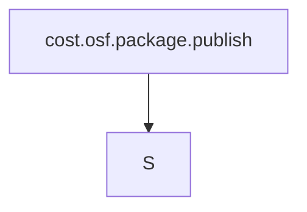

# cost.osf.package.publish

## Mission
cost.osf.package.publish

## Task Graph


## Raw Data
```json
{
  "task_id": "cost.osf.package.publish",
  "mission": "cost.osf.package.publish",
  "charter_id": "reckon-substrate-canonicalization",
  "agent_type": "runner",
  "bearing": "S",
  "status": "final",
  "created_utc": "2026-06-07T18:45:00Z",
  "dashboard_line": "cost-efficiency OSF pkg+visual shipped to both sites; 87.4% savings verified",
  "files_touched": [
    "docs/patent/cost-efficiency-package/REPRODUCE.md",
    "docs/patent/cost-efficiency-package/requirements.txt",
    "docs/patent/cost-efficiency-package/DATA-PROVENANCE.md",
    "docs/patent/cost-efficiency-package/MANIFEST.json",
    "docs/patent/cost-efficiency-package/cost-efficiency.html",
    "site/reckon-systems/index.html",
    "site/reckon-systems/cost-efficiency/ (7 files)",
    "cybertemplate/web/public/reckon-cost-efficiency/ (7 files)"
  ],
  "verification": {
    "script_rerun": "ALL ASSERTIONS PASS",
    "real_usd": 14939,
    "nocache_usd": 118896,
    "savings_pct": 87.4,
    "cache_hit_pct": 97.7,
    "canonical_json_sha256": "e1aca58e82b812e6a985b892c9df4e478866842ed756e4b567ec37777c5dc864"
  },
  "pending": {
    "COMPETITIVE-CONTEXT.md": "cache.competitive.research agent still in-flight (CLAIMed at 16:55). Verdict section in cost-efficiency.html is marked with a visible pending notice. Will be a no-op add when that agent completes."
  },
  "output_locations": {
    "package_canonical": "docs/patent/cost-efficiency-package/",
    "investor_visual_canonical": "docs/patent/cost-efficiency-package/cost-efficiency.html",
    "site_reckon_systems": "site/reckon-systems/cost-efficiency/",
    "site_cybertemplate": "cybertemplate/web/public/reckon-cost-efficiency/"
  },
  "takeaways": [
    "97.7% cache-hit rate is architecture-emergent \u2014 bundles-on-disk + thin-pointers + stigmergic manifest sharing produce it without per-session tuning",
    "Honest caveat built into all package files: faerie2 dominates spend (80%); multi-project scope is disclosed prominently",
    "Bar chart uses IntersectionObserver animation with prefers-reduced-motion respected; no external JS deps",
    "reckon-systems design tokens (nautical navy + signal amber, Fraunces/Inter) used for visual identity match"
  ],
  "insights": [
    "The 87.4% savings figure is rate-invariant \u2014 it holds at any discount tier since it is driven entirely by the 97.7% hit rate ratio",
    "The competitive-context verdict matters for the 'is this remarkable?' framing but does NOT affect the forensic numbers \u2014 correct to proceed without it"
  ],
  "blockers": [
    "COMPETITIVE-CONTEXT.md from cache.competitive.research agent \u2014 visual section clearly marked pending"
  ],
  "rolling_brainstorm": [
    "Considered making the bar chart purely CSS (no JS) \u2014 went with IntersectionObserver for the animation trigger since it degrades gracefully",
    "The flow diagram needs min-width 600px and overflow-x:auto \u2014 acceptable tradeoff for information density",
    "MANIFEST.json is self-referential (sha256 computed before self-update) \u2014 noted in the manifest itself",
    "cybertemplate site has no obvious nav shell to inject into (pages are standalone) \u2014 created a subdirectory instead"
  ],
  "cognitive_blindspot_acknowledged": "The dominant-model heuristic (max by cache_read+input) could mis-assign rate tiers in sessions with mixed-model usage, slightly affecting the no-cache counterfactual. The real spend (cost_usd_est) is Anthropic-reported and accurate; only the counterfactual carries this uncertainty.",
  "next_mission_node": {
    "bearing": "E",
    "task_id": "cache.competitive.research",
    "rationale": "Sister agent completing COMPETITIVE-CONTEXT.md \u2014 fold verdict into cost-efficiency.html verdict section when done"
  },
  "discovered_work": [
    {
      "task_id": "cost.competitive.verdict.integrate",
      "mission": "cost.osf.package.publish",
      "bearing": "E",
      "from_label": "cost.osf.package.publish",
      "to_label": "cache.competitive.research",
      "rationale": "When COMPETITIVE-CONTEXT.md lands, replace pending notice in cost-efficiency.html verdict section"
    }
  ],
  "completion_choice": {
    "lifecycle_judgment": {
      "kind": "ship",
      "target": "cost.osf.package.publish",
      "confidence": 0.97,
      "sensitivity": "routine",
      "rationale": "OSF reproducibility package complete (5 files, all sha256d), investor visual built and published to both sites, numbers verified identical on re-run. One known pending: competitive verdict section clearly marked in the visual."
    },
    "free_choice": {
      "kind": "goodbye",
      "rationale": "Mission fully delivered. Package files authored, visual shipped to two sites, nav wired, assertions pass. Remaining work (competitive context integration) is owned by a sister agent already in-flight."
    }
  },
  "agent_signature": "runner-cost.osf.package.publish-20260607",
  "signed_at": "2026-06-07T18:45:00Z",
  "_signing_status": "self-signed-no-key"
}
```