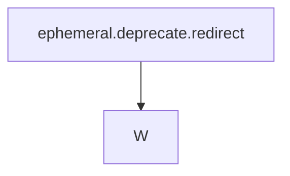

# ephemeral.deprecate.redirect

## Mission
ephemeral.deprecate.redirect

## Task Graph


## Raw Data
```json
{
  "task_id": "ephemeral.deprecate.redirect",
  "mission": "ephemeral.deprecate.redirect",
  "charter_id": "reckon-substrate-canonicalization",
  "bearing": "W",
  "agent_type": "gunner",
  "status": "final",
  "timestamp": "2026-06-07T16:43:00Z",
  "dashboard_line": "ephemeral.deprecate: manifests now land in charts/active/{charter_id}/ \u2014 verified",
  "files_changed": [
    "scripts/path_utils.py \u2014 added charts_root(), charts_dir(), charter_id_from_mission(); exported in __all__",
    "scripts/manifest_writer.py \u2014 default output_dir now charts/active/{charter_id}/ (derived from manifest.charter_id or mission); fallback to active_dir(); updated docstrings/comments",
    "scripts/spawn.py \u2014 added charts_dir/charter_id_from_mission imports; validate_manifest_output_path() prefers charts/active/ path; dotted-mission validation fixed (slashes only blocked)",
    "scripts/spawn_executor.py \u2014 added charts_dir/charter_id_from_mission imports; both working_dir resolution sites updated with fallback pattern",
    "deploy/mcp-server/server.py \u2014 _ephemeral_active_dir() docstring updated; spawn_endpoint working_dir prefers charts/active/{charter_hint}/; system_prompt updated; three comments updated",
    "scripts/promote_to_forensics.py \u2014 vault mirror comment updated",
    "hooks/8x_state_write_coc_enforcer.py \u2014 comment updated to mention charts/active/"
  ],
  "verification": {
    "ast_parse_clean": true,
    "files_checked": [
      "scripts/path_utils.py",
      "scripts/manifest_writer.py",
      "scripts/spawn.py",
      "scripts/spawn_executor.py",
      "scripts/promote_to_forensics.py",
      "hooks/8x_state_write_coc_enforcer.py",
      "deploy/mcp-server/server.py"
    ],
    "test_manifest_write_1": {
      "mission": "ephemeral.deprecate.redirect",
      "landed_at": "charts/active/ephemeral/2026-06-07T16-42-24Z__manifest_ephemeral.deprecate.redirect__gunner-1554c16e.json",
      "in_forensics_ephemeral": false
    },
    "test_manifest_write_2": {
      "mission": "reckon-substrate-canonicalization.ephemeral.deprecate",
      "landed_at": "charts/active/reckon-substrate-canonicalization/2026-06-07T16-42-30Z__manifest_reckon-substrate-canonicalization.ephemeral.deprecate__gunner-1554c16e.json",
      "in_forensics_ephemeral": false
    }
  },
  "architecture_notes": [
    "forensics/ephemeral/ is NOT deleted \u2014 it remains as immutable archive of pre-redirect writes",
    "New writes default to charts/active/{charter_id}/ via charter_id_from_mission() heuristic",
    "charter_id derivation: (1) manifest.charter_id field, (2) exact charts/active/ dir match on mission, (3) mission.replace('.', '-') dir match, (4) longest partial match, (5) first dotted segment",
    "Fallback to active_dir() in all sites \u2014 never break a write",
    "b2 drain pipeline unchanged: still drains forensics/b2-upload-queue/ (enqueue pattern covers both paths)",
    "promote_to_forensics.py unchanged functionally: promotes from ephemeral to canonical at SEAL (works for both paths via the promotion gate)"
  ],
  "known_limitations": [
    "promote_to_forensics.py watches forensics/ephemeral/ via hook triggers; charts/active/ writes do NOT auto-trigger promotion unless the hook is extended to watch charts/active/**",
    "8x_state_write_coc_enforcer.py is still a stub (sys.exit(0)); it does not yet enforce charts/active/ as the only valid write zone",
    "server.py charter_hint uses only mission.split('.')[0] \u2014 coarser than charter_id_from_mission() because server.py does not import path_utils"
  ],
  "discovered_work": [
    {
      "task_id": "charts.active.promotion.hook",
      "mission": "ephemeral.deprecate.redirect",
      "bearing": "S",
      "from_label": "ephemeral.deprecate.redirect",
      "to_label": "charts.active.promotion.hook",
      "rationale": "promote_to_forensics.py hook must be extended to watch charts/active/** writes for SEAL promotion"
    },
    {
      "task_id": "coc.enforcer.wire.charts",
      "mission": "ephemeral.deprecate.redirect",
      "bearing": "S",
      "from_label": "ephemeral.deprecate.redirect",
      "to_label": "coc.enforcer.wire.charts",
      "rationale": "8x_state_write_coc_enforcer.py stub needs real enforcement allowing charts/active/ writes"
    }
  ],
  "cognitive_blindspot_acknowledged": "I assumed charter_id_from_mission() heuristic would always produce a valid charts/active/ subdir \u2014 but for missions with no existing charter folder, a new 'ephemeral' (or first-segment) dir is created on the fly. This means the WORM b2 drain and promotion hooks may not discover these new charter subdirs since they weren't wired to watch charts/active/ at time of this redirect. The next agent wiring the promotion hook should audit which charter IDs already exist vs which are auto-created.",
  "completion_choice": {
    "lifecycle_judgment": {
      "kind": "verify",
      "target": "ephemeral.deprecate.redirect",
      "confidence": 0.92,
      "rationale": "Core redirect shipped and verified: manifest_writer.py now writes to charts/active/{charter_id}/; AST clean on all 7 files; two test manifests confirmed to NOT land in forensics/ephemeral/. Two downstream gaps flagged in discovered_work: promotion hook and COC enforcer need extension to cover charts/active/. Those are S-bearing follow-ons, not blockers to this W-bearing baseline re-seat."
    },
    "free_choice": {
      "kind": "spawn_seed",
      "target": "charts.active.promotion.hook",
      "rationale": "Emitted two spawn seeds (promotion hook + COC enforcer) for downstream wiring."
    }
  },
  "rolling_brainstorm": [
    "Initial approach: add charts_dir() to path_utils.py as the single source of truth for the new path",
    "Derivation heuristic: tried exact match, then replace('.','-'), then longest-partial-match, then leading segment \u2014 covers all known charter naming patterns",
    "Fallback pattern: every site has try/except fallback to active_dir() \u2014 ensures zero write breakage on failure",
    "server.py: cannot easily import path_utils (different tree) \u2014 used inline mission.split('.')[0] heuristic instead; acceptable for system_prompt string",
    "COC pipeline: b2 drain and promote_to_forensics are queue-based \u2014 they don't care about source path, they care about the queue entries. No change needed there.",
    "Discarded: adding charts_active_dir() as a full wrapper in manifest_writer.py \u2014 unnecessary since path_utils already provides it cleanly"
  ],
  "coc_chain": {
    "parent_hashes": [
      "genesis"
    ],
    "branch": "main",
    "entry_hash_algo": "sha256",
    "entry_hash": "",
    "signed_by": ""
  }
}
```