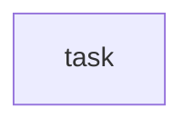

# ephemeral-state-file.schema.json

## Task Graph


## Raw Data
```json
{
  "$schema": "http://json-schema.org/draft-07/schema#",
  "$id": "https://reckon.systems/schemas/ephemeral-state-file.json",
  "title": "Ephemeral State / Telemetry File \u2014 Classifier Shape",
  "description": "Recognizer for the class of runtime state + telemetry files that hooks write continuously (piston gate-decisions, compact-events, post-compact-springboard, altimeter snapshots). Born 2026-06-13 from the 'moving telemetry' incident: these files were git-TRACKED, so every session on every machine committed+pushed them, making the remote a constantly-moving rebase/push target ([auto] churn). Root cause was a path-migration miss \u2014 the kill-telemetry-churn charter (2026-06-10) gitignored chart/active/_piston/ + forensics/state/, but after the ephemeral/chart migration the churn actually lands in forensics/ephemeral/** and forensics/{date}/. This shape exists so a config-auditor can RECOGNIZE any such file and assert its read/git/durability policy is correct BEFORE it churns the remote. CANONICAL RULE: a high-churn, write-only, regenerable telemetry log MUST be git-untracked; if a signal in it is worth keeping, a READER must roll it up into a tracked aggregate \u2014 never track the raw log. See docs/175 (Tesla-valve: raw pollen flows forward to refined NECTAR).",
  "type": "object",
  "required": [
    "file_class",
    "path_globs",
    "writers",
    "read_policy",
    "git_policy",
    "durability",
    "regenerable"
  ],
  "additionalProperties": false,
  "properties": {
    "file_class": {
      "type": "string",
      "description": "Which member of the ephemeral-state taxonomy this is. 'telemetry-log' = high-churn append-only forensic/debug trail (the gate-decisions class). 'state-snapshot' = last-write-wins runtime state read by sibling hooks on the SAME machine (the altimeter/piston-state class). 'telemetry-rollup' = the SMALL aggregate distilled FROM a telemetry-log that IS read back into the measure\u2192tune loop (the answer to 'should we read it back?').",
      "enum": [
        "telemetry-log",
        "state-snapshot",
        "telemetry-rollup"
      ]
    },
    "path_globs": {
      "type": "array",
      "minItems": 1,
      "description": "Repo-relative glob(s) the file matches. Be exact about the LIVE path post-migration (forensics/ephemeral/**, forensics/{date}/, hooks/state/), not the pre-migration path \u2014 getting this wrong is how the churn survived the first fix.",
      "items": {
        "type": "string",
        "minLength": 1
      }
    },
    "writers": {
      "type": "array",
      "minItems": 1,
      "description": "Every hook/script that appends to or rewrites this file. Enumerated so a reader knows what produces it.",
      "items": {
        "type": "string",
        "minLength": 1
      }
    },
    "readers": {
      "type": "array",
      "description": "Every component that READS this file back. EMPTY for a pure write-only telemetry-log (that is the whole point: nothing consumes it, so it must not be tracked). NON-empty is MANDATORY for file_class=state-snapshot (sibling hooks read it) and file_class=telemetry-rollup (the autotuner/eval pipeline reads it).",
      "items": {
        "type": "string",
        "minLength": 1
      }
    },
    "read_policy": {
      "type": "string",
      "description": "write_only = produced for the record, never consumed programmatically (telemetry-log). read_back = consumed by another component (state-snapshot intra-machine, or telemetry-rollup into the tune loop). A write_only file with a non-empty readers[] is a contradiction the auditor must flag.",
      "enum": [
        "write_only",
        "read_back"
      ]
    },
    "git_policy": {
      "type": "string",
      "description": "untracked = MUST be in .gitignore (high-churn, regenerable, per-machine \u2014 tracking it caused the incident). tracked-rollup = the small distilled aggregate is tracked (slow-changing, cross-machine signal). tracked-source = a genuine forensic SOURCE that must stay tracked (custody leaf shards, manifests) \u2014 NOT a telemetry file; present only so the auditor can tell them apart.",
      "enum": [
        "untracked",
        "tracked-rollup",
        "tracked-source"
      ]
    },
    "durability": {
      "type": "string",
      "description": "ephemeral = no durability needed; regenerable from source, loss is fine. worm-optional = nice to archive to the COMPLIANCE WORM bucket for forensic completeness but not court-load-bearing. worm-required = court-load-bearing custody \u2014 must flush to WORM on write (see scripts/b2-admin/b2_forensic_flush.py). git-history = the file's own git history IS the durability (tracked-rollup case).",
      "enum": [
        "ephemeral",
        "worm-optional",
        "worm-required",
        "git-history"
      ]
    },
    "regenerable": {
      "type": "boolean",
      "description": "True if the file can be rebuilt byte-for-(approximately)-byte from a source tier (e.g., custody spine via `charter.py coc rebuild`, or simply re-accrues as hooks fire). High-churn telemetry is regenerable=true and therefore safe to gitignore."
    },
    "scope": {
      "type": "string",
      "description": "per-machine = local to one device (different content per leaf/device \u2014 syncing it via git guarantees conflicts). shared = a single logical artifact all machines converge on (must be conflict-free, e.g. CRDT/union-merge, before it can be tracked).",
      "enum": [
        "per-machine",
        "shared"
      ]
    },
    "rolls_up_to": {
      "type": "string",
      "description": "For file_class=telemetry-log: the path/identifier of the telemetry-rollup that SHOULD distill this log's signal into the measure\u2192tune loop. Null/absent means the signal is currently ORPHANED (written, never measured) \u2014 the auditor should surface this as a missed-signal warning, not an error."
    },
    "churn_class": {
      "type": "string",
      "description": "Rough write frequency. high = multiple writes per session/turn (gate-decisions, altimeter). low = a few writes per session (compact-events). Drives how aggressively the file must be kept out of the git push path.",
      "enum": [
        "high",
        "low"
      ]
    }
  },
  "$examples": [
    {
      "$comment": "The canonical case that birthed this shape \u2014 orphaned, write-only, was wrongly tracked.",
      "file_class": "telemetry-log",
      "path_globs": [
        "forensics/ephemeral/**/_piston/gate-decisions.jsonl"
      ],
      "writers": [
        ".openhands/hooks/9x_op_piston_gate.py",
        ".openhands/hooks/9x_f0_burden_gate.py",
        ".openhands/hooks/9x_f0_inline_op_gate.py",
        "scripts/hookdoctor.py"
      ],
      "readers": [],
      "read_policy": "write_only",
      "git_policy": "untracked",
      "durability": "worm-optional",
      "regenerable": true,
      "scope": "per-machine",
      "rolls_up_to": null,
      "churn_class": "high"
    },
    {
      "$comment": "What it SHOULD become \u2014 the read-back aggregate that feeds the autotuner (answers 'should we read it back?': yes, the rollup, not the raw log).",
      "file_class": "telemetry-rollup",
      "path_globs": [
        "forensics/eval/gate-health-{date}.json"
      ],
      "writers": [
        "scripts/rollup_gate_health.py"
      ],
      "readers": [
        ".openhands/hooks/9x_spawn_pressure_autotuner.py",
        "scripts/evolve.py"
      ],
      "read_policy": "read_back",
      "git_policy": "tracked-rollup",
      "durability": "git-history",
      "regenerable": true,
      "scope": "shared",
      "churn_class": "low"
    },
    {
      "$comment": "Intra-machine state read by sibling hooks \u2014 already correctly gitignored (hooks/state/*.json).",
      "file_class": "state-snapshot",
      "path_globs": [
        "hooks/state/altimeter.json"
      ],
      "writers": [
        "scripts/altimeter_writer.py"
      ],
      "readers": [
        ".openhands/hooks/9x_op_piston_gate.py",
        ".openhands/hooks/9x_completion_trajectory_gate.py"
      ],
      "read_policy": "read_back",
      "git_policy": "untracked",
      "durability": "ephemeral",
      "regenerable": true,
      "scope": "per-machine",
      "churn_class": "high"
    }
  ]
}
```