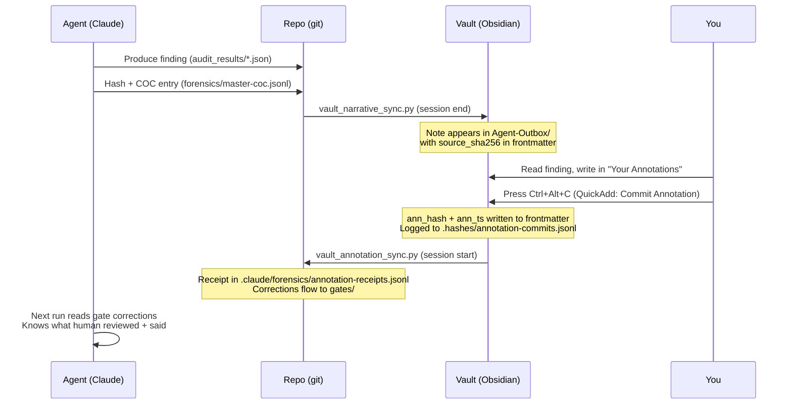

> [!nav]
> [[HOME|← HOME]] · [[Annotation-Dash|← Annotate]] · **Chain of Custody** · [[Pipeline-Gates|Gates →]] · [[Session-Manifests|Sessions →]]

# Chain of Custody

> The forensic audit trail: what agents produced, what you reviewed, what you signed.
> Press **Ctrl+Alt+C** on any note to commit your annotation (QuickAdd macro).

---

## Your Pending Reviews

> [!warning]+ Annotations awaiting your commit
> These notes have a `## Your Annotations` section you've written in, but haven't committed yet.
> **Commit = hash your annotation + timestamp it. This is your "submit" button.**

```dataview
TABLE WITHOUT ID
  file.link AS "Note",
  tier AS "Tier",
  hypothesis_support AS "H",
  confidence_level AS "Conf",
  agent_author AS "Agent"
FROM "00-SHARED/Agent-Outbox" OR "00-SHARED/Human-Inbox"
WHERE ann_hash = null AND contains(file.content, "## Your Annotations")
SORT tier ASC, confidence_level DESC
LIMIT 15
```

> **To commit:** Open the note → write in `## Your Annotations` → press **Ctrl+Alt+C**

---

## Recently Committed (awaiting sync)

> [!info]+ Committed but not yet synced to agent COC
> These have `ann_hash` set but `ann_synced` is empty. They'll sync on next session start
> or when you run `python3 scripts/vault_annotation_sync.py`.

```dataview
TABLE WITHOUT ID
  file.link AS "Note",
  ann_hash AS "Hash",
  ann_ts AS "Committed",
  agent_author AS "Agent"
FROM "00-SHARED"
WHERE ann_hash != null AND ann_hash != "*(filled on commit)*" AND (ann_synced = null OR ann_synced = "")
SORT ann_ts DESC
LIMIT 10
```

---

## Fully Synced (in agent COC)

> [!success]+ Annotations synced back to agent forensic log
> Receipt in `{repo}/.claude/forensics/annotation-receipts.jsonl`

```dataview
TABLE WITHOUT ID
  file.link AS "Note",
  ann_hash AS "Hash",
  ann_ts AS "Committed",
  ann_synced AS "Synced"
FROM "00-SHARED"
WHERE ann_synced != null AND ann_synced != ""
SORT ann_synced DESC
LIMIT 15
```

---

## Evidence Chain Integrity

> [!critical]+ Tier 1 evidence — all must be signed

```dataview
TABLE WITHOUT ID
  file.link AS "Finding",
  confidence_level AS "Conf",
  source_sha256 AS "Source Hash",
  ann_hash AS "Ann Hash",
  choice(ann_hash != null AND ann_hash != "*(filled on commit)*", "signed", "UNSIGNED") AS "Status"
FROM "00-SHARED/Agent-Outbox"
WHERE tier = 1 OR tier = "1"
SORT confidence_level DESC
```

---

## The Flow



---

## QuickAdd Actions (your buttons)

Set these up once in QuickAdd Settings → Manage Macros → each gets a User Script step.
Then bind to hotkeys or use from command palette (Ctrl+P → type the name).

| Action | Script | Hotkey | What it does |
|--------|--------|--------|-------------|
| **Commit Annotation** | `scripts/commit-annotation.js` | Ctrl+Alt+C | SHA-256 hashes your annotation, writes `ann_hash`+`ann_ts` to frontmatter |
| **Endorse Finding** | `scripts/endorse-finding.js` | Ctrl+Alt+E | Sets `status: endorsed`, `promotion_state: promoted` |
| **Challenge Finding** | `scripts/challenge-finding.js` | Ctrl+Alt+X | Sets `status: challenged` — write details first, then commit |
| **Flag for Red Team** | `scripts/flag-for-redteam.js` | Ctrl+Alt+R | Asks which hypothesis, adds `red-team` tag, queues for `/run` |
| **Promote to Evidence** | `scripts/promote-to-evidence.js` | Ctrl+Alt+P | Sets `promotion_state: promoted`, asks for tier (1-4) |
| **Pass Gate** | `scripts/pass-gate.js` | Ctrl+Alt+G | On gate-review notes: approves the pipeline gate |

All scripts live in: `00-SHARED/Dashboards/scripts/`

### How these feed back to agents

| Frontmatter field | Set by | Read by |
|---|---|---|
| `ann_hash` | Commit Annotation | `vault_annotation_sync.py` → agent COC receipt |
| `status: endorsed/challenged` | Endorse/Challenge | `vault_annotation_sync.py` → classifies as endorsement/challenge |
| `promotion_state: promoted` | Endorse/Promote | membot promotes to NECTAR at session end |
| `red_team_target: H2` | Flag for Red Team | `vault_annotation_sync.py` → creates sprint queue task |
| `status: passed` | Pass Gate | `gate_pass.py` reads vault gate notes at `/data-ingest` start |

The round-trip: **you click a button → frontmatter updates → next sync reads it → agents act on it.**

---

## Setup

| Step | Status | How |
|------|--------|-----|
| Install QuickAdd macros | | QuickAdd Settings → Manage Macros → New Macro for each action → User Script step → point to `00-SHARED/Dashboards/scripts/{name}.js` |
| Bind hotkeys | | Obsidian Settings → Hotkeys → search macro name → assign |
| Create signing identity | | `python3 note_sign.py identity create` |
| Register in participants | | `python3 note_sign.py identity register` |
| Verify a note | | `python3 note_sign.py verify "path/to/note.md"` |
| Sync annotations to COC | | `python3 scripts/vault_annotation_sync.py` (auto at session start) |

---

## Court Readiness

For any finding, the chain proves:

1. **Agent produced X** — `source_sha256` links to git-tracked JSON
2. **Human received X intact** — vault note hash matches repo source
3. **Human reviewed and wrote Y** — `ann_hash` proves content, `ann_ts` proves time
4. **Y is unmodified since commit** — re-hash and compare
5. **Y fed back to agents** — `annotation-receipts.jsonl` has the receipt
6. **The signer is authorized** — `participants.yaml` commitment registry

> [!quote] The vault doesn't store evidence. It stores receipts.
> Sensitive forensic material lives locally, gitignored. The vault shows
> "agent X produced this, I annotated that." Light COC links notes to the
> forensic store without exposing it.

---

*← [[HOME]] . [[Pipeline-Gates]] . [[Session-Manifests]] . [[HOW-ANNOTATION-COC-WORKS]]*
