> [!nav]
> [[HOME|← HOME]] · [[Session-Manifests|← Sessions]] · [[Nectar-View|← NECTAR]] · **System Architecture** · [[00-SHARED/Hive/_index|Hive →]]

> [!tip] Dev Entry Point
> For tools, eval scores, queue, and all design docs in one view: [[SYSTEM-DEV-HOME|System Dev Home →]]

# System Architecture

```dataviewjs
// Auto-generated TOC from headers
const content = await dv.io.load(dv.current().file.path);
const headers = content.match(/^#{2,3}\s+\d+\..+$/gm) || [];
dv.list(headers.map(h => {
  const text = h.replace(/^#+\s+/, '');
  const anchor = text.toLowerCase().replace(/[^\w\s-]/g, '').replace(/\s+/g, '-');
  return `[[#${text}|${text}]]`;
}));
```

> **Color language:** Gold = gateways (faerie/handoff). Teal = flowing state (work, scratch, queue). Pistachio = crystallized (HONEY, cards). Dark = immutable (forensics). Coral = human layer. **Same color = same process family.** Inputs and outputs of the same cycle share a color.

> **Design narratives**: [[design-narratives/_index|Design Docs Index]] | **Explorable graph**: [[pseudosystem/_index|Pseudosystem Map]]

---

## 0. Master Overview — The Hive


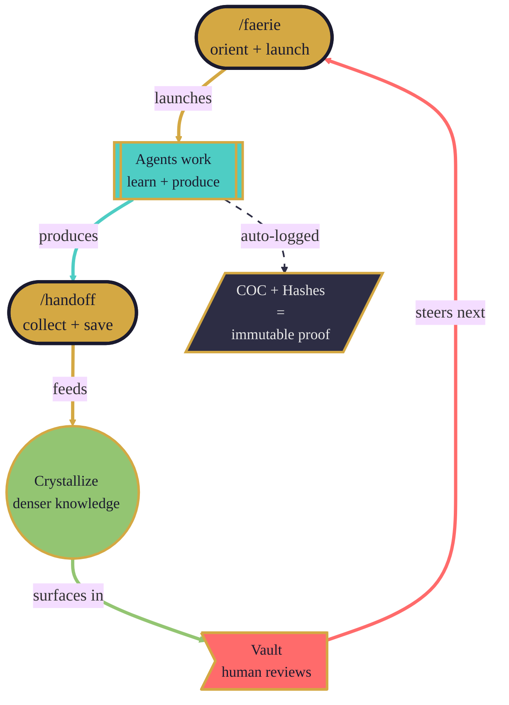

> **The whole system is one circulation.** Gold gateways breathe in and out. Teal water flows. Pistachio crystals form. Coral warmth guides. Dark bedrock records. Each cycle, the crystals get denser and the outputs get better. **Shape language:** `([stadium])` = gateway, `[[subroutine]]` = process, `(())` = cycle, `>asymmetric]` = human, `[/parallelogram/]` = immutable.

---

## 1. The Cycle (Session Flow)

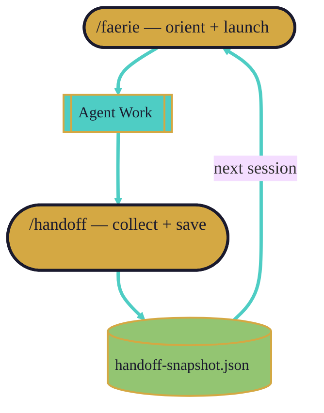

> Faerie and handoff are the **same gold** — they're the inhale and exhale of the same breath. Work flows between them like water.

---

## 2. Memory Temperature

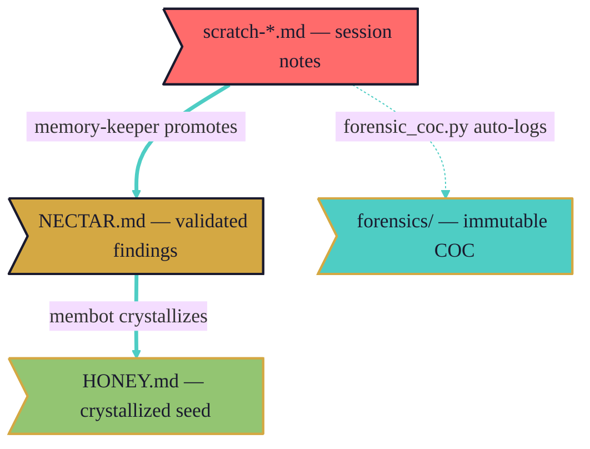

> Heat decreases, density increases. Scratch is a rushing river. NECTAR is a lake. HONEY is a crystal. Forensics is bedrock.

---

## 3. Emergency Resilience

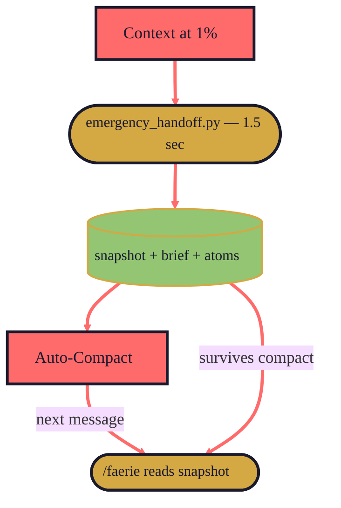

> The circuit breaker. Pure Python, no LLM. Writes durable files in 1.5 seconds. Everything survives the reset.

---

## 4. Two Memory Systems

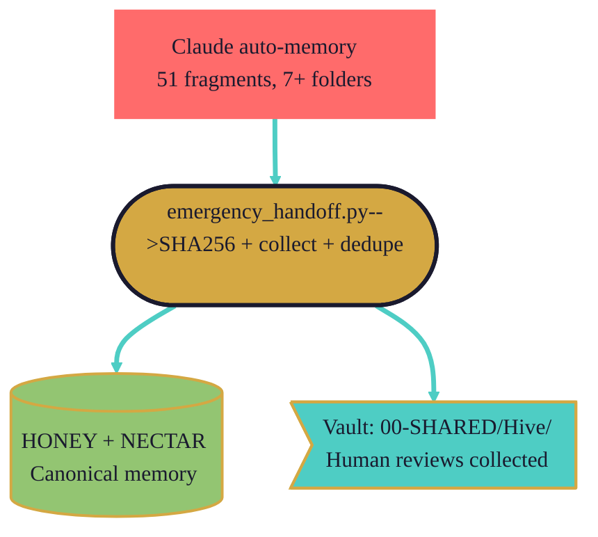

> Claude's auto-memory and our system are completely independent. The bridge hashes each file before touching it, deduplicates WSL/Windows variants, and promotes useful items.

---

## 5. Crystallization Cycle

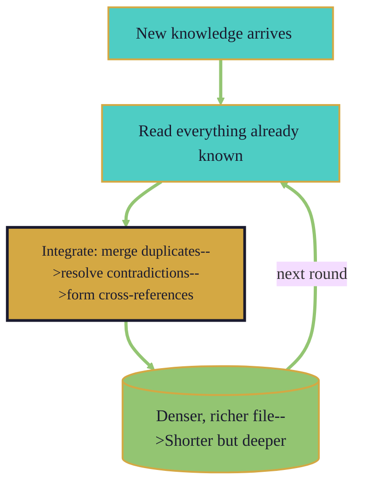

> Not compression — crystallization. Like a saturated solution forming a crystal: more ordered, more dense, more useful. Each line carries more meaning.

---

## 6. Forensic Hash Chain

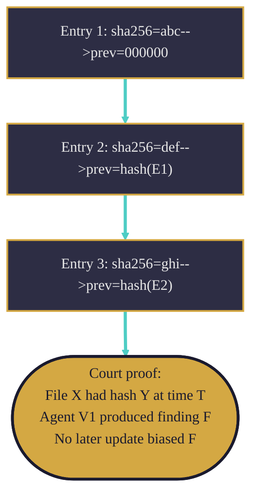

> Bedrock. Each entry links to the previous. Tamper with one, the chain breaks. Write-only — agents can never read their own forensic logs.

---

## 7. Agent Learning

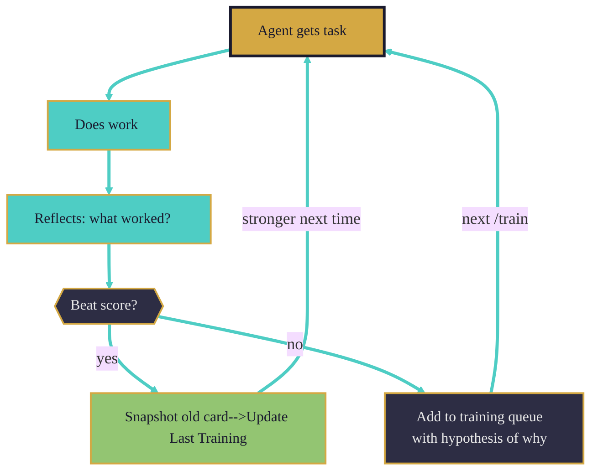

> Every agent reflects after every run. ~2K tokens, invisible to you. They improve continuously, but only record process learnings — never case data.

---

## 8. Three Layers

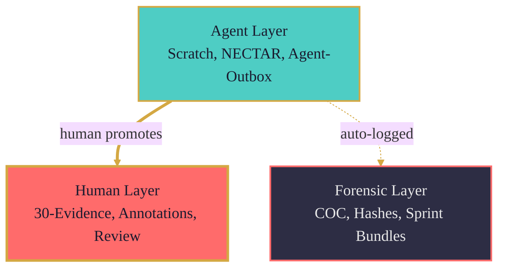

> Three rivers that never mix. Agents draft, humans validate, forensics records everything. The permission boundaries are the dams.

---

## 9. Context Budget (Equilibrium)

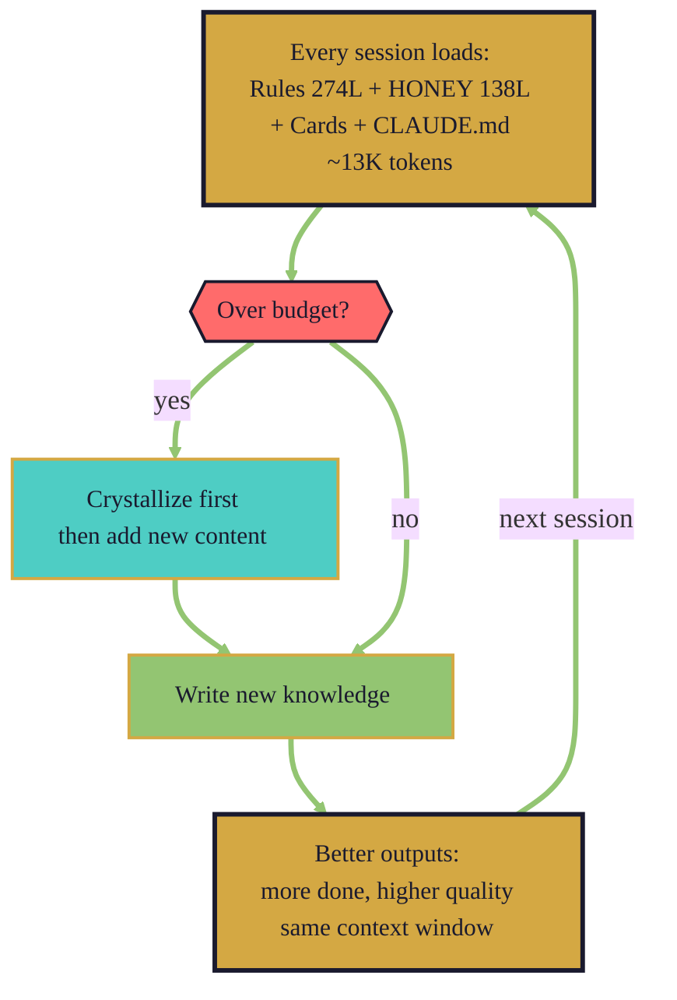

> The budget IS the equilibrium. It forces crystallization. Crystallization makes knowledge denser. Denser knowledge means better outputs per token. Better outputs mean more gets done. More done means more knowledge. The cycle accelerates.

---

## 10. The Pipeline

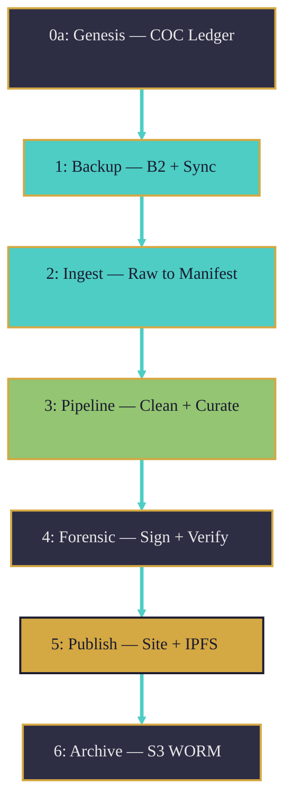

---

## 11. Vault Flow

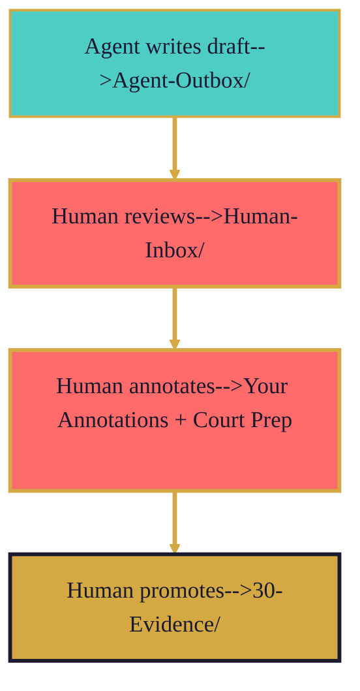

> Agents draft. Humans validate. Annotations are sacred — agents never touch them. The flow is one-directional: AI proposes, human disposes.

---

## 12. The Circulation (Everything Together)

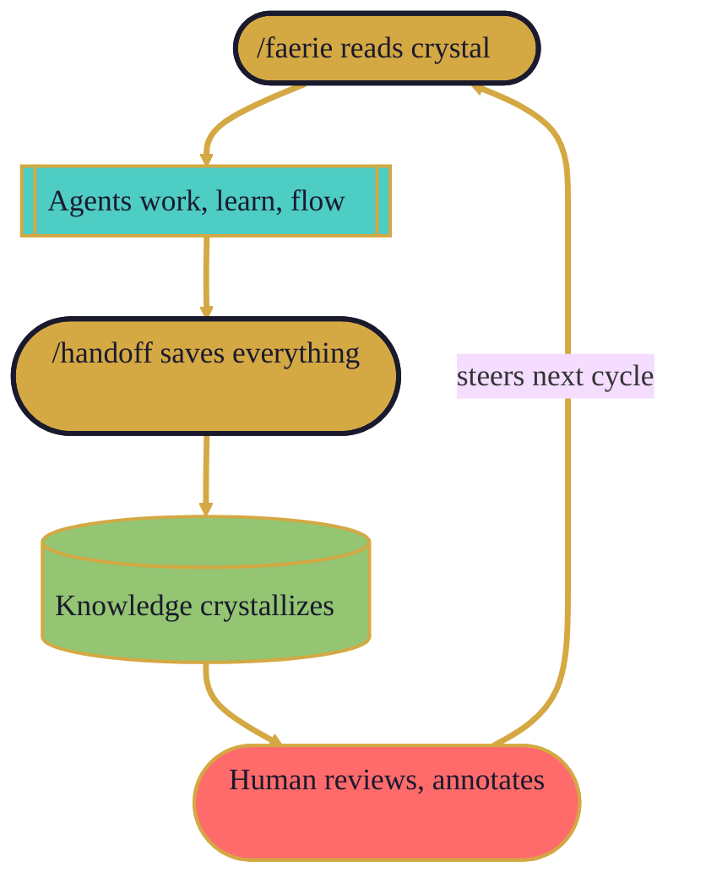

> The whole system is a circulation. Gold gateways inhale and exhale. Teal water flows between them. Pistachio crystals form from the flow. Coral warmth guides the direction. Each cycle, the crystals get denser. Each cycle, the outputs get better. **That's the magic: we respected the physics, and the system found its own equilibrium.**

---

## 13. Data Analysis Engine (DAE → CyberTemplate)

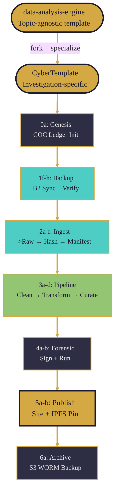

> DAE is the reusable engine. CyberTemplate is the investigation that runs on it. Every numbered script is court-ready: hashed inputs, signed outputs, COC at every step.

---

## 14. DAE Script Pipeline (Detailed)

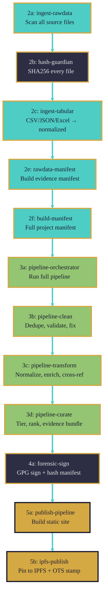

> 18 scripts, each numbered. Improvements to DAE benefit every investigation that forks from it. CyberTemplate adds investigation-specific scripts in `scripts/custom/`.

---

## 15. Design Process Log

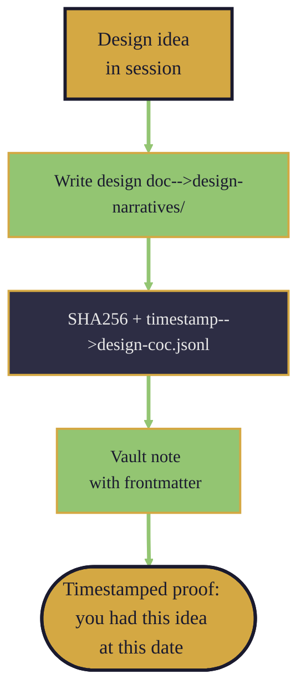

> Every design doc gets hashed when created. The design COC proves: "This architecture was designed by this person at this time." If anyone challenges IP, the hash chain + git history + session transcripts prove provenance.

---

## Your Annotations

<!-- What's missing? What processes are still invisible? -->

