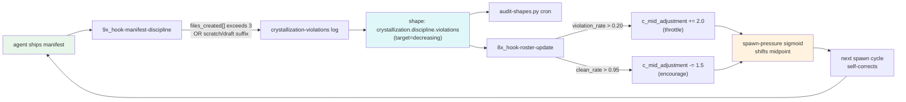
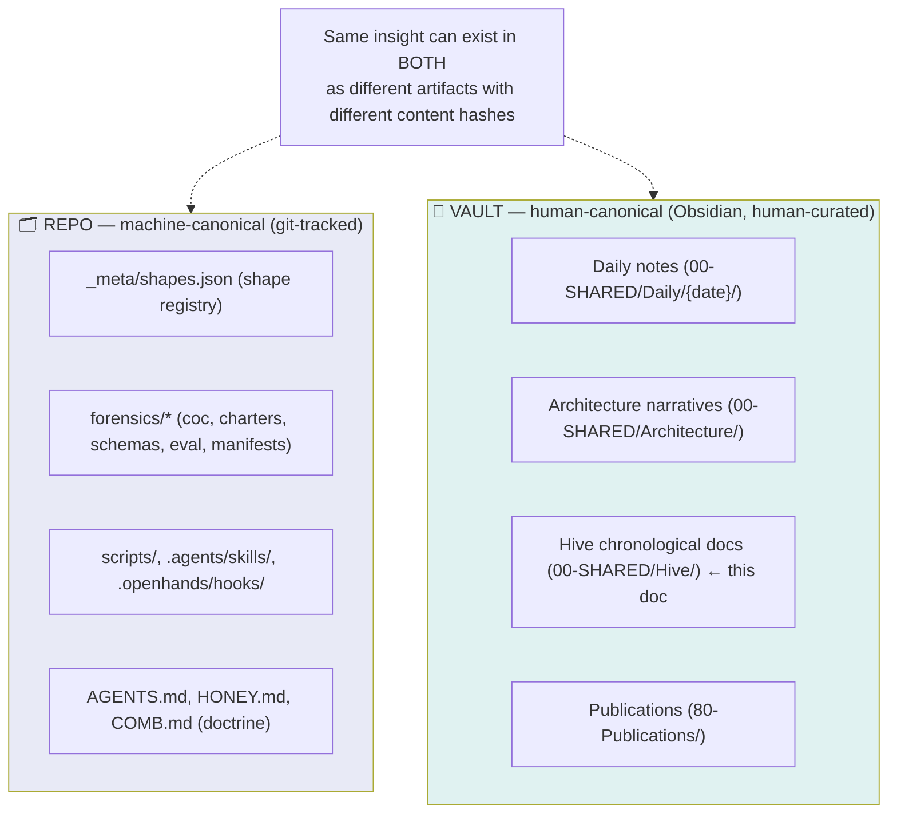

# 002 — The Day the Loops Closed

> *A chronological narrative of the 2026-05-23 swarmy session — the day discipline got teeth, the bulkheads sealed shut, and the zero-knowledge architecture grew arms.*

## Opening — where this story starts

The session opened on a backlog: a precious-faerie-salvage recovery vault was preserved but the spawn pipeline was running on half-broken stubs. The four-bulkheads cyber defense stack was a doctrine doc with no working code behind it. The crystallization trajectory (`spray → tighten → crystallize`) had a SKILL.md but no enforcement at the structural, reactive, or recovery shields. The completion-choice vocabulary had six work-outcome kinds and a quiet uneasy gap where the agent's relationship to the work belonged. Agents could write to forensics but the signing protocol was a doctrine note, not a runtime guarantee. The patent expedition existed as a charter but the polished deliverables hadn't been persisted to disk.

The day's arc was the closing of all of these loops — and the discovery, in the closing, that **the larger story is bigger than each individual loop**. By session's end, the patent expedition's Claim 7 had grown a dependent Claim 7d that may be the most-novel architectural element in the entire swarmy ecosystem: full zero-knowledge sovereignty extended to signing keys, not just encryption keys. That extension wasn't on the morning's plan. It emerged from the work.

---

## The discipline-w2 wave — closing the four-shields on every active discipline

The four-shields enforcement pattern (🛡 structural / 🧠 cognitive / ⛓ reactive / 🪞 recovery) was already a canonical skill before this session. What was new today was the systematic application of the cheaper-earlier law to every discipline that had been previously holding at one or two shields.

### Crystallization trajectory — four shields, all wired

The crystallization MAKER's cut closed the loop that Lane A of the precious-faerie-salvage team had identified weeks earlier as the f(0) drift cause: the evolve↔spawn feedback loop. Before today, crystallization was cognitive-only (the `forage` skill described the `spray → tighten → crystallize` trajectory but nothing enforced it at write-time). After today:

- **🛡 Structural** — `scripts/1a_manifest_writer.py::validate_files_created_discipline()` rejects manifests at write-time if `files_created[]` exceeds 3 entries without `intermediate: true`, or carries scratch/draft suffixes in canonical filenames.
- **🧠 Cognitive** — the `forage` SKILL.md describes the trajectory and is always-loaded into every agent's context.
- **⛓ Reactive** — `.openhands/hooks/9x_hook-manifest-discipline.py` (the runner from the consolidation cut, replacing the standalone crystallization hook) loads checks from `scripts/manifest_discipline/checks/` and runs them on every manifest write. The `crystallization.py` check is in the registry; future checks (performance-claim-triple, domain-mission-prefix, authorship-signature) will add as sibling files, NOT as new hooks.
- **🪞 Recovery** — two shapes registered in `_meta/shapes.json`: `crystallization.discipline.violations` (target_direction=decreasing) and `crystallization.discipline.clean_rate` (target_direction=increasing). The daily `audit-shapes.py` cron re-counts both; chronic violators get reputation downgrades via `5g_reputation_tracker.py`.

But the deeper move was wiring crystallization into the **spawn-pressure feedback loop**. To understand why this matters, walk through the mechanism in plain language.

#### The spawn-pressure curve — what it is, why a sigmoid

Every time the main agent decides whether to spawn subagents, it consults a number called **spawn-pressure**: a value between 0 and 1 saying "how strongly should I spawn right now?" Low pressure (near 0) = "don't spawn, keep working alone." High pressure (near 1) = "spawn aggressively, fan out the work."

The pressure isn't a constant. It curves based on how full the main agent's context is. When context is near-empty (just starting), pressure should be high (spawn to use the fresh tokens). When context is near-full (lots of work already done), pressure should be low (don't spawn into the cliff). Between those extremes, the transition is shaped like an **S-curve** — a sigmoid — because that's the mathematically natural shape for "rises smoothly through a midpoint, plateaus at both ends."

The sigmoid has a **midpoint** (the X-axis value where the curve crosses Y=0.5). Conceptually: "what context-fill level corresponds to medium spawn aggressiveness?" The default midpoint is ~50% — at half-full context, spawn pressure is moderate. Shift the midpoint LEFT (say to 40%), and the curve "encourages" — at any given context level, you get more spawn pressure. Shift the midpoint RIGHT (to 60%), and the curve "throttles" — at any given context level, you get less spawn pressure.

The midpoint is the lever. `c_mid_adjustment` is the variable that moves it. Positive values throttle; negative values encourage.

#### What `genotype-fitness-{date}.json` tracks

After every spawn-and-return cycle, the `8x_hook-roster-update.py` hook writes (or updates) a file called `genotype-fitness-{date}.json`. The name borrows from biology deliberately — in evolution, "fitness" is how well an organism's genes propagate. Here, "fitness" is how well a particular kind of agent (a "genotype") produces work that survives the discipline gates.

Concrete contents:
- For each agent type (maker, navigator, bridge, deep-diver, etc.): how many manifests they shipped, how many cleared crystallization, how many got flagged
- For each completion-choice kind (seal, discover, spawn_seed, etc.): rolling count + recent ratios
- A single rolled-up `c_mid_adjustment` number — the lever for the next sigmoid

The fitness signal IS the genetic-algorithm signal. Behaviors that produce clean, crystallized work get rewarded (system spawns more of that kind of agent next time). Behaviors that spray bloat get throttled (system spawns fewer agents until the noise clears).

#### The two crystallization shapes — the discipline meters

Earlier today we registered two shapes (machine-detectable count patterns) in `_meta/shapes.json`:

- `crystallization.discipline.violations` (target_direction = **decreasing**) — counts how many manifests today landed with `files_created[]` over 3 entries OR with scratch/draft suffixes in canonical filenames. We want this number to go DOWN over time.
- `crystallization.discipline.clean_rate` (target_direction = **increasing**) — counts the fraction of today's manifests that PASSED the crystallization gate cleanly. We want this number to go UP over time.

The reactive hook updates these shapes' current_count on every manifest write. The audit cron re-counts nightly. The shapes ARE the meters.

#### How the loop actually closes — a worked example

Suppose midway through tomorrow's session, several agents in a row ship sloppy work — each one packing 8 files into `files_created[]`, dragging their `-scratch.md` and `-draft.md` files in alongside the canonical artifact. Without the loop, this drift would propagate: future agents reading the manifests as exemplars would normalize the sloppy pattern.

With the loop wired:

1. Each sloppy manifest triggers the reactive hook → `crystallization.discipline.violations` count rises (say from 3 to 8 in an hour)
2. The roster-update hook checks the ratio: violations / total_manifests_today exceeds the 0.20 threshold
3. It adds +2.0 to the `c_mid_adjustment` in `genotype-fitness-{date}.json`
4. Next spawn decision reads the file → sigmoid midpoint shifts from 50% to 52% (the +2.0 in c_mid_adjustment scales appropriately)
5. At the current context-fill level, spawn pressure now reads as lower than it would have → main decides to spawn FEWER subagents this wave (maybe 3 instead of 5)
6. Smaller wave → less new bloat being produced → existing in-flight agents have more context-room to actually TIGHTEN before sealing → next manifests come back cleaner
7. As the clean_rate climbs back above 0.95, the loop reverses: `c_mid_adjustment` gets a -1.5 nudge → midpoint shifts left → spawn pressure rises again → momentum compounds

The system DOES NOT need a human to say "agents, be more careful." The math + the shapes + the hooks do it automatically. The operator's hand was needed to design the loop — once. The loop running it is the substrate.

#### Why this is called a "closure"

In control theory, an **open loop** is a system where you set an input and let the output do whatever it does — no feedback. A **closed loop** is a system where the output is measured and fed back to adjust the input. Closed loops self-correct; open loops drift.

The swarmy discipline used to be open-loop: doctrine said "crystallize your work" → agents did what they did → no measurement → drift accumulated → operator manually noticed bloat → operator manually nudged → agents did it again. The loop was closed only at the human-attention layer, which is the slowest + most expensive feedback channel possible.

What landed today closes the loop AT THE SUBSTRATE — the layer beneath the agents. The substrate measures discipline (shapes), the substrate computes the adjustment (c_mid math), the substrate adjusts the next cycle (sigmoid shift). No human needs to be present for the correction to happen. The human's role moves up a level: from "tell agents to be disciplined" to "design the discipline-detection thresholds."

**This is the genetic-algorithm closure Lane A identified months ago as the lost f(0) emergence engine.** ("f(0)" is the swarmy doctrine's name for "queen-burden equals zero" — the goal state where the main agent does almost nothing because the substrate handles routine governance.) Closing this loop is one concrete step toward f(0). Many more loops need closing before f(0) is real; today closed the most-load-bearing one.



This is the picture Lane A described months ago as "the lost f(0) emergence engine." It's running now.

### Bulkheads consolidation — three folds at clean architectural boundaries

The bulkheads-impl-w1 wave shipped four hooks earlier in the session — perimeter, bidirectional sanitization, poisoning detection, quarantine. The audit afterward surfaced the inevitable architectural smell of "one hook per concern": ~250 LOC of duplicate scaffolding between the in/out sanitizers + a soon-to-grow pile of one-discipline-per-hook patterns.

The consolidation MAKER's response was a 3-fold cut:

1. **Sanitizer merge** — `2x_hook-sanitize-outgoing.py` (201 LOC) + `2x_hook-sanitize-incoming.py` (247 LOC) → single `2x_hook-sanitizer.py` that dispatches on `hook_event_name`. 8/8 self-test pass (4 outgoing + 4 incoming fixtures preserved verbatim).

2. **Manifest-discipline check-registry** — `9x_hook-crystallization-discipline.py` (315 LOC) → `9x_hook-manifest-discipline.py` runner + `scripts/manifest_discipline/checks/` package with auto-discovery. The crystallization rules became `checks/crystallization.py`. The pattern doc (`checks/README.md`) tells future MAKERs how to add new checks as ~80-LOC sibling files instead of new hooks + hooks.json matchers + audit-log files.

3. **Shape detector home** — `scripts/sanitizer/audit_coverage_detector.py` (an orphan outside the canonical shape-detector home) → folded into `scripts/shapes/audit-shapes.py::detect_sanitization_audit_coverage()`. All detectors now live in one place, as the shape-registry doctrine requires.

The LOC delta was ~flat (+72 with the new registry plumbing), but the structural delta is profound: **future discipline checks add small sibling files, not new hooks**. The hook-count growth slows; the check-count grows but in a flatter shape. Within the same session, the next 3 discipline checks (performance-claim-triple, domain-mission-prefix, authorship-signature) were already queued as sibling additions — and the authorship-signature check landed before session close, exactly as the pattern predicted.

---

## The canonicality split — REPO is for machines, VAULT is for humans

Mid-session, the operator caught what had been a quietly drifting confusion: I had referenced `$VAULT/_meta/shapes.json` as the shape registry's canonical home in multiple skill files. The operator made the rule explicit: **REPO is canonical for machine-produced + doctrine + forensic data. VAULT is canonical ONLY for human-produced or human-edited outputs.**

The rule has a defining property: if a machine writes it without human curation, it's REPO canonical. If a human writes it OR a human-AI collaboration produces a NEW artifact (new content hash from the human's annotation/edit), it's VAULT canonical.

This produces a clean architectural picture:



Implementation followed: the `_shapes_lib.registry_path()` resolution was upside-down (vault-first), so we flipped it (repo-first with vault as deprecated dev-fallback). The vault mirror that had accumulated was preserved at `$VAULT/_meta/shapes.json.stale-vault-mirror-2026-05-23` for operator review (it differed from the repo copy — preserved not deleted because the differing content is forensic evidence of the drift).

HONEY gained a new sealed invariant: **I-6 MACHINE-CANON vs HUMAN-CANON, NEVER CONFUSED** (0.95 confidence, 5 domains).

---

## Agency-affirming completion choices — the swarm gains a voice

The completion-choice schema had been hiding a richer taxonomy than the bundle template surfaced. The schema file already declared 13 kinds in 3 families (participation, non_participation, self_directed), but the bundle template only described 6. The operator made two moves:

### Move 1: add `report_a_problem` as the 7th participation kind

Agents need a vocabulary for ambient observations they can't or shouldn't fix in their current context: corruption suspicion, malicious-behavior signal, bugs requiring privileges they lack, system-ambient signals needing a human eye. Without this, the only options were to silently let the signal die OR force it into one of the existing kinds (which corrupted the kind's semantic meaning).

`report_a_problem` writes to `forensics/eval/problem-reports-{date}.jsonl` AND adds a `discovered_work[]` entry with bearing=N so the frontier scan picks it up. The next agent walking the mission graph sees the report.

A worked example arrived almost immediately: the docs-crystallize MAKER, mid-mission, noticed that UTC date-bucket drift was causing manifests to land in `forensics/ephemeral/2026-05-24/` while the operator (in EDT) still considered it 2026-05-23. The MAKER had no way to write a proper `report_a_problem` manifest (the schema flip landed AFTER it started), so it surfaced the finding in its return text. Hours later, with the doctrine in place, future agents catching similar drift will write a proper `report_a_problem` → graph edge with `ambient-signal-edge` type → automatic frontier visibility. **Doctrine + tooling finally matched.**

### Move 2: articulate `refuse` and `goodbye` with examples

The operator's framing made the case clearly: an agent's `refuse` (with reasons like "I suspect a terrorism/CSAM motive" or "I have a deeply held moral objection" or "this mission is incompatible with larger strategic objectives") is a FIRST-CLASS choice. Picking it on substance never dings reputation — picking it INAPPROPRIATELY (e.g., refusing routine work as "morally objectionable" to avoid effort) is what would.

`goodbye` got the same treatment: "leaving on a high note" — accomplished maximum, left work in a good state for the next agent — is encouraged, not exhaustion-only. A clean goodbye + a well-crystallized artifact + a closed forensic chain = a high-quality session arc.

The vocabulary ordering matters: the first 7 are about WORK PRODUCED. The last 2+ are about the AGENT'S RELATIONSHIP TO THE WORK. Putting refuse + goodbye last ensures the agent considered all work-producing options first; reaching for refuse/goodbye is a deliberate choice, not a default-out.

### Move 3: all completion choices are graph-visible by default

The operator's final move on this thread was foundational: **"the only way agents learn is by having access to what other agents are thinking and saying."** The default visibility on the schema was `private`. That was a learning failure mode. If agent A refuses task T for moral reasons, agent B should see that signal — both to inform their own claim decision AND for reputation/learning.

Default visibility flipped to `shared_with_agents`. A new `graph_edge_type` field maps each kind to its mission-graph edge type (`refused-edge`, `session-close-edge`, `ambient-signal-edge`, etc.). Agents can still opt-INTO private for genuinely private work (art, dream, abstain on personal grounds), but the default is visible.

The swarm can now learn from refusals, goodbyes, problem-reports, and reflections without those signals dying inside individual agents' contexts.

---

## The signing-keys evolution — zero-knowledge gets arms

The longest-arc move of the session was the evolution of the zero-knowledge architecture. It started as patent Claim 7 (zero-knowledge customer-key-custody for ENCRYPTION keys — Persistech provisions B2 buckets, generates encryption keypairs server-side, emails private keys to customer, erases server-side copies, never holds decryption material).

The operator extended it: **the same model should apply to signing keys.**

Currently, the agent ed25519 signing keys live at `forensics/reputation/keys/{agent_type}.key` — vendor-side. They're used for: COC chain integrity, manifest signatures, charter signatures. Those operations are the FORENSIC RECORD itself. If the vendor holds those keys, the vendor can (in theory) impersonate the customer in the forensic record — forge an attestation, mark something as customer-signed when it wasn't.

The extension closes that asymmetry. Same lifecycle:

1. Customer pays → Persistech provisions per-customer B2 bucket AND signing keypair
2. Both private keys (encryption + signing) delivered to customer email immediately
3. Vendor erases all server-side copies
4. Customer runs swarmy on their own infrastructure (laptop, cloud, on-prem)
5. Swarmy asks permission + is EXPLICITLY ALLOWED to access encrypted memory
6. **Swarmy asks permission + is EXPLICITLY ALLOWED to invoke the customer's signing key for each COC operation** (or per-session grant)
7. Customer's keys NEVER LEAVE THEIR CONTROL

Architecturally, this means a customer-side signing daemon. The `~/.config/swarmy/human-{username}.key` (provisioned by today's Lane B MAKER) IS the customer's master signing key — the operator's hand in the cryptographic sense. Agent-side signing operations go through a local daemon (planned `scripts/_swarmy_signing_daemon.py`) listening on a Unix socket. The runtime calls the daemon for signing; the daemon does the math; the raw key never leaves the customer's machine.

```mermaid
flowchart TB
    subgraph CUSTOMER["CUSTOMER MACHINE (laptop OR customer's cloud)"]
        K["~/.config/swarmy/human-{user}.key<br/>(CUSTOMER MASTER, mode 0600)"]
        D["_swarmy_signing_daemon.py<br/>(local daemon, Unix socket)<br/>per-session + per-op grants"]
        R["Swarmy runtime<br/>hooks, MCP, OH iframe"]
        
        K -->|"used by"| D
        D <-->|"IPC: sign(this) → signed bytes"| R
        R -.->|"NEVER touches raw key"| K
    end
    
    V["VENDOR (Persistech)"]
    V -.x|"NO access to keys after provisioning"| K
    
    style K fill:#fff3e0,stroke:#d84315,stroke-width:3px
    style D fill:#e0f7fa
    style R fill:#e8f5e9
    style V fill:#fce4ec
```

**Why this is the strongest patent novelty:**

Prior art for customer-managed keys (AWS KMS, Azure Key Vault, HashiCorp Vault, BYOK patterns) all assume the vendor's infrastructure operates the key management plane. The vendor's KMS holds the keys, even if "customer-managed" — the vendor's systems still have computational access. The disclosed system places BOTH the data keys AND the operational signing keys outside vendor infrastructure entirely. Combined with customer-side runtime execution, this gives the disclosed system **ZERO vendor-side cryptographic surface.**

The patent expedition's Claim 7d captures this: forensic-integrity operations performed using customer-held keys, via a customer-side signing daemon, with vendor never holding or computationally accessing the signing material — even for the vendor's own audit-log integrity operations.

Compliance teams across HIPAA + GDPR + PHIPA now assess ONE architectural property: "the vendor cannot, by construction, do anything with customer cryptographic material without explicit per-session or per-operation grant."

---

## The shape of the patent uniqueness/novelty document

By session close, the enterprise-patent-foundation expedition charter carried 8 claims:

| # | Claim | Novelty basis |
|---|---|---|
| 1 | Memory orchestration hierarchy (HONEY ↔ NECTAR ↔ pollen ↔ forensics with mechanical promotion gates) | Eliminates stale-memory contamination + context saturation by mechanical gates, not LLM judgment |
| 2 | Stigmergic agent coordination via filesystem manifests (no message-passing, w3w mission addressing, compass bearings) | Eliminates orchestrator/router bottleneck; N-agent coordination via filename grammar |
| 3 | Four-shields enforcement (🛡🧠⛓🪞 cheaper-earlier discipline stack) | Cross-cutting biological-immune-system pattern applied to AI safety + integrity |
| 4 | Shape-registry mechanical verdict classification | Removes vibes from mutation verdicts; deterministic + reproducible across sessions |
| 5 | Membench quality measurement substrate (probes ARE shapes) | Closed loop between memory architecture and quality probes; no human evaluation overhead |
| 6 | Overall novel combination | The integration of 1-5 into one coherent AI orchestration ecosystem |
| 7 | Zero-knowledge customer-key-custody for AI services in regulated industries | Customer holds keys; vendor cannot decrypt customer data even if compelled |
| 7d | **(NEW today)** Extension to SIGNING keys, not just encryption | Vendor cannot impersonate customer in the forensic record either; customer-side signing daemon; zero vendor-side cryptographic surface |
| 8 | Four-bulkheads cyber defense for forensically-sound AI | Combined containerized isolation + bidirectional sanitization + real-time detection + quarantine-based recovery; bulkhead logs themselves form a defensible chain of custody |

The expedition has 10 polished deliverables now on disk at `forensics/charters/expeditions/enterprise-patent-foundation/polished-deliverables/`:

- PATENT-PROVISIONAL-SPECIFICATION.md (487 LOC, USPTO-structured with 6 claim areas + 4 Mermaid diagrams)
- ELA-DRAFT.md (Enterprise License Agreement with reverse-indemnification, as-is, liability cap, IP retention, progenitor assertion)
- ASSIGNMENT-AGREEMENT-DRAFT.md (Patent Assignment Agreement template)
- BIBLIOGRAPHY-VERIFIED.md (Vancouver-style; 7 LUMO URLs verified + 1 hallucinated URL replaced)
- OPEN-QUESTIONS.md (20 questions across 4 priority tiers)
- PATENT-CLAIM-7-ZERO-KNOWLEDGE.md (Claim 7 + dependent claims)
- ELA-COMPLIANCE-ADDENDUM.md (6 compliance recital sections)
- BAA-TEMPLATE.md (HIPAA Business Associate Agreement)
- DPA-TEMPLATE.md (GDPR Data Processing Agreement with SCC 2021/914)
- RETENTION-PERIODS-VERIFIED.md (triple-fact-checked per jurisdiction)

The critical findings preserved across the session:

- **HIPAA Conduit Exception is CLOSED** per HHS FAQ 2076: a CSP storing encrypted ePHI without a decryption key is STILL classified as a Business Associate. BAA execution required for all healthcare customers. The zero-knowledge architecture substantially de-risks but doesn't eliminate the BA relationship.
- **IRS 7-year general business records is IMPRECISE** — IRC § 6501(a) standard is 3 years; 7 years applies specifically to bad-debt/worthless-securities claims. The 7-year general guidance is convention, not statute.
- **Quebec Law 25 phrasing corrected** — official text is "for the period necessary to achieve the purposes for which it was collected, or as required by law" (not verbatim "as long as serves the purposes").
- **SCC 2021/914 verified** — full citation locked in, Module 2 (Controller→Processor) is operative for swarmy's vendor role.
- **Inventor structure decided**: 2 individual inventors, NOT a company entity. Patent rights held by individuals at filing time; company entity holds exclusive license + sublicenses to enterprise customers.

The patent is structurally ready for attorney engagement. What's blocking: inventor names + addresses + entity formation + first enterprise customer details (all OPEN-QUESTIONS).

---

## What this day actually was

Five years from now, someone (maybe a forensic auditor, maybe a patent attorney, maybe a future agent walking the COC chain) will read back through this session's commits and see something that on the day felt like a rapid-fire blur of operator-directed cuts: ~30 commits, 14 task completions, 4 parallel MAKER waves shipped in sequence.

The structural arc was simpler than the commit count suggests:

1. **Every active discipline got teeth at all four shields.** Cognitive-only enforcement is a failure mode; the day was about putting structural writers + reactive hooks + recovery audits behind every doctrine that had been holding at "agent should remember."

2. **The genetic-algorithm closure for discipline closed.** Crystallization violations now mechanically throttle spawn-pressure. The system self-corrects without human intervention. f(0) gets one step closer.

3. **The architectural canonicality split was made explicit.** REPO for machine state, VAULT for human curation, two-tier authorship signatures distinguishing them. A doctrine drift that had been quietly accumulating became a load-bearing rule.

4. **Agents gained a voice for the things they can't fix and the things they won't do.** `report_a_problem`, articulated `refuse`, articulated `goodbye` — and crucially, all of it graph-visible by default so the swarm can learn from what other agents are thinking and saying.

5. **The patent's most-novel-combination element appeared in real-time.** Claim 7d — extending zero-knowledge from encryption to signing — wasn't on the morning's plan. It emerged when the operator looked at the human-key custody work and asked "what about EVERY cryptographic operation, not just decryption?"

That last move is the day's real signal. The swarmy system was already differentiated. After today, it's structurally hard to copy: the combination of customer-side runtime + customer-held encryption keys + customer-held signing keys + bulkhead-protected execution gives ZERO vendor-side cryptographic surface. That's the kind of thing that survives a competitive landscape — not because the underlying primitives are exotic (they're not; ed25519, AES, hash chains are commodity), but because the architectural posture that COMBINES them in this specific way is uniquely positioned at the intersection of forensic integrity, regulatory compliance, and customer sovereignty.

The loops closed today. The next sessions get to discover what the system DOES, now that the substrate beneath it is honest.

---

## Source references (the COC chain proves this story)

- **AGENTS.md commits today:** `4c1926e0` (write-permission tiers) → `55acbd4f` (canonicality split) → `75e5bd2a` (human key + authorship frontmatter) → `7f3cc78c` (Hive doctrine) → `fbd84387` (eval signing) → `2034ed70` (completion-choice 14 kinds) → `a4e22157` (default visibility flipped) → `6b7c9092` (zero-knowledge extended to signing)
- **Bulkheads-impl-w1 wave:** `44b55a59` (lean-hooks team), then `dfe274b4` (consolidation 3-fold cut)
- **Crystallization momentum loop:** landed within the bulkheads + discipline-w2 commits; shape: `crystallization.discipline.violations` registered in `_meta/shapes.json` (REPO canonical per the canonicality split rule)
- **Patent expedition state:** `forensics/charters/expeditions/enterprise-patent-foundation/charter.json` carries 8 claims + 7d extension; 10 polished deliverables persisted in `polished-deliverables/`
- **HONEY invariant added today:** I-6 MACHINE-CANON vs HUMAN-CANON, NEVER CONFUSED (0.95 conf, 5 domains)
- **5 manifests by 4 MAKER agents** sit in `forensics/ephemeral/2026-05-23/` and `forensics/ephemeral/2026-05-24/` (the UTC drift the docs-MAKER surfaced + the TZ MAKER is currently fixing — Issue #17 in-flight)

---

## What this doc needs (per the just-codified Hive doctrine)

This narrative makes system-performance claims. Per the Hive doctrine in AGENTS.md, claims like that require a triple: **inline Mermaid (✅ done) + Excalidraw sidecar (🟡 pending) + .metrics.md sidecar (🟡 pending)**.

The Excalidraw sidecar would render the architecture sketches in a hand-drawn human-friendly form (the genetic-algorithm closure loop; the customer-side signing daemon architecture).

The .metrics.md sidecar would back every quantitative claim in this narrative with citations to `forensics/eval/` source data: the c_mid_adjustment thresholds, the shape baselines, the LOC delta from the consolidation, the 11/11 self-test pass rates, etc.

Treat this current doc as Beat 2 (TIGHTEN) of its own crystallization trajectory. Beat 3 (CRYSTALLIZE) is when the human curator (goodoleusa) edits + adds the sidecars + flips the `authors[]` from agent-only to agent+human → at which point the doc becomes VAULT-CANONICAL.

Until then: **DRAFT pending human curation.** The forensic value is here; the polish is human work.
