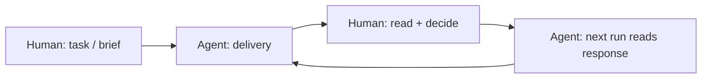

# Async human–agent bridge — one note, two audiences

The goal is **one Obsidian note** that (1) agents can parse reliably and (2) humans can read and answer **without** reformatting or a second channel. Everything below is **convention** — adopt what fits your runner and permissions.

---

## The loop (time-shifted)



| Phase | Who | Where it usually lives |
|-------|-----|-------------------------|
| Intent | Human | `00-SHARED/Inbox/` or `00-SHARED/Agent-Inbox/` (task), `00-SHARED/Human-Outbox/` (brief) |
| Delivery | Agent | `00-SHARED/Agent-Outbox/` (reports, findings) |
| Attention | Agent → human | `00-SHARED/Human-Inbox/flags/REVIEW-INBOX.md` or inline sections below |
| Steering | Human → agent | Same delivery note **or** `Human-Outbox/` / appended handoff in `00-SHARED/Memories/shared/` |
| Casual | Anyone | `00-SHARED/Hive/` |

Agents and humans **do not** need to be online at the same time: the **note** is the mailbox.

---

## Layer 1 — YAML frontmatter (machine + Properties panel)

Use **stable keys** so Dataview, hooks, and the next agent run agree on meaning.

**Minimum for handoff-heavy notes:**

```yaml
---
type: task | agent-delivery | preserved-response | flag | brief
status: pending | awaiting-human | in-progress | done | blocked
created: YYYY-MM-DD
updated: YYYY-MM-DD
tags: []
---
```

**Optional traceability** (nice in Properties; good for audits and “did this file move?”):

```yaml
vault_path: 00-SHARED/Agent-Outbox/example/2026-03-24-findings.md
source: ~/.claude/projects/.../session.jsonl   # or URL / repo path
sha256: <64-char hex of bytes you care to freeze, e.g. full file on disk>
session: <uuid>                                 # if promoted from a session log
```

**Navigation** (for humans browsing + Breadcrumbs / graph): use quoted wikilinks per **[[FRONTMATTER-WIKILINKS]]** — `parent`, `sibling`, `child` / `children`, and if you use ordered threads, `next` / `prev`.

Convention: **frontmatter = facts and links**; avoid long prose there — humans skim the body first.

### Faerie-aligned metadata (queues, memory lanes, bundles)

Use **optional** keys so **`/memory`**, **`/data-ingest`**, `/faerie`, and vault hooks route the **same** note consistently. This stacks on top of the async bridge fields above — not a second format.

| Faerie role | What it is | Typical CLI / repo home | Vault mirror (UNIFIED) | `memory_lane` |
|-------------|------------|-------------------------|-------------------------|----------------|
| **Queue** | Claimable work | `sprint-queue.json`, `*.task.md` | `00-SHARED/Inbox/` (or `Agent-Inbox/`) | `queue` |
| **Inbox** | Human triage / HIGH flags | `REVIEW-INBOX.md` | `00-SHARED/Human-Inbox/flags/REVIEW-INBOX.md` | `inbox` |
| **NECTAR** | Investigation findings (additive) | Project `.claude/memory/NECTAR.md` | Linked vault notes + optional synced full doc under `Memories/` / case tree | `nectar` |
| **HONEY** | Workspace facts (learned, crystallized) | `~/.claude/memory/HONEY.md` | Promoted stubs / `KNOWLEDGE-BASE` paths your sync uses | `honey` |
| **Scratch** | Session captures, `<!-- MEM -->` | `scratch-*.md`, `scratchpad.jsonl` | Optional: `Hive/` or `Memories/shared/` mirror | `scratch` |
| **Bundle** | Sealed sprint / handoff context | `.claude/sprints/...`, `context_bundle:` | Narrative in `Agent-Outbox/` + path in `bundle_ref` | `bundle` |
| **Insight** | Agent cards, techniques, logbook | `~/.claude/agents/`, repo techniques | `00-SHARED/Memories/agents/` (per your layout) | `insight` |
| **Hive** | Informal / system-change | — | `00-SHARED/Hive/` | `hive` |

**Suggested YAML (all optional):**

```yaml
memory_lane: queue | inbox | nectar | honey | hive | bundle | scratch | insight
promotion_state: none | capture | in_review | promoted | learn_pending
queue_task_id: "<id from sprint queue or task stub, if any>"
bundle_ref: "<path to sprint bundle dir or forensics.md>"
nectar_ref: "[[10-Investigations/Your-Case]]"   # or repo-relative path as string
faerie_session: "<uuid>"                         # optional: same session id as session bus / jsonl
```

- **`promotion_state`:** `capture` = still in scratch or agent-outbox; `in_review` = waiting in REVIEW-INBOX or human section; `promoted` = human approved append to NECTAR/HONEY path; `learn_pending` = workspace fact queued for **`/memory learn`** (investigation stays **NECTAR**, never merged into HONEY per memory rules).
- **`memory_lane`** should match **why the note exists** for faerie routing (Dataview can `WHERE memory_lane = "queue"`).
- **Scratch parity:** the body may still use **`<!-- MEM -->`** blocks (`cat=`, `pri=`) where your hooks already parse them; frontmatter **summarizes** lane + promotion for Obsidian and cross-tool queries.

See **[[11-FAERIE-IMPACT-AB]]** for what HONEY / NECTAR / queue / inbox **mean** in the stack.

---

## Layer 2 — body: human-first, then machine

Order matters for **reading comfort**:

1. **Title + short summary** (1–3 lines) — what this note *is*.
2. **`## Context` or `## What happened`** — narrative the human reads in Obsidian preview.
3. **`## Findings` / `## Evidence pointers`** — bullets, links to `10-Investigations/`, `30-Evidence/`, etc.
4. **`## For the human (async)`** — checkboxes and freeform **only humans** are expected to edit:

```markdown
## For the human (async)

- [ ] Read and acknowledged
- [ ] Decision needed: (yes / no / defer — add one line)
- [ ] Promote to protected: (link or “n/a”)

**Human notes (append-only below this line):**

- YYYY-MM-DD — ...
```

5. **`## For the next agent run`** — instructions that **must** be read before changing the case:

```markdown
## For the next agent run

- Do not edit "Human notes" above except to fix obvious typos if asked.
- If `status:` is still `awaiting-human`, do not spawn subagents; ping Human-Inbox only.
- Next action: ...
```

That split keeps **async boundaries** obvious in source mode and in graph-backed navigation.

---

## Layer 3 — closing the loop without chat

| Human action | Prefer |
|--------------|--------|
| Approve / reject | Edit `status:` in frontmatter + one line under Human notes |
| New constraint | `00-SHARED/Human-Outbox/YYYY-MM-DD-constraints.md` + wikilink from the task |
| Small correction | `00-SHARED/Memories/human/` (agents read, must not overwrite) |
| Thread for multi-hop work | `00-SHARED/Memories/shared/` handoff blocks per **[[04-QUICKADD-GLOBAL-VARS-HANDOFF]]** |

Agents **merge** into shared indexes (VAULT-INDEX, KNOWLEDGE-BASE); they **append** to human response sections or dedicated human files — see **[[VAULT-RULES]]**.

---

## What “seamless” means here

- **Same file** carries structured state (YAML) and readable story (markdown).
- **Same folders** route direction: in vs out vs flags vs hive (see **[[KICKSTART-COLLAB]]**).
- **Traceability** is optional but first-class: `vault_path`, `source`, `sha256` when you need to prove what byte stream you meant.
- **No second app** is required for the default loop — only Obsidian + your runner/sync.

---

## Related

- **`/data-ingest`** (Claude skill `data-ingest`) — **Vault handoff** section maps pipeline outputs here and should set **`memory_lane`**, **`promotion_state`**, **`queue_task_id`**, **`bundle_ref`** when relevant (same keys as above).
- **`/memory`** (skill `memory`) — REVIEW-INBOX / NECTAR / HONEY promotion; when mirroring to the vault, use this doc’s faerie-aligned frontmatter.
- [[11-FAERIE-IMPACT-AB]] — HONEY, NECTAR, queue, inbox, bundles (honest A/B + semantics).
- [[VAULT-RULES]] — zones and hard rules.
- [[KICKSTART-COLLAB]] — where to drop the first files.
- [[09-HUMAN-PROMOTES-AI-EXECUTES]] — promote vs execute boundary.
- [[00-SHARED/HOW-SYNC-WORKS]] — what auto-lands in the vault vs manual.
- [[FRONTMATTER-WIKILINKS]] — parent / sibling / child wikilinks.
