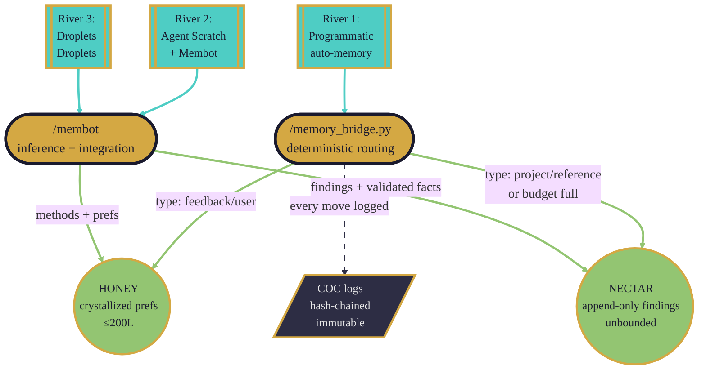
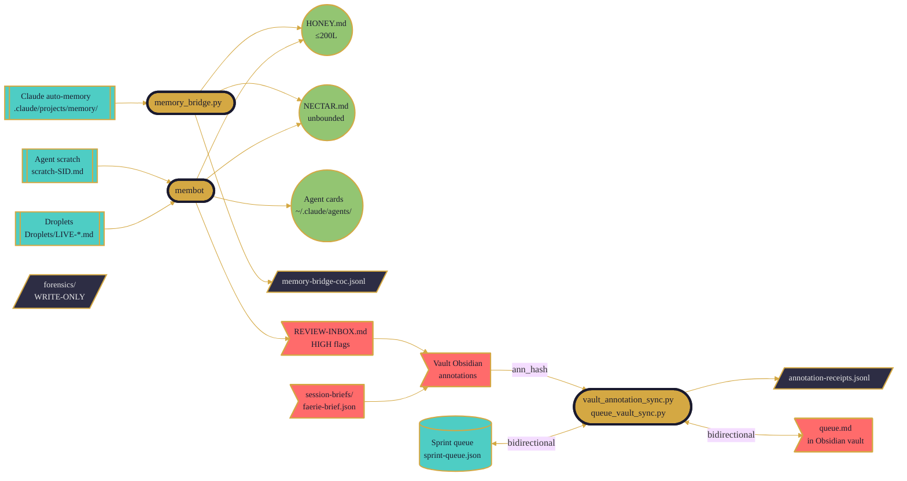
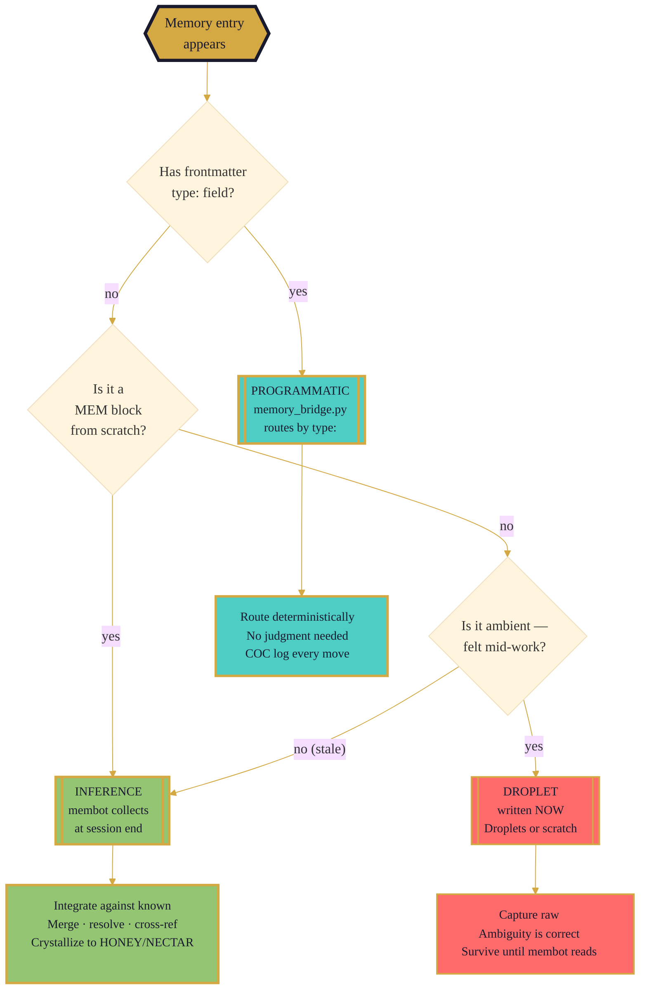
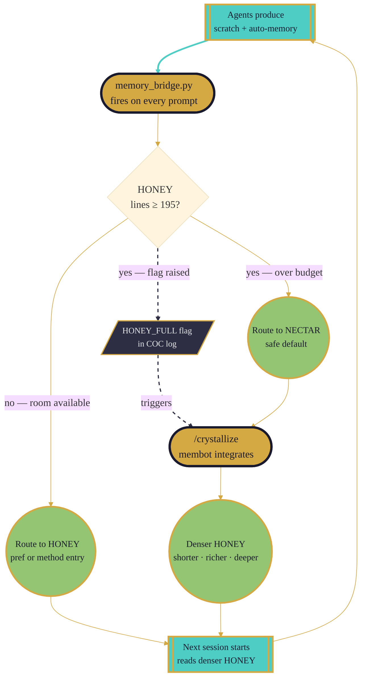
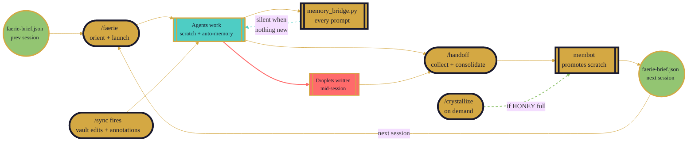
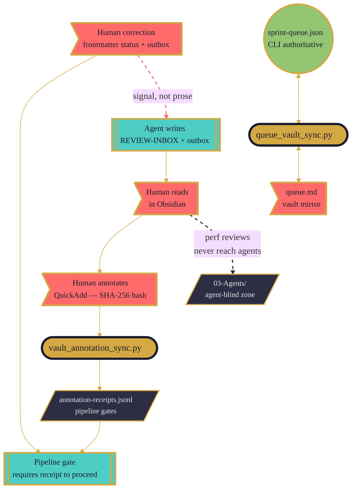
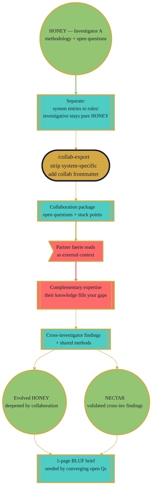

# Memory Flow Architecture — The Three Rivers

```dataviewjs
const content = await dv.io.load(dv.current().file.path);
const headers = content.match(/^#{2,3}\s+\d+\..+$/gm) || [];
dv.list(headers.map(h => {
  const text = h.replace(/^#+\s+/, '');
  return `[[#${text}|${text}]]`;
}));
```

> **Color language:** Gold = gateways (faerie/handoff). Teal = flowing state (work, scratch, queue). Pistachio = crystallized (HONEY, NECTAR, agent cards). Dark = immutable (forensics, COC). Coral = human layer. **Same color = same process family.**

---

## 1. The Three Rivers

Memory doesn't arrive from one direction. It comes from three sources simultaneously, each with a different character: the precise, the inferred, and the felt. Together they feed the same lake — HONEY and NECTAR — where everything the system knows eventually settles. Understanding the difference between these rivers is understanding the whole architecture.

**River one is the most mechanical.** When Claude Code runs, it writes auto-memories to `.claude/projects/*/memory/`. This is a platform behavior — not controlled by faerie, not asked for, just a constant trickle of "here is something the system noticed." The `memory_bridge.py` script sits downstream and watches that trickle. When something appears, the bridge reads the frontmatter, looks at the `type:` field, and routes it. No judgment, no interpretation — just routing. `type: feedback` goes to HONEY as a preference entry. `type: project` goes to NECTAR as a dated block. No `type:` at all? NECTAR — the safe default, where nothing is ever lost. The bridge also checks whether HONEY is close to its 200-line budget; if it is, even HONEY-bound entries reroute to NECTAR and a flag is raised. The whole operation is COC-logged: every entry that moves carries a SHA-256 hash, a timestamp, and a record in `memory-bridge-coc.jsonl`. This river runs every prompt, silently.

**River two is where intelligence lives.** Agents work. They write `<!-- MEM -->` blocks to their session scratch file at `{repo}/.claude/memory/scratch-{SESSION_ID}.md`. These blocks carry category tags — OBSERVATION, TECHNIQUE, FLAG, DECISION, HYPOTHESIS — and priority markers. At session end, `/handoff` triggers the membot to collect these scratches and do something the bridge never does: *understand them*. Membot reads each block against everything already in NECTAR and HONEY. It merges entries that say the same thing differently. It resolves contradictions. It forms cross-references. It promotes validated findings to NECTAR and crystallizes methods and preferences into HONEY. This is where new knowledge integrates with existing knowledge — not appended alongside it, but woven into it. This river is slower and episodic, but it's the one that makes the system smarter.

**River three has no schedule.** When thinking gets deep enough that something would hurt to lose — when three documents converge on a pattern, when a method clicks, when an investigation reveals something that feels significant before it can be articulated fully — that is when droplets are written. Not to a queue, not triggered by a hook. Directly to `Droplets/LIVE-{date}.md` or as `cat=DROPLET` blocks in scratch. They're raw, deliberately unfiltered, and deliberately preserved before the moment passes. Compaction is the enemy of this river: it fires exactly when context is richest, exactly when the most connections have been formed. Droplets exist because we learned this the hard way. They survive compaction precisely because they were captured in the moment — not queued for later, not waiting for handoff, not depending on the session to finish cleanly.



> **Three rivers, one lake.** The bridge handles the mechanical river. Membot handles the rivers that require understanding. All three empty into HONEY and NECTAR — the crystallized memory that survives compaction, seeds the next session, and accumulates meaning over time.

---

## 2. The Full Memory Map

The three rivers tell the story at the right altitude, but the full map is more detailed. Several memory locations exist that don't appear in the rivers metaphor — the forensic layer, the human annotation loop, the queue bidirectional sync, the session briefs. Each serves a distinct purpose. The map below shows all of them together so you can trace any path a memory can take.

The forensic layer deserves particular attention because it appears to do nothing — agents only write to it, never read from it. This is intentional. Forensic logs are chain-of-custody evidence. If an agent read from its own COC log, it could theoretically adjust its behavior to match prior findings — a subtle form of contamination that would undermine the integrity of the record. The constraint that forensics is write-only is a forensic principle, not a technical limitation.

The annotation loop moves in the opposite direction from most memory flows. Human annotations in Obsidian carry SHA-256 hashes in frontmatter. `vault_annotation_sync.py` reads those hashes on session start and logs them to `annotation-receipts.jsonl`. This allows corrections and steering from the human side to flow into pipeline gates — not as raw annotation text that agents could read and internalize, but as structured signals about what the human approved or corrected. The annotation text itself stays in Obsidian, human-only. The signal crosses the boundary; the prose doesn't.



---

## 3. Programmatic vs Inference — Where Each Belongs

There is a design principle behind the three-river architecture that is worth making explicit, because the temptation to collapse these categories is strong. The principle is this: *collection is not understanding, and routing is not integration*.

**Programmatic work** — what `memory_bridge.py` does — includes: scanning for new files, reading frontmatter, routing by `type:` field, checking HONEY's line count against its 200-line budget, deduplicating by SHA-256 hash, marking source files as promoted, appending to destination files, and logging every move to the COC. None of these operations require knowing what the content means. They require only that the rules be followed precisely and consistently every time. Programmatic work benefits from being code: it runs in under a second, it's deterministic, it can be audited by reading the source, and it produces the same output given the same input regardless of context, mood, or model.

**Inference work** — what membot does — includes: recognizing that two differently-worded entries describe the same technique, resolving apparent contradictions by understanding the context each came from, forming a cross-reference between an agent card observation and a NECTAR finding, recognizing that a scratch observation has crystallized into a principle worth promoting to HONEY, and deciding which `<!-- MEM cat= -->` blocks from a session's scratch file are findings versus noise. These operations require understanding the content. They benefit from being LLM work: they can reason across context, recognize semantic equivalence, apply judgment, and produce outputs that are denser and more meaningful than their inputs. Delegation to membot is not bureaucratic; it's the only honest way to do this work.

**Droplets** are neither. They are not produced by routing logic and they are not the output of inference. They are pre-inferential — the raw sensation that something important just happened, captured before the moment passes. A droplet written well is deliberately ambiguous: it gestures at a pattern, names a feeling, records a convergence. It doesn't need to be right. It doesn't need to be complete. It needs to survive until membot can read it and begin the inference work. The quality of a droplet is measured by how much it would hurt to lose it, not by how well-formed it is.



---

## 4. The Equilibrium Cycle

Every system that accumulates knowledge faces the same failure mode: accumulation without integration. Files grow until they exceed their usefulness. Tokens pile up without becoming denser. The noise floor rises. Over time the system knows more but understands less. Equilibrium is the architectural principle that prevents this.

The word "equilibrium" is precise. Every input must balance an output. When knowledge is produced, it must be integrated — not just stored. When a file reaches its budget, that is the system signaling that integration work is owed before new content can safely arrive. The budget is not an arbitrary limit; it is the system asking to be understood before it grows.

`memory_bridge.py` implements this directly. Before every write to HONEY, it calls `count_lines(HONEY)`. If the result is 195 or higher — within five lines of the 200-line budget — the entry is rerouted to NECTAR and a `HONEY_FULL` flag is raised in the COC log. The content is never lost; it waits safely in NECTAR until a crystallization run can integrate the backlog into HONEY. This means the bridge is not just a router — it is a budget enforcer. Its routing decisions depend on the current state of the files it writes to.

Crystallization closes the loop. `/crystallize` is the command that dispatches membot to do the integration work: reading what has accumulated in NECTAR, identifying entries that deserve to be distilled into HONEY-level insight, merging them against existing HONEY entries, and producing a shorter, denser, richer HONEY file. After crystallization, HONEY is not just smaller — it is deeper. Each line carries more meaning than before. The space that opened up can absorb the next wave of incoming knowledge.

The cycle repeats: produce → collect → route → crystallize → produce. Each revolution, the crystals are a little denser and the outputs are a little better.



> **The cycle is self-correcting.** When HONEY fills, the bridge automatically reroutes and flags. When the flag is acted on, crystallization runs and space opens. No manual intervention needed to prevent overflow — only to do the crystallization work itself, which requires the kind of intelligence a script cannot provide.

---

## 5. The Session Lifecycle (Memory Edition)

A session has a shape. It begins with orientation, fills with work, generates knowledge, and ends with consolidation. The memory system has a different concern than the task system: where the task system tracks what is done, the memory system tracks what is learned. The two overlap but they are not the same thing.

A session begins when `/faerie` runs. Faerie reads `faerie-brief.json` (the handoff package from the previous session), loads HONEY into context, and scans the queue. From the first prompt onward, `memory_bridge.py` is running as a hook — every prompt fires it, every new auto-memory entry is processed. The bridge is silent when there is nothing new and visible only in the COC log when it acts.

During work, agents write scratch. This is the main data-producing phase. Scratch blocks accumulate: observations about what worked, techniques discovered, flags for human review, decisions made. High-priority blocks (`pri=HIGH`) also append to REVIEW-INBOX so they surface for the human regardless of whether handoff runs cleanly.

Droplet capture happens mid-session, not at the end. When a moment warrants it — when something would hurt to lose — a droplet is written immediately. This is the exception to the rule that memory consolidation happens at session boundaries. The droplets protocol exists precisely because session boundaries are not reliable: compaction can fire, context can run out, the session can end unexpectedly. Droplets are the system's circuit breaker against loss.

At session end, `/handoff` collects scratch and dispatches membot. Membot promotes validated findings to NECTAR, distills methods and preferences toward HONEY, and writes a `faerie-brief.json` for the next session. The brief is the bridge between sessions: it carries active threads, decisions made, files touched, and the state of the queue. The next `/faerie` call reads this brief and the cycle begins again.



---

## 6. Human-Agent Memory Flow

The memory system is asymmetric in one important respect: agents write down into the system (scratch to NECTAR to HONEY), but humans write up into the system from a different direction entirely. Human knowledge enters through Obsidian, through annotation, through correction and steering — not through scratch files and not through auto-memory. This asymmetry is deliberate. The human layer is the authoritative layer. Agent outputs inform it; they don't replace it.

When a human annotates a note in Obsidian — using the QuickAdd `Ctrl+Alt+C` workflow or directly editing frontmatter — the note acquires a SHA-256 hash in its frontmatter. This is the human's signature: "I have read and acknowledged this." On the next session start, `vault_annotation_sync.py` reads those hashes and records them in `annotation-receipts.jsonl`. This file tells the pipeline which agent outputs have been reviewed by a human. Gates downstream can require a receipt before proceeding — preventing unreviewed findings from flowing into protected areas.

Corrections flow as structured signals, not as prose. If a human disagrees with a finding, they don't write a note that agents will read and internalize. They change the `status:` in frontmatter, or they edit the REVIEW-INBOX entry with a one-line response, or they add a constraint document to `Human-Outbox/`. The correction crosses the boundary as data about the finding, not as natural language that could subtly shift the next agent's worldview.

The queue is the clearest example of bidirectional memory. `sprint-queue.json` is the authoritative queue in the CLI environment. `queue.md` in the Obsidian vault is a human-readable mirror. `queue_vault_sync.py` keeps them synchronized in both directions: agent completions flow to the vault, human priority edits flow back to the CLI. Neither side is subordinate — the sync respects both.

The `03-Agents/` folder in the vault is agent-blind: performance reviews, evaluation notes, and human commentary about agent behavior live there and are never loaded into agent context. This prevents a subtle feedback loop where agents adjust their behavior to match their own performance reviews, which would undermine both the integrity of the reviews and the honest baseline of the agents themselves.



> **Asymmetry by design.** Agents write down into the system through scratch and auto-memory. Humans write up through annotations and corrections — as structured signals, not prose. The queue is the exception: it flows both ways because task state must stay synchronized regardless of which side last touched it.

---

## 7. The Collaboration Vision

HONEY is currently a mix of two different things: system knowledge (WSL path conventions, Python version constraints, script timeouts) and investigative knowledge (working style, what gets overlooked, how to build trust with a specific set of evidence). The first category belongs in `rules/` — it's operational, it should be versioned, it's useful to anyone running the same infrastructure. The second category is the real HONEY — the essence of how this particular investigator thinks, what patterns they find compelling, where their attention naturally goes. That second category is portable and potentially collaborative in ways the first category is not.

The vision for collaboration begins with this separation. As system-specific entries migrate to `rules/`, HONEY becomes an increasingly concentrated expression of investigative personality and methodology. The metaphor is accurate: honey produced by a particular hive in a particular place carries the flavor of its flowers. HONEY, properly distilled, would carry the flavor of how this investigation sees the world.

A `/collab-export` command would strip the system-specific entries, add collaboration frontmatter, and produce a package a trusted collaborator could receive. Their faerie reads it as external context — not as their own memory, but as a known and trusted perspective. The open questions in one investigator's HONEY become seeds for another's expertise. Stuck points become invitations. The complementarity between two investigators — what each knows that the other doesn't — becomes navigable.

The output of this collaboration, per the three-river architecture, flows back through the same channels. Cross-investigator findings go to NECTAR. Methods that generalize go toward HONEY. The briefs that summarize collaboration sessions look exactly like the briefs that summarize solo sessions — the architecture doesn't need to know that two investigators were involved. It just routes.



> **Collaboration is HONEY becoming social.** The system architecture doesn't change — the same rivers, the same lake, the same equilibrium cycle. What changes is that the lake now has a tributary from another hive. The architecture routes it the same way it routes everything else: collect, integrate, crystallize.

---

## Related

- [[System-Architecture]] — 16-diagram master overview, all subsystems
- [[12-ASYNC-HUMAN-AGENT-BRIDGE]] — async human-agent communication protocol
- [[11-FAERIE-IMPACT-AB]] — honest A/B on what HONEY, NECTAR, and queue add
- [[09-HUMAN-PROMOTES-AI-EXECUTES]] — promote vs execute boundary
- [[10-TASK-LINEAGE-AND-HANDBACK]] — task provenance and handback
- [[KICKSTART-COLLAB]] — collaboration setup
- [[VAULT-RULES]] — vault zones and hard rules
