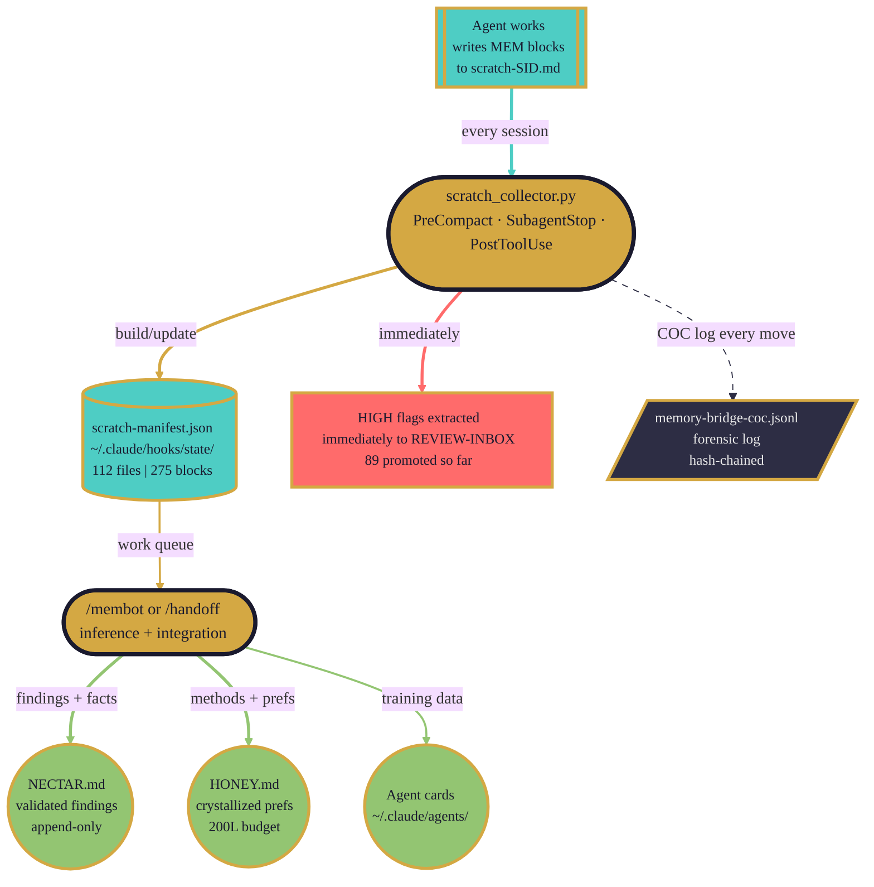
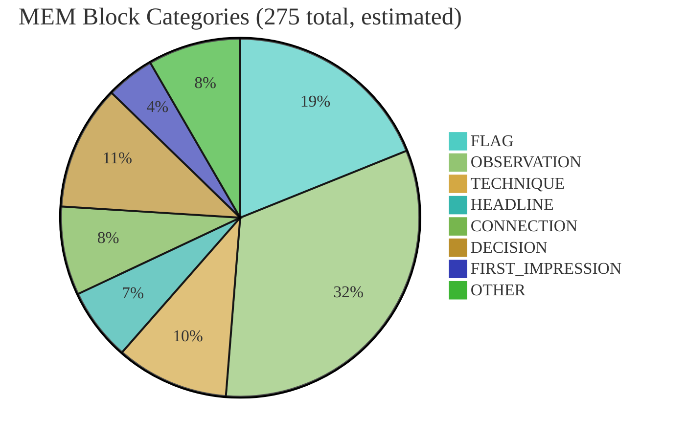
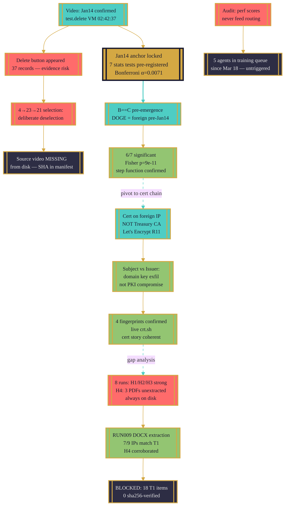

# Scratch Dump — Processing State & Investigation Narrative

```dataviewjs
const content = await dv.io.load(dv.current().file.path);
const headers = content.match(/^#{2,3}\s+\d+\..+$/gm) || [];
dv.list(headers.map(h => {
  const text = h.replace(/^#+\s+/, '');
  return `[[#${text}|${text}]]`;
}));
```

> **Color language (FFFF system):** Gold = gateways and orchestration. Teal = flowing/active state. Pistachio = crystallized knowledge. Dark = immutable forensic layer. Coral = human review layer. **Same color = same process family.**

---

## 14.1. Current State — What the Manifest Shows

As of 2026-03-28T15:14:47Z, the scratch-manifest contains:

| Metric | Value |
|---|---|
| Total scratch files | 112 |
| Total `<!-- MEM -->` blocks | 275 |
| Files with HIGH-priority flags | 58 |
| Blocks previously promoted to REVIEW-INBOX | 89 |
| Files with `promoted` status | 0 |
| Total scratch content (bytes) | 383 KB |
| Manifest trigger | manual |
| Last scan | 2026-03-28 |

**Repos represented (6 total):**

| Repo | Scratch files |
|---|---|
| `/mnt/d/0LOCAL/gitrepos/cybertemplate` | 75 |
| `/mnt/d/0LOCAL/gitrepos/data-analysis-engine` | 23 |
| `/mnt/d/0LOCAL/0-ObsidianTransferring/CyberOps-UNIFIED` | 7 |
| `/mnt/d/0LOCAL/gitrepos/faerie2` | 5 |
| `/mnt/c/Users/amand` | 1 |
| (droplet) | 1 |

> [!findings]
> **Zero files are marked `promoted`.** This means membot has not yet run a full integration pass against this manifest. 89 HIGH-flag snippets were surfaced to REVIEW-INBOX by `scratch_collector.py` during the runs (the auto-save function did its job), but none of the 275 MEM blocks have been crystallized into HONEY or NECTAR via inference. The membot work queue is the full manifest.

The manifest is the ledger of unfinished memory work. Every scratch file in it represents a session that generated knowledge which has not yet been integrated into the permanent record.

---

## 14.2. What Was Worked Through — The Sequential Insight Chain

The scratch files tell a story. Reading them in chronological order (March 20 through March 28) reveals how one finding created the question that opened the next file.

### Wave 1 — Infrastructure Foundations (2026-03-20)

The earliest files are named `scratch-MINE005.md`, `scratch-mine007`, `scratch-mine-001`, and the initial `scratch-.md`. These capture the data engineering phase: mining Prisma Studio HTML, extracting AS400495 spreadsheets, and the first video frame extraction of the ProxMox VM interface.

The chain begins with `scratch-proxmox-vision.md`: *99 frames extracted, 37 VM records, 35 TERMINATED, 2 ACTIVE. Jan 14 2025 confirmed visible.* That single timestamp — `test.delete` VM created `2025-01-14T02:42:37` — became the anchor for every subsequent statistical test. Before this, Jan 14 was a hypothesis. After this frame, it was confirmed infrastructure evidence.

The same session produced the first FLAG that would echo through all later work: the operator had selected all 37 records and the **"Delete 37 records"** button appeared. The video *itself* became the preservation of potential evidence destruction. This observation seeded `scratch-faerie-evid.md`, which then deepened the analysis: deletion was not executed, but the selection sequence (4 → 23 → 21 records) was deliberate. The 23→21 reduction meant someone deselected 2 specific records — not accidental UI interaction.

One discovery created the next question: if the records weren't deleted in the video, were they deleted *after* the recording? That question opened `scratch-faerie-evid.md`'s third block: the source video file (`Packetware ProxMox VM lots spun up... Jan 14.mp4`, SHA-256: `e82435...`) was **not present on disk** despite being in the genesis hash manifest. Only `Recording #55.mp4` (3.1 MB, different hash) existed. The file had dematerialized.

### Wave 2 — Statistical Validation (2026-03-22)

With infrastructure evidence in hand, the statistical campaign opened. `scratch-stat-main.md` captures the pre-registration of 7 hypotheses before any test ran — Bonferroni alpha 0.0071, locked. The `FIRST_IMPRESSION` block from the data scientist reads like a detective's initial observation: "Group A is exactly 0 for all 7 pre-emergence days, then jumps to 128 on Jan 14. This is not gradual — it is a step function."

The 7-test battery completed. 6/7 significant. The one null result (`H_C_PERSIST`, p=0.19) was more valuable than the six successes: the data scientist documented *why* it failed rather than hunting for a passing comparison. This anti-p-hacking discipline was captured as a `TECHNIQUE` block and fed the agent training pipeline.

The critical discovery in `scratch-stat-main.md` was not one of the seven pre-registered tests. It was a structural observation: **B == C exactly on all 7 pre-emergence days.** The DOGE IPs and the foreign infrastructure IPs were the *same set* before Jan 14. During the emergence window, C was a superset of B. This pattern — foreign infrastructure as a superset that includes DOGE IPs — was the statistical fingerprint of shared infrastructure.

`scratch-certchain.md` then raised the precision question about that finding: *the certs on `138.124.123.3` are signed by Let's Encrypt R11, not a Treasury CA.* This changed the claim. Not "Treasury PKI private key compromise" but "government domain cert private key exfiltration or ACME channel compromise." The distinction between cert Subject and cert Issuer became a `TECHNIQUE` block: *propagate this to all cert-chain verification tasks.*

`scratch-certdeep.md` confirmed 4 cert fingerprints on foreign infrastructure via live crt.sh lookups. `scratch-certnorm.md` normalized the full set into structured data (6 files, unified schema). The cert story became structurally coherent.

### Wave 3 — Gap Analysis and Publication Blocking (2026-03-22)

The most urgent FLAG in the entire manifest lives in `scratch-gap-analyst.md`:

> *T1 has 18 items, 0 sha256-verified — publication is blocked until hashes are confirmed.*

This was the evidence-curator's assessment after 6 ingestion runs. The investigation had strong findings but could not publish without chain-of-custody hash verification on every Tier 1 item. The gap analyst also closed one important hypothesis: **H5 is DEAD — zero evidence.** The `$6.74 Prisma DB billing total` is evidence Packetware is not a real hosting company, not evidence of payment via other channels. Inferring financial motive from low declared revenue is speculation. H5 was retained as a named-but-unsupported concept only.

After Run 8, the gap analyst produced its clearest summary: H1, H2, H3 are at publishable strength. H4 (foreign actor attribution) is the only hypothesis where additional extraction would materially change the publication. The critical path to H4 closure: three PDFs that have existed on disk since before Run 1 and remain unextracted through Run 8. The pattern — high-value PDFs requiring OCR persist across runs because they need dedicated extraction engineering — was itself a finding about the pipeline, not just the investigation.

`scratch-treasury-tls.md` (Run 9) then partially closed that gap: DOCX extraction via python-docx yielded a clean 7-column table. 7 of 9 extracted IPs matched existing Tier 1 items. The Treasury TLS document corroborated what the statistical analysis had already shown. A new entity appeared: Amazon China IPv6 `2600:9000:20f0:5800:1a:aaa4:9300:93a1` serving `seqdata.uspto.gov` cert — no prior cross-reference.

### Wave 4 — System Self-Audit (2026-03-25 through 2026-03-28)

The most recent scratch wave shifted from investigation to infrastructure. The `faerie2` repo's `scratch-phase1-audit.md`, `scratch-error-coordinator-phase1-audit.md`, and `scratch-audit-phase1.md` document a systematic audit of the agent pipeline itself.

Key findings from the system audit:
- Performance scores (KPI results) were never flowing back to the agent routing layer. Agents ran, scored, but the routing didn't update based on score. The feedback loop was broken.
- `next_on_failure` was missing from sprint queue tasks — failure handling was not specified, making error recovery purely manual.
- Partial success was treated identically to full success in task completion logic.
- A personal access token appeared in plaintext in a `faerie2` config file — flagged HIGH, required immediate rotation.
- Training queues for 5 agents had been sitting since 2026-03-18 with no redemption run triggered.

This wave also generated the `scratch-memory-gate-build.md`, `scratch-stop-hook-drain.md`, and `scratch-honey-version-build-20260327.md` files — the building of new plumbing in response to gaps found during the audit.

> [!friction]
> The system audited itself and found the audit system was incomplete. This recursive quality — using the memory pipeline to discover flaws in the memory pipeline — is structurally sound but requires human review before trusting the self-assessment. The faerie2 scratch files represent the system's attempt at its own code review.

---

## 14.3. Processing Pipeline — How Scratch Becomes Knowledge



**Three moments when `scratch_collector.py` fires:**

1. **PreCompact** — context is richest right before compaction. This is the highest-risk moment for knowledge loss. The collector captures everything before the context window shrinks.
2. **SubagentStop** — agent just returned with results. Capture immediately while the session is hot.
3. **PostToolUse (throttled)** — every 5 minutes during active work. Catches everything else.

What the collector does NOT do: no inference, no crystallization, no HONEY/NECTAR writes. It is the auto-save function in a video game — it doesn't advance the story, it just ensures progress is not lost to a crash or walkaway. The story advances only when membot runs.

**The current bottleneck:** 0 of 112 files are marked `promoted`. The collector has been running faithfully. The manifest is complete. But membot has not processed the queue. 275 blocks are waiting for inference-level integration. This is the work that remains.

---

## 14.4. Forensic COC Links

The chain-of-custody for scratch processing lives across several files. Working Obsidian links where they exist:

**Global forensic layer:**
- `~/.claude/memory/forensics/annotation-receipts.jsonl` — pipeline gate receipts
- `~/.claude/hooks/state/scratch-manifest.json` — the live work queue (not vaulted, read via CLI)
- `~/.claude/memory/forensics/researcher-review/` — siphoned HIGH-priority items

**Project-level COC (cybertemplate):**
- [[analysis-run-log]] — per-run log of all ingestion runs
- `/mnt/d/0LOCAL/gitrepos/cybertemplate/forensic/provenance/` — genesis hash manifests, b2 manifests, per-run COC logs
- `/mnt/d/0LOCAL/gitrepos/cybertemplate/.claude/memory/forensics/` — agent COC logs

**Key forensic files by type:**

| File | Purpose |
|---|---|
| `hash_manifest_genesis_RUN004.json` | Genesis hashes for all evidence files at first ingest |
| `b2_manifest.json` | B2 backup state — some `sha256` fields NULL (incomplete backup) |
| `memory-bridge-coc.jsonl` | Every auto-memory routing move, hash-chained |
| `annotation-receipts.jsonl` | Human review receipts for pipeline gates |

> [!flags]
> **B2 backup gap:** `b2_manifest.json` shows several files with `sha256: null` and `etag: null` — backup was initiated but not confirmed complete. The ProxMox video file that went missing from local disk (SHA-256 `e82435...`) also had null backup fields. Evidence preservation status is uncertain for this file until the B2 bucket is directly verified.

---

## 14.5. Membot Work Queue — What Still Needs Processing

All 112 files are unprocessed. Priority ordering by signal density:

### Priority 1 — HIGH flags, large block count

| File | Blocks | Repo |
|---|---|---|
| `scratch-phase1-audit.md` | 10 | faerie2 |
| `scratch-audit-phase1.md` | 8 | faerie2 |
| `scratch-error-coordinator-phase1-audit.md` | 8 | faerie2 |
| `scratch-gap-analyst.md` | 7 | cybertemplate |
| `scratch-data-ingest-session.md` | 7 | cybertemplate |
| `scratch-treasury-tls.md` | 5 | cybertemplate |
| `scratch-phase1-audit-20260318.md` | 5 | faerie2 |
| `scratch-STAT-NEW-001.md` | 4 | cybertemplate |
| `scratch-RUN007.md` | 4 | cybertemplate |
| `scratch-PDF-INGEST-001.md` | 4 | cybertemplate |
| `scratch-stat-main.md` | 4 | cybertemplate |
| `scratch-task5a6f.md` | 4 | cybertemplate |
| `scratch-proxmox-vision.md` | 4 (×2 repos) | both |
| `scratch-faerie-evid.md` | 4 (×2 repos) | both |

### Priority 2 — TECHNIQUE blocks (promote to AGENTS.md + techniques/)

Identified TECHNIQUE blocks awaiting promotion:
- `scratch-stat-main.md` → anti-p-hacking null result documentation
- `scratch-stat-main.md` → Cohen's d with degenerate zero-variance pre-period; use Fisher for step-function transitions
- `scratch-certchain.md` → Subject vs Issuer distinction in cert-compromise claims
- `scratch-treasury-tls.md` → DOCX table extraction via python-docx preferred over pdfplumber
- `scratch-proxmox-vision.md` → Windows ffmpeg via WSL interop for video frame extraction
- `scratch-gap-analyst.md` → direct directory scan at every gap cycle (not only prior gap order)

### Priority 3 — CONNECTION blocks (cross-project)

The faerie2 audit files contain CONNECTION-category findings about the agent system that apply across all projects. These need promotion to the global AGENTS.md, not just project-level NECTAR.

### Estimated membot work volume

At 2-4 minutes of inference work per file for the dense files and 30 seconds for the thin ones, this manifest represents roughly 3-5 hours of membot integration work. The TECHNIQUE promotions alone could yield 8-12 new technique entries in AGENTS.md and the vault techniques/ folder.

---

## 14.6. Key Findings by Category

The 275 blocks break into the following approximate category distribution (from file content review):



**Selected findings by category:**

### FLAG (HIGH-priority — most urgent for REVIEW-INBOX)

- T1 has 18 items, 0 sha256-verified — publication blocked until hashes confirmed
- Source video file MISSING from local rawdata (ProxMox deletion-evidence video)
- H5 is DEAD — zero evidence — commvault bundle incorrectly listed H5 in RUN-006 report
- 138.124.123.3 cert chain: NOT signed by Treasury CA — signed by Let's Encrypt R11
- Evidence destruction risk: operator selected all 37 ProxmoxVM records, Delete button appeared
- GitHub personal access token exposed in plaintext (faerie2 config — immediate rotation required)
- Training queue for 5 agents sitting since 2026-03-18 — no redemption run triggered
- Performance scores never flow back to agent routing layer — feedback loop broken

### OBSERVATION (investigation findings)

- Full 7-test battery: 6/7 significant at Bonferroni; H_JAN14 Fisher p=9.05e-11 (perfect binary transition)
- B==C exactly on all 7 pre-emergence days — DOGE IPs and foreign infra were the same set pre-Jan-14
- Prometheus TX:RX ratio 26:1 on single snapshot — time-series validation still needed
- SparrowDoor GCHQ report on disk but untiered through all 8 runs
- 6 Bloomberg shortlist files existed on disk through all 8 runs without gap-order capture
- `internal-systems` VM (password=`test`) created Jan 13 23:45 — STILL ACTIVE persistent infra
- Mass `updatedAt = 2025-02-18T19:18:41` on all 37 ProxMox records — bulk DB operation post-DOGE-window

### TECHNIQUE (reusable, promote to AGENTS.md)

- Cohen's d with zero-variance pre-period: report but flag degenerate denominator; use Fisher for binary step transitions
- When pre-registered test fails: document the null fully, explain why, do NOT run post-hoc rescues
- DOCX table extraction via python-docx preferred over pdfplumber for structured cert tables
- Windows ffmpeg via WSL interop: `/mnt/c/Users/amand/AppData/.../ffmpeg.exe` with Windows paths in ffmpeg calls
- Direct directory scan at every gap cycle — evidence accumulates on disk faster than gap orders are written
- Subject vs Issuer in cert compromise: Let's Encrypt issuer = domain key exfiltration; internal CA issuer = PKI compromise

### HEADLINE (publishable-strength findings)

- Packetware database operator evaluated bulk-deleting VM records during DOGE access window — video preserved (confidence 0.90)
- DOGE malware: `base.apk` contacts `doge.gov`; `test.exe` contacts `suckmychocolatesaltyballs.doge.gov` (threat score 100/100, 72 MITRE techniques)
- Phase 3 complete: evidence curation + journalist brief package ready for H1/H2/H3
- Bloomberg H1: Krish Soni = COO Monk AI Group; Edward identified via SignalHire
- 400yaahc.gov = CONFIRMED GSA domain; DOGE-GSA access corroborated by FICAM cert admin

---

## 14.7. Accidental Inventions — Tools Built as Workarounds

The three scripts that now form the core of the memory pipeline were not designed upfront. They emerged from friction.

### `scratch_collector.py` — the auto-save that shouldn't have been necessary

The original design assumed agents would write scratch, `/handoff` would collect it, and membot would promote it. Clean, sequential, intentional.

The problem: compaction fires at the worst possible moment. When context is richest — three documents converging, a statistical result just validated, a connection just formed — the context window fills and auto-compact truncates. The scratch file exists but the agent that was going to write the closing `<!-- MEM -->` block never got to it. The insight was in the compressed-away context, not on disk.

`scratch_collector.py` was built because insights were lost to compaction too many times. It has no inference capability — deliberately. It is the canary, not the miner. It fires at `PreCompact` precisely because that is the highest-risk moment: the collector runs *before* the context window shrinks, ensuring that whatever blocks exist are catalogued and HIGH flags are surfaced immediately.

The manifest it produces became the membot work queue. This was not the original plan — the manifest was supposed to be a diagnostic tool. It became the production interface.

### `memory_bridge.py` — routing without judgment

Claude Code's auto-memory feature writes entries to `.claude/projects/*/memory/*.md` automatically, with frontmatter `type:` fields. The original handling was manual: periodically a human or agent would read these and decide where they should go.

The problem: auto-memory fires every prompt. After a week of active sessions, there were hundreds of unrouted entries. The volume made manual routing infeasible.

`memory_bridge.py` was built as a five-minute script to handle the obvious cases. The routing table was simple: `type: feedback` → HONEY, anything else → NECTAR, nothing at all → NECTAR (safe default). Budget awareness was added after HONEY went over the 200-line limit twice: the bridge now checks `wc -l` before every HONEY write and re-routes if within 5 lines of capacity.

What made it valuable was what it didn't do. By explicitly not doing inference — by being deterministic, auditable, and dumb — it became reliable in a way a smarter script would not have been. The COC log it maintains is forensically sound precisely because the routing is mechanical. There's no judgment to question.

### `queue_vault_sync.py` — because two sources of truth became one problem

The sprint queue lived in `sprint-queue.json` in the CLI environment. The human worked in Obsidian. These two representations diverged within days. The human would mark a task done in their `queue.md`; the CLI wouldn't know. An agent would complete a task; the vault wouldn't show it.

`queue_vault_sync.py` was built to fix a sync problem. It became a bidirectional protocol. The `--import` mode reads the vault file, detects changes, writes back to `sprint-queue.json`. The `--export` mode does the reverse. The `--hook` mode skips the full sync if the vault file hasn't changed since last run.

The deeper design principle that emerged from building it: *neither side is subordinate.* Human priority edits flow back to the CLI. Agent completions flow to the vault. The sync respects both. This became the model for the human-agent boundary more broadly — not a master/slave relationship but a bidirectional protocol with each side authoritative in its own domain.

> [!flow]
> All three scripts were built to fix specific pain points. None was planned. Each revealed a structural need the original design had not anticipated. `scratch_collector.py` revealed that session boundaries are not reliable memory boundaries. `memory_bridge.py` revealed that volume kills manual routing. `queue_vault_sync.py` revealed that two authoritative sources of truth are one too many. The pain points were features in disguise — each one pointed at a real architectural requirement.

---

## 14.8. Product Vision — How This Maps to the Three-Tier Model

The infrastructure built during these sessions maps directly to the three-tier product architecture.

```mermaid
%%{init: {'theme': 'base', 'flowchart': {'curve': 'basis', 'nodeSpacing': 60, 'rankSpacing': 70}, 'themeVariables': {
  'fontSize': '14px', 'fontFamily': 'Inter, system-ui',
  'lineColor': '#D4A843', 'background': '#1a1a2e'
}}}%%
graph LR
    classDef gold fill:#D4A843,stroke:#1a1a2e,stroke-width:4px,color:#1a1a2e,font-size:14px
    classDef teal fill:#4ECDC4,stroke:#D4A843,stroke-width:3px,color:#1a1a2e,font-size:13px
    classDef pist fill:#93C572,stroke:#D4A843,stroke-width:3px,color:#1a1a2e,font-size:13px
    classDef dark fill:#2d2d44,stroke:#D4A843,stroke-width:3px,color:#e8e8e8,font-size:12px
    classDef coral fill:#FF6B6B,stroke:#D4A843,stroke-width:3px,color:#1a1a2e,font-size:13px

    subgraph FREE ["FREE TIER — no persistence"]
        direction TB
        F1[["Session runs<br/>agent produces output"]]:::teal
        F2[["Context ends<br/>all lost"]]:::dark
    end

    subgraph TRIAL ["TRIAL TIER — basic scratch"]
        direction TB
        T1[["scratch_collector.py<br/>auto-save + manifest"]]:::gold
        T2[["HIGH flags extracted<br/>immediately"]]:::coral
        T3[["manifest.json maintained<br/>but not processed"]]:::teal
    end

    subgraph PAID ["PAID TIER — full pipeline"]
        direction TB
        P1[["scratch_collector.py<br/>+ memory_bridge.py<br/>+ queue_vault_sync.py"]]:::gold
        P2[["membot runs on manifest<br/>inference + integration"]]:::gold
        P3[["HONEY crystallized<br/>NECTAR + cards updated<br/>next session deeper"]]:::pist
    end

    FREE -.->|"upgrade"| TRIAL
    TRIAL -.->|"upgrade"| PAID
```



**What each tier delivers:**

**Free:** The agent does the work, returns the answer. No scratch files persist, no manifest is maintained, no history accumulates. Each session starts from zero. This is adequate for one-off tasks and exploration. It is not adequate for investigation work that spans weeks.

**Trial:** `scratch_collector.py` runs. HIGH flags are extracted to REVIEW-INBOX immediately. The manifest is written and maintained across sessions. The user gets the immediate value of not losing HIGH-priority flags to compaction. The integration work (membot) is not included — the manifest accumulates unpromoted blocks. At 275 blocks across 112 files, a trial user eventually reaches the state this manifest is currently in: rich with content, waiting for crystallization that requires the paid tier.

**Paid:** The full pipeline runs. `memory_bridge.py` routes every auto-memory entry deterministically. `queue_vault_sync.py` keeps the CLI and vault in sync. Membot processes the manifest: findings go to NECTAR, methods and preferences go toward HONEY, agent cards are updated with training data. The next session starts with a materially deeper context than the one before it. The accumulation is the product.

The current state of this manifest — 112 files, 275 blocks, 0 promoted — is the most honest possible demonstration of the trial-to-paid boundary. Everything the trial tier does well is present: the manifest is complete, the HIGH flags were extracted, nothing was lost to compaction. Everything the trial tier cannot do is also present: 275 blocks waiting for integration work that requires inference, that requires membot, that requires the paid tier to close the loop.

> [!findings]
> **The manifest is the product demo.** Show a prospect the scratch-manifest.json in this state — 112 files catalogued, 89 HIGH flags surfaced, 0 promoted — and then show them what the manifest looks like after a membot pass: the same 112 files, but now with `promoted: true`, NECTAR entries timestamped, agent cards updated, HONEY deepened. The delta between those two states is what the paid tier delivers. The manifest makes that delta visible and measurable.

---

## 14.9. The Sequential Insight Chain — Visual Summary



---

## Related

- [[13-MEMORY-FLOW-ARCHITECTURE]] — the three rivers, the equilibrium cycle, full memory map
- [[12-ASYNC-HUMAN-AGENT-BRIDGE]] — async human-agent communication protocol
- [[11-FAERIE-IMPACT-AB]] — honest A/B on what HONEY, NECTAR, and queue add
- [[01-ARCHITECTURE]] — project architecture and phase overview
- [[System-Architecture]] — 16-diagram master overview, all subsystems
- [[analysis-run-log]] — per-run log of all ingestion runs
- `~/.claude/hooks/state/scratch-manifest.json` — live work queue (not vaulted, read via CLI)
- `~/.claude/scripts/scratch_collector.py` — auto-save script
- `~/.claude/scripts/memory_bridge.py` — programmatic memory router
- `~/.claude/scripts/queue_vault_sync.py` — bidirectional queue sync
