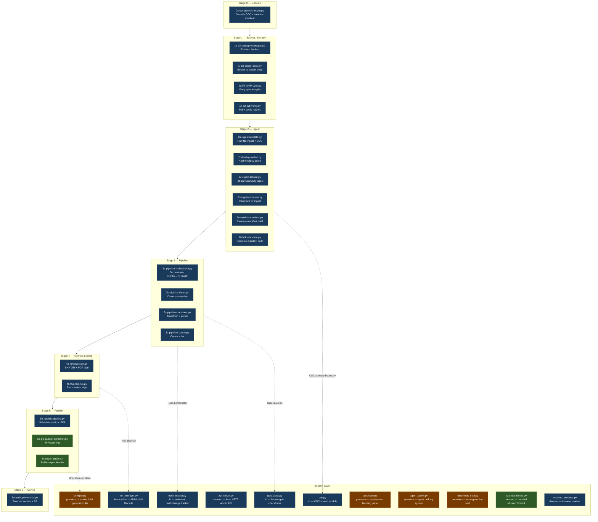

# DAE Scripts Architecture

## 0. Why This Exists — The Problem

Before the work documented here, the DAE pipeline had a structural flaw that grew worse with scale: all coordination state lived in the orchestrating agent's context window. When a session ended, an agent crashed, or context hit limits, recovery required a human to reconstruct "where were we?" through back-and-forth prompts. The orchestrator was not a coordinator — it was a single point of failure holding the entire pipeline state in volatile memory. A 140-script repository with no classification, no tier documentation, and hardcoded investigation references in public-facing code compounded the problem: a contributor couldn't know what to touch, what to trust, or what was free to modify.

Four specific gaps drove this:

**No machine-readable I/O contracts between pipeline stages.** Stages 2a → 3a → 4a had no standard way to communicate completion, partial state, or failure to each other. The only way stage 3a knew stage 2f was done was if the human or parent agent explicitly said so. Nothing in the environment said "2f completed, 1420 rows, next: 3a." Every handoff was a verbal relay through a person.

**Recovery required parent relay.** An agent crash or session restart triggered: human notices → human reconstructs context → human re-prompts with explanation of what happened. Every recovery path went through the human, even for purely mechanical "resume from where you left off" operations. The system had no self-healing capability. The human was not the last resort — they were the only resort.

**140 unclassified scripts with no tier boundaries.** No documentation of what each script did, what broke without it, or what was investigation-specific versus reusable framework. Premium IP — AI synthesis, adversarial cross-source correlation, censorship-resilient multi-protocol publishing — was mixed with basic pipeline utilities. Investigation-specific scripts with hardcoded paths ("criticalexposure", "packetware-spreadsheets", specific researcher's home directory) sat alongside the framework code. There was no clean extraction path for open-sourcing without exposing case data or paid features.

**Agents read prompts, not environment.** An agent received its context from the parent prompt. If the parent forgot to mention something, the agent missed it. There was no standard way for an agent to read "what did the previous stage produce?" without being told explicitly. This made every agent invocation dependent on perfect prompt construction.

The three additions documented below — the trail protocol, the scripts audit, and the modularization pattern — solve multiple gaps each:

- **`trail_reader.py` + `manifest_schema.py` + `stage_wrapper.py`** eliminates the orchestrator bottleneck (stages self-report), creates machine-readable I/O contracts (each stage writes a manifest declaring its outputs, row counts, and recommended next stage), and makes self-healing recovery possible (an agent reads the trail on startup without asking anyone). It also solves the "agents read prompts" problem: the trail IS the environment state.

- **`scripts-audit.md`** closes the 140-script classification gap (49 archived, 22 premium identified, 8 merge opportunities mapped) and establishes the free/paid boundary that was nowhere enforced. It also surfaces the investigation-specific contamination in 11 blueprint scripts that needed removal before any open-source extraction could happen.

- **`modules/` interface pattern** provides the extraction path the free/paid boundary requires — premium scripts plug in without modifying core pipeline code, and can be stripped for OSS release by deleting one directory. It solves the classification gap without introducing new coupling between core and premium layers.

### What this does NOT do

This documentation does not solve the problem of agents needing to understand *why* a stage failed — it tells them *that* it failed and *where* to resume, but diagnosis still requires reading the error and the preceding stage's outputs. It does not automate the human gates (`gate_pass.py`) — those are intentional checkpoints where human judgment is required. It does not merge the 8 modularization opportunities identified in the audit — those require code changes and are future work. And it does not remove the 49 Tier 3 scripts — it classifies them. The archive pass is a separate operation requiring human confirmation per the deletion safety rule.

---

## 1. What DAE Is

The Data Analysis Engine is a forensic investigation pipeline for independent researchers who need court-defensible analysis without institutional infrastructure. Its central design constraint is chain of custody first: every transformation of raw data is logged, hashed, and signed before any analysis runs. The pipeline doesn't just process data — it enforces the scientific method structurally, making p-hacking, cherry-picking, and broken provenance architecturally impossible rather than a matter of individual discipline.

The engine solves a specific gap: the tools for data cleaning, statistical analysis, and visualization already exist separately. What doesn't exist is their integration with forensic provenance as a structural byproduct of operation, not a separate manual effort. A researcher shouldn't have to decide to keep good records — the pipeline keeps them automatically. Every file that enters the system gets a SHA-256 hash at ingest. Every transformation is logged to an append-only chain-of-custody ledger. Every finding is traceable back to its raw source file by anyone, anywhere, from a published genesis manifest.

The vault integration layer connects the pipeline to an Obsidian-based human workspace. Agents write structured brief atoms to vault directories; the researcher reads summaries, promotes findings, and annotates without ever touching agent output files directly. Two worlds — machine rigor and human judgment — stay cleanly separated with defined handoff points (gate_pass.py) where human review is required before the pipeline advances.

DAE is designed to run entirely on-premises. Sensitive data never leaves the researcher's machine. IPFS and Bitcoin timestamping provide censorship-resistant publication after the researcher chooses to publish — but the analysis pipeline itself has no cloud dependency. This matters for the communities DAE serves: anti-trafficking NGOs, legal aid organizations, human rights documentarians, and investigative journalists at under-resourced newsrooms cannot send case data to cloud platforms.

---

## 2. Pipeline Flow



**Color key:** Core free (dark blue) · Advanced free (dark green) · Premium (brown) · Vault layer (purple) · Daemon (dark grey)

---

## 3. Script Reference — Numbered Pipeline

| Stage | Script | Tier | Purpose | What breaks without it |
|-------|--------|------|---------|------------------------|
| 0 | `0a-coc-genesis-ledger.py` | Core free | Creates genesis COC ledger and baseline manifest for the investigation. Fires once. | No genesis baseline — run_manager has no anchor hash; reproducibility broken. |
| 1 | `1a-b2-backup-robocopy.ps1` | Core free | Robocopy-based Windows → B2 backup of rawdata. | No offsite backup of originals. |
| 1 | `1b-b2-pull-rclone.sh` | Core free | Restore rawdata from B2 via rclone. | Cannot restore from backup. |
| 1 | `1c-check-b2.ps1` | Core free | Quick B2 connection + bucket health check. | Blind to backup failures. |
| 1 | `1d-b2backup.ps1` | Core free | Alternate B2 backup path (PowerShell). | Redundancy lost. |
| 1 | `1e-upload-frames-b2.ps1` | Core free | Upload extracted video frames to B2. | Video evidence not offsite. |
| 1 | `1f-b2-bucket-copy.py` | Core free | Python bucket-to-bucket copy (migration). | Cross-bucket moves require manual work. |
| 1 | `1g-b2-verify-sync.py` | Core free | Verify B2 sync integrity against local hashes. | Cannot confirm offsite copy matches local. |
| 1 | `1h-b2-pull-verify.py` | Core free | Pull from B2 and verify hashes on receipt. | Corrupt restores go undetected. |
| 2 | `2a-ingest-rawdata.py` | Core free | Primary ingest entry point — hashes raw files, writes COC entry, stages to pipeline. | Nothing ingested; pipeline has no input. |
| 2 | `2b-hash-guardian.py` | Core free | Re-verifies hashes of ingested files; alerts on any change. | Silent file corruption; COC integrity lost. |
| 2 | `2c-ingest-tabular.py` | Core free | Ingest structured CSV/XLS/XLSX with schema detection. | Tabular data not available to pipeline. |
| 2 | `2d-ingest-recursive.py` | Core free | Walk nested directories, ingest everything found. | Deep directory structures skipped. |
| 2 | `2e-rawdata-manifest.py` | Core free | Build SHA-256 manifest of all rawdata/ contents. | No rawdata baseline for reproducibility. |
| 2 | `2f-build-manifest.py` | Core free | Build evidence_manifest.json — the master index. | Evidence browser, tiers, and exports all break. |
| 3 | `3a-pipeline-orchestrator.py` | Core free | Sequences CLEAN → TRANSFORM → CURATE, logs each phase, handles failures. | Phases must be run manually in correct order. |
| 3 | `3b-pipeline-clean.py` | Core free | Dedup, normalize encodings, standardize column names, remove malformed rows. | Dirty data flows to analysis; false findings possible. |
| 3 | `3c-pipeline-transform.py` | Core free | Type coercion, geospatial normalization, cross-reference joins, derived columns. | Datasets not joined; relationships invisible. |
| 3 | `3d-pipeline-curate.py` | Core free | Evidence tiering (Tier 1–4), relevance scoring, tag application. | No evidence tiers; everything is undifferentiated. |
| 4 | `4a-forensic-sign.py` | Core free | SHA-256 + PGP sign all pipeline outputs; writes forensic log entries. | Outputs unsigned; cannot prove post-analysis tampering. |
| 4 | `4b-forensic-run.py` | Core free | Signs the run manifest; closes the forensic chain for the run. | Run record unsigned; chain broken. |
| 5 | `5a-publish-pipeline.py` | Core free | Assembles static site, writes evidence_manifest.json, preps for deploy. | Nothing gets published; all analysis stays local. |
| 5 | `5b-ipfs-publish-sprint004.py` | Advanced free | Pins site to IPFS via Pinata; records CID in cid_history.log. | No censorship-resistant copy. |
| 5 | `5c-export-public.sh` | Advanced free | Exports redacted public bundle (no sensitive paths). | Public export must be done manually. |
| 6 | `6a-backup-forensics.py` | Core free | Archives .claude/forensics/ to B2 at run close. | Forensic logs not backed up offsite. |

---

## 4. Unnumbered Scripts — Where They Belong

These scripts exist and work but sit outside the stage naming convention. The proposed rename or layer placement makes their role explicit and enables the modularization pattern in Section 6.

| Script | Proposed rename / layer | Stage / Layer | Reason |
|--------|-------------------------|---------------|--------|
| `hash_tracker.py` | `lib/hash_tracker.py` | lib | Universal utility called from any stage; no stage ownership |
| `coc.py` | `lib/coc.py` | lib | Shared COC module; imported by 2a, 4a, 4b, 6a |
| `forensics_paths.py` | `lib/forensics_paths.py` | lib | Path resolution helper; no stage |
| `forensics_fsl.py` | `lib/forensics_fsl.py` | lib | FSL-format forensic log writer; shared |
| `gate_pass.py` | `lib/gate_pass.py` | lib | Human gate check between phases; no stage, always available |
| `run_manager.py` | `daemons/run_manager.py` | daemon | Long-lived RUN-NNN lifecycle tracker; session-spanning |
| `api_server.py` | `daemons/api_server.py` | daemon | Local HTTP admin API; always-on during investigation |
| `session_heartbeat.py` | `daemons/session_heartbeat.py` | daemon | Liveness monitor; runs alongside pipeline |
| `dae_dashboard.py` | `daemons/dae_dashboard.py` | daemon | Terminal Mission Control; always-on view |
| `dae_dashboard_launcher.py` | `daemons/dae_dashboard_launcher.py` | daemon | Launcher wrapper for dashboard |
| `dae_ingest_pulse.py` | `daemons/dae_ingest_pulse.py` | daemon | "Big picture" operator pulse; session-start view |
| `pipeline_session_log.py` | `lib/pipeline_session_log.py` | lib | Append/tail/resume for pipeline session events |
| `briefgen.py` | `premium/briefgen.py` | premium | AI-generated brief atoms; requires LLM |
| `autolearn.py` | `premium/autolearn.py` | premium | Session-end AI learning pulse |
| `agent_scorer.py` | `premium/agent_scorer.py` | premium | AI agent ranking; reads ~/.claude/agents/ |
| `agent_card_snapshot.py` | `premium/agent_card_snapshot.py` | premium | Agent card versioning (training workflow) |
| `agent_learning_log.py` | `premium/agent_learning_log.py` | premium | Structured learning event log |
| `hypothesis_seal.py` | `premium/hypothesis_seal.py` | premium | Pre-registers hypotheses before analysis; hash-seals |
| `baseline_reproducibility.py` | `lib/baseline_reproducibility.py` | lib | Reproducibility baseline generation; can run free |
| `generate_genesis.py` | `lib/generate_genesis.py` | lib | Genesis manifest generation; called by 0a |
| `ensure_genesis_baseline.py` | `lib/ensure_genesis_baseline.py` | lib | Auto-validation at session start |
| `run_planner.py` | `lib/run_planner.py` | lib | Run planning / phase sequencing |
| `health_check.py` | `lib/health_check.py` | lib | Environment sanity check |
| `enforce_budget.py` | `lib/enforce_budget.py` | lib | Token/context budget enforcement |
| `vault_agent_evolution_sync.py` | `5d-vault-agent-sync.py` | Stage 5 | Vault sync of agent evolution data; fires near publish |
| `vault_annotation_sync.py` | `5e-vault-annotation-sync.py` | Stage 5 | Syncs annotations to vault at session end |
| `vault_narrative_sync.py` | `5f-vault-narrative-sync.py` | Stage 5 | Syncs narrative docs to vault |
| `vault_nectar_atomize.py` | `lib/vault_nectar_atomize.py` | lib | NECTAR → vault atom promotion |
| `vault_siphon_handoff.py` | `lib/vault_siphon_handoff.py` | lib | REVIEW-INBOX siphon to vault at handoff |
| `narrative_auto_update.py` | `lib/narrative_auto_update.py` | lib | Session-stop narrative update; session-scoped |
| `detect_improvements.py` | `premium/detect_improvements.py` | premium | AI-driven improvement detection in run outputs |
| `causality_analysis.py` | `premium/causality_analysis.py` | premium | Causal inference over pipeline outputs |
| `evidence_audit.py` | `lib/evidence_audit.py` | lib | Evidence manifest audit; any stage |
| `backfill_run_ids.py` | `lib/backfill_run_ids.py` | lib | One-time migration utility |
| `canonicalize_paths.py` | `lib/canonicalize_paths.py` | lib | Path normalization utility |
| `lint_agent_cards.py` | `lib/lint_agent_cards.py` | lib | Validate agent card format |
| `brief_miner.py` | `premium/brief_miner.py` | premium | AI brief mining across session outputs |
| `normalize_csv.py` | `3e-normalize-csv.py` | Stage 3 | Generic CSV normalization; belongs in pipeline |
| `enrich_timeline.py` | `3f-enrich-timeline.py` | Stage 3 | Timeline enrichment; fits transform/curate boundary |
| `cross_reference_shodan.py` | `3g-cross-reference-shodan.py` | Stage 3 | Shodan cross-reference; transform-stage enrichment |
| `consolidate_normalized.py` | `3h-consolidate-normalized.py` | Stage 3 | Consolidate normalized outputs; post-curate |

---

## 5. Free vs Paid Design

**The free tier is a complete forensic pipeline.** A researcher can ingest raw data, run the full clean → transform → curate sequence, forensically sign every output, publish to a static site with IPFS mirroring, and back up the entire forensic archive — all without any premium features. The chain of custody is intact, the evidence is reproducible, and the outputs are court-defensible. Nothing essential is withheld.

**Premium adds intelligence.** Where the free tier executes deterministic transformations, premium features apply AI reasoning: synthesizing findings into narratives, learning from run outcomes, ranking analysis approaches, and sealing hypotheses before analysis begins. These features improve throughput and analytical quality but are not required for forensic integrity.

### Free tier includes
- All numbered pipeline scripts (`0a` through `6a`)
- `lib/`: hash_tracker, coc, forensics_paths, forensics_fsl, gate_pass, pipeline_session_log, baseline_reproducibility, generate_genesis, ensure_genesis_baseline, run_planner, health_check, enforce_budget, evidence_audit, canonicalize_paths
- `daemons/`: run_manager, api_server, session_heartbeat, dae_dashboard, dae_dashboard_launcher, dae_ingest_pulse
- `lib/` vault sync: vault_nectar_atomize, vault_siphon_handoff, narrative_auto_update
- Stage 5 vault syncs: vault_agent_evolution_sync, vault_annotation_sync, vault_narrative_sync

### Premium adds

| Script | What it adds |
|--------|-------------|
| `briefgen.py` | AI-generated structured brief atoms at run close; Obsidian-ready with frontmatter |
| `autolearn.py` | Session-end learning pulse; reads run benchmarks, appends agent learning events |
| `agent_scorer.py` | Agent card ranking for team selection; routes tasks to best-fit agents |
| `agent_card_snapshot.py` | Versioned agent card snapshots before training updates |
| `agent_learning_log.py` | Structured learning event log linked to run IDs |
| `hypothesis_seal.py` | Pre-registers and hash-seals hypotheses before analysis; prevents post-hoc HARKing |
| `detect_improvements.py` | AI scan of run outputs for improvement opportunities |
| `causality_analysis.py` | Causal inference layer over pipeline outputs |
| `brief_miner.py` | AI mining of session outputs for brief promotion candidates |

---

## 6. Modularization Pattern

Premium modules plug in without modifying core pipeline code. The pattern: a `modules/` directory at repo root, a config flag per module, and a standard three-method interface. The pipeline checks for registered modules at stage boundaries and calls them if enabled.

### Directory structure
```
data-analysis-engine/
  modules/
    briefgen/
      __init__.py       ← exposes register(), run(), teardown()
      briefgen.py       ← moved from scripts/
    autolearn/
      __init__.py
      autolearn.py
    hypothesis_seal/
      __init__.py
      hypothesis_seal.py
```

### Standard module interface

```python
# Every premium module must implement this interface

def register(config: dict) -> dict:
    """
    Called at pipeline start. Validate config, check deps, return capabilities.
    Return: {"name": str, "version": str, "hooks": ["stage3_post", "stage6_pre"], "ready": bool}
    """
    ...

def run(hook: str, context: dict) -> dict:
    """
    Called by pipeline at registered hook point.
    hook: e.g. "stage3_post", "stage6_pre", "pipeline_close"
    context: {"run_id": str, "phase": str, "outputs": [...], "vault_root": str, ...}
    Return: {"status": "ok"|"skip"|"error", "artifacts": [...], "log": str}
    """
    ...

def teardown(context: dict) -> None:
    """Called at pipeline close or on error. Write final artifacts, flush logs."""
    ...
```

### Config flag in project_config.json
```json
{
  "modules": {
    "briefgen": {"enabled": true, "vault_root": "/path/to/vault"},
    "autolearn": {"enabled": true},
    "hypothesis_seal": {"enabled": false}
  }
}
```

### Hook point example (in 3a-pipeline-orchestrator.py or 6a)
```python
from modules import load_enabled_modules

modules = load_enabled_modules(config)
for mod in modules:
    if "stage3_post" in mod.capabilities["hooks"]:
        result = mod.run("stage3_post", context)
        log_module_result(result)
```

This pattern means premium modules can be stripped before open-sourcing — delete the `modules/` directory, remove the loader call. The core pipeline is unchanged.

---

## 7. Removal Impact Map

| Remove | Impact | Workaround |
|--------|--------|------------|
| `0a-coc-genesis-ledger.py` | No genesis baseline; reproducibility broken; run_manager has no anchor | Run manually: `python3 scripts/generate_genesis.py` before any ingest |
| `2a-ingest-rawdata.py` | Nothing enters the pipeline | Manual copy to `rawdata/` + manual COC entry |
| `2b-hash-guardian.py` | Silent file corruption undetected; hashes not re-verified post-ingest | Re-run `hash_tracker.py snapshot` manually at each stage |
| `3a-pipeline-orchestrator.py` | Phases must be run individually in correct order | Run 3b → 3c → 3d manually and in sequence |
| `4a-forensic-sign.py` | Pipeline outputs unsigned; chain of custody breaks at signing stage | Use `hash_tracker.py` + manual PGP signing |
| `4b-forensic-run.py` | Run manifest unsigned; no closed forensic chain per run | Acceptable for non-publishing work; sign manually before publish |
| `gate_pass.py` | No human gate enforcement; pipeline advances without review | Human checks quality manually at phase transitions |
| `run_manager.py` | No RUN-NNN manifests; sessions not linked to code + data versions | Track runs manually in a log file |
| `api_server.py` | No local admin API; evidence browser and admin.html non-functional | Use CLI tools directly; lose web admin interface |
| `hash_tracker.py` | No universal change tracking; manual SHA-256 only | Use `sha256sum` directly; lose structured tracking |
| `coc.py` | COC module missing; all scripts that import it fail | Inline COC logic in each script; high maintenance |
| `briefgen.py` (premium) | No AI brief atoms; vault not populated automatically | Write session summaries manually to vault |
| `hypothesis_seal.py` (premium) | No pre-registration; statistical rigor reduced (HARKing risk) | Pre-register manually in a dated, hash-tracked document |
| `autolearn.py` (premium) | No session-end learning pulse; agent cards don't improve | Update agent cards manually after strong runs |
| `5a-publish-pipeline.py` | No automated publish; static site must be assembled manually | Manual `rsync` of outputs to docs/ or dist/ |
| `6a-backup-forensics.py` | Forensic archive not backed up offsite at run close | Manually run B2 backup of `.claude/forensics/` |
| `dae_dashboard.py` | No terminal Mission Control; status must be queried per-script | Use `run_manager.py status` + `pipeline_session_log tail` |

---

*Written 2026-03-29. Source: `data-analysis-engine/scripts/` directory audit, README.md, ARCHITECTURE.md, CLAUDE.md, .claude/LAUNCH.md.*
