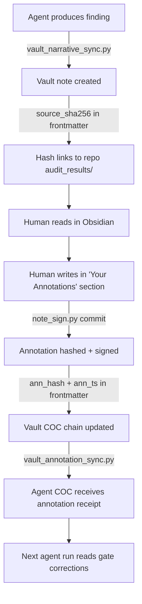

# How Annotation COC Works

> The round-trip: agent produces findings → vault displays them → human annotates →
> annotation is hashed and signed → hash feeds back to agent COC → next agent run
> knows "human reviewed this, here's what they said."

---

## The Problem

Agents produce findings. Humans review and annotate them in Obsidian. But without
a cryptographic link, there's no proof that:

1. The human actually reviewed a specific agent output (not a modified version)
2. The annotation was written at a specific time (not backdated)
3. The annotation hasn't been modified since it was committed
4. The agent's next run can verify what the human said

## The Solution: Three-Layer COC



### Layer 1: Agent → Vault (already working)

`vault_narrative_sync.py` (session stop hook) syncs agent findings to vault:
- Writes to `00-SHARED/Agent-Outbox/`
- Frontmatter includes: `source_sha256`, `agent_author`, `agent_hash`, `pipeline_run`
- The vault note is a **receipt** — it links to the forensic store via hashes

### Layer 2: Human Annotation → Hash (needs Shell Commands or QuickAdd)

When you finish annotating a note:

**Option A: Shell Commands plugin (recommended)**
1. Install: `obsidian-shellcommands` from Community Plugins
2. Configure a command:
   ```
   Name: Sign Annotation
   Shell: PowerShell or bash
   Command: python3 "D:\0LOCAL\gitrepos\data-analysis-engine\note_sign.py" commit "{{file_path:absolute}}"
   Hotkey: Ctrl+Alt+C
   ```
3. After annotating, press Ctrl+Alt+C — `note_sign.py` runs:
   - Reads `## Your Annotations` section
   - SHA-256 hashes the content
   - Writes `ann_hash` and `ann_ts` to frontmatter
   - Appends to vault chain: `00-SHARED/Agent-Context/.hashes/chain-state.json`
   - Optionally: Semaphore-lite signing (pseudonymous) or Ed25519 (named)

**Option B: QuickAdd macro (already installed)**
1. Create a QuickAdd Macro called "Sign Note"
2. Add a "User Script" step pointing to a wrapper:
   ```javascript
   // QuickAdd user script: sign-note.js
   module.exports = async (params) => {
     const { exec } = require('child_process');
     const filePath = params.app.workspace.getActiveFile().path;
     const vaultPath = params.app.vault.adapter.basePath;
     const fullPath = `${vaultPath}/${filePath}`;
     exec(`python3 "D:\\0LOCAL\\gitrepos\\data-analysis-engine\\note_sign.py" commit "${fullPath}"`);
     new Notice("Annotation signed!");
   };
   ```
3. Bind to hotkey or command palette

**Option C: Manual (always works)**
```powershell
python3 D:\0LOCAL\gitrepos\data-analysis-engine\note_sign.py commit "D:\0LOCAL\0-ObsidianTransferring\CyberOps-UNIFIED\30-Evidence\FIND-*.md"
```

### Layer 3: Annotation → Agent COC (the return path)

`vault_annotation_sync.py` (new script, runs at session start or as pre-session hook):
1. Scans vault for notes where `ann_hash` is set but hasn't been synced
2. For each annotated note:
   - Reads the annotation content
   - Creates a receipt in the agent forensic log:
     ```json
     {
       "type": "human_annotation",
       "note_path": "30-Evidence/FIND-SG1-Jan14-Inflection.md",
       "ann_hash": "sha256:abc...",
       "ann_ts": "2026-03-25T...",
       "source_sha256": "sha256:def...",
       "annotation_summary": "First 200 chars of annotation...",
       "gate": "GATE_2",
       "correction_type": "factual_correction | endorsement | challenge"
     }
     ```
   - Marks the note as synced (adds `ann_synced: true` to frontmatter)
3. Gate corrections in `scripts/audit_results/gates/` are generated from annotations

---

## Verification Flow

At any point, verify the chain:

```bash
# Verify a single note
python3 note_sign.py verify "D:\...\30-Evidence\FIND-SG1.md"

# Verify entire chain
python3 note_sign.py chain --verify --chain-id criticalexposure

# Check annotation sync status
python3 scripts/vault_annotation_sync.py --status
```

Output:
```
FIND-SG1-Jan14-Inflection.md
  agent_hash: sha256:abc123  ✓ matches repo source
  ann_hash:   sha256:def456  ✓ annotation intact
  ann_ts:     2026-03-25T14:00:00Z
  chain_link: sha256:789...  ✓ chain valid
  synced:     true
```

---

## For Court

The COC proves:

1. **Agent produced X at time T1** — `agent_hash` + `source_sha256` link to git commit
2. **Human received X intact** — vault note `source_sha256` matches repo file
3. **Human wrote Y at time T2 > T1** — `ann_ts` in frontmatter, signed
4. **Human's annotation is unmodified** — `ann_hash` verifiable
5. **The chain is unbroken** — `chain_link` connects each annotation to the previous one
6. **The signer is a registered participant** — `zk_commitment` in `participants.yaml`

No annotation coaching: `gate_pass.py` validates that corrections contain facts, not conclusions.

---

## Setup Checklist

- [ ] Install Shell Commands plugin (`obsidian-shellcommands`)
- [ ] Configure sign command: `python3 note_sign.py commit "{{file_path:absolute}}"`
- [ ] Bind to Ctrl+Alt+C
- [ ] Run `note_sign.py identity create` (one-time)
- [ ] Run `note_sign.py identity register` (adds you to participants.yaml)
- [ ] Test: annotate a note, press Ctrl+Alt+C, check frontmatter for `ann_hash`

*← [[HOME]] . [[Pipeline-Gates]] . [[PIPELINE-DESIGN]]*
