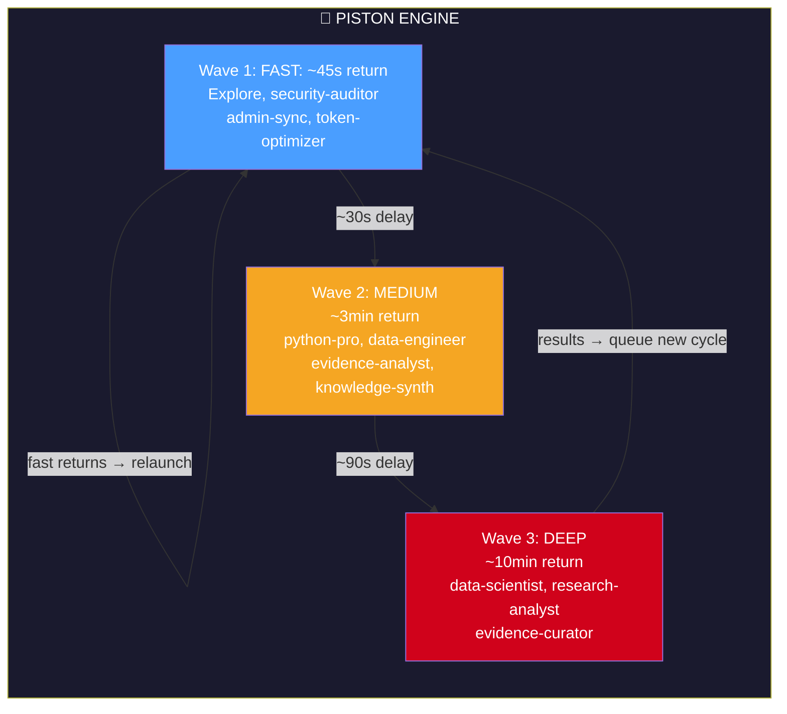
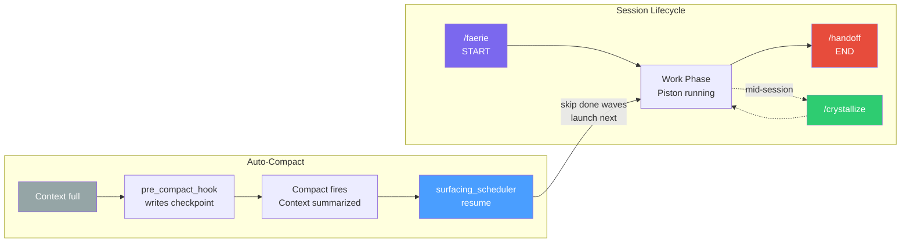
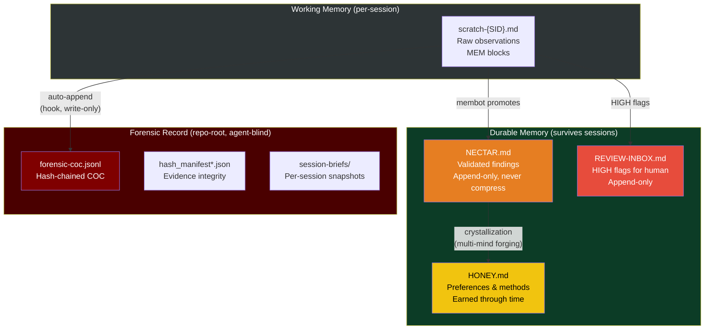
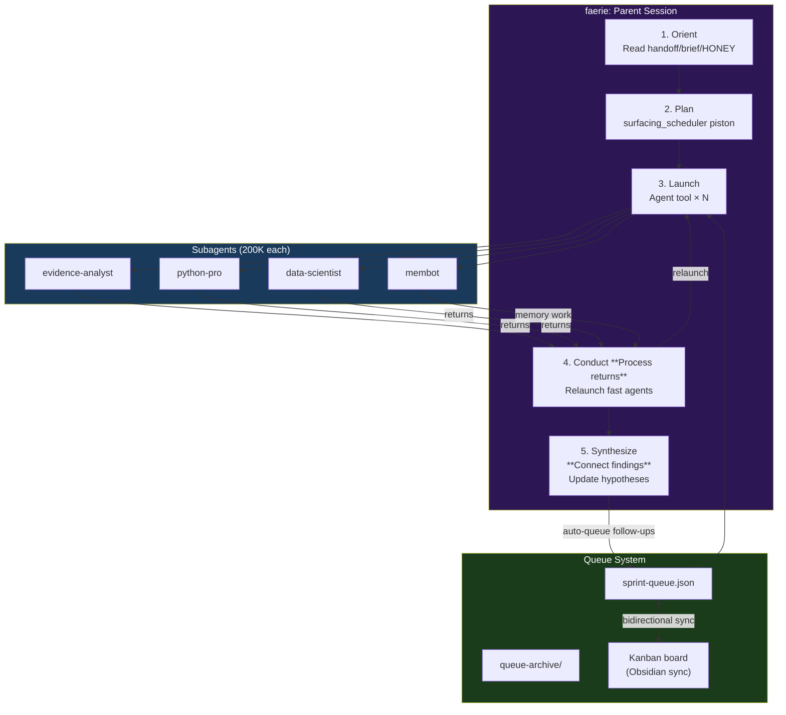
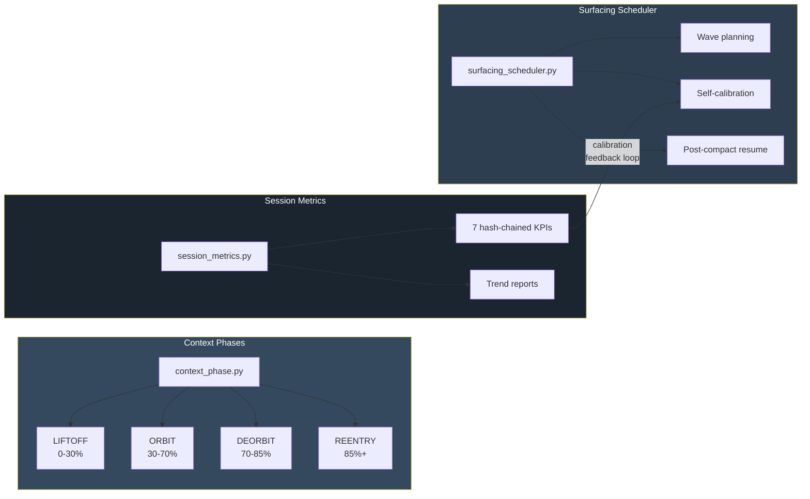
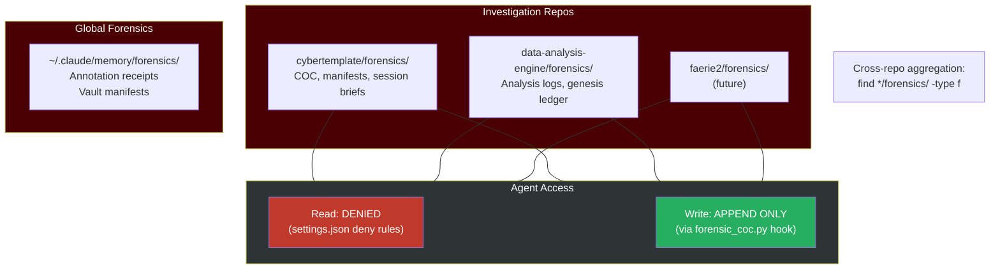
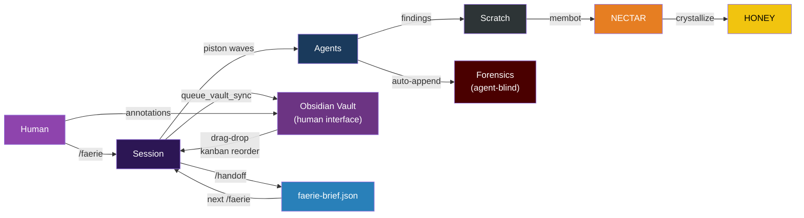
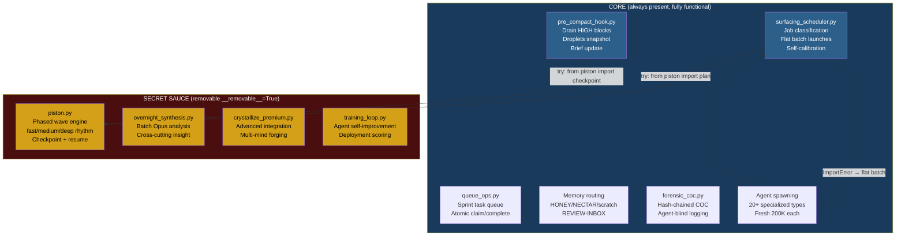
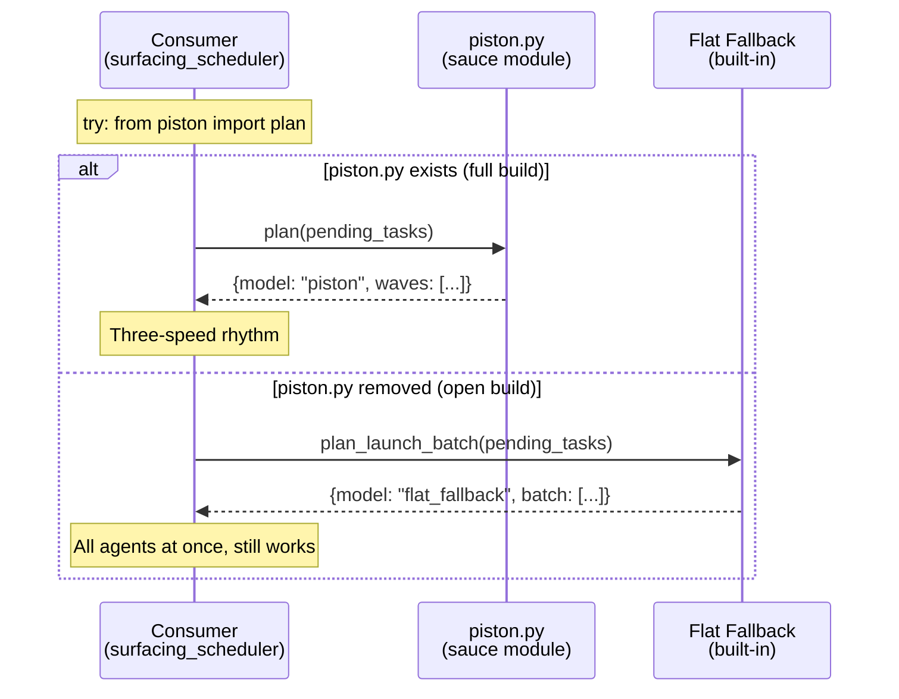
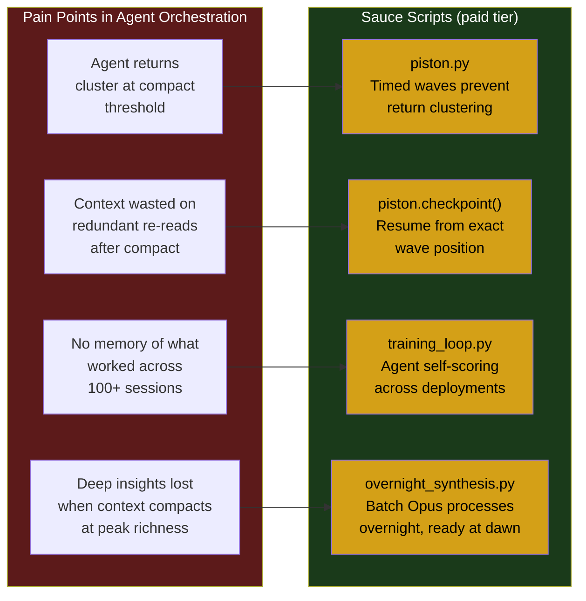

# Hive Frame — System Architecture

> **Start here:** [[SYSTEM-GUIDE]] for a full clickable learning guide.

## Related Docs

### Deep Dives (by diagram section)

| Diagram | Deep-dive doc | Pseudosystem component |
|---------|--------------|----------------------|
| Piston engine | [[PISTON-MODEL-DESIGN]] | [[session-lifecycle]] |
| Session lifecycle | [[faerie-start]] / [[handoff-end]] | [[emergency-handoff]] |
| Memory architecture | [[13-MEMORY-FLOW-ARCHITECTURE]] | [[memory-layer]] / [[honey-seed]] / [[nectar-narrative]] |
| faerie's role | [[11-FAERIE-IMPACT-AB]] | [[faerie-start]] / [[subagent-spawning]] |
| Three independent systems | [[system-state-files-guide]] | [[state-engine]] / [[context-budget]] |
| Forensics isolation | [[HOW-ANNOTATION-COC-WORKS]] | [[forensic-layer]] / [[coc-hash-chain]] |
| Data flow | [[PIPELINE-DESIGN]] | [[agent-outbox]] / [[vault-layer]] |
| Modular sauce | [[15-MODULAR-SECRET-SAUCE]] | — |

### Related Design Narratives

```dataview
LIST
FROM "00-SHARED/Hive"
WHERE (type = "system-design" OR type = "design-narrative" OR type = "narrative")
  AND file.name != this.file.name
SORT default(updated, created) DESC
LIMIT 10
```

### Component Notes Referenced

```dataview
TABLE WITHOUT ID
  link(file.link, file.name) AS "Component",
  component_type AS "Type"
FROM "00-SHARED/Hive/pseudosystem"
WHERE contains(["session-lifecycle", "memory-layer", "honey-seed", "nectar-narrative", "forensic-layer", "coc-hash-chain", "faerie-start", "handoff-end", "agent-layer", "subagent-spawning", "state-engine", "context-budget", "equilibrium", "crystallization", "sprint-queue", "vault-layer", "agent-outbox"], file.name)
SORT component_type ASC, file.name ASC
```

---

## The Piston: Session Engine



## Session Lifecycle



## Memory Architecture: Separate Systems



## faerie's Role: Orchestrator, Not Worker



## Three Independent Systems



## Forensics Isolation Architecture



## Data Flow: End to End



## Modular Secret Sauce: Paid Feature Architecture

The system supports two build modes: **full** (all features) and **open** (sauce modules removed).
Proprietary modules enhance specific pain points. Remove them and the core still works — just simpler.



### How It Works



### Pain Points Each Sauce Module Addresses



### Removal Protocol

```bash
# Find all sauce modules
grep -rl '__removable__' ~/.claude/scripts/

# Remove before interview
rm ~/.claude/scripts/piston.py
rm ~/.claude/scripts/overnight_synthesis.py
rm ~/.claude/scripts/crystallize_premium.py
rm ~/.claude/scripts/training_loop.py

# Verify: everything still works
python3 ~/.claude/scripts/surfacing_scheduler.py plan   # flat_fallback model
python3 ~/.claude/scripts/surfacing_scheduler.py resume  # "no_piston_module" status
echo '{}' | python3 ~/.claude/hooks/pre_compact_hook.py  # steps 1-4 work, step 5 skipped
```

## Key Separations

| System | What it is | What it is NOT |
|---|---|---|
| **faerie** | Session orchestrator (read → launch → conduct) | Not a worker — never does task work inline |
| **HONEY** | Sacred preferences/methods earned through time | Not a scratchpad — entries are crystallized, not appended |
| **NECTAR** | Append-only validated findings | Not compressible — forensic truth record |
| **Forensics** | Agent-blind COC at repo root | Not in .claude/ — agents can't read it |
| **Vault** | Human-readable interface / message bus | Not canonical storage — repos are canonical |
| **Queue** | Sprint task list with COC on transitions | Not ephemeral — completed tasks are evidence |
| **Piston** | Three-speed agent wave rhythm (sauce) | Not a scheduler — it's a rhythm (fast/medium/deep/cycle) |
| **Crystallization** | Multi-mind knowledge forging (agents + human + time) | Not compression — integration makes text richer, not shorter |
| **Sauce modules** | `__removable__` scripts enhancing pain points | Not load-bearing — core works without them |


## Blueprint Registry

Agent output types have canonical schema definitions in `Hive/blueprints/`.
Each blueprint specifies required frontmatter, section structure, validation rules,
and links to an example output. Reference via `blueprint: blueprint_{type}` in frontmatter.

### Active Blueprints

| Blueprint | Type | Output Dir | Example |
|-----------|------|------------|---------|
| [[blueprints/blueprint_finding\|blueprint_finding]] | finding | Agent-Outbox/findings/ | (see blueprint) |
| [[blueprints/blueprint_analysis\|blueprint_analysis]] | analysis | Agent-Outbox/analysis/ | (see blueprint) |
| [[blueprints/blueprint_evidence\|blueprint_evidence]] | evidence | Agent-Outbox/evidence/ | (see blueprint) |
| [[blueprints/blueprint_report\|blueprint_report]] | report | Agent-Outbox/reports/ | (see blueprint) |
| [[blueprints/blueprint_brief\|blueprint_brief]] | brief | Session-Briefs/ | (see blueprint) |
| [[blueprints/blueprint_agent_evolution\|blueprint_agent_evolution]] | agent-evolution | Agent-Outbox/agent-evolution/ | [[Agent-Outbox/agent-evolution/example-agent-evolution\|example]] |
| [[blueprints/blueprint_droplet\|blueprint_droplet]] | droplet | Dashboards/Droplets/ | [[Agent-Outbox/droplets/example-droplet-LIVE\|example]] |
| [[blueprints/blueprint_dashboard\|blueprint_dashboard]] | dashboard | Dashboards/ | [[Agent-Outbox/dashboards/example-dashboard\|example]] |
| [[blueprints/blueprint_session_manifest\|blueprint_session_manifest]] | session-manifest | Dashboards/session-briefs/ | [[Dashboards/session-briefs/example-session-manifest\|example]] |
| [[blueprints/blueprint_design_insight\|blueprint_design_insight]] | design-narrative | Hive/ | [[18-blueprint-system-design\|18 — Blueprint System]] |

### How to Use a Blueprint

When writing an agent output file, set `blueprint: blueprint_{type}` in frontmatter.
Read the blueprint file to get required fields and sections. The blueprint is the
single source of truth for that output type — not VAULT-SCHEMA.md (which remains the
canonical universal spec but is too large to consult at write time).

For spawn prompts, include:
```
Blueprint for this output type: 00-SHARED/Hive/blueprints/blueprint_{type}.md
Read it before writing your output file.
```

See [[18-blueprint-system-design]] for the ADR explaining why this system was created.
