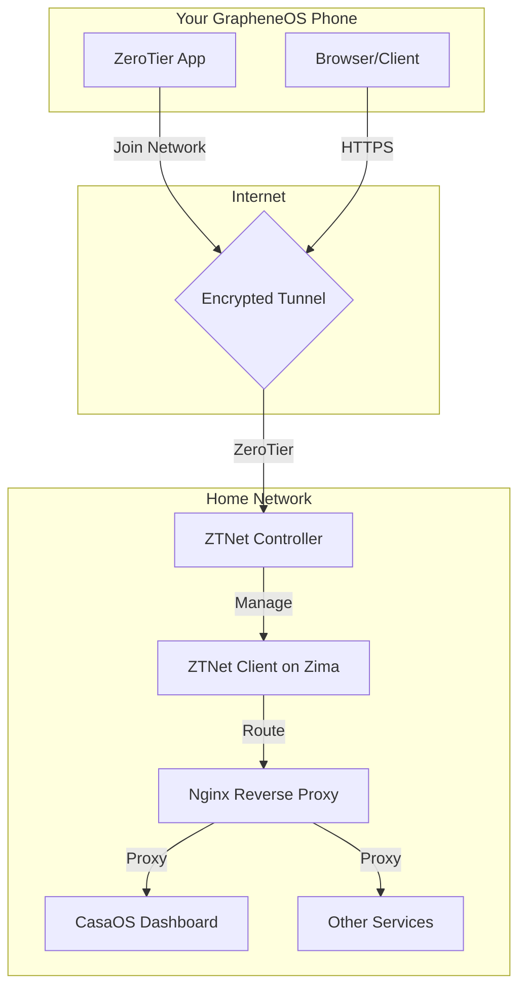
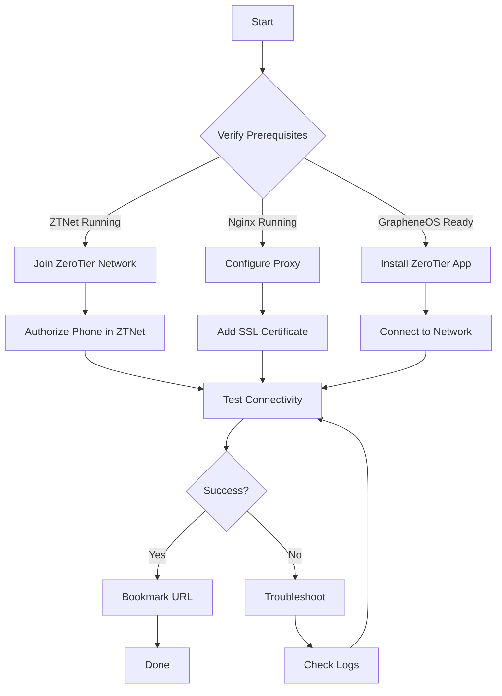

Thought about this #lumo #zimaboard 

Updated Remote Access Guide: ZimaBoard2 + CasaOS + ZTNet + Nginx
Here's the complete guide tailored to your existing setup with ZTNet and Nginx reverse proxy, optimized for GrapheneOS Android access.

## 📋 Updated Architecture Overview




## 🔧 Part 1: ZTNet Configuration (ZeroTier Private Mesh)
Current Status Check
### On ZimaBoard, verify ZTNet is running
sudo docker ps | grep ztnet
sudo systemctl status zerotier-one
Step 1: Join Your ZTNet Network
Via ZTNet Web UI:

1. Access ZTNet: http://zimaboard-ip:3000
2. Login with admin credentials
3. Navigate to Networks → Your Network ID
4. Click 'Members' tab
5. Find ZimaBoard's ZeroTier ID (check below)
6. Authorize the member
7. Note the assigned IP (e.g., 10.147.20.x)
Find ZimaBoard's ZeroTier ID:

### Get ZeroTier network info
sudo zerotier-cli info
sudo zerotier-cli listnetworks

#### Output example:
 NETWORK ID     STATUS       TYPE
abcdef123456   OK           PRIVATE
 Your ZeroTier ID: abcdef1234567890

## Step 2: Install ZeroTier Client on GrapheneOS
Important GrapheneOS Considerations:

GrapheneOS doesn't have Google Play Services by default
You'll need to sideload ZeroTier or use Aurora Store
Installation Options:

Method	Steps	Security
Aurora Store	1. Install Aurora Store
2. Search "ZeroTier"
3. Install anonymously	⭐⭐⭐⭐
APK Sideload	1. Download from https://zerotier.com
4. Enable unknown sources
5. Install APK	⭐⭐⭐
F-Droid	Not available (ZeroTier not open source)	N/A
ZeroTier App Setup:

6. Open ZeroTier Central app
7. Tap 'Join Network'
8. Enter your Network ID (from ZTNet)
9. Grant VPN permission
10. Wait for 'Authorized' status
11. Note your assigned IP
Step 3: Verify Connectivity
### From GrapheneOS phone (via Termux or similar)
ping 10.147.20.x  # Your ZimaBoard ZeroTier IP

### Or test from ZTNet web interface
#### Members tab → Check 'Latency' column

## 🌐 Part 2: Nginx Reverse Proxy Configuration
Current Nginx Setup Check
### Check if Nginx is running
sudo systemctl status nginx

### View current config
sudo cat /etc/nginx/nginx.conf
sudo ls /etc/nginx/sites-enabled/
Step 1: Create Nginx Site Config for CasaOS

```yaml
 /etc/nginx/sites-available/casaos
server {
    listen 80;
    listen [::]:80;
    
    # Replace with your ZeroTier-assigned domain or IP
    server_name zimaboard.local;
    
    # Security headers
    add_header X-Frame-Options "SAMEORIGIN" always;
    add_header X-Content-Type-Options "nosniff" always;
    add_header X-XSS-Protection "1; mode=block" always;
    
    # CasaOS dashboard
    location / {
        proxy_pass http://127.0.0.1:80;
        proxy_set_header Host $host;
        proxy_set_header X-Real-IP $remote_addr;
        proxy_set_header X-Forwarded-For $proxy_add_x_forwarded_for;
        proxy_set_header X-Forwarded-Proto $scheme;
        
        # WebSocket support for CasaOS
        proxy_http_version 1.1;
        proxy_set_header Upgrade $http_upgrade;
        proxy_set_header Connection "upgrade";
        
        # Timeouts
        proxy_connect_timeout 600;
        proxy_send_timeout 600;
        proxy_read_timeout 600;
    }
}
```

## Step 2: Enable the Site
### Create symlink
sudo ln -s /etc/nginx/sites-available/casaos /etc/nginx/sites-enabled/

### Remove default if exists
sudo rm /etc/nginx/sites-enabled/default

### Test configuration
sudo nginx -t

### Reload Nginx
sudo systemctl reload nginx
Step 3: Add SSL with Let's Encrypt (Optional but Recommended)
### Install Certbot
sudo apt update
sudo apt install certbot python3-certbot-nginx

#### Obtain certificate
sudo certbot --nginx -d zimaboard.local

#### Auto-renewal test
sudo certbot renew --dry-run
Note: For ZeroTier networks, you may need to use a self-signed certificate or a wildcard domain if Let's Encrypt validation fails on private IPs.

### Self-Signed Certificate Alternative:

#### Generate self-signed cert
sudo mkdir -p /etc/nginx/ssl
sudo openssl req -x509 -nodes -days 365 -newkey rsa:2048 \
  -keyout /etc/nginx/ssl/zimaboard.key \
  -out /etc/nginx/ssl/zimaboard.crt

### Update nginx config to use SSL
### Add to server block:

 ssl_certificate /etc/nginx/ssl/zimaboard.crt;
ssl_certificate_key /etc/nginx/ssl/zimaboard.key;

## 📱 Part 3: GrapheneOS Phone Access
Option A: Browser Access (Simplest)
flowchart LR
    A[GrapheneOS Browser] --> B{HTTPS}
    B --> C[ZeroTier Network]
    C --> D[ZTNet Tunnel]
    D --> E[Nginx Proxy]
    E --> F[CasaOS Dashboard]
Steps:

1. Ensure ZeroTier app is active and connected
2. Open browser (Chrome/Firefox/DuckDuckGo)
3. Navigate to: https://10.147.20.x (your ZTNet IP)
4. Accept certificate warning if self-signed
5. Bookmark for quick access
Option B: Termux + SSH (For Advanced Users)
Install Termux on GrapheneOS:

6. Download from F-Droid (not Play Store for GrapheneOS)
7. Grant storage permissions
8. Update packages
Termux Commands:

### Update packages
pkg update && pkg upgrade

### Install SSH client
pkg install openssh

### Connect to ZimaBoard
ssh root@10.147.20.x -p 2222

### Optional: SSH config for easy access
nano ~/.ssh/config


SSH Config Example:

```yaml
Host zimaboard
    HostName 10.147.20.x
    Port 2222
    User root
    IdentityFile ~/.ssh/id_ed25519
Option C: Dedicated Apps
Service	App	Link
CasaOS	Browser	Native
SSH	Termux	F-Droid
File Manager	Solid Explorer	Play Store
VNC	bVNC	F-Droid
🔒 Part 4: Security Hardening for GrapheneOS
ZeroTier Security Settings
mindmap
  root((ZeroTier Security))
    Network
      Private Mode
      Allow Default
      Capabilities
    Device
      Authorized Only
      IP Assignment
      DNS Settings
    Nginx
      Rate Limiting
      SSL/TLS
      Headers
    System
      Firewall
      Fail2Ban
      Updates
```
      
### Recommended ZTNet Settings:

1. Network Type: Private
2. Allow Default: OFF
3. Capabilities: Restrict by device
4. DNS: Custom (optional)
5. IP Assignment: Manual or Pool
Nginx Security Headers (Add to config)
### Security headers
```yaml
add_header Strict-Transport-Security "max-age=31536000; includeSubDomains" always;
add_header Content-Security-Policy "default-src 'self';" always;
add_header Referrer-Policy "strict-origin-when-cross-origin" always;
add_header Permissions-Policy "geolocation=(), microphone=()" always;

#### Rate limiting
limit_req_zone $binary_remote_addr zone=casaos:10m rate=10r/s;
location / {
    limit_req zone=casaos burst=20 nodelay;
    # ... rest of config
}
```

GrapheneOS Hardening Tips
1. Keep ZeroTier app updated
2. Use strong ZeroTier auth tokens
3. Enable GrapheneOS network permissions controls
4. Use separate browser profile for home services
5. Consider using a privacy-focused browser (Mull, Cromite)

## 🚀 Quick Start Checklist




## ⚠️ Troubleshooting

Common Issues & Fixes
Issue	Solution	Command


### ZeroTier disconnected

Reauthorize in ZTNet	

> sudo zerotier-cli leave 

then rejoin

### Nginx 502 error	
Check upstream service	

> sudo systemctl status casaos-gateway


### SSL certificate warning	

Accept or regenerate	

> sudo certbot --nginx -d zimaboard.local

### GrapheneOS blocks ZeroTier	
Check VPN permissions	

> Settings → Apps → ZeroTier → VPN

### Slow connection	
Check ZeroTier latency	
> ZTNet → Members → Latency column

## Diagnostic Commands
### Check all services

> sudo systemctl status nginx

> sudo systemctl status zerotier-one

> sudo docker ps | grep ztnet

### View Nginx errors

> sudo tail -f /var/log/nginx/error.log

### Check ZeroTier connections

> sudo zerotier-cli peers

### Test connectivity from Zima

> ping 8.8.8.8

> ping 10.147.20.x  # Your phone's ZeroTier IP

## 📚 Additional Resources
Resource	Description	Link
ZTNet GitHub	Official ZTNet repo	https://github.com/robertdavidgraham/ztnet
ZeroTier Docs	ZeroTier documentation	https://docs.zerotier.com
GrapheneOS Docs	Security hardening	https://grapheneos.org/usage
Nginx Docs	Reverse proxy guide	https://nginx.org/en/docs/http/ngx_http_proxy_module.html
CasaOS Docs	Dashboard configuration	https://docs.casaos.io
## 📝 Obsidian Frontmatter
```yaml
tags: [zimaboard, casaos, ztnet, zerotier, nginx, graphenecos, remote-access, homelab]
created: {{date}}
modified: {{date}}
related: [[Homelab Setup]], [[Network Security]], [[ZeroTier Mesh]]
aliases: [ZimaBoard Remote Access, ZTNet Guide]
```

## 🎯 Final Recommendation

### For your setup, here's the optimal workflow:

### Primary Access: Browser via ZeroTier IP (10.147.20.x)

### Admin Tasks: Termux + SSH with key authentication

### Backup: Direct SSH if ZeroTier unavailable

### Security: Self-signed SSL + strict Nginx headers

### This gives you private mesh access without exposing services to the public internet, perfect for GrapheneOS's security model.

