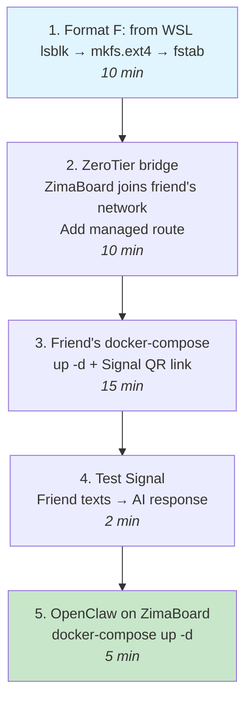
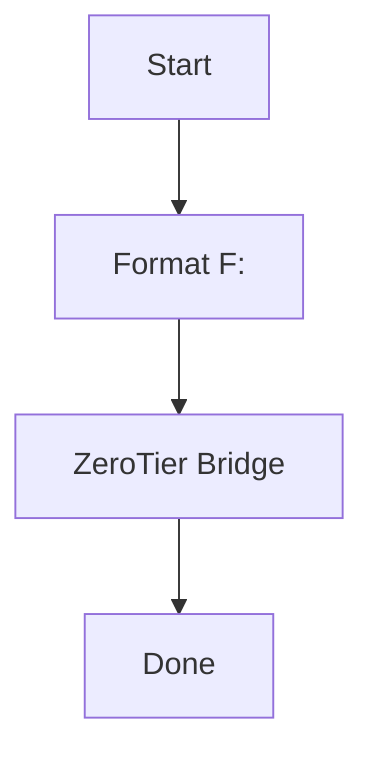
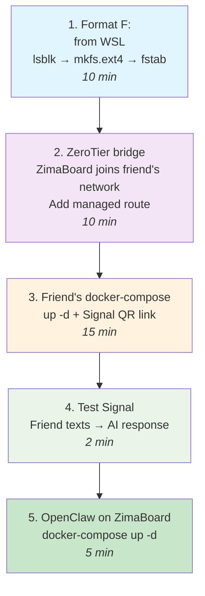
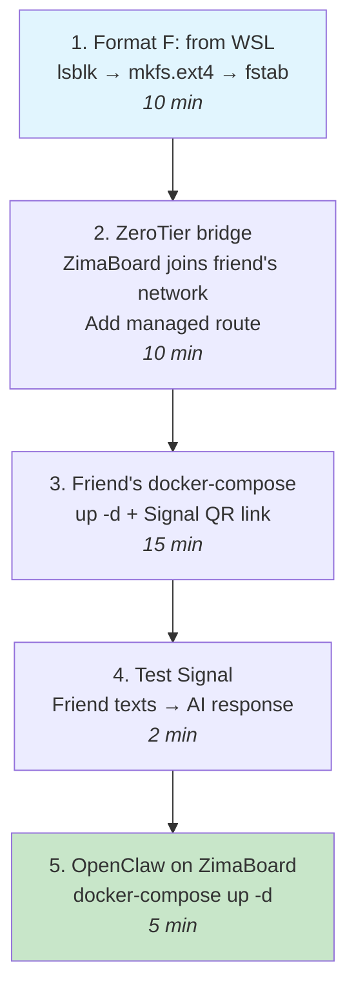
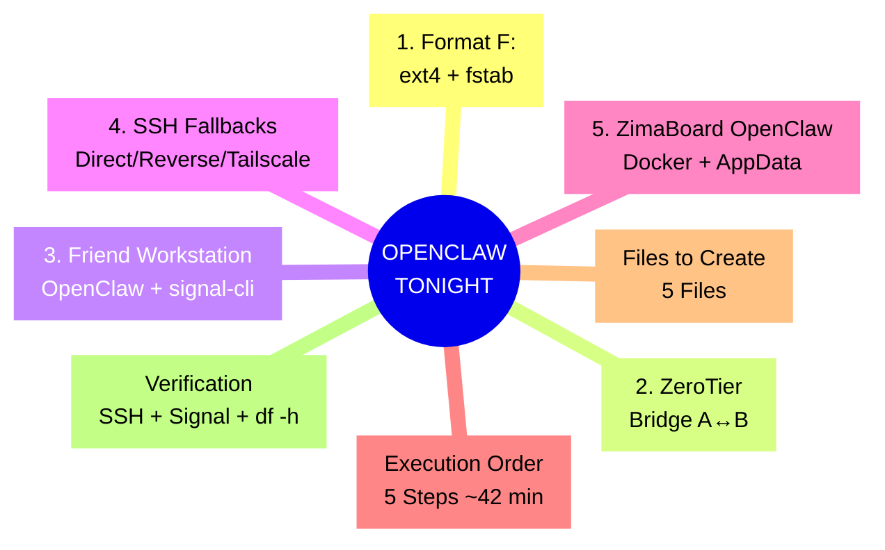

 Plan: ZimaBoard Full Setup — F: Drive + ZeroTier Bridge + Signal Agent + OpenClaw                                   │
│                                                                                                                     │
│ Context                                                                                                             │
│                                                                                                                     │
│ Tonight's goals:                                                                                                    │
│ 1. Format F: (external drive) as ext4 for ZimaBoard Docker appdata + light NAS                                      │
│ 2. Bridge two ZeroTier networks: friend's air-gapped workstation ↔ user's ZimaBoard                                 │
│ 3. OpenClaw + signal-cli on friend's workstation (text → agent → commands)                                          │
│ 4. OpenClaw on ZimaBoard for user (Docker, no GUI)                                                                  │
│ 5. SSH fallback if signal-cli doesn't work                                                                          │
│                                                                                                                     │
│ OpenClaw facts (from docs):                                                                                         │
│ - GitHub: github.com/openclaw/openclaw — personal AI assistant, any platform                                        │
│ - Install: npm install -g openclaw@latest + openclaw onboard --install-daemon                                       │
│ - Native Signal support via signal-cli (HTTP JSON-RPC + SSE)                                                        │
│ - Docker image: manishmshiva/openclaw (set ANTHROPIC_API_KEY)                                                       │
│ - Gateway: port 18789                                                                                               │
│ - Headless-safe: works without GUI via config file                                                                  │
│ - Signal setup: QR link (signal-cli link) — friend scans with their Signal app, no SMS needed                       │
│                                                                                                                     │
│ ---                                                                                                                 │
│ Part 1: Format F: as ext4                                                                                           │
│                                                                                                                     │
│ From WSL (Windows can't format ext4 natively):                                                                      │
│                                                                                                                     │
│ # 1. Identify F: drive device                                                                                       │
│ lsblk                                                                                                               │
│ # Look for drive matching F:'s size — usually /dev/sdc or /dev/sdd                                                  │
│                                                                                                                     │
│ # 2. Unmount if mounted                                                                                             │
│ sudo umount /mnt/f 2>/dev/null || true                                                                              │
│                                                                                                                     │
│ # 3. Format                                                                                                         │
│ sudo mkfs.ext4 -F -L "ZIMA-APPDATA" /dev/sdX   # replace sdX                                                        │
│                                                                                                                     │
│ # 4. Verify                                                                                                         │
│ sudo e2label /dev/sdX                                                                                               │
│                                                                                                                     │
│ On ZimaBoard (after plugging in F:):                                                                                │
│ # Find the drive                                                                                                    │
│ lsblk                                                                                                               │
│                                                                                                                     │
│ # Mount it                                                                                                          │
│ sudo mkdir -p /DATA/AppData                                                                                         │
│ sudo mount -L ZIMA-APPDATA /DATA/AppData                                                                            │
│                                                                                                                     │
│ # Make persistent — add to /etc/fstab:                                                                              │
│ echo "LABEL=ZIMA-APPDATA /DATA/AppData ext4 defaults,nofail 0 2" | sudo tee -a /etc/fstab                           │
│                                                                                                                     │
│ CasaOS: Settings → Storage → set /DATA/AppData as Docker appdata path.                                              │
│                                                                                                                     │
│ ---                                                                                                                 │
│ Part 2: ZeroTier Network Bridge                                                                                     │
│                                                                                                                     │
│ Two networks:                                                                                                       │
│ - Network A = user's (ZimaBoard already on this)                                                                    │
│ - Network B = friend's (friend's air-gapped workstation)                                                            │
│                                                                                                                     │
│ ZimaBoard acts as bridge node (joins both networks):                                                                │
│                                                                                                                     │
│ # On ZimaBoard — join friend's Network B                                                                            │
│ zerotier-cli join <FRIEND_NETWORK_B_ID>                                                                             │
│                                                                                                                     │
│ # Friend approves ZimaBoard in their ZeroTier console (my.zerotier.com)                                             │
│                                                                                                                     │
│ # Get ZimaBoard's IP in each network                                                                                │
│ zerotier-cli listnetworks                                                                                           │
│                                                                                                                     │
│ Add managed route in friend's network (friend does this at my.zerotier.com):                                        │
│ - Routes → Add Route                                                                                                │
│ - Destination: 172.28.0.0/16 (or whatever subnet Network A uses)                                                    │
│ - Via: ZimaBoard's ZeroTier IP in Network B                                                                         │
│                                                                                                                     │
│ Result: Friend's workstation can now reach ZimaBoard at its Network A IP.                                           │
│                                                                                                                     │
│ Fallback (simpler): Friend just joins Network A directly. User approves. Done. No routing needed.                   │
│                                                                                                                     │
│ ---                                                                                                                 │
│ Part 3: OpenClaw + Signal for Friend's Workstation                                                                  │
│                                                                                                                     │
│ docker-compose.yml                                                                                                  │
│                                                                                                                     │
│ version: "3.8"                                                                                                      │
│ services:                                                                                                           │
│   signal-cli-rest-api:                                                                                              │
│     image: bbernhard/signal-cli-rest-api:latest                                                                     │
│     container_name: signal-cli                                                                                      │
│     restart: unless-stopped                                                                                         │
│     ports:                                                                                                          │
│       - "127.0.0.1:8080:8080"                                                                                       │
│     volumes:                                                                                                        │
│       - ./signal-data:/home/.local/share/signal-cli                                                                 │
│     environment:                                                                                                    │
│       - MODE=json-rpc                                                                                               │
│                                                                                                                     │
│   openclaw:                                                                                                         │
│     image: manishmshiva/openclaw:latest                                                                             │
│     container_name: openclaw                                                                                        │
│     restart: unless-stopped                                                                                         │
│     ports:                                                                                                          │
│       - "127.0.0.1:18789:18789"                                                                                     │
│     volumes:                                                                                                        │
│       - ./openclaw-config:/home/node/.openclaw                                                                      │
│       - ~/.ssh:/home/node/.ssh:ro                                                                                   │
│     environment:                                                                                                    │
│       - ANTHROPIC_API_KEY=${ANTHROPIC_API_KEY}                                                                      │
│     depends_on:                                                                                                     │
│       - signal-cli-rest-api                                                                                         │
│                                                                                                                     │
│ openclaw-config/config.json (no GUI needed)                                                                         │
│                                                                                                                     │
│ {                                                                                                                   │
│   "gateway": {                                                                                                      │
│     "bind": "0.0.0.0",                                                                                              │
│     "port": 18789                                                                                                   │
│   },                                                                                                                │
│   "model": {                                                                                                        │
│     "provider": "anthropic",                                                                                        │
│     "name": "claude-sonnet-4-6"                                                                                     │
│   },                                                                                                                │
│   "channels": {                                                                                                     │
│     "signal": {                                                                                                     │
│       "enabled": true,                                                                                              │
│       "signalCliRestApi": "http://signal-cli:8080",                                                                 │
│       "phoneNumber": "+1XXXXXXXXXX",                                                                                │
│       "dmPolicy": "pairing"                                                                                         │
│     }                                                                                                               │
│   },                                                                                                                │
│   "agents": {                                                                                                       │
│     "defaults": {                                                                                                   │
│       "sandbox": {                                                                                                  │
│         "browser": { "headless": true }                                                                             │
│       }                                                                                                             │
│     }                                                                                                               │
│   }                                                                                                                 │
│ }                                                                                                                   │
│                                                                                                                     │
│ Signal registration (one-time, friend does this):                                                                   │
│                                                                                                                     │
│ # Option A: QR link — friend scans with Signal app (no new number needed)                                           │
│ docker exec -it signal-cli signal-cli link -n "OpenClaw"                                                            │
│ # Shows a QR code / link — scan with Signal on phone                                                                │
│                                                                                                                     │
│ # Option B: Register new number (needs SMS)                                                                         │
│ docker exec -it signal-cli signal-cli -u +1NEWNUM register                                                          │
│ docker exec -it signal-cli signal-cli -u +1NEWNUM verify <code>                                                     │
│                                                                                                                     │
│ Start:                                                                                                              │
│                                                                                                                     │
│ echo "ANTHROPIC_API_KEY=sk-ant-..." > .env                                                                          │
│ docker-compose up -d                                                                                                │
│                                                                                                                     │
│ Friend texts their linked number → OpenClaw responds → can run local commands or SSH to ZimaBoard.                  │
│                                                                                                                     │
│ ---                                                                                                                 │
│ Part 4: SSH Fallback Options                                                                                        │
│                                                                                                                     │
│ Option A: Direct SSH via ZeroTier (works once bridge is up)                                                         │
│                                                                                                                     │
│ ssh casaos@<ZIMA_ZEROTIER_IP>                                                                                       │
│                                                                                                                     │
│ Option B: Reverse tunnel (workstation calls home to ZimaBoard)                                                      │
│                                                                                                                     │
│ # Run on friend's workstation to keep tunnel open                                                                   │
│ ssh -N -R 2222:localhost:22 casaos@<ZIMA_ZEROTIER_IP> -o ServerAliveInterval=60                                     │
│                                                                                                                     │
│ # As systemd service /etc/systemd/system/zima-tunnel.service:                                                       │
│ [Service]                                                                                                           │
│ ExecStart=ssh -N -R 2222:localhost:22 casaos@<ZIMA_IP> -o ServerAliveInterval=60                                    │
│ Restart=always                                                                                                      │
│                                                                                                                     │
│ Option C: Tailscale (instant, replaces ZeroTier bridge complexity)                                                  │
│                                                                                                                     │
│ curl -fsSL https://tailscale.com/install.sh | sh                                                                    │
│ tailscale up                                                                                                        │
│ # Both machines get 100.x.x.x IPs, routable immediately                                                             │
│                                                                                                                     │
│ ---                                                                                                                 │
│ Part 5: OpenClaw on ZimaBoard (for user)                                                                            │
│                                                                                                                     │
│ Same docker-compose approach, added to ZimaBoard's CasaOS:                                                          │
│                                                                                                                     │
│ services:                                                                                                           │
│   openclaw:                                                                                                         │
│     image: manishmshiva/openclaw:latest                                                                             │
│     container_name: openclaw-user                                                                                   │
│     restart: unless-stopped                                                                                         │
│     ports:                                                                                                          │
│       - "18789:18789"                                                                                               │
│     volumes:                                                                                                        │
│       - /DATA/AppData/openclaw:/home/node/.openclaw                                                                 │
│     environment:                                                                                                    │
│       - ANTHROPIC_API_KEY=${ANTHROPIC_API_KEY}                                                                      │
│                                                                                                                     │
│ Access: ssh casa → docker exec -it openclaw-user sh (headless), or via browser at http://192.168.0.11:18789 when on │
│  LAN.                                                                                                               │
│                                                                                                                     │
│ ---                                                                                                                 │
│ Execution Order (tonight)                                                                                           │
│                                                                                                                     │
│ 1. Format F: from WSL — lsblk → mkfs.ext4 → plug into ZimaBoard → fstab (10 min)                                    │
│ 2. ZeroTier bridge — ZimaBoard joins friend's network, friend adds managed route (10 min)                           │
│ 3. Friend's docker-compose — docker-compose up -d + Signal QR link (15 min)                                         │
│ 4. Test Signal — friend texts → gets response (2 min)                                                               │
│ 5. OpenClaw on ZimaBoard — docker-compose up -d (5 min)                                                             │
│                                                                                                                     │
│ ---                                                                                                                 │
│ Files to Create                                                                                                     │
│                                                                                                                     │
│ ┌───────────────────────────────────────────────┬──────────────────────────┐                                        │
│ │                     Path                      │           What           │                                        │
│ ├───────────────────────────────────────────────┼──────────────────────────┤                                        │
│ │ ~/zima-agent/docker-compose.yml               │ Friend's workstation     │                                        │
│ ├───────────────────────────────────────────────┼──────────────────────────┤                                        │
│ │ ~/zima-agent/openclaw-config/config.json      │ OpenClaw config (no GUI) │                                        │
│ ├───────────────────────────────────────────────┼──────────────────────────┤                                        │
│ │ ~/zima-agent/.env                             │ ANTHROPIC_API_KEY        │                                        │
│ ├───────────────────────────────────────────────┼──────────────────────────┤                                        │
│ │ ZimaBoard: /DATA/AppData/openclaw/config.json │ User's OpenClaw config   │                                        │
│ ├───────────────────────────────────────────────┼──────────────────────────┤                                        │
│ │ /etc/fstab on ZimaBoard                       │ F: drive mount           │                                        │
│ └───────────────────────────────────────────────┴──────────────────────────┘                                        │
│                                                                                                                     │
│ Verification                                                                                                        │
│                                                                                                                     │
│ - ssh casa from WSL works                                                                                           │
│ - ssh casaos@<ZIMA_ZEROTIER_IP> works from friend's machine                                                         │
│ - Friend texts Signal → receives AI response within 5 sec                                                           │
│ - df -h /DATA/AppData on ZimaBoard shows F: drive mounted                                                           │
│ - Docker containers write appdata to F: drive                   Here's the table from your note, reformatted as a proper GitHub-flavored Markdown table for better readability in Obsidian:

| Path                                      | What                       |
|-------------------------------------------|----------------------------|
| ~/zima-agent/docker-compose.yml           | Friend's workstation       |
| ~/zima-agent/openclaw-config/config.json  | OpenClaw config (no GUI)   |
| ~/zima-agent/.env                         | ANTHROPIC_API_KEY          |
| ZimaBoard: /DATA/AppData/openclaw/config.json | User's OpenClaw config  |
| /etc/fstab on ZimaBoard                   | F: drive mount             |

To apply this to your note [[00-CLAUDE DEV/00-CLAUDEFINALSTRETCH/Untitled 3]], copy-paste it under the "Files to Create" heading (replacing the ASCII art version). Let me know if you need the full note content rewritten!

Here's the reworked content for your note [[00-SHARED/Human-Inbox/OPENCLAW TONIGHT]]. I've identified the single ASCII art table under "Files to Create" (no other tables exist). 

- **Files to Create**: Converted to a clean GitHub Markdown table (best for tabular data in Obsidian).
- **Execution Order**: Added a new Mermaid flowchart for visual flow (replaces the numbered list for better scannability).
- **Overall Structure**: Optionally, a Mermaid mindmap summarizing all Parts + Execution + Files (insert as a high-level overview).

Copy-paste these directly into your note, replacing the relevant sections (e.g., delete the ASCII block and numbered Execution Order list).

### 1. Markdown Table for "Files to Create" (replace the entire ASCII block)

Files to Create

## flow

## Execution Order

## Execution Order
1. Format F: from WSL (lsblk → mkfs.ext4 → fstab) - 10 min
2. ZeroTier bridge (ZimaBoard joins friend's network + managed route) - 10 min
3. Friend's docker-compose (up -d + Signal QR link) - 15 min
4. Test Signal (Friend texts → AI response) - 2 min
5. OpenClaw on ZimaBoard (docker-compose up -d) - 5 min

### 2. Mermaid Flowchart for "Execution Order" (replace the numbered list)

### 3. Bonus: Mermaid Mindmap for Full Note Overview (insert at top after "Tonight's goals")

These render beautifully in Obsidian (enable Mermaid in settings if needed). The flowchart shows dependencies/sequence; mindmap gives hierarchy. Let me know if you want full note rewrite, more diagrams (e.g., sequence for Signal setup), or edits to specific sections!

## part 2

 Formatted. UUID is 64e7de64-9960-4f3d-b6d0-23a8c6d3fcbc — save that for the fstab step on ZimaBoard.

  Task 3 — mount and stage files:

  sudo mkdir -p /mnt/zima-f
  sudo mount -L ZIMA-APPDATA /mnt/zima-f

  # Create folder structure ZimaBoard expects
  sudo mkdir -p /mnt/zima-f/{setup,AppData,Media,Share}

  # Copy all setup files
  sudo cp -r ~/zima-agent/* /mnt/zima-f/setup/

  # Verify
  ls /mnt/zima-f/setup/
  ls /mnt/zima-f/setup/friend/

  # Unmount cleanly before detaching
  sudo umount /mnt/zima-f

  Then in PowerShell:
  usbipd detach --busid 2-21

  Then eject from Windows Explorer before unplugging. Drive is ready to go straight into ZimaBoard.

  [⚡ T9 | ctx ~133K | cache MISS ✗ | $0.02/turn | headroom: 61K]

  9 tasks (0 done, 9 open)
  ◻ Identify F: drive device in WSL
  ◻ Format F: as ext4 from WSL
  ◻ Stage all ZimaBoard files onto F: drive
  ◻ Plug F: into ZimaBoard and mount
  ◻ Move ZimaOS AppData to F: drive
  ◻ Deploy OpenClaw on ZimaBoard
  ◻ ZeroTier bridge — ZimaBoard joins friend's network
  ◻ Friend's workstation — install signal-cli + OpenClaw
  ◻ Test Signal → OpenClaw end-to-end

────────────────────────────────────────────────────────────────────────