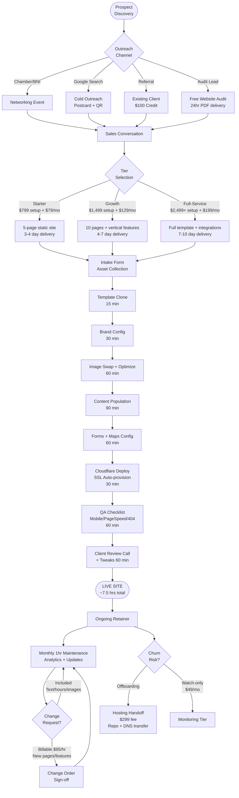
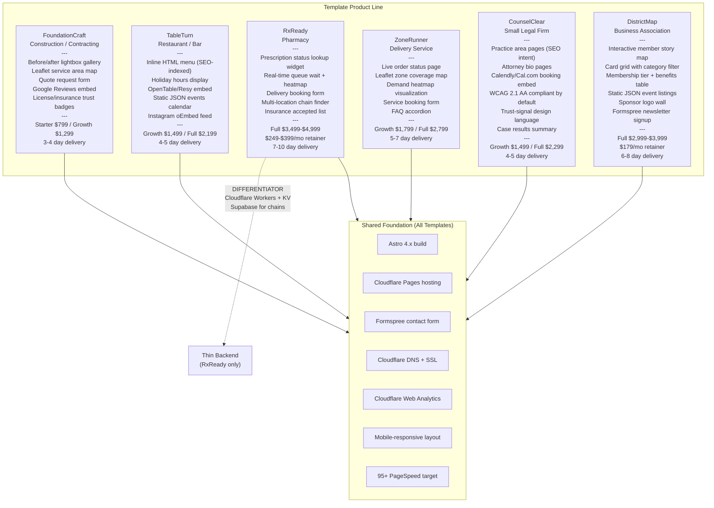
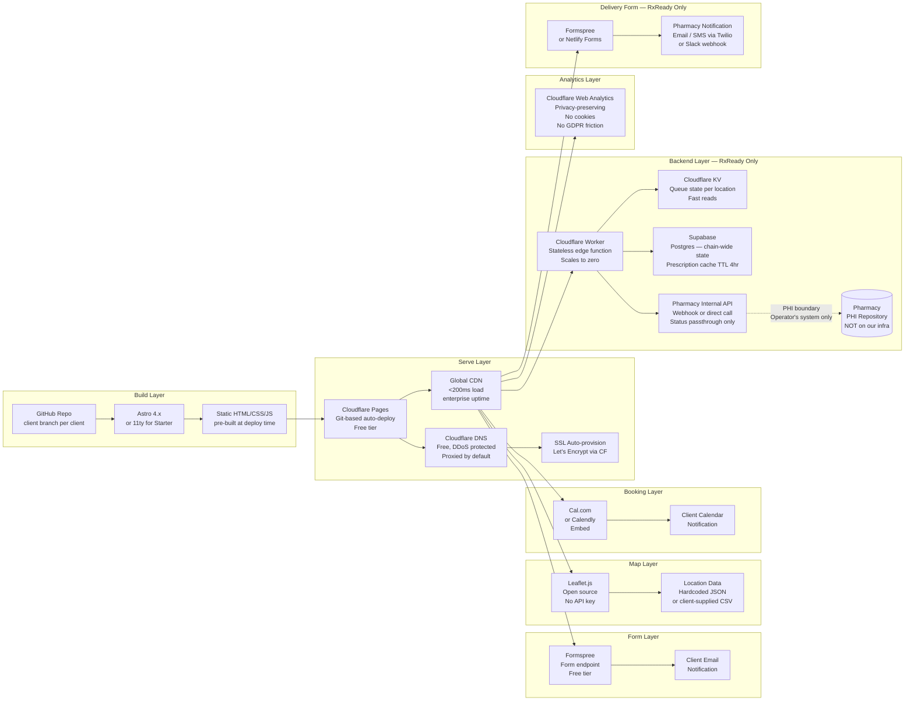
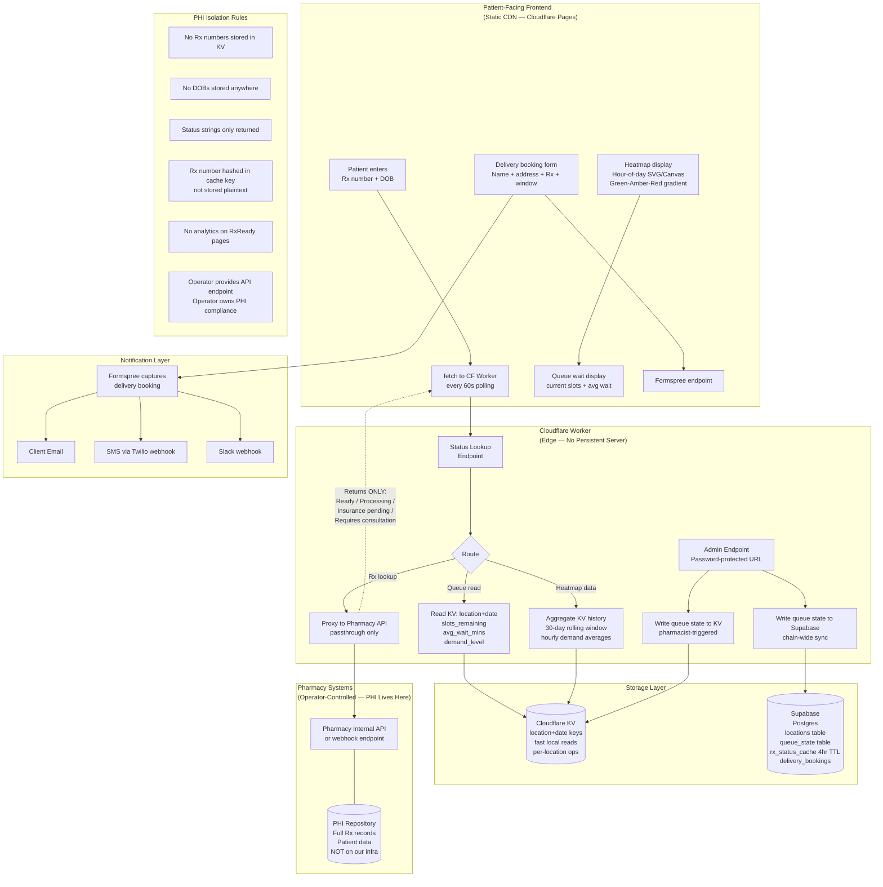
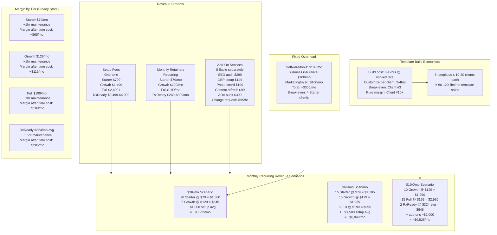

# LocalWeb Studio — Architecture & Operations

## Executive Summary

LocalWeb Studio is a solo-operator web design and hosting business built around six vertical-specific static site templates, three service tiers, and a single genuine technical differentiator: the RxReady pharmacy queuing system. The architecture is deliberately minimal — Astro builds to static HTML, Cloudflare Pages serves it, Formspree handles forms, and Cloudflare Workers provide the only thin backend surface (scoped to RxReady). Every tool choice prioritizes portability and zero vendor lock-in. The business model is template amortization: 8–12 hours to build a vertical template once, 2–4 hours to customize per client, with full margin recovery by client #3 in each vertical.

This document maps the full operational and technical architecture: how a prospect becomes a client, how the six templates relate to each other and their markets, how the tech stack interconnects, how money flows, and how a solo operator stays under capacity at 35 active clients.

**Source:** `/mnt/d/0LOCAL/gitrepos/hustle/business-plan-localweb.md`

---

## Diagram 1 — Client Service Flow

How a prospect moves from first contact to live site and into ongoing retention.



The critical constraint is the intake form — the site cannot start until all assets are in hand. The 7.5-hour build target assumes complete asset delivery. Delays in client asset collection are the primary schedule risk, not the technical work.

---

## Diagram 2 — Template Ecosystem

All six vertical templates, their key differentiators, and pricing anchors.



Every template shares the same deployment pipeline. RxReady is the only template with a backend surface — and that backend is scoped to a single Cloudflare Worker, not a server. The interactive map templates (FoundationCraft, ZoneRunner, DistrictMap) all use Leaflet.js with no API key billing risk.

---

## Diagram 3 — Tech Stack Relationships

How all tools interact across the build, serve, and integrate layers.



The PHI boundary is the most important architecture constraint: the Cloudflare Worker is a passthrough proxy to the pharmacy's own system. No patient data lands in LocalWeb infrastructure. The Worker returns only status strings — the pharmacy's existing system remains the sole PHI repository.

---

## Diagram 4 — RxReady Deep Dive

Data flow, PHI isolation, and the queue visualization system.



The heatmap is driven by historical KV aggregates — not live tracking of individual patients. It shows "Wednesday 2pm is typically busy" derived from aggregate demand levels, not individual prescription records. The admin endpoint is a URL-path-protected page within the same Astro site, not a separate app, keeping deployment simple.

---

## Diagram 5 — Revenue Model

How setup fees, retainers, and add-ons compound across client counts.



RxReady is the margin engine. Five pharmacy clients at $324/mo average equals $1,620 MRR — equivalent to 20+ Starter clients. The $10K/mo scenario requires only 27 total clients (10 Growth + 15 Full + 2 RxReady) versus the 35-client capacity ceiling, leaving headroom for new builds. Setup fees are excluded from steady-state margin because they are non-recurring, but they are critical in months 1-12 to fund the template build cost.

---

## Diagram 6 — Operational Workflow

How a solo operator allocates time across onboarding, ongoing maintenance, and capacity ceiling.

```mermaid
flowchart LR
    subgraph WEEK1["Week 1 — New Client Onboarding\nTarget: 8 hrs operator time"]
        W1A[Intake form sent\nAssets collected] --> W1B[Day 1-2: Template clone\nBrand config\n45 min]
        W1B --> W1C[Day 2-3: Content + images\nForms + maps\n3.5 hrs]
        W1C --> W1D[Day 3: Deploy\nQA\n1.5 hrs]
        W1D --> W1E[Day 4-5: Client review\nTweaks\n1 hr]
        W1E --> W1F([LIVE\n~7.5 hrs total])
    end

    subgraph MONTHLY["Ongoing Monthly — Per Client\nTarget: 1 hr or less"]
        M1[Cloudflare analytics\n10 min] --> M2[Uptime check\nautomated alert]
        M2 --> M3[Content update requests\nup to 30 min included]
        M3 --> M4{Quarterly?}
        M4 --> |Yes| M5[PageSpeed audit\nBroken link check\n20 min extra]
        M4 --> |No| M6([Done for month])
        M5 --> M6
    end

    subgraph CAPACITY["Monthly Capacity — 35 Client Ceiling"]
        C1["Maintenance: 35 clients x 1hr = 35hrs"] --> C2["New builds: 2/mo x 8hrs = 16hrs"]
        C2 --> C3["Sales + admin: ~20hrs"]
        C3 --> C4([~71 hrs/mo\nHire contractor at 28-30 clients])
    end

    subgraph YEAR1["Year 1 Milestones"]
        Y1["Mo 1-2: 3 clients\nDemo sites built\nChamber joined"] --> Y2["Mo 3-4: 8 clients\nReferral program live\nSBDC relationship"]
        Y2 --> Y3["Mo 5-6: 15 clients\nFirst RxReady\nFull template line"]
        Y3 --> Y4["Mo 7-9: 22 clients\n$3K+ MRR\nFirst contractor consideration"]
        Y4 --> Y5["Mo 10-12: 28-30 clients\n$5K+ MRR\nSystematic referral pipeline"]
    end
```



The capacity math: 35 clients x 1hr maintenance + 2 builds x 8hrs + 20hrs admin = 71 hours/month, which is above a sustainable solo pace. The hire trigger should be at 28-30 active clients, not at the stated 35-client ceiling, to protect build time — which is the primary new revenue generator.

---

## Implementation Notes for Developers

Concrete steps and configuration touchpoints when cloning a template for a new client.

### Astro Configuration Checklist (Per Client Clone)

**1. Config file — `src/config/site.yml` (or equivalent config object)**

```yaml
# Replace these on every clone:
business:
  name: "Client Business Name"
  phone: "+1-555-000-0000"
  email: "contact@client.com"
  address: "123 Main St, City, ST 00000"
  hours:
    mon_fri: "9am - 6pm"
    saturday: "10am - 4pm"
    sunday: "Closed"
  social:
    instagram: "https://instagram.com/clienthandle"
    facebook: "https://facebook.com/clientpage"

brand:
  primary_color: "#2B4C7E"      # client hex
  secondary_color: "#F4A261"    # client hex
  font_heading: "Montserrat"    # or client-specified
  font_body: "Open Sans"

cloudflare:
  analytics_token: "REPLACE_WITH_CLIENT_TOKEN"

formspree:
  endpoint: "https://formspree.io/f/REPLACE_WITH_CLIENT_ID"
```

**2. Cloudflare Pages — per client setup**
- Create new Pages project from GitHub branch (not fork)
- Set custom domain in Pages dashboard — Cloudflare handles SSL automatically
- Analytics: enable Cloudflare Web Analytics per site, copy token to config
- Workers (RxReady only): deploy Worker via `wrangler deploy`, bind KV namespace

**3. Formspree — per client setup**
- Create new form in Formspree dashboard
- Copy endpoint URL to config
- Set notification email to client's email address
- Enable reCAPTCHA on contact forms

**4. Leaflet.js maps (FoundationCraft, ZoneRunner, DistrictMap)**
- Set `MAP_CENTER: [lat, lng]` and `MAP_ZOOM: 11` in config
- Service area polygons: edit `src/data/service-area.geojson`
- Member pins (DistrictMap): edit `src/data/members.json` — one object per member with `lat`, `lng`, `name`, `category`, `description`, `url`

**5. Image optimization workflow**
- All images processed through Squoosh before commit
- Target: AVIF at 75% quality for hero images, WebP at 80% for gallery
- Max file size: 200KB per image, 80KB for thumbnails
- Use Astro's `<Image>` component — handles srcset automatically

**6. RxReady-specific Cloudflare Worker config**
- `wrangler.toml`: bind KV namespace as `QUEUE_STATE`
- Set environment variables: `PHARMACY_API_URL`, `PHARMACY_API_KEY`, `ADMIN_SECRET` (via Cloudflare dashboard, not in code)
- `ADMIN_SECRET` gates the admin endpoint — use a random 32-char string, share only with pharmacy staff
- Supabase (chain clients): set `SUPABASE_URL` and `SUPABASE_ANON_KEY` as Worker environment variables

**7. QA checklist before client review call**
- [ ] PageSpeed Insights score >= 95 mobile, >= 98 desktop
- [ ] Mobile layout check at 375px, 430px, 768px breakpoints
- [ ] All form submissions tested (check Formspree dashboard)
- [ ] Map loads and pins/polygons render correctly
- [ ] No 404s in browser console
- [ ] SSL active on custom domain (Cloudflare dashboard shows "Active")
- [ ] Business hours accurate
- [ ] Phone number and email links clickable on mobile (tel: and mailto: protocols)

### Template Customization Time Estimates

| Task | Estimate | Notes |
|---|---|---|
| Clone repo + create client branch | 15 min | `git checkout -b client-name` |
| Brand config (colors, fonts, info) | 30 min | Single config file |
| Image swap + Squoosh optimization | 60 min | 5-10 hero/gallery images |
| Content population | 90 min | Copy, menu, services, hours |
| Forms + maps config | 60 min | Formspree endpoint + coordinates |
| Cloudflare Pages deploy + DNS | 30 min | Git push triggers auto-deploy |
| QA checklist | 60 min | PageSpeed + mobile + forms |
| Client review tweaks | 60 min | Minor copy/image adjustments |
| **Total** | **~7.5 hrs** | Target: under 8 hrs |

### Hosting Handoff Protocol

When a client leaves or wants ownership:

1. Transfer GitHub repo to client's GitHub account (Settings > Transfer)
2. Client creates their own Cloudflare Pages account and imports repo
3. Update DNS A/CNAME records to point to client's Pages deployment
4. Export Formspree forms to client's account (Formspree supports this)
5. Record a 30-minute Loom walkthrough covering how to update the site
6. Invoice $299 offboarding fee + final month's retainer
7. Offer $49/mo "watch-only" monitoring if client wants continued oversight

---

*LocalWeb Studio Architecture — Generated 2026-04-01 from business-plan-localweb.md*
*Status: draft — update to final after human review*
