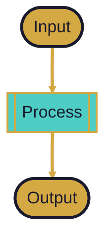

# Design Session: yeah

## Auto-Generated TOC → Mermaid

```dataviewjs
// Generates a Mermaid diagram from this note's headers
// Shows document structure as a clickable flowchart
const content = await dv.io.load(dv.current().file.path);
const headers = [];
const lines = content.split('\n');
let id = 0;

for (const line of lines) {
  const match = line.match(/^(#{2,4})\s+(.+)$/);
  if (match) {
    headers.push({
      level: match[1].length,
      text: match[2].replace(/["`{}]/g, ''),
      id: 'N' + (id++)
    });
  }
}

if (headers.length > 0) {
  let mermaid = '```mermaid\n';
  mermaid += "%%{init: {'theme': 'base', 'flowchart': {'curve': 'basis'}, 'themeVariables': {\n";
  mermaid += "  'fontSize': '16px', 'lineColor': '#D4A843', 'background': '#1a1a2e'\n";
  mermaid += '}}}%%\n';
  mermaid += 'graph TD\n';
  mermaid += '    classDef h2 fill:#D4A843,stroke:#1a1a2e,stroke-width:3px,color:#1a1a2e,font-size:16px\n';
  mermaid += '    classDef h3 fill:#4ECDC4,stroke:#D4A843,stroke-width:2px,color:#1a1a2e,font-size:14px\n';
  mermaid += '    classDef h4 fill:#93C572,stroke:#D4A843,stroke-width:2px,color:#1a1a2e,font-size:13px\n';

  // Build nodes
  for (const h of headers) {
    const cls = h.level === 2 ? 'h2' : h.level === 3 ? 'h3' : 'h4';
    const short = h.text.length > 30 ? h.text.slice(0, 27) + '...' : h.text;
    mermaid += `    ${h.id}["${short}"]:::${cls}\n`;
  }

  // Build edges: each header connects to the next header of same or deeper level
  let stack = [];
  for (const h of headers) {
    while (stack.length > 0 && stack[stack.length - 1].level >= h.level) {
      stack.pop();
    }
    if (stack.length > 0) {
      mermaid += `    ${stack[stack.length - 1].id} ==> ${h.id}\n`;
    }
    stack.push(h);
  }

  mermaid += '```';
  dv.paragraph(mermaid);
}
```

## Design Docs Index (from design-narratives/)

```dataviewjs
const pages = dv.pages('"00-SHARED/Dashboards/design-narratives"')
  .sort(p => p.file.name);

if (pages.length > 0) {
  dv.table(
    ["Document", "Type", "Status"],
    pages.map(p => [p.file.link, p.type || "-", p.status || "-"])
  );
} else {
  dv.paragraph("No design docs found in design-narratives/");
}
```

## System Component Links

```dataviewjs
// Shows all pseudosystem components for quick linking
const components = dv.pages('"00-SHARED/00-META/pseudosystem"')
  .where(p => p.type === "system-component")
  .sort(p => p.color);

if (components.length > 0) {
  const grouped = components.groupBy(p => p.color || "unset");
  for (const group of grouped) {
    dv.header(4, group.key.toUpperCase());
    dv.list(group.rows.map(p =>
      `${p.file.link} — ${p.component_type || ""} (${p.concurrency || ""})`
    ));
  }
}
```

---

## Context

What problem are we solving? What part of the system does this touch?

**System components affected:**
- <!-- Link pseudosystem notes: [[pseudosystem/component-name]] -->

## Design

### The Idea

### How It Flows

### Inputs and Outputs

| Input | Output |
|---|---|
| | |

### Diagram



## Decisions

## Open Questions

## Your Annotations

<!-- Human notes, corrections, ideas -->
