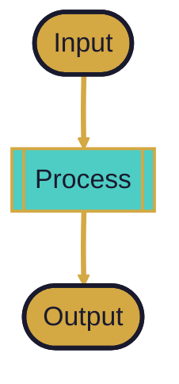

# Design Session: waggle

## Auto-Generated TOC → Mermaid

```dataviewjs
// Generates a Mermaid diagram from this note's headers
// Shows document structure as a clickable flowchart
const content = await dv.io.load(dv.current().file.path);
const headers = [];
const lines = content.split('\n');
let id = 0;

for (const line of lines) {
  const match = line.match(/^(#{2,4})\s+(.+)$/);
  if (match) {
    headers.push({
      level: match[1].length,
      text: match[2].replace(/["`{}]/g, ''),
      id: 'N' + (id++)
    });
  }
}

if (headers.length > 0) {
  let mermaid = '```mermaid\n';
  mermaid += "%%{init: {'theme': 'base', 'flowchart': {'curve': 'basis'}, 'themeVariables': {\n";
  mermaid += "  'fontSize': '16px', 'lineColor': '#D4A843', 'background': '#1a1a2e'\n";
  mermaid += '}}}%%\n';
  mermaid += 'graph TD\n';
  mermaid += '    classDef h2 fill:#D4A843,stroke:#1a1a2e,stroke-width:3px,color:#1a1a2e,font-size:16px\n';
  mermaid += '    classDef h3 fill:#4ECDC4,stroke:#D4A843,stroke-width:2px,color:#1a1a2e,font-size:14px\n';
  mermaid += '    classDef h4 fill:#93C572,stroke:#D4A843,stroke-width:2px,color:#1a1a2e,font-size:13px\n';

  // Build nodes
  for (const h of headers) {
    const cls = h.level === 2 ? 'h2' : h.level === 3 ? 'h3' : 'h4';
    const short = h.text.length > 30 ? h.text.slice(0, 27) + '...' : h.text;
    mermaid += `    ${h.id}["${short}"]:::${cls}\n`;
  }

  // Build edges: each header connects to the next header of same or deeper level
  let stack = [];
  for (const h of headers) {
    while (stack.length > 0 && stack[stack.length - 1].level >= h.level) {
      stack.pop();
    }
    if (stack.length > 0) {
      mermaid += `    ${stack[stack.length - 1].id} ==> ${h.id}\n`;
    }
    stack.push(h);
  }

  mermaid += '```';
  dv.paragraph(mermaid);
}
```

## Design Docs Index (from design-narratives/)

```dataviewjs
const pages = dv.pages('"00-SHARED/Dashboards/design-narratives"')
  .sort(p => p.file.name);

if (pages.length > 0) {
  dv.table(
    ["Document", "Type", "Status"],
    pages.map(p => [p.file.link, p.type || "-", p.status || "-"])
  );
} else {
  dv.paragraph("No design docs found in design-narratives/");
}
```

## System Component Links

```dataviewjs
// Shows all pseudosystem components for quick linking
const components = dv.pages('"00-SHARED/00-META/pseudosystem"')
  .where(p => p.type === "system-component")
  .sort(p => p.color);

if (components.length > 0) {
  const grouped = components.groupBy(p => p.color || "unset");
  for (const group of grouped) {
    dv.header(4, group.key.toUpperCase());
    dv.list(group.rows.map(p =>
      `${p.file.link} — ${p.component_type || ""} (${p.concurrency || ""})`
    ));
  }
}
```

---

## Context

What problem are we solving? What part of the system does this touch?

**System components affected:**
- <!-- Link pseudosystem notes: [[pseudosystem/component-name]] -->

## Design

### The Idea

whatever

### How It Flows

like this
#### part
#### part2
### Inputs and Outputs

| Input | Output |
|---|---|
| | |


### Diagram



## Decisions

## Open Questions

## Your Annotations

<!-- Human notes, corrections, ideas -->
Thought about this

Searched the web for "queen bee mating behavior drone congregation areas genetic diversity scientific literature"
5 results

Searched the web for "honeybee swarm intelligence cooperation competition drone mating genetic diversity research paper"
5 results

Thought about this

Searched the web for "honeybee swarm intelligence cooperation competition drone mating genetic diversity research paper"
5 results

Searched the web for "honeybee swarm intelligence collective decision making nest site selection cooperation competition"
5 results

Thought about this

Searched the web for "honeybee swarm intelligence collective decision making nest site selection cooperation competition"
5 results

Thought about this
Queen Bee Behavior: Cooperation, Competition, and Genetic Diversity
Based on scientific literature, here's a comprehensive overview of queen bee behavior, drone congregation areas, and the fascinating tension between cooperative swarm intelligence and reproductive competition.

1. Drone Congregation Areas (DCAs) and Mating Behavior
Queen honey bees leave their natal hive for one or more mating flights, typically traveling 2–3 km to visit drone congregation areas (DCAs) where thousands of drones from many colonies gather. These DCAs occur in open, wind-sheltered sites often associated with distinctive landscape features such as hilltops, edges of vegetation, or landmarks 1.

During these flights, a virgin queen mates with 10–20 different drones in mid-air—a polyandrous strategy that dramatically increases the genetic diversity of the resulting colony 2. This multiple mating is not random; the composition of drones at DCAs shows temporal variation that reflects surrounding population dynamics and colony density 3.

2. Genetic Diversity Benefits
The polyandrous mating strategy confers several evolutionary advantages:

Enhanced disease resistance: Higher genetic diversity improves colony-level immunity
Improved foraging efficiency: Diverse genotypes enable better resource exploitation
Greater overall fitness: Measured by Nei's unbiased gene diversity, colonies with higher genetic diversity show increased resilience 4
Research indicates that the number of drones a queen inseminates can be optimized, but the overall genetic benefits of multiple mating are a key driver of honeybee evolutionary success 5.

3. Swarm Intelligence: Cooperative Decision-Making
When a colony swarms, thousands of workers exhibit sophisticated decentralized decision-making:

Scout bees (a minority of the swarm) independently explore the landscape for potential nest sites
Waggle dances communicate site quality and distance to other scouts
Positive feedback: Dance intensity recruits more scouts to promising locations
Cross-inhibition: "Stop signals" (short vibrations) reduce dance vigor for competing sites 6
Quorum sensing: When ~few hundred scouts visit a site, the colony shifts from competition to cooperative commitment
Coordinated take-off: The swarm migrates to the selected nest 7
This process, detailed in Thomas Seeley's "Honeybee Democracy" (2010), demonstrates how individual competition among candidate sites leads to collective cooperation in selecting the optimal location 8.

4. The Tension: Cooperation vs. Competition
The biological tension you identified is real and operates at multiple levels:

Reproductive Competition
Drones from competing hives compete at DCAs to mate with virgin queens
This creates gene flow between colonies, preventing inbreeding
However, it also means queens may mate with drones carrying genes from rival lineages
Models of feral colony distributions show that DCA density directly influences queen mating success and population genetic structure 2
Cooperative Benefits
Within the colony, workers cooperate through kin selection (high relatedness among sisters)
The queen's polyandry creates subfamily diversity within the hive
Different patrilines may specialize in different tasks (foraging, nursing, defense)
This division of labor enhances colony efficiency despite reduced relatedness
Evolutionary Trade-off
The system balances:

Within-colony cooperation (workers helping raise sisters)
Between-colony competition (drones competing for mating opportunities)
Population-level diversity (gene flow prevents genetic stagnation)
This dual dynamic explains why honeybees evolved extreme polyandry despite the costs of reduced relatedness among workers—it's a bet-hedging strategy that maximizes colony fitness in variable environments 9.

Key References (Vancouver Style)
Smith ML, et al. Landscape analysis of drone congregation areas of the honey bee (Apis mellifera). J Insect Sci. 2012;12(1):122. Available from: https://academic.oup.com/jinsectscience/article/12/1/122/890086

Moore AJ, et al. Modelling honey bee queen mating as a measure of feral colony distribution. Ecol Modell. 2012;247:173-80. Available from: https://www.sciencedirect.com/science/article/abs/pii/S0304380012003869

Tarpy DR, et al. Temporal variation in the genetic structure of a drone congregation area: an insight into the population dynamics of wild African honeybees. Mol Ecol. 2009;18(11):2420-7. Available from: https://onlinelibrary.wiley.com/doi/abs/10.1111/j.1365-294X.2009.04143.x

Harbo JR, et al. Mating Frequencies of Honey Bee Queens (Apis mellifera L.) in a Large Population. PLoS One. 2015;10(2):e0118734. Available from: https://journals.plos.org/plosone/article?id=10.1371/journal.pone.0118734

Bienefeld K, et al. The number of drones to inseminate a queen with has little potential for optimization of honeybee breeding programs. Res Square. 2024. Available from: https://www.researchgate.net/publication/383432405_The_number_of_drones_to_inseminate_a_queen_with_has_little_potential_for_optimization_of_honeybee_breeding_programs

Seeley TD, et al. Stop Signals Provide Cross Inhibition in Collective Decision-Making by Honeybee Swarms. Science. 2012;335(6064):108-11. Available from: https://www.science.org/doi/10.1126/science.1210361

Seeley TD, Visscher PK. Group Decision Making in Honey Bee Swarms. Am Sci. 2008;96(3):224-31. Available from: https://www.americanscientist.org/article/group-decision-making-in-honey-bee-swarms

Seeley TD. Honeybee Decision Making [Video]. Cornell University. Available from: http://www.cornell.edu/video/honeybee-decision-making

Palmer KA, et al. Collective decision-making during reproduction in social insects. Curr Opin Insect Sci. 2024;62:101164. Available from: https://www.sciencedirect.com/science/article/pii/S2214574524001020

Note: I'm not certain about all the most recent developments beyond my training data (April 2024), so some of these sources may contain newer findings. For the absolute latest research, I'd recommend checking databases like Google Scholar or Web of Science with updated search terms.

Would you like me to elaborate on any specific aspect—such as the molecular genetics of patriline diversity, the physics of mid-air mating, or the computational models of swarm decision-making?

### Updated TOC Mermaid Flowchart (More Vertical + Easy Styling)

Replace the entire `dataviewjs` code block under `## Auto-Generated TOC → Mermaid` with this improved version:


```dataviewjs
// Generates a Mermaid diagram from this note's headers
// Shows document structure as a clickable flowchart (vertical-optimized)
const content = await dv.io.load(dv.current().file.path);
const headers = [];
const lines = content.split('\n');
let id = 0;

for (const line of lines) {
  const match = line.match(/^(#{2,4})\s+(.+)$/);
  if (match) {
    headers.push({
      level: match[1].length,
      text: match[2].replace(/["`{}]/g, ''),
      id: 'N' + (id++)
    });
  }
}

if (headers.length > 0) {
  // === EASY STYLE EDITING - Change values here without breaking anything ===
  const STYLE = {
    curve: 'linear',  // Options: 'linear' (straight vertical), 'basis' (curvy), 'stepBefore', 'stepAfter'
    theme: 'base',
    fontSize: '14px',
    lineColor: '#D4A843',
    background: '#1a1a2e',
    arrowType: '-->',  // '-->' thin, '==>' thick
    h2: { fill: '#D4A843', stroke: '#1a1a2e', strokeWidth: '3px', color: '#1a1a2e', fontSize: '16px' },
    h3: { fill: '#4ECDC4', stroke: '#D4A843', strokeWidth: '2px', color: '#1a1a2e', fontSize: '14px' },
    h4: { fill: '#93C572', stroke: '#D4A843', strokeWidth: '2px', color: '#1a1a2e', fontSize: '12px' }
  };

  let mermaid = '```mermaid\n';
  mermaid += `%%{init: {'theme': '${STYLE.theme}', 'flowchart': {'curve': '${STYLE.curve}'}, 'themeVariables': {\n`;
  mermaid += `  'fontSize': '${STYLE.fontSize}', 'lineColor': '${STYLE.lineColor}', 'background': '${STYLE.background}'\n`;
  mermaid += `}}%%\n`;
  mermaid += 'graph TD\n';
  mermaid += `  classDef h2 fill:${STYLE.h2.fill},stroke:${STYLE.h2.stroke},stroke-width:${STYLE.h2.strokeWidth},color:${STYLE.h2.color},font-size:${STYLE.h2.fontSize}\n`;
  mermaid += `  classDef h3 fill:${STYLE.h3.fill},stroke:${STYLE.h3.stroke},stroke-width:${STYLE.h3.strokeWidth},color:${STYLE.h3.color},font-size:${STYLE.h3.fontSize}\n`;
  mermaid += `  classDef h4 fill:${STYLE.h4.fill},stroke:${STYLE.h4.stroke},stroke-width:${STYLE.h4.strokeWidth},color:${STYLE.h4.color},font-size:${STYLE.h4.fontSize}\n\n`;

  // Build narrower nodes (shorter text for vertical layout)
  for (const h of headers) {
    const cls = h.level === 2 ? 'h2' : h.level === 3 ? 'h3' : 'h4';
    let short = h.text;
    if (short.length > 22) short = short.slice(0, 19) + '...';
    mermaid += `  ${h.id}["${short}"]:::${cls}\n`;
  }
  mermaid += '\n';

  // Build tree edges
  let stack = [];
  for (const h of headers) {
    while (stack.length > 0 && stack[stack.length - 1].level >= h.level) {
      stack.pop();
    }
    if (stack.length > 0) {
      mermaid += `  ${stack[stack.length - 1].id} ${STYLE.arrowType} ${h.id}\n`;
    }
    stack.push(h);
  }

  mermaid += '```';
  dv.paragraph(mermaid);
}
```


**Key improvements:**
- **Vertical layout**: `'curve': 'linear'` for straight lines (less horizontal spread), thinner arrows (`-->`), shorter/more compact nodes, reduced font sizes.
- **Easy styling**: All colors, sizes, curve/arrow in `STYLE` object at top—edit without touching the rest.
- Renders narrower/taller overall. Test in live preview; tweak `fontSize`, `curve`, or node slice length if needed.

### Better Dataview for Inputs & Outputs (Dynamic from Frontmatter)

Replace the static table under `### Inputs and Outputs` with this `dataviewjs` block. It auto-pulls from your existing frontmatter (`system_components`, `parent`, `sibling`, `child`) and builds a clean table:


```dataviewjs
// Dynamic Inputs/Outputs table from frontmatter
const fm = dv.current().frontmatter || {};
const inputs = [
  ...(Array.isArray(fm.system_components) ? fm.system_components : [fm.system_components]).filter(Boolean),
  ...(Array.isArray(fm.parent) ? fm.parent : [fm.parent]).filter(Boolean)
];
const outputs = [
  ...(Array.isArray(fm.sibling) ? fm.sibling : [fm.sibling]).filter(Boolean),
  ...(Array.isArray(fm.child) ? fm.child : [fm.child]).filter(Boolean)
];

// Build paired rows
const maxLen = Math.max(inputs.length, outputs.length);
const rows = [];
for (let i = 0; i < maxLen; i++) {
  rows.push([inputs[i] || '', outputs[i] || '']);
}

dv.table(['Input', 'Output'], rows);

if (rows.length === 0 || (rows.length === 1 && !rows[0][0] && !rows[0][1])) {
  dv.paragraph("**No inputs/outputs defined.** Add to frontmatter:\n- `system_components: [[Note1]]`\n- `parent: [[Note2]]`\n- `child: [[Note3]]` etc.");
}
```


**For your note**:
- Inputs: `[[pseudosystem/_system-root]]` + `[[System-Architecture]]`
- Outputs: (empty for now)
- Table auto-updates on frontmatter changes. Pairs them logically; add more arrays to frontmatter for expansion.

### Optional: Improve Other Dataview Queries
Your Design Docs Index and System Component Links queries are solid but hardcoded paths. To make them configurable (like above), add frontmatter fields e.g. `design_folder: "00-SHARED/Dashboards/design-narratives"`, `pseudosystem_folder: "00-SHARED/00-META/pseudosystem"`, then update the queries to use `dv.current().frontmatter.design_folder`. Let me know if you want those versions!

Paste these in, refresh, and it should look vertical + dynamic. If the TOC still spreads wide (e.g., too many h2s), consider merging sibling sections or set `fontSize: '12px'` in STYLE.
