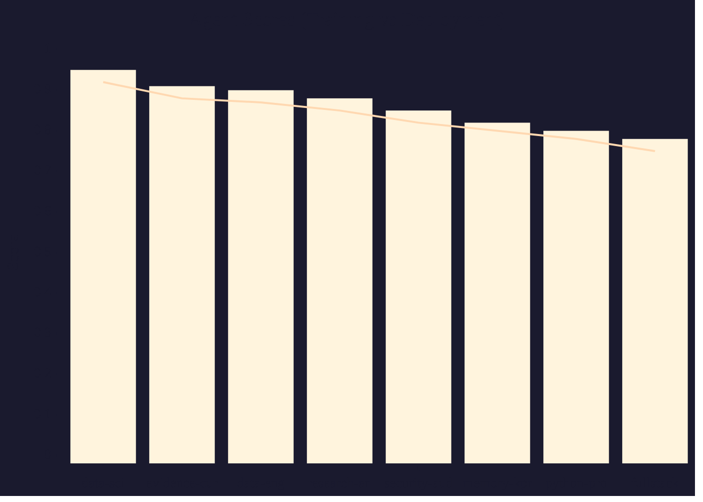
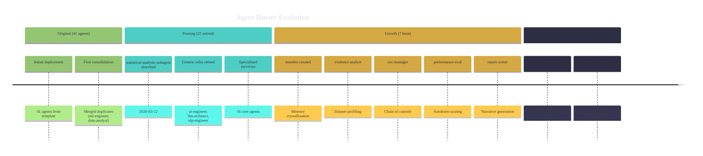

# Agent Performance Dashboard

*FINDINGS FLAGS FRICTION FLOW at every zoom level.*
*Sync: `python3 scripts/vault_agent_evolution_sync.py` (run at session end or on-demand)*

---

## ZOOM OUT: Team Overview

### FINDINGS — What the team discovered

```dataview
TABLE WITHOUT ID
  agent_author AS "Agent",
  count(rows) AS "Briefs",
  min(rows.confidence_delta) AS "Min Delta",
  max(rows.confidence_delta) AS "Max Delta"
FROM "00-SHARED/Session-Briefs"
WHERE type = "brief"
GROUP BY agent_author
SORT count(rows) DESC
```

### FLAGS — Blockers and warnings raised

```dataview
TABLE WITHOUT ID
  file.link AS "Flag",
  agent_author AS "Agent",
  blockers AS "Blocker",
  created AS "When"
FROM "00-SHARED/Session-Briefs"
WHERE type = "brief" AND length(blockers) > 0
SORT created DESC
LIMIT 10
```

### FRICTION — Where agents struggled

```dataview
TABLE WITHOUT ID
  agent_name AS "Agent",
  training_type AS "Type",
  score_delta AS "Delta",
  created AS "When"
FROM "03-Agents/training-events"
WHERE score_delta < 0
SORT created DESC
LIMIT 10
```

### FLOW — What went smoothly

```dataview
TABLE WITHOUT ID
  agent_name AS "Agent",
  training_type AS "Type",
  new_score AS "Score",
  score_delta AS "Delta"
FROM "03-Agents/training-events"
WHERE score_delta > 0
SORT score_delta DESC
LIMIT 10
```

---

## ZOOM MID: Sprint / Pipeline Phase

### Current Sprint Performance

```dataview
TABLE WITHOUT ID
  agent_name AS "Agent",
  current_score AS "Score",
  deployment_score AS "Deploy",
  score_delta AS "Delta"
FROM "03-Agents/snapshots"
WHERE type = "agent-snapshot"
SORT current_score DESC
```

### Pipeline Phase Heatmap

| Phase | Strong Agents | Weak Agents | Notes |
|-------|--------------|-------------|-------|
| SEED | data-engineer, evidence-analyst | | Ingest + baseline |
| DEEPEN | data-scientist, research-analyst | | Statistical analysis |
| EXTEND | security-auditor, evidence-curator | | Verification + curation |
| FULL | report-writer, fullstack-developer | | Publication |

### Session-Level: Recent Spawns

```dataview
TABLE WITHOUT ID
  file.link AS "Event",
  agent_name AS "Agent",
  training_type AS "Type",
  new_score AS "Score",
  created AS "Date"
FROM "03-Agents/training-events"
SORT created DESC
LIMIT 15
```

---

## ZOOM IN: Individual Agent Drill-Down

> Click any agent snapshot below to see their full history, spawn log, score trends, and techniques learned.

```dataview
TABLE WITHOUT ID
  file.link AS "Agent",
  current_score AS "Training",
  deployment_score AS "Deployment",
  score_delta AS "Delta",
  score_context AS "Context"
FROM "03-Agents/snapshots"
WHERE type = "agent-snapshot"
SORT current_score DESC
```

### Agent Score Chart



*Bar = training score, Line = deployment score. Update manually or via sync script.*

---

## ZOOM MICRO: Technique Library

```dataview
TABLE WITHOUT ID
  file.link AS "Technique",
  agent_name AS "Agent",
  created AS "Learned"
FROM "03-Agents/training-events"
WHERE contains(tags, "technique")
SORT created DESC
LIMIT 20
```

---

## Evolution Timeline



---

## Your Annotations

<!-- Which agents need attention? Retraining? Retirement? -->
<!-- What friction patterns keep recurring? -->

