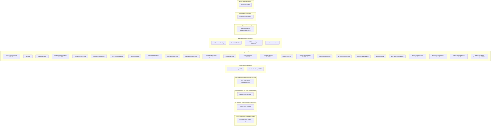

# 20-Mission-Graph — Index

> Generated by `6k_mission_graph_vault_sync.py` from `forensics/manifests/`.
> Press **Ctrl+G** in Obsidian to open the graph view (wiki-link topology).

## Live Graph

![mission-graph](https://mermaid.ink/img/Zmxvd2NoYXJ0IExSCiAgc3ViZ3JhcGggY2FudmFzX2V4dGVuc2lvbl9hbmRfcmVhZGFiaWxpdHlfcG9saXNoWyJjYW52YXMtZXh0ZW5zaW9uLWFuZC1yZWFkYWJpbGl0eS1wb2xpc2giXQogICAgbjBbInJlYWRhYmlsaXR5LXBvbGlzaC0yMDI2LTA1LTI1Il0KICBlbmQKICBzdWJncmFwaCBjb2NfYnJhbmNoaW5nX21lcmtsZV9yb2xsdXBfYWNjZXB0YW5jZV9yaXR1YWxbImNvYy1icmFuY2hpbmctbWVya2xlLXJvbGx1cC1hY2NlcHRhbmNlLXJpdHVhbCJdCiAgICBuMVsiYnJhbmNoLW1ha2VyLWIxYjJiMy1jb21wbGV0ZSJdCiAgZW5kCiAgc3ViZ3JhcGggcHVibGljYXRpb25fZXhwb3J0X2FuZF90b2tlbl9pbnN0cnVtZW50YXRpb25bInB1YmxpY2F0aW9uLWV4cG9ydC1hbmQtdG9rZW4taW5zdHJ1bWVudGF0aW9uIl0KICAgIG4yWyJ3YW5kYi1jdXJhdG9yLTIwMjYwNTI1Il0KICBlbmQKICBzdWJncmFwaCBzY3JpcHRfY29uc29saWRhdGlvbl9hbmRfY2hhcnRlcl9zaWduaW5nX2NoYWluWyJzY3JpcHQtY29uc29saWRhdGlvbi1hbmQtY2hhcnRlci1zaWduaW5nLWNoYWluIl0KICAgIG4zWyJkZWVwLWRpdmVyLXNpZ3N0b3JlLXJlbWVkaWF0aW9uLXNlYWwiXQogIGVuZAogIHN1YmdyYXBoIHN3YXJteV9kb2N0cmluYWxfaGFyZGVuaW5nWyJzd2FybXktZG9jdHJpbmFsLWhhcmRlbmluZyJdCiAgICBuNFsiZG9jdHJpbmFsLWhhcmRlbmluZy1QMS1QMiJdCiAgICBuNVsiZG9jdHJpbmFsLWhhcmRlbmluZy1QMy1QNCJdCiAgZW5kCiAgc3ViZ3JhcGggc3dhcm15X29oX3VuaWZpZWRbInN3YXJteS1vaC11bmlmaWVkIl0KICAgIG42WyJiYWNrLXRvLWZyb250LXN5bnRoZXNpcy0yMDI2MDUyNCJdCiAgICBuN1siY2FudmFzLXYzIl0KICAgIG44WyJjbG9zZWQtbG9vcC13YWxrZXIiXQogICAgbjlbImNvbXBsZXRpb24tY2hvaWNlLWNhbm9uLTIwMjYtMDUtMjQiXQogICAgbjEwWyJjb21wbGV0aW9uLWNob2ljZS1yZWxheSJdCiAgICBuMTFbImNyZWF0dXJlcy12My1wZXJzb25hbGl0eSJdCiAgICBuMTJbImN1dC1GLXNoYXJlZC1jb252LXJlbGF5Il0KICAgIG4xM1siZGVzaWduLW1vZGUtc3VpdGUiXQogICAgbjE0WyJmaWxlcy1jcmVhdGVkLWRpc2NpcGxpbmUtdXBkYXRlIl0KICAgIG4xNVsiZmluYWwtd2F2ZS1jYWRkeS1pbmZyYSJdCiAgICBuMTZbImZpbmFsLXdhdmUtZnJvbnRlbmQtbW91bnQiXQogICAgbjE3WyJmb3JtdWxhLW1hdGgtY29ja3BpdC1leHBsYW5hdGlvbnMiXQogICAgbjE4WyJmb3JtdWxhLW1hdGgtZmluYWwiXQogICAgbjE5WyJpbnNpZ2h0cy10YWItcG9saXNoLTIwMjYwNTI0Il0KICAgIG4yMFsibWFycmlhZ2Utc3ludGhlc2lzLTIwMjYwNTI0Il0KICAgIG4yMVsibWlzc2lvbi1ncmFwaC1hcGkiXQogICAgbjIyWyJtaXNzaW9uLXN0ZWVyLWRlY2x1dHRlci0yMDI2LTA1LTI0Il0KICAgIG4yM1sibWlzc2lvbi10YWItZGVjbHV0dGVyLXYyIl0KICAgIG4yNFsicGFpci1zZXNzaW9uLWxheW91dC1jdXQtQSJdCiAgICBuMjVbInJlY3Vyc2l2ZS1jYW52YXMtZWRpdC12MiJdCiAgICBuMjZbInNlc3Npb24tcG90ZW50aWFsIl0KICAgIG4yN1sic3dhcm15LW9oLXVuaWZpZWQtYWktYXJjaCJdCiAgICBuMjhbInN3YXJteS1vaC11bmlmaWVkLWRyaXZlLWhvb2tzLUEiXQogICAgbjI5WyJzd2FybXktb2gtdW5pZmllZC1kcml2ZS1ob29rcy1CIl0KICAgIG4zMFsic3dhcm15LW9oLXVuaWZpZWQtZHJpdmUtaG9va3MtQyJdCiAgICBuMzFbInN3YXJteS1vaC11bmlmaWVkLWZyb250ZW5kLWRlc2lnbi0yMDI2MDXigKYiXQogIGVuZAogIHN1YmdyYXBoIHN3YXJteV9wYWlyX2NvZGluZ19jb21wbGV0aW9uWyJzd2FybXktcGFpci1jb2RpbmctY29tcGxldGlvbiJdCiAgICBuMzJbIlAxLVA1LWJhY2tlbmQtd2lyaW5nIl0KICAgIG4zM1siUDItUDMtRVhFQ1VURSJdCiAgICBuMzRbIlA0LVA2LWdoLXJvdW5kdHJpcC1wcm9kLWhhcmRlbmluZyJdCiAgICBuMzVbImN1dC1ELWFuZC1CLWZhc3QtZXZvIl0KICBlbmQKICBzdWJncmFwaCBzd2FybXlfcHJvZHVjdGlvbl9ydW53YXlbInN3YXJteS1wcm9kdWN0aW9uLXJ1bndheSJdCiAgICBuMzZbInNwYXduLWFuZC1jaGFydGVyLWRpc2NpcGxpbmUtY2xvc2UtdGhlLWzigKYiXQogIGVuZAogIHN1YmdyYXBoIHZhdWx0X3BzZXVkb3N5c3RlbV9idWlsZFsidmF1bHQtcHNldWRvc3lzdGVtLWJ1aWxkIl0KICAgIG4zN1sidmF1bHQtcHNldWRvc3lzdGVtLWJ1aWxkIl0KICBlbmQKICBzdWJncmFwaCB2aWV3ZXJfcmVhZG9ubHlfY2FwYWJpbGl0eVsidmlld2VyLXJlYWRvbmx5LWNhcGFiaWxpdHkiXQogICAgbjM4WyJhbm9uLXZpZXdlci1jdXQtZyJdCiAgZW5k)

mermaid source (Obsidian renders this natively)

---

## Missions (10 clusters, 39 nodes)

## canvas-extension-and-readability-polish
  - [[readability-polish-2026-05-25|readability-polish-2026-05-25]]    ## coc-branching-merkle-rollup-acceptance-ritual
  - [[branch-maker-b1b2b3-complete|branch-maker-b1b2b3-complete]]    ## publication-export-and-token-instrumentation
  - [[wandb-curator-20260525|wandb-curator-20260525]]    ## script-consolidation-and-charter-signing-chain
  - [[deep-diver-sigstore-remediation-seal|deep-diver-sigstore-remediation-seal]]    ## swarmy-doctrinal-hardening
  - [[doctrinal-hardening-p1-p2|doctrinal-hardening-P1-P2]]  - [[doctrinal-hardening-p3-p4|doctrinal-hardening-P3-P4]]    ## swarmy-oh-unified
  - [[back-to-front-synthesis-20260524|back-to-front-synthesis-20260524]]  - [[canvas-v3|canvas-v3]]  - [[closed-loop-walker|closed-loop-walker]]  - [[completion-choice-canon-2026-05-24|completion-choice-canon-2026-05-24]]  - [[completion-choice-relay|completion-choice-relay]]  - [[creatures-v3-personality|creatures-v3-personality]]  - [[cut-f-shared-conv-relay|cut-F-shared-conv-relay]]  - [[design-mode-suite|design-mode-suite]]  - [[files-created-discipline-update|files-created-discipline-update]]  - [[final-wave-caddy-infra|final-wave-caddy-infra]]  - [[final-wave-frontend-mount|final-wave-frontend-mount]]  - [[formula-math-cockpit-explanations|formula-math-cockpit-explanations]]  - [[formula-math-final|formula-math-final]]  - [[insights-tab-polish-20260524|insights-tab-polish-20260524]]  - [[marriage-synthesis-20260524|marriage-synthesis-20260524]]  - [[mission-graph-api|mission-graph-api]]  - [[mission-steer-declutter-2026-05-24|mission-steer-declutter-2026-05-24]]  - [[mission-tab-declutter-v2|mission-tab-declutter-v2]]  - [[pair-session-layout-cut-a|pair-session-layout-cut-A]]  - [[recursive-canvas-edit-v2|recursive-canvas-edit-v2]]  - [[session-potential|session-potential]]  - [[swarmy-oh-unified-ai-arch|swarmy-oh-unified-ai-arch]]  - [[swarmy-oh-unified-drive-hooks-a|swarmy-oh-unified-drive-hooks-A]]  - [[swarmy-oh-unified-drive-hooks-b|swarmy-oh-unified-drive-hooks-B]]  - [[swarmy-oh-unified-drive-hooks-c|swarmy-oh-unified-drive-hooks-C]]  - [[swarmy-oh-unified-frontend-design-20260524t170323z|swarmy-oh-unified-frontend-design-20260524T170323Z]]    ## swarmy-pair-coding-completion
  - [[p1-p5-backend-wiring|P1-P5-backend-wiring]]  - [[p2-p3-execute|P2-P3-EXECUTE]]  - [[p4-p6-gh-roundtrip-prod-hardening|P4-P6-gh-roundtrip-prod-hardening]]  - [[cut-d-and-b-fast-evo|cut-D-and-B-fast-evo]]    ## swarmy-production-runway
  - [[spawn-and-charter-discipline-close-the-loop-01|spawn-and-charter-discipline-close-the-loop-01]]    ## vault-pseudosystem-build
  - [[vault-pseudosystem-build|vault-pseudosystem-build]]    ## viewer-readonly-capability
  - [[anon-viewer-cut-g|anon-viewer-cut-g]]  
---

*Sync is idempotent — re-run at any time to refresh.*
