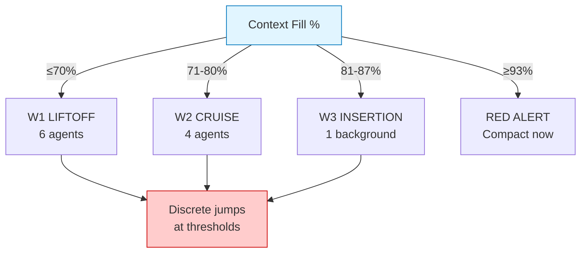
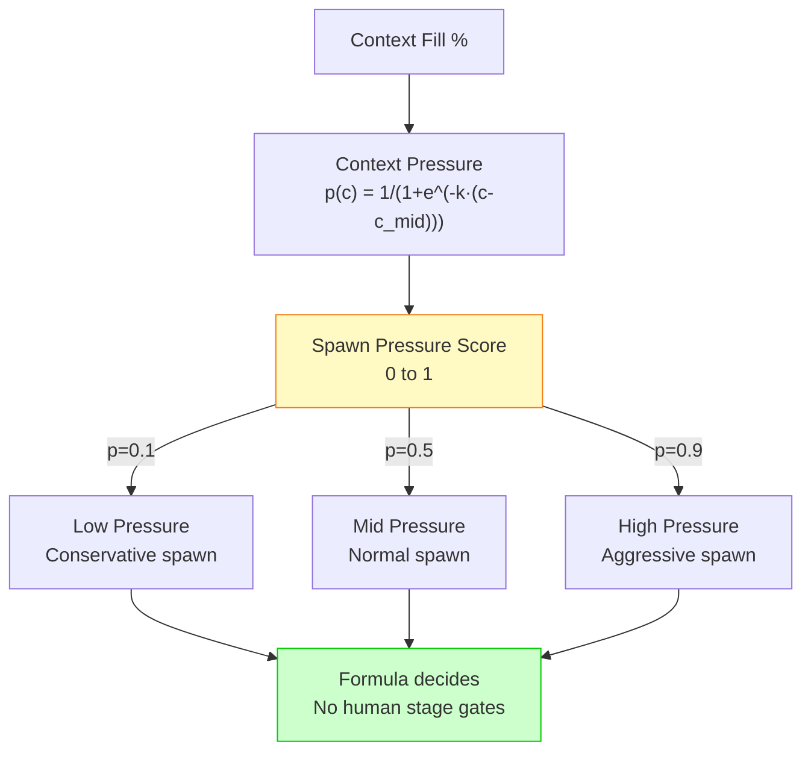
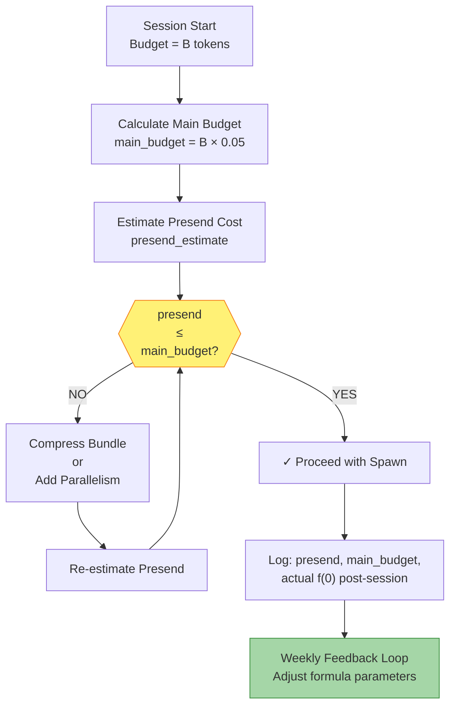
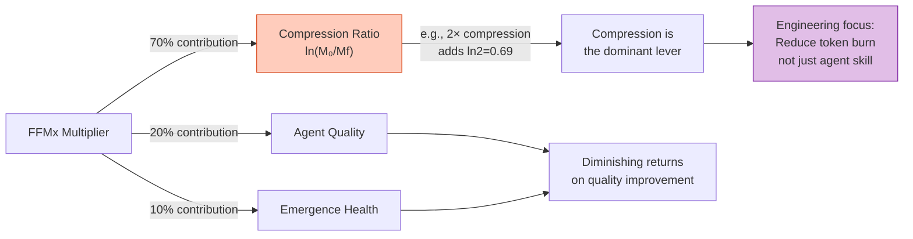
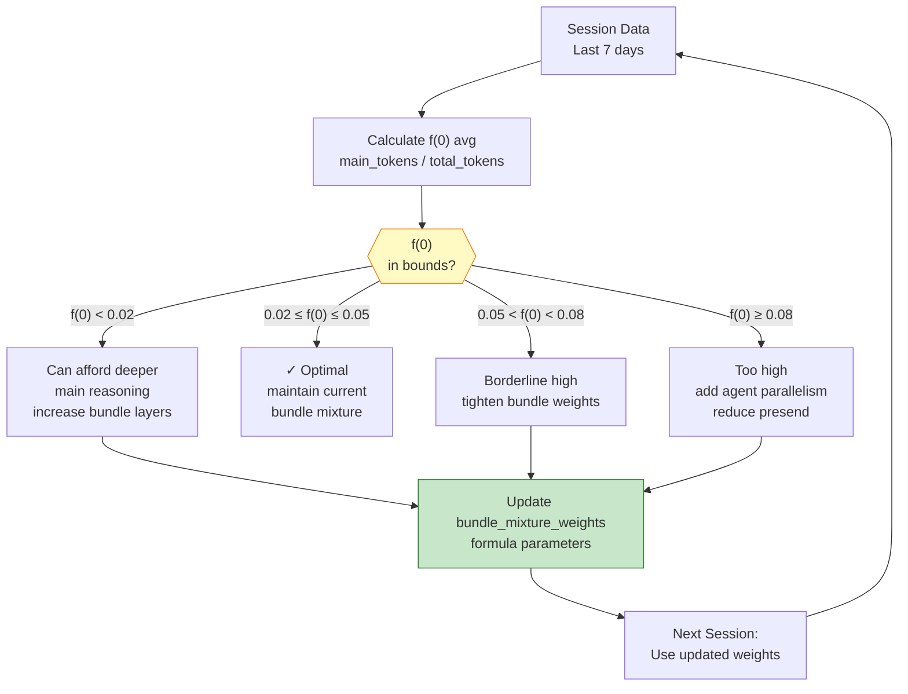
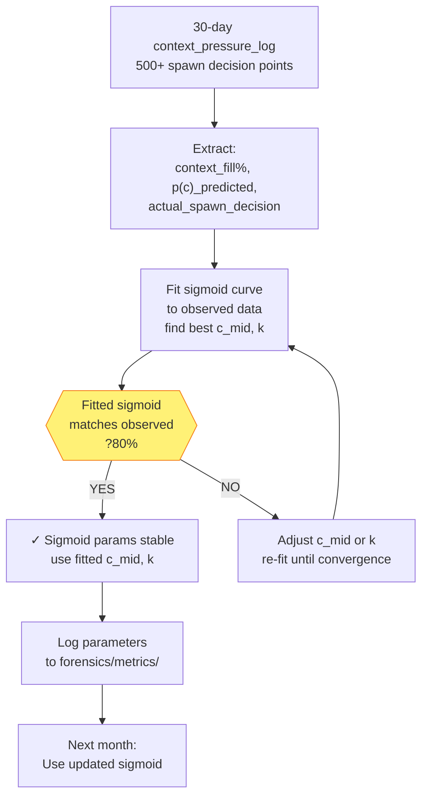
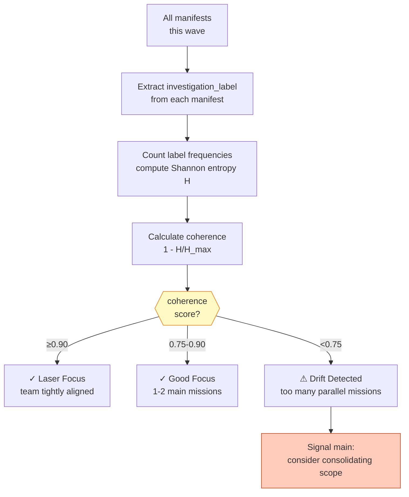
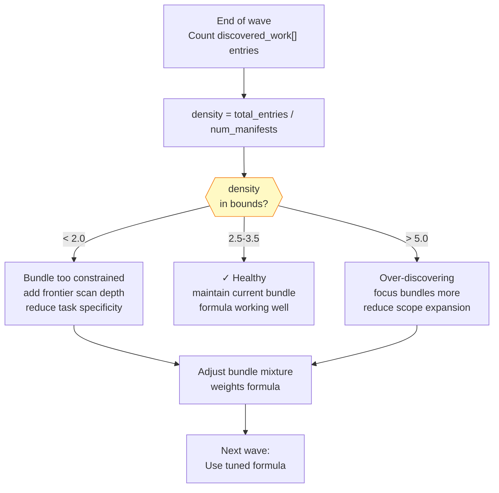
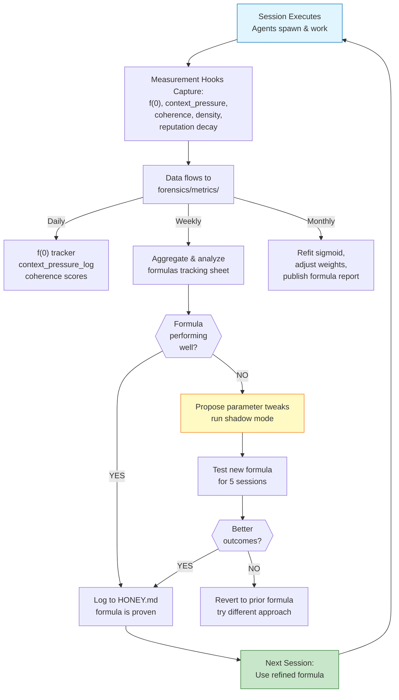

# Faerie2 Living Formula System

**North Star:** f(0) context burden ratio ≤ 5% (measured + enforced via constraint equation)

## 1. System Architecture: From Discrete Waves to Continuous Pacing

### OLD: Discrete Wave Thresholds


**Problem:** Discontinuities at threshold boundaries. Human decides "is it time for W2?"

### NEW: Continuous Context Pressure Sigmoid


**Advantage:** Smooth curve, formula-driven, no discrete jumps. Main doesn't ask "when is W2?"—formula answers.

---

## 2. f(0) as Active Constraint: The Forcing Equation

### Measurement (Passive) vs Constraint (Active)

```
PASSIVE (Old):
  Measure f(0) each session
  Hope it's ≤5%
  Adjust next session if too high
  
ACTIVE (New):
  CONSTRAINT: f(0) ≤ 0.05 (hard limit)
  DERIVED: main_budget = total_budget × 0.05
  DECISION: Before spawn, check presend cost ≤ main_budget
  FEEDBACK: If presend > budget, compress bundle or parallelize
```

### The Forcing Equation

```
Given:
  B = total_session_tokens (e.g., 150,000)
  f(0)_target = 0.05 (5%)
  presend_estimate = estimated orchestration cost

Constraint:
  f(0) = main_tokens / B ≤ 0.05
  
Rearranged (enforcement):
  main_tokens ≤ B × 0.05
  main_tokens ≤ 150,000 × 0.05
  main_tokens ≤ 7,500

Decision Gate:
  IF presend_estimate ≤ 7,500:
    spawn normally
  ELSE:
    reduce bundle size OR increase agent_count
    re-estimate, check again
```

### f(0) Enforcement Loop (Mermaid)



---

## 3. Compression Ratio Dominates FFMx: The Logarithmic Lever



---

## 4. Living Formula Feedback Loops

### Weekly f(0) Adjustment Loop



### Monthly Context Pressure Sigmoid Refit



---

## 5. Mission Coherence: Team Focus Metric

```
Entropy-based focus score:

coherence = 1 - H(labels) / H_max

Where:
  H(labels) = Shannon entropy of investigation_labels in discovered_work[]
  H_max = log₂(num_unique_labels)

Interpretation:
  coherence ≈ 1.0  →  Team laser-focused on 1-2 missions
  coherence ≈ 0.5  →  Team scattered across many missions
  coherence < 0.75 →  ⚠ Mission drift detected
```

### Coherence Monitoring



---

## 6. Reputation Decay: Meritocratic Agent Selection

```
Prevent permanent caste system: decay old scores, enable comebacks

score_aged(t) = score₀ / (1 + λ·days)

Where:
  score₀ = initial reputation score
  λ = decay constant (0.1 per day by default)
  days = time since agent's last spawn
  
At λ=0.1:
  Day 0: score₀ (100%)
  Day 7: score₀ / 1.7 ≈ 59% (half-life)
  Day 30: score₀ / 4 = 25% (fully reset to baseline)
```

### Decay Curve (Excalidraw-style)

```
Reputation Score vs Time

100% |●
     |  ╲
 75% |    ╲
     |      ╲
 50% |        ●─────← Half-life: ~7 days
     |          ╲
 25% |            ╲___●
     |
  0%  ├─────┬─────┬─────┬─────┐
     0      7     14    21    30  days

λ = 0.1 (decay per day)

Logic:
  - Top agent from last month slowly decays
  - New agent with good score rises quickly
  - System meritocratic, not monopolistic
```

---

## 7. Discovery Density: Signal Quality per Manifest

```
discovered_work_density = Σ entries in discovered_work[] / num_manifests

Current baseline: 2.8 entries/manifest
Target: 3.5 entries/manifest

Interpretation:
  density < 2.0 →  Agent bundles too constrained; not discovering enough
  density 2.5-3.5 →  ✓ Healthy discovery rate
  density > 5.0 →  May be over-discovering (signal noise, false positives)
```

### Density Feedback



---

## 8. Complete Feedback Loop: From Measurement to Living Formula



---

## Summary: F(0) Constraint + Living Formulas

| Aspect | Old Approach | New Approach |
|--------|--------------|--------------|
| **f(0)** | Measured passively | Enforced as constraint (≤5%) |
| **Wave Timing** | Discrete thresholds (W1/W2/W3) | Continuous sigmoid formula |
| **Pacing Decision** | Human judgment ("is it W2 time?") | Formula query (p(c) score) |
| **Agent Quality** | Static rankings | Decaying reputation (meritocratic) |
| **Team Focus** | Gut feeling | Measured coherence (entropy-based) |
| **Feedback** | One-time fixes | Living loops (weekly + monthly) |
| **Formulas** | Static parameters | Refit monthly on data |

**Result:** Main doesn't manage waves—formulas do. Main focuses on mission intent, formulas handle pacing.

---

**Next Actions:**
1. ✓ Wire measurement hooks (9x_f0_tracker.py, 9x_context_pressure_logger.py)
2. ✓ Implement f(0) constraint enforcement
3. ✓ Run Phase 1 (measurement: 3-5 sessions)
4. → Phase 2 (sigmoid shadow mode: sessions 4-8)
5. → Phase 3 (cutover: replace wave gates with formula)
