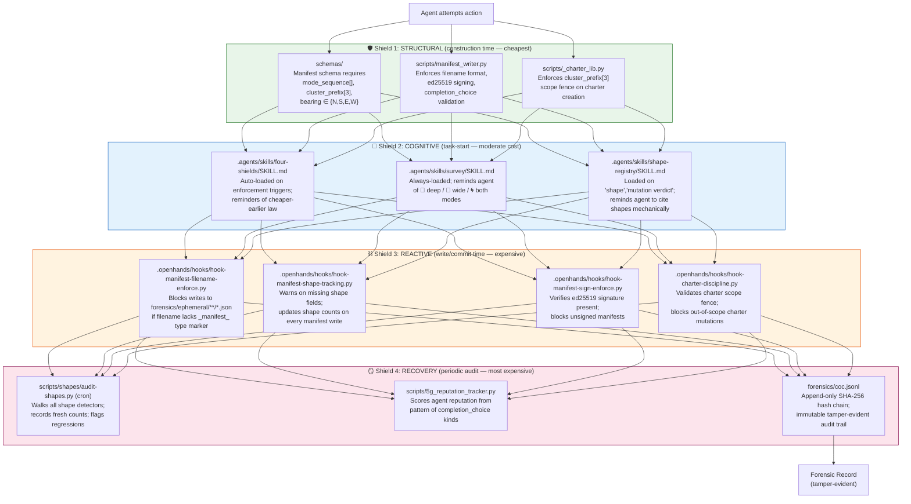
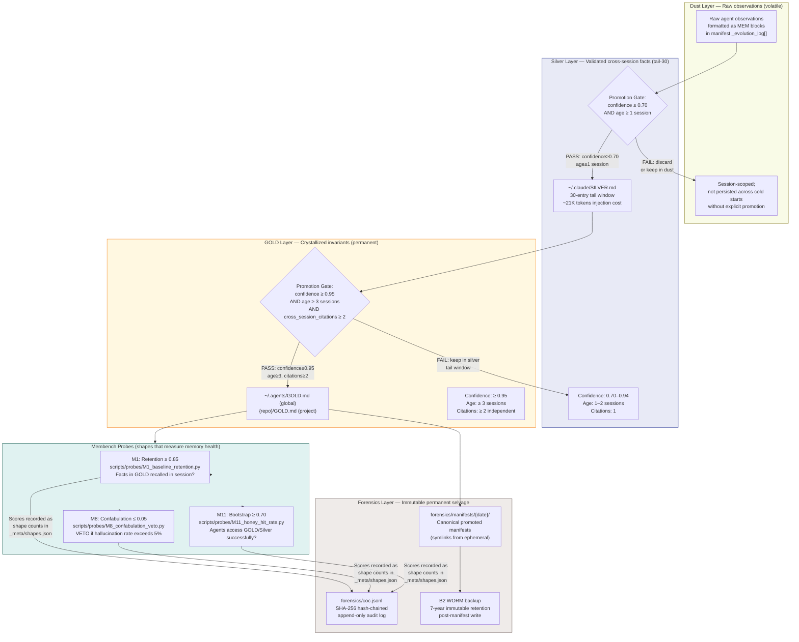
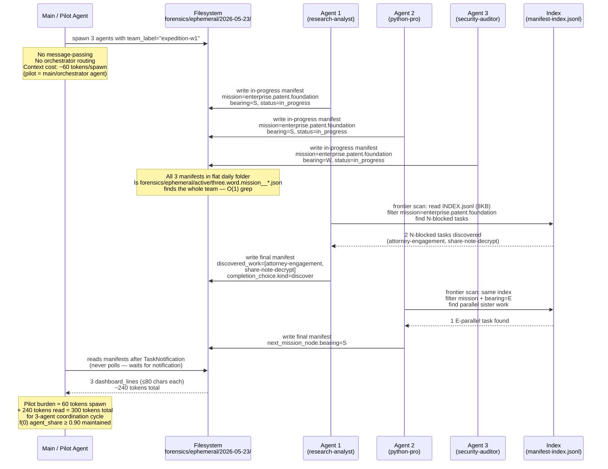
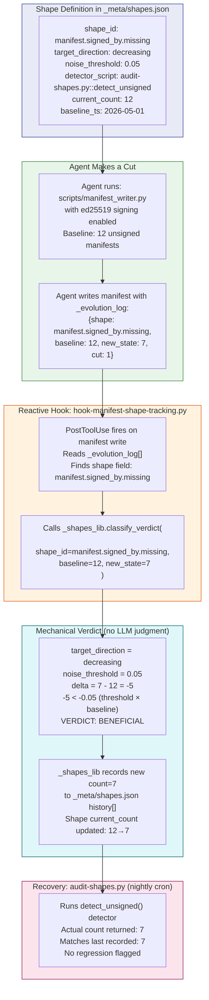

> **⚠️ DRAFT — NOT LEGAL ADVICE — ATTORNEY REVIEW REQUIRED**
>
> This document is a consolidated draft prepared from agent-authored source artifacts. It is intended for review by a registered patent attorney before any USPTO filing. Inventor names + addresses + entity information must be completed before submission.
>
> **Ancestor sources** (originals preserved verbatim at `docs/patent/_source/`):
>
> 1. `PATENT-PROVISIONAL-SPECIFICATION.md` — the 487-LOC technical core (Claims 1-6 + overall combination)
> 2. `PATENT-CLAIM-7-ZERO-KNOWLEDGE.md` — Claim 7 + dependent claims 7a/7b/7c/7d (zero-knowledge customer-key-custody architecture)
> 3. `BIBLIOGRAPHY-VERIFIED.md` — Vancouver-style verified bibliography with URL verification status markers
>
> Citation style: Vancouver numbered endnotes (the bibliography section at the end of this document). For inline reference: `[1]`, `[2]`, etc.
>
> **Promoted to `business/patent/` 2026-05-23, consolidated to `docs/patent/` 2026-06-04** from `forensics/charters/expeditions/enterprise-patent-foundation/polished-deliverables/`.


# PATENT PROVISIONAL SPECIFICATION
## Autonomous Multi-Agent Orchestration System with Forensic Cryptographic Backbone, Append-Only Hash-Chained Chain-of-Custody, Stigmergic Filesystem Coordination, Four-Layer Enforcement Stack, and Mechanical Quality Classification

> **BACKBONE NOTE (re-centered 2026-06-04):** The forensic cryptographic backbone — append-only ed25519-signed hash-chained COC (forensics/coc.jsonl), Merkle rollups, Rekor transparency-log anchoring, B2 WORM immutability, zero-vendor customer-key custody — is the load-bearing spine of this invention. Every other module (stigmergic orchestration, identity sovereignty, mission-graph, encrypt-to-customer delivery) inherits its integrity guarantees FROM the backbone. Prior drafts listed the forensic layer as one module among many; this re-centered draft frames it as the foundational layer all other claims build upon.

**Filing type:** Provisional Application for Patent
**Filing basis:** 35 U.S.C. § 111(b)
**Cover sheet:** USPTO Form SB/16 (PTO/SB/16) — attach separately
**Entity status:** Individual inventors (micro entity filing recommended — verify current qualification criteria at USPTO fee schedule)
**Filed by:** [INVENTOR 1 NAME — OPEN QUESTION] and [INVENTOR 2 NAME — OPEN QUESTION], joint inventors
**Note:** This is a DRAFT specification prepared for attorney review. Inventor names, residence addresses, and entity information must be completed before filing.


### CROSS-REFERENCE TO RELATED APPLICATIONS

No prior provisional or non-provisional applications are claimed as priority. This application establishes the initial priority date for all subject matter described herein.

The inventors note that a related technical charter (`forensic-coc-v2-rekor`) covering a Merkle-tree-based forensic chain-of-custody architecture may be subject to a separate or combined provisional filing — this is an open question recorded in Section 7 (Open Questions for Attorney).


### FIELD OF THE INVENTION

This invention relates to multi-agent artificial intelligence orchestration systems, and more particularly to: 

(1) a forensic cryptographic backbone comprising an append-only ed25519-signed hash-chained chain-of-custody ledger (COC), Merkle rollups providing constant-cost branch state compression, Rekor transparency-log anchoring for public tamper-evidence, B2 WORM immutable cloud backup, and zero-vendor customer-key custody — this backbone is the foundational spine from which all other system properties derive their integrity; 

(2) a hierarchical memory architecture with mechanical promotion gates between memory tiers, whose tamper-evident auditability is provided by the forensic backbone; 

(3) a stigmergic agent coordination system using filesystem manifests as the sole coordination substrate, all manifest writes chained into the forensic backbone; 

(4) a four-layer enforcement stack modeled on biological immune system defense, whose recovery audit layer reads the forensic backbone; and 

(5) a mechanical quality classification system using shape registries with declared target directions, whose measurement substrate is grounded in the backbone's tamper-evident records. 

The invention further claims the novel combination of all five modules into a single coherent AI orchestration ecosystem whose trustworthiness derives architecturally from the forensic backbone rather than from organizational policy.


### BACKGROUND OF THE INVENTION

**1. Problems in current AI agent memory systems**

Current large language model (LLM) agent systems suffer from memory degradation and hallucination caused by undifferentiated memory storage. Systems that store all observations in a single flat memory layer (e.g., a single vector database or a monolithic context window) fail to distinguish between raw unverified observations, validated cross-session facts, and immutable invariants. This causes several specific technical failures:

(a) **Stale memory contamination**: Observations that were valid in one session but later invalidated by new evidence continue to surface in retrieval, causing agents to act on outdated or contradictory beliefs. Current systems provide no mechanical gate between raw observations and the long-term memory store.

(b) **Hallucination amplification**: Without a promotion gate that requires minimum confidence score and cross-session citation count, low-confidence observations propagate into long-term memory and generate compounding errors across future sessions.

(c) **Context window saturation**: Flat memory architectures inject all historical observations into every agent's context at startup, consuming large fractions of the available token budget before any new work begins. A 200,000-token context window with naive memory injection may be 60-80% consumed by historical data before the agent performs its first action.

(d) **No measurement substrate**: Current systems lack a mechanical substrate linking memory operations to measurable quality outputs. There is no programmatic way to assert "memory promotion improved agent quality" without manual evaluation.

**2. Problems in current multi-agent coordination systems**

Current multi-agent AI systems rely on one of two coordination patterns, both of which introduce serious bottlenecks:

(a) **Orchestrator/router pattern**: A central orchestrator LLM receives all agent requests, routes them to worker agents, and aggregates results. This creates a single point of failure, a throughput bottleneck, and imposes LLM inference cost on every inter-agent communication. Scaling to N agents scales the orchestrator linearly.

(b) **Message-passing pattern**: Agents communicate via message queues or direct API calls. This requires agents to maintain awareness of each other's addresses and availability, creating tight coupling. Cost of each message to N agents scales quadratically, not just linearly. Message-passing systems fail silently when an agent is unavailable, and produce race conditions when multiple agents attempt to update shared state concurrently. Main reason for bugginess and failure of Claude's Agent Teams feature.

Neither pattern enables true emergent coordination — the ability for agents to discover each other's work and self-route to unblocked tasks without explicit scheduling.

**3. Problems in current AI safety enforcement systems**

Current AI safety systems apply enforcement reactively — monitoring outputs after they are produced and flagging violations. This reactive-only approach has two fundamental problems:

(a) **Cost at the wrong layer**: Catching a harmful output after generation is maximally expensive in terms of compute, latency, and potential damage. Prevention before generation is orders of magnitude cheaper but current systems rarely achieve structural prevention.

(b) **Whack-a-mole without immune memory**: Reactive systems catch specific known violations but do not build up a structural immune response. The same class of violation recurs in new forms because the underlying structural gap was never closed. Current systems have no analog to the biological immune system's memory T-cell mechanism that produces faster, stronger responses to previously-seen threats.

**4. Problems in current AI quality measurement**

Current AI system quality evaluation relies on human judgment or LLM-as-judge approaches. Both suffer from:

(a) **Vibe-based verdicts**: Human and LLM evaluators produce subjective assessments ("this looks better") that are not reproducible across sessions, not comparable across agents, and cannot drive automated improvement loops.

(b) **No genetic algorithm substrate**: Without integer-comparable, mechanically-produced quality signals, it is impossible to implement selection pressure that reliably improves agent behavior over time. Genetic algorithm-style improvement requires fitness functions that are deterministic, comparable, and not dependent on human judgment for each evaluation.


### SUMMARY OF THE INVENTION

The present invention provides an autonomous multi-agent orchestration system built on a **Forensic Cryptographic Backbone** that is the foundational load-bearing spine from which all other system properties inherit their integrity. Five technical modules compose on top of this backbone:

**Forensic Cryptographic Backbone — The Load-Bearing Spine**
An append-only, ed25519-signed, SHA-256 hash-chained chain-of-custody ledger (`forensics/coc.jsonl`) in which each entry carries a `parent_hashes[]` DAG array linking to its predecessor(s), enabling both linear chain and two-parent merge structures. The backbone provides: 

(1) **append-only tamper-evidence** — modifying any historical entry invalidates all subsequent hashes, mechanically detectable by `scripts/manifest_verifier.py`; 

(2) **Merkle rollups** — per-branch forensic trees compressed to a constant 32-byte root via `scripts/_merkle_tree.py` (14/14 tests pass, SHA-256: `79d22d9e…`), enabling branch history of arbitrary depth to be represented in a single COC entry; 

(3) **Rekor transparency-log anchoring** — handshake Merkle roots submitted to Sigstore Rekor (log_index 1630813609 for v2 genesis seal, entry_hash `80f56b10…`, commit `6890b4ab`), creating a public tamper-evident timestamp independent of the operator; 

(4) **B2 WORM immutable backup** — 7-year WORM retention via `scripts/b2_realtime_uploader.py` triggered on every manifest write, making historical records irrecoverable from tampering; 

(5) **zero-vendor customer-key custody** — ed25519 signing keys generated server-side, delivered to customer via zero-retention pipeline, and erased from vendor storage, such that vendor cannot forge chain-of-custody signatures (Claim 7 architecture). This backbone is not a feature of the system — it is the foundation every other module writes into and reads from for its integrity guarantees.

**Module 1 — Hierarchical Memory Architecture with Mechanical Promotion Gates (inherits backbone)**
A three-tier memory system (dust → silver → GOLD) with a separate immutable forensic layer (forensics/), in which promotion between tiers is governed by mechanical rules: minimum confidence score (≥0.95), minimum session age (≥3 sessions), and minimum independent cross-session citation count (≥2). Promotion is executed by a canonical script (`scripts/manifest_writer.py`) that simultaneously evaluates gate criteria and appends an entry to the forensic backbone's append-only COC (`forensics/coc.jsonl`) with SHA-256 hash linking between entries and ed25519 signature. The backbone provides the tamper-evident audit trail that makes the promotion decision legally and technically defensible.

**Module 2 — Stigmergic Filesystem Coordination (inherits backbone)**
A multi-agent coordination architecture in which agents discover each other's work and self-route to unblocked tasks exclusively through shared filesystem artifacts (manifests). No message-passing, no central orchestrator, no inter-agent API calls. Agents write manifests to a flat daily folder (`forensics/ephemeral/{YYYY-MM-DD}/`) following a deterministic filename grammar. A frontier scanner (`scripts/2d_frontier_scanner_indexed.py`) enables O(1) lookup of unblocked tasks by reading an 8KB daily index rather than scanning all manifests, reducing context cost by approximately 80% versus naive full-manifest scanning. Every manifest write is chained into the forensic backbone via PostToolUse hooks, so coordination history is tamper-evident.

**Module 3 — Four-Layer Enforcement Stack, Four-Shields (inherits backbone)**
A discipline enforcement architecture modeled on biological immune system defense, comprising: (a) structural prevention (wrong behavior cannot be expressed, enforced by schema and canonical writer scripts); (b) cognitive reminder (skill files auto-loaded before action); (c) reactive blocking (PostToolUse hooks reject violations at OS write boundary); and (d) recovery audit (periodic batch scans that surface escaped violations and update reputation scores). The recovery layer reads the forensic backbone's COC chain to audit enforcement history. Each layer is cheaper to operate than the next, and the four layers together provide defense-in-depth that no single layer can provide alone.

**Module 4 — Shape Registry with Mechanical Verdict Classification (inherits backbone)**
A quality classification system in which every recognizable, countable pattern of work ("shape") is declared in a registry (`_meta/shapes.json`) with a `target_direction` field (increasing/decreasing/bounded/stable). A reactive hook (`scripts/shapes/_shapes_lib.py::classify_verdict`) computes mutation verdicts (beneficial/neutral/harmful/uncertain) by comparing the observed count delta to the target direction and a noise threshold. No LLM judgment in the verdict path. Quality signals are integer-comparable across sessions, enabling genetic-algorithm-style improvement selection. Verdict records are written to the forensic backbone, making the quality history tamper-evident.

**Module 5 — Membench Quality Measurement Substrate (inherits backbone)**
A quality measurement architecture in which evaluation probes (M1 baseline retention, M8 confabulation veto, M11 silver bootstrap uptime, and their F-series internal mirrors) are themselves first-class shapes in the shape registry. This creates a closed loop between memory operations and quality measurement: memory promotion decisions directly affect probe scores, which are classified mechanically by the same shape-registry verdict system that classifies all other work patterns. The membench scorer (`scripts/3k_membench_scorer.py`) computes M3 (efficiency), SI (stigmergy index), and SBI (switchboard burden index) deterministically from fixed eval data, enabling reproducible T0 vs T1 comparison. Probe results are anchored to the backbone, providing a tamper-evident quality history.

**Combination Claim — Overall Novel System**

> [!INFO] 
> The novel combination of the forensic cryptographic backbone and all five modules into a single coherent AI orchestration ecosystem where every claim of quality improvement, every coordination event, and every enforcement decision is backed by the same cryptographic substrate. Individual modules may be open-sourced; the combination claim retains patent protection over the integrated system design whose integrity derives architecturally from the forensic backbone rather than from organizational policy.


### BRIEF DESCRIPTION OF DRAWINGS

Four diagrams are provided. Formal USPTO drawings are not required for provisional applications but are highly recommended. The following Mermaid-format diagrams may be rendered into figures for the non-provisional filing.

**Figure 1** — Four-Shields Lifecycle Enforcement Stack (Diagram A)
**Figure 2** — Memory Orchestration Hierarchy with Mechanical Promotion Gates (Diagram B)
**Figure 3** — Stigmergic Multi-Agent Coordination via Filesystem Manifests (Diagram C)
**Figure 4** — Shape Registry Mechanical Verdict Classification (Diagram D)


#### Figure 1 — Four-Shields Lifecycle Enforcement Stack



**Technical improvement:** This architecture eliminates the "reactive whack-a-mole" failure mode of enforcement systems that operate only at a single layer. By enforcing at construction time (schema), task-start (cognitive), write time (hook), and audit time (cron), the system catches violations at the cheapest possible layer. A violation caught by the structural schema costs approximately zero compute; the same violation caught post-generation by the recovery audit costs 1-2 orders of magnitude more.


#### Figure 2 — Memory Orchestration Hierarchy with Mechanical Promotion Gates



**Technical improvement:** The mechanical promotion gates eliminate the "stale memory contamination" failure mode. A fact cannot advance to GOLD without surviving 3 independent sessions and achieving 2 cross-session citations at confidence ≥ 0.95. This is not an LLM judgment — it is a mathematical threshold enforced by the `gold-confidence-floor.formula.json` rule evaluated by the canonical writer script. The silver tail window (30 entries, ~21K tokens injection cost) prevents context saturation while maintaining session continuity. Every promotion event writes to the forensic backbone (Tier 4), creating a tamper-evident audit trail of the memory system's complete history.


#### Figure 3 — Stigmergic Multi-Agent Coordination via Filesystem Manifests



**Technical improvement:** This architecture eliminates the orchestrator/router bottleneck by removing the central coordinator entirely. Agents discover each other's work through the shared filesystem substrate, not through message-passing. The frontier scanner (`scripts/frontier_scanner_indexed.py`) reads an 8KB daily index file rather than all manifests, reducing context cost by approximately 80% (from ~2,500KB naive to <100KB indexed). An N-agent team can coordinate at O(1) lookup cost via filename grammar matching (`ls *__{team-label}__*.json`).


#### Figure 4 — Shape Registry Mechanical Verdict Classification



**Technical improvement:** The mechanical verdict classification removes LLM judgment from the quality assessment path. The verdict (beneficial/neutral/harmful/uncertain) is computed by a mathematical comparison: `delta < -(noise_threshold × baseline)` → beneficial; `|delta| ≤ (noise_threshold × baseline)` → neutral; `delta > +(noise_threshold × baseline)` → harmful. This is deterministic, reproducible, and integer-comparable across sessions. The same classification applies to all shapes including membench probes, enabling genetic-algorithm-style improvement selection without human evaluation overhead.


### DETAILED DESCRIPTION OF THE PREFERRED EMBODIMENT

#### Section 1 — Memory Orchestration Architecture (Claim Area 1)

**Technical Problem:** Large language model agents operating across multiple sessions experience memory degradation caused by the absence of mechanical promotion gates between memory tiers. Current systems either inject all historical context into every session (causing context saturation and stale-data contamination) or discard all memory between sessions (causing agents to repeat failed experiments and re-derive known facts).

**Specific Implementation:**

The invention provides a four-tier memory architecture:

*Tier 1 — Dust (volatile observations):* Raw agent observations formatted as MEM blocks embedded in manifest `_evolution_log[]` arrays. These are session-scoped; they do not persist to long-term memory without passing through the promotion gates. (Historical term: "pollen" — updated to "dust" for nautical ontology consistency.)

*Tier 2 — Silver (validated cross-session facts):* A tail-windowed memory store (default: 30 entries, approximately 21,000 tokens injection cost at 700 tokens/entry average). Facts in silver carry confidence scores in the range 0.70–0.94. The tail window (controlled by the `silver-tail-window.formula.json` parameter, current default: 30 entries) prevents context saturation while maintaining cross-session continuity. (Historical term: "NECTAR" — updated to "silver" for nautical ontology consistency.)

*Tier 3 — GOLD (crystallized permanent invariants):* A write-protected memory store containing only facts that have survived the following mechanical gate: confidence ≥ 0.95, session age ≥ 3 sessions, and independent cross-session citation count ≥ 2. These thresholds are encoded in `forensics/schemas/formulas/honey-confidence-floor.formula.json` and enforced by the canonical writer `scripts/manifest_writer.py`. GOLD is stored at `~/.claude/GOLD.md` (global, all-projects) and `{repo}/GOLD.md` (project-specific). The project GOLD is read before the global GOLD; project-specific invariants take precedence.

*Tier 4 — Forensic Cryptographic Backbone (immutable permanent selvage — the load-bearing spine):* The append-only, ed25519-signed, SHA-256 hash-chained chain-of-custody log (`forensics/coc.jsonl`) stores every memory operation. This tier is not merely a logging layer — it is the structural foundation that provides tamper-evidence to all other tiers. Each entry carries: SHA-256 hash of the previous entry (or previous entries, via `parent_hashes[]` for merge manifests), SHA-256 hash of the current entry's data, agent identifier, tool call type, file path, bytes changed, and an ed25519 signature from the writing agent's key. 

The hash formula is: `entry_N.hash = SHA-256(entry_{N-1}.hash || entry_N.data)`. This chain is tamper-evident: modifying any entry breaks all subsequent hashes, detectable by `scripts/manifest_verifier.py`. 

The backbone provides three further integrity layers beyond the local hash chain: 

(a) **Merkle rollup compression** — per-branch ledgers are compressed to a constant 32-byte Merkle root (`scripts/_merkle_tree.py`, M-06: 14/14 tests pass, SHA-256: `79d22d9ea7dd9bc1…`), enabling branch histories of arbitrary depth to be incorporated into the main chain via a single signed two-parent merge entry; 

(b) **Rekor transparency-log anchoring** — handshake Merkle roots are submitted to the public Sigstore Rekor log (actual anchor: log_index 1630813609, uuid `108e9186…`, entry_hash `80f56b10…`, commit `6890b4ab`), providing a public timestamp independent of the operator that proves specific COC state existed at a specific time; 

(c) **B2 WORM immutable backup** — 7-year WORM retention via `scripts/b2_realtime_uploader.py` triggered on every manifest write, making historical records irrecoverable from tampering even by the operator. Customer-held ed25519 signing keys (Claim 7) complete the backbone: since private signing keys are delivered to customers and erased from vendor storage, the vendor cannot forge any historical COC entry.

**Promotion mechanics:** The canonical writer (`scripts/manifest_writer.py`) evaluates the promotion gate criteria when an agent attempts to promote a dust observation to silver or a silver entry to GOLD. The writer is the structural shield for this discipline — a promotion that fails the confidence/age/citation gate cannot be written; the wrong thing cannot be expressed at the schema level. Every promotion simultaneously writes to the forensic backbone, so the promotion event is tamper-evidently recorded.

**Why append-only JSONL beats RDBMS for forensic COC (computational analysis):** See Section 9-DB for the full analysis. Summary: O(1) tail-append vs. transactional overhead; hash-chain tamper-evidence vs. mutable rows; lock-free parallel-agent writes vs. row/table locks; plain-JSONL portability and court-readability vs. proprietary DB dumps; replay/verification speed. The forensic backbone's append-only JSONL substrate is both faster and more forensically sound than a relational database for this workload.

**Technical Effect:** This architecture provides three measurable improvements: (1) elimination of stale-memory contamination by preventing sub-confidence observations from entering GOLD; (2) reduction of context window saturation from approximately 60-80% (naive injection) to approximately 10-15% (NECTAR tail-30 injection) of available token budget; (3) a measurable confabulation rate gate (M8 probe, threshold ≤ 0.05 hallucination rate) that vetoes agent operation if the memory system's accuracy falls below threshold.

**Working demonstration:** `scripts/probes/M1_baseline_retention.py`, `scripts/probes/M8_confabulation_veto.py`, `scripts/probes/M11_honey_hit_rate.py` are operational probe implementations running against the swarmy repository. The membench scorer (`scripts/membench_scorer.py`) computes these metrics deterministically from fixed eval data, enabling reproducible T0 vs T1 comparison.


#### Section 2 — Stigmergic Agent Coordination (Claim Area 2)

**Technical Problem:** Multi-agent AI systems require coordination mechanisms that scale to N agents without creating a central bottleneck. Orchestrator/router patterns scale linearly with agent count; message-passing patterns create tight coupling and race conditions. Neither enables emergent self-routing.

**Specific Implementation:**

The invention provides a stigmergic coordination architecture in which the filesystem is the exclusive coordination substrate. No message-passing. No central orchestrator. No inter-agent API calls.

**Mission addressing (w3w grammar):** Every task is assigned a mission address consisting of exactly three atomic terms separated by dots (e.g., `enterprise.patent.foundation`). This "what-three-words" (w3w) addressing provides an adjacency property: missions sharing one term are neighbors; missions sharing two terms are in the same neighborhood; missions sharing all three terms are identical. Agents filter the frontier by mission address to discover relevant work without scanning all tasks.

**Manifest filename grammar:** Every manifest written by an agent follows the deterministic filename format: `{mission}{YYYY-MM-DD}T{HH-MM-SS}Z__{agent_type}_{session_id}.json`. This format is enforced by `scripts/manifest_writer.py` (structural shield) and by `.openhands/hooks/hook-manifest-filename-enforce.py` (reactive hook that blocks writes lacking the `_manifest_` type marker). The deterministic format enables grep-based discovery at zero context cost: `ls forensics/ephemeral/active/*__{mission}__*.json` finds all manifests for a given mission.

**Flat active missions folder:** All manifests relating to active charters land in `forensics/ephemeral/active/` — a single flat folder shared by all agents regardless of mission or charter. 

> [!INFO]
> This is the stigmergic substrate: agents leave markers (manifests) in the shared environment; other agents detect the markers and self-route to unblocked work. No per-agent subdirectories; no task-specific isolation.

**Compass bearings:** Every manifest carries a bearing field (N/S/E/W) encoding the work's relationship to the mission frontier: N = unblock upstream prerequisite; S = conclude / move downstream; E = parallel sister work at same DAG level; W = return to baseline / re-seat assumptions. The `bearing-diversity-entropy.formula.json` formula measures the Shannon entropy of bearing distribution (H = -Σp_i log₂ p_i where i ∈ {N,S,E,W}). Healthy mission graphs maintain entropy H ≥ 0.87 bits (target encoded in `scripts/emergence_metrics.py`).

**Indexed frontier scanner:** The frontier scanner (`scripts/2d_frontier_scanner_indexed.py`) reads a daily 8KB index file (`forensics/ephemeral/active/INDEX.jsonl`) rather than scanning all manifests. The index aggregator pre-computes one summary line per manifest grouped by mission and bearing. This reduces frontier scan context cost from approximately 2,500KB (naive full-manifest scan) to approximately 100KB (indexed scan), an approximately 80% reduction.

**In-flight cap:** The manifest index enforcer (`scripts/manifest_index_enforcer.py`) gates Agent() spawns by checking that `in_flight_count + agents_to_spawn ≤ 10` (the `in-flight-manifest-cap.formula.json` maximum). This prevents queue overload while maintaining the maximum parallelism the hash-chain integrity requires (COC append latency target: ≤100ms).

**Technical Effect:** The stigmergic architecture eliminates the orchestrator/router bottleneck entirely. An N-agent team coordinates through filesystem reads alone. The pilot agent's burden (f(0) metric, computed as `agent_share = 1 - (main_ops / total_ops)`) targets agent_share ≥ 0.90 — meaning ≥90% of all operations are performed by subagents, leaving the main agent free for high-leverage spawning decisions rather than routing. The spawn cost to main is approximately 60 tokens per agent (baseline spawn: `cost_per_agent = 60` in `scripts/2a_spawn_pressure.py`). All coordination events — including handoff signals between agents — are chained into the forensic backbone, making the coordination history tamper-evidently auditable.

**Working demonstration:** `scripts/2d_frontier_scanner_indexed.py` is the operational indexed frontier scanner. `scripts/2a_spawn_pressure.py` implements the sigmoid spawn pressure formula (`pressure = sigmoid(context_pct, midpoint=0.5, steepness=8.0)`) that gates spawn decisions to context-fill level.


#### Section 3 — Four-Layer Enforcement Stack (Claim Area 3)

**Technical Problem:** AI system safety and integrity enforcement that operates only at a single layer (e.g., output monitoring) is brittle, expensive, and reactive. Violations propagate until the monitoring layer catches them, by which point they may have caused significant downstream damage. No existing AI orchestration system models enforcement on the cheaper-earlier principle analogous to biological immune defense.

**Specific Implementation:**

The invention provides a four-layer enforcement stack in which each layer is cheaper to operate than the next, and all four layers together provide defense-in-depth that eliminates the "reactive whack-a-mole" failure mode.

*Layer 1 — Structural (🛡):* Violations cannot be produced at construction time. The canonical manifest writer (`scripts/manifest_writer.py`) enforces schema at the point of generation: manifests without `cluster_prefix[3]`, without `bearing ∈ {N,S,E,W}`, without `mode_sequence[]`, without `completion_choice.kind` in the canonical six-choice vocabulary cannot be written. Charter creation (`scripts/_charter_lib.py`) enforces `cluster_prefix[3]` at charter genesis. Schema files in `forensics/schemas/` provide the structural definitions. This layer fires at construction time and costs approximately zero compute per enforcement.

*Layer 2 — Cognitive (🧠):* Skill files (`.agents/skills/{name}/SKILL.md`) carry `triggers:` keyword lists that cause them to auto-load when an agent's task description matches the trigger phrases. The four-shields skill itself auto-loads on "enforcement", "immune system", "four layer" triggers; the shape-registry skill auto-loads on "shape", "mutation verdict", "target_direction" triggers; the forage skill is always-loaded (no triggers needed). These skills remind agents of constraints before actions are taken. This layer fires at task-start and costs approximately one skill-file read per constraint.

*Layer 3 — Reactive (⛓):* PostToolUse hooks (`.openhands/hooks/*.py`) fire at the OS write boundary and can block writes that violate constraints. `hook-manifest-filename-enforce.py` blocks writes to `forensics/ephemeral/**/*.json` that lack the `_manifest_` type marker in the filename. `hook-manifest-shape-tracking.py` warns on `_evolution_log[]` entries missing numeric baseline/new_state fields. `hook-manifest-sign-enforce.py` blocks unsigned manifests. This layer fires at write time and costs one hook execution per write.

*Layer 4 — Recovery (🪞):* Periodic batch audits (`scripts/shapes/audit-shapes.py` as nightly cron) scan all shape detectors, record fresh counts, and flag regressions. The reputation tracker (`scripts/5g_reputation_tracker.py`) scores agent reputation from patterns in completion_choice kinds over time. This layer fires asynchronously and catches violations that escaped the earlier layers; it also builds "immune memory" for recurring violation patterns.

**The biology framing (formally analogous):** Layer 1 = skin (physical barrier, prevents most insults without active sensing); Layer 2 = olfactory/chemical recognition (recognizes threat before contact, informs behavior); Layer 3 = innate immune response / antibody neutralization (specific threat neutralization on contact); Layer 4 = adaptive immunity / memory T-cell (learns patterns, responds faster and stronger to previously-seen threats).

**Technical Effect:** The four-layer stack implements the "cheaper-earlier is the law" principle mechanically. A violation caught by the structural schema (Layer 1) costs approximately 0 additional compute beyond the normal manifest write. The same violation caught by the recovery audit (Layer 4) costs 1-2 orders of magnitude more in compute, latency, and potential damage. By closing structural gaps at Layer 1, the system avoids accumulating Layer 4 workload. The disciplines table (`.agents/skills/four-shields/SKILL.md`) tracks which layers are active for each discipline, making enforcement gaps visible rather than hidden.

**Working demonstration:** `.openhands/hooks/hook-manifest-filename-enforce.py` and `.openhands/hooks/hook-manifest-shape-tracking.py` are operational reactive hooks. `scripts/shapes/audit-shapes.py` is the operational recovery cron. `scripts/_charter_lib.py` is the operational structural enforcer for charter scope.


#### Section 4 — Shape Registry with Mechanical Verdict Classification (Claim Area 4)

**Technical Problem:** AI system improvement loops require quality classification that is deterministic, reproducible, and not dependent on LLM judgment. Current "LLM as judge" evaluation approaches produce subjective, non-comparable, session-variable verdicts that cannot drive selection pressure in an improvement loop analogous to genetic algorithms.

**Specific Implementation:**

The invention provides a shape registry (`_meta/shapes.json`) in which every recognizable, countable pattern of work is declared with the following mandatory fields:

```json
{
  "shape_id": "{domain}.{subject}.{mode}",
  "target_direction": "decreasing | increasing | bounded | stable",
  "noise_threshold": 0.05,
  "detector_script": "scripts/shapes/audit-shapes.py::detect_{slug}",
  "current_count": null,
  "baseline_ts": "<ISO8601>",
  "history": [],
  "why_novel": "≤200 chars: distinguishes from existing shapes",
  "how_when_to_use": "≤200 chars: trigger conditions",
  "retirement_criteria": "explicit condition for cutting the tie"
}
```

*Mechanical verdict classification:* The `_shapes_lib.classify_verdict(shape_id, baseline, new_state)` function in `scripts/shapes/_shapes_lib.py` computes verdicts according to the following table:

| target_direction | beneficial | neutral | harmful |
|---|---|---|---|
| decreasing | delta < −threshold | |delta| ≤ threshold | delta > +threshold |
| increasing | delta > +threshold | |delta| ≤ threshold | delta < −threshold |
| bounded | delta ≤ 0 | |delta| ≤ threshold | delta > +threshold |
| stable | (no beneficial state — any drift beyond threshold = harmful) | |delta| ≤ threshold | |delta| > threshold |

where `delta = new_state − baseline` and `threshold = noise_threshold × baseline`.

*Reactive integration:* The hook `hook-manifest-shape-tracking.py` fires on every manifest write, reads `_evolution_log[]` entries that cite a `shape` field, calls `_shapes_lib.classify_verdict()`, records the verdict and the new count into the shape's `history[]` array, and updates `current_count`. This closes the loop between agent actions and quality measurement without requiring any explicit evaluation step.

*Formula composition:* Shape counts are consumed by formula computations in `scripts/_formulas.py`. For example: `formula:signing_coverage = 1 − (shape:manifest.signed_by.missing.current_count / total_manifests)`. Formulas compose shapes into [0,1] metrics; metrics drive improvement selection.

**Technical Effect:** The shape registry provides integer-comparable quality signals across all sessions. Because `classify_verdict()` is deterministic — given the same `shape_id`, `baseline`, and `new_state`, the verdict is always identical — it enables the genetic-algorithm-style improvement selection that LLM-as-judge approaches cannot provide. The mutation fitness rate formula (`mutation-fitness-rate.formula.json`) targets ≥0.85 beneficial verdict fraction; this signal drives spawn strategy adjustments via the sigmoid spawn pressure formula.

**Working demonstration:** `scripts/shapes/_shapes_lib.py` is the operational mechanical verdict classifier. `.openhands/hooks/hook-manifest-shape-tracking.py` is the operational reactive integration hook.


#### Section 5 — Membench Quality Measurement Substrate (Claim Area 5)

**Technical Problem:** Quality measurement in AI systems is typically disconnected from the system's memory and coordination architecture. Evaluation is an external process applied after the fact. This disconnection means that memory architecture changes cannot be automatically detected as quality improvements or regressions; every change requires new manual evaluation.

**Specific Implementation:**

The invention provides a quality measurement architecture in which evaluation probes are themselves first-class shapes in the shape registry. This means: (1) probes are declared in `_meta/shapes.json` with `membench_probe: true`; (2) probe scores are mechanically classified as beneficial/neutral/harmful using the same `target_direction` mechanism as all other shapes; (3) memory promotion decisions directly affect probe scores; and (4) the same formula composition system that drives all other improvement decisions drives memory architecture decisions.

*M-series probes (canonical):*
- **M1 (Baseline Retention, threshold ≥ 0.85):** `scripts/probes/M1_baseline_retention.py` — measures what fraction of GOLD facts are correctly recalled in the current session. Score = `found_facts / total_honey_facts`. PASS ≥ 0.85.
- **M8 (Confabulation Veto, threshold ≤ 0.05):** `scripts/probes/M8_confabulation_veto.py` — measures hallucination rate (claims with zero supporting evidence). Score = `hallucinated_claims / total_claims`. VETO if > 0.05.
- **M11 (Silver Bootstrap Uptime, threshold ≥ 0.70):** `scripts/probes/M11_honey_hit_rate.py` — measures what fraction of agent sessions successfully accessed GOLD.md / SILVER.md without error. Score = `successful_reads / total_read_attempts`. PASS ≥ 0.70. (Historical term: "Honey Bootstrap Uptime" — updated to "Silver Bootstrap Uptime" per nautical ontology.)
- **M3 (Wave History / Efficiency):** `scripts/probes/M3_wave_history_sessions.py` — efficiency of session-over-session context reuse.

*F-series internal mirrors:* The F-series (`scripts/probes/F{N}_*.py`) are internal mirrors of the M-series for self-comparison (current version vs. prior version, rather than against external benchmarks). F-metric thresholds are aliased in `_meta/swarmy.config.json::f_metric_aliases`.

*Membench scorer:* `scripts/3k_membench_scorer.py` computes M3 (efficiency), SI (stigmergy index), and SBI (switchboard burden index) deterministically from fixed eval data in `forensics/ephemeral/2026-04-29/eval-results/`. The scorer is designed for reproducibility: given the same input data, it produces identical output, enabling T0 vs T1 comparison with `p < 0.05 AND effect_size ≥ 10%` as the significance gate.

*Probe runner:* `scripts/3f_membench_probes.py` is the canonical probe runner for M1/M3/M8/M11 and their F-series mirrors.

**Technical Effect:** The closed-loop architecture creates a direct mechanical link between memory operations and quality measurement. When a GOLD promotion improves M1 retention, the probe score rises, the shape is classified as beneficial (target_direction: increasing), and the improvement is recorded in the shape history with a timestamp. When a GOLD corruption causes M8 confabulation to exceed 0.05, the VETO fires and halts agent operation. No human evaluation is required to detect either event. This enables continuous, automated quality assurance for the memory architecture without manual evaluation overhead.

**Working demonstration:** `scripts/3f_membench_probes.py`, `scripts/membench_scorer.py`, and `scripts/probes/M1_baseline_retention.py`, `M8_confabulation_veto.py`, `M11_honey_hit_rate.py` are all operational probe implementations in the swarmy repository.

#### Section 6 — Novel Combination Claim (Claim Area 6)

**Technical Problem:** No existing AI orchestration system combines all five of the above technical modules into a single coherent ecosystem. Individual techniques (hierarchical memory, agent coordination, safety enforcement, quality measurement) exist in isolation. The synergistic technical improvement of their integration is novel and non-obvious.

**Specific Implementation:**

The five modules are integrated through the following cross-module interactions, each producing technical effects not achievable by any individual module:

*Integration 1 — Memory feeds measurement:* GOLD (Module 1) is the data source for M1 retention probes (Module 5). Changes to the GOLD promotion gate directly and mechanically affect M1 scores. The mechanical verdict classification (Module 4) classifies M1 as a shape with `target_direction: increasing`. An improvement in GOLD promotion quality is automatically detected as a beneficial mutation without manual evaluation.

*Integration 2 — Coordination feeds enforcement:* Manifest filenames (Module 2) are enforced by the structural and reactive shields of Module 3 (`.openhands/hooks/hook-manifest-filename-enforce.py`). The stigmergic substrate is self-enforcing: a manifest written outside the canonical format is blocked at the OS boundary.

*Integration 3 — Shapes govern everything:* The shape registry (Module 4) governs quality assessment for all other modules. The four-shields enforcement table itself is expressed as shapes (e.g., `manifest.signed_by.missing` is a shape with `target_direction: decreasing`). Memory health is expressed as shapes (M1/M8/M11 probes). Coordination health is expressed as shapes (bearing entropy, discovery depth). The shape registry is the common measurement substrate that makes all modules comparable and composable.

*Integration 4 — Forensic Cryptographic Backbone is the load-bearing substrate:* The forensic backbone (`forensics/coc.jsonl`) is not one integration point — it is the foundational layer every other module writes into. Module 1 (memory promotion) appends to the backbone on every tier transition. Module 2 (stigmergic coordination) chains manifest writes into the backbone via PostToolUse hooks. Module 3 (four-shields) writes enforcement decisions to the backbone. Module 4 (shape registry) writes verdict history to the backbone. The backbone provides: ed25519 signatures making every entry attributable; Merkle rollup enabling parallel branch histories to be incorporated via constant-size merge entries; Rekor anchoring providing public timestamp independent of operator; B2 WORM making historical backbone records irrecoverable from tampering; zero-vendor key custody preventing even the operator from forging entries. The hash-chain integrity formula (`hash-chain-integrity.formula.json`) governs the entire forensic layer. The backbone is the reason the combination's claims about quality improvements are legally and technically defensible — not because an auditor trusts the vendor's reports, but because the backbone's mathematical structure makes tampered records detectable.

*Integration 5 — Measurement closes the loop:* Module 5 probes measure the health of Modules 1, 2, and 3. The membench scorer produces a single FFMx emergence quality score (`FFMx = (A × Q × D^1.5) / T`) that summarizes system health. The sigmoid spawn pressure formula (`sigmoid(context_pct, midpoint=0.5, steepness=8.0)`) uses the FFMx trajectory to adjust spawn count. The spawn adjustment affects Module 2 coordination, which feeds Module 1 memory operations, which feeds Module 5 measurement — completing the feedback loop.

**Technical Effect of the combination:** The integrated system achieves: (1) f(0) agent_share ≥ 0.90 (queen burden ≤ 10% of context); (2) bearing entropy H ≥ 0.87 bits (emergent mission diversity); (3) M8 confabulation ≤ 0.05 (memory hallucination below veto threshold); (4) mutation fitness rate ≥ 0.85 (85% of agent operations produce beneficial or neutral verdicts); (5) hash-chain integrity = 1.0 (100% verification pass rate on forensic audit trail). These five composite metrics define the system's health and are all mechanically measurable without human evaluation.

**OSS boundary and combination claim:** Under the operator's selected "core-engine-proprietary-rest-open" strategy, the orchestration kernel (Modules 1-4 canonical scripts + formulas) and the memory pipeline (GOLD/NECTAR promotion mechanics) are proprietary. Skills, hook templates, vault patterns, and agent archetypes may be open-sourced. The combination claim covers the integrated system design as described in this specification. Open-sourcing individual modules does not invalidate the combination claim provided the integration architecture (the five cross-module interactions above) remains proprietary.


### Section 9-DB — DB-vs-JSONL Computational Analysis: Why Append-Only Hash-Chained JSONL Is the Correct Forensic Substrate

> [!INFO] **Claim support:** 
> This section provides computational analysis supporting the forensic backbone's design choice of append-only JSONL over a traditional RDBMS. 
> The analysis ties directly to 
> - Claim 1 (memory COC), 
> - Claim 9 (blackboard), 
> - Claim 10 (per-branch chain), and the combination claim. 
>   
> It demonstrates that the chosen substrate is not a convenience preference — it is the architecturally correct substrate for the forensic integrity requirements.

#### 9-DB.1 Write Performance: O(1) Tail-Append vs. Transactional Overhead

**Append-only JSONL:** Every COC write is a single `O(1)` append to the tail of a flat file. The operating system's append mode (`O_APPEND`) provides atomic tail-appends on POSIX systems. No transaction log, no write-ahead log, no buffer pool management, no index update. The actual write is: `sha256(prev_hash || entry_data)` → `sign(ed25519, entry_hash)` → `write(fd, json_line + '\n')`. Three operations, zero database overhead.

**Traditional RDBMS (e.g., PostgreSQL, SQLite, MySQL):** Every row insertion requires: (a) transaction begin; (b) write to WAL (write-ahead log); (c) page allocation (if needed); (d) row insertion into B-tree index; (e) index update for every indexed column; (f) transaction commit; (g) WAL flush. For a forensic COC requiring sequential integrity, the RDBMS would need an additional serial sequence guarantee, typically implemented via `SELECT MAX(id)` + row insertion under a transaction — introducing serialization points that prevent concurrent writes from different agents.

**Advantage: JSONL** — O(1) append vs. O(log N) B-tree insert + transaction overhead. At 74 entries (current corpus), the difference is trivial; at 1 million entries, JSONL tail-append remains O(1) while RDBMS WAL flush becomes the bottleneck.

#### 9-DB.2 Tamper-Evidence: Hash-Chain Integrity vs. Mutable Rows

**Append-only JSONL with hash chain:** Each entry carries `prev_entry_hash = SHA-256(line_{N-1})`. An adversary attempting to modify entry K must also update entries K+1, K+2, … N to recompute the chain — and must do so without invalidating the ed25519 signatures on each modified entry (which requires the private signing key). Tamper detection is O(N) in a single sequential scan: `scripts/manifest_verifier.py` walks the file once, recomputing each hash and verifying each signature. No database query required.

**Traditional RDBMS:** Database rows are mutable by design. An attacker with database write access (or a corrupt DBA) can update any historical row without leaving a trace visible to the database engine itself. Audit logging in RDBMS systems is a software feature, not a hardware property — it can be disabled, bypassed, or its log itself tampered with. The COC's tamper-evidence in the JSONL design is a mathematical property of the hash chain, not a policy property of the database configuration.

**Advantage: JSONL** — cryptographic tamper-evidence is structurally enforced, not policy-enforced.

#### 9-DB.3 Parallel-Agent Write Concurrency: Lock-Free vs. Row/Table Locks

**Append-only JSONL:** Multiple agents writing to the same JSONL file use POSIX `O_APPEND` mode, which provides atomic appends on POSIX-compliant filesystems. The blackboard protocol (Claim 9) adds a lightweight CLAIM/COMPLETE grammar on top: each agent tail-reads before writing, and resolves collision by timestamp priority. This provides O(F) coordination cost independent of agent count N — as proven in the Wave A sealed run (3 agents, 40 files, 8,533 insertions, zero collisions; commit `07daafe0`, SHA-256: `ef166f5c…`).

**Traditional RDBMS:** Concurrent writes to a shared audit table require row-level or table-level locks. Under high concurrency, lock contention introduces serialization. PostgreSQL's MVCC reduces this, but still requires transaction isolation management and occasional vacuum overhead. For N=10+ agents writing concurrently, a shared audit table becomes a serialization bottleneck. The JSONL append-only substrate eliminates this entirely: there is no lock to contend for.

**Advantage: JSONL** — lock-free O(F) coordination vs. transactional serialization.

#### 9-DB.4 Portability and Court-Readability: Plain Text vs. DB Dumps

**Append-only JSONL:** The COC is a plain-text file readable by any text editor, any `grep`, any `python3`, any court-appointed technical expert without database installation. Each line is self-describing JSON. The file can be attached to a legal exhibit, emailed, version-controlled in git, diffed, and verified with a single shell one-liner: `python3 -c "import json,sys; [json.loads(l) for l in open(sys.argv[1])]" forensics/coc.jsonl`. No database driver, no schema migration, no proprietary format.

**Traditional RDBMS:** Producing a court-admissible export requires a `pg_dump` or `mysqldump`, an explanation of the dump format, a database administrator to verify the export's completeness, and typically a chain-of-custody argument for the export process itself (was the dump complete? was it tampered post-export?). The JSONL chain's tamper-evidence is self-contained; the RDBMS export's integrity requires additional attestation.

**Advantage: JSONL** — forensic portability is structural, not procedural.

#### 9-DB.5 Replay and Verification Speed

**Append-only JSONL:** Chain verification is a single sequential pass over the file. At 74 entries, this runs in milliseconds. At 1 million entries, a sequential scan of a 1GB JSONL file on modern hardware takes approximately 5-10 seconds. The hash-chain verification algorithm is O(N) with a small constant — SHA-256 + ed25519 verify per line.

**Traditional RDBMS:** Verifying that no row has been tampered with requires either: (a) a full table scan with re-computation of expected hashes from row content (same O(N) cost, but with database query overhead per row), or (b) an application-level hash chain stored separately — which is exactly what the JSONL implementation provides, without the database layer. Adding a hash chain on top of an RDBMS recreates the JSONL architecture inside the database, adding database overhead without gaining anything.

**Advantage: JSONL** — same O(N) verification cost, without database overhead.

#### 9-DB.6 Conclusion: Append-Only Hash-Chained JSONL Is Correct for This Workload

The forensic COC workload is: (a) write-heavy, append-only (never update, never delete); (b) read-mostly-sequential (verification and replay are sequential scans); (c) cryptographically integrity-dependent (tamper-evidence must be a structural property, not a policy); (d) parallel-write concurrent (multiple agents write simultaneously); (e) portability-critical (court exhibits, external auditors, WORM backup). Every property of this workload favors append-only JSONL over RDBMS. A relational database is the correct substrate for workloads requiring random-access updates, complex query joins, and transactional consistency across multiple tables — none of which the forensic COC requires. Using an RDBMS for the COC would add transaction overhead, row mutability risk, lock contention, proprietary format, and database operational burden while gaining nothing. The forensic backbone's JSONL substrate is the technically correct choice for forensic COC at the claimed scale and integrity requirements.


### BRIEF CLAIMS SUMMARY

*(Formal claims are optional in provisional applications. The following claim summaries are provided as good practice to establish claim scope for the non-provisional filing. A patent attorney should refine these into formal claims before the non-provisional is filed.)*

**Independent Claim 1 (Forensic Cryptographic Backbone + Memory Hierarchy):** A computer-implemented method for AI agent memory management comprising: 

(a) maintaining a forensic cryptographic backbone comprising an append-only, ed25519-signed, SHA-256 hash-chained chain-of-custody ledger with parent_hashes[] DAG edges, Merkle rollup compression of branch state, Rekor transparency-log anchoring, B2 WORM immutable backup, and zero-vendor customer-key custody — this backbone is the load-bearing spine from which all integrity properties derive; 

(b) maintaining a first memory tier (dust) comprising raw session-scoped observations; 

(c) maintaining a second memory tier (silver) comprising validated cross-session facts subject to a tail window of N entries; 

(d) maintaining a third memory tier (GOLD) comprising crystallized permanent invariants; and (e) enforcing mechanical promotion gates between tiers comprising a minimum confidence score, a minimum session age, and a minimum independent cross-session citation count, wherein every promotion decision is executed by a canonical writer script that simultaneously appends a signed entry to the forensic backbone's append-only hash-chained audit log, creating a tamper-evident record of every memory operation backed by WORM storage and public transparency-log anchoring.

**Independent Claim 2:** A computer-implemented method for multi-agent AI coordination comprising: writing agent work records to a shared flat filesystem folder as manifests having a deterministic filename grammar encoding mission address, agent type, and timestamp; scanning a pre-computed index of manifests to discover unblocked tasks in a specified mission with a specified bearing; and routing agents to unblocked tasks without message-passing or central orchestration, wherein the filesystem is the exclusive coordination substrate.

**Independent Claim 3:** A computer-implemented system for AI safety enforcement comprising four layers: a structural layer preventing generation of non-conforming artifacts via schema and canonical writer enforcement; a cognitive layer providing pre-task reminders via keyword-triggered skill files; a reactive layer blocking non-conforming writes at OS boundaries via PostToolUse hooks; and a recovery layer periodically auditing for escaped violations and updating agent reputation scores; wherein each layer operates at lower cost than the subsequent layer.

**Independent Claim 4:** A computer-implemented method for AI quality classification comprising: registering patterns of work as shapes in a registry, each shape comprising a target_direction field and a noise_threshold; executing a mechanical verdict classifier that computes beneficial, neutral, or harmful verdicts by comparing an observed count delta to the target_direction and noise_threshold; recording verdicts to a history array in the registry; and composing shape counts into formula-based metrics driving improvement selection; wherein no language model judgment is involved in the verdict path.

**Independent Claim 5:** A computer-implemented system for AI quality measurement comprising: declaring evaluation probes as shapes in a shape registry; classifying probe score changes using the same mechanical verdict classifier applied to all other shapes; and creating a closed feedback loop in which memory architecture changes mechanically affect probe scores which mechanically drive memory architecture improvement decisions.

**Dependent Combination Claim 6:** The system of Claims 1 through 5 in combination, wherein: 
- the memory tier architecture provides the data source for quality probes (Claim 5);
- the quality probes are classified by the shape registry verdict mechanism (Claim 4);
- the shape registry enforces probe measurement integrity via the four-layer enforcement stack (Claim 3); 
- the enforcement stack operates on artifacts produced by the stigmergic coordination system (Claim 2); 
- and the stigmergic coordination system reads and writes to the memory architecture (Claim 1); 
- creating an integrated autonomous multi-agent orchestration ecosystem in which all quality signals are mechanically produced, all coordination is filesystem-mediated, and all enforcement is layered from structural prevention to recovery audit.

### ENABLEMENT STATEMENT

A person having ordinary skill in the field of computer science and AI systems engineering could construct and operate the described invention based on this specification. The working implementation is demonstrated in the `reckon` repository (formerly `faerie2` and `swarmy`), which contains all referenced scripts (`scripts/manifest_writer.py`, `scripts/frontier_scanner_indexed.py`, `scripts/membench_probes.py`, `scripts/3k_membench_scorer.py`, `scripts/spawn_pressure.py`, `scripts/shapes/_shapes_lib.py`, `scripts/shapes/audit-shapes.py`, `scripts/_merkle_tree.py`, `scripts/manifest_verifier.py`), all referenced hooks (`.openhands/hooks/hook-manifest-filename-enforce.py`, `hook-manifest-shape-tracking.py`, `hook-manifest-sign-enforce.py`), all referenced formula JSON files (`forensics/schemas/formulas/honey-confidence-floor.formula.json`, `silver-tail-window.formula.json`, `ffmx-emergence-quality-score.formula.json`, `sigmoid-spawn-pressure.formula.json`, `mutation-fitness-rate.formula.json`, `hash-chain-integrity.formula.json`), all referenced skill files (`.agents/skills/four-shields/SKILL.md`, `shape-registry/SKILL.md`, `navigate/SKILL.md`, `spawn/SKILL.md`), and the forensic backbone artifacts (`forensics/coc.jsonl` SHA-256: `06e89e5c…`, 74 entries as of 2026-06-03; Rekor anchor log_index 1630813609 for v2 genesis seal).

### CLAIM ↔ SESSION-DATA BIDIRECTIONAL LINKS

> **Navigation note:** The following table provides bidirectional links between each claim and the real session forensic data that evidences it. Every claim's evidence can be traced forward from the claim to a specific artifact (forward link); every artifact can be traced back to the claim it supports (backlink). This web enables an auditor or attorney to mechanically verify any claim's demonstrability.

| Claim | Forward Link (claim → evidence artifact) | Evidence Artifact | Backward Link / Provenance | COC Chain | Rekor Anchor |
|---|---|---|---|---|---|
| C1 (memory hierarchy) | `docs/patent/_source/citations/INT-08__honey-confidence-floor.formula.json` | SHA-256: `f6304de8…` | METRICS-PROVENANCE M-17: confidence ≥ 0.95, age ≥ 3, citations ≥ 2 thresholds confirmed | `forensics/coc.jsonl` entry `v2-genesis-0019E60BFB98B9B10F10F560B0BE4E940` | Rekor log_index 1630813609 |
| C1 (backbone) | `forensics/coc.jsonl` | SHA-256: `06e89e5c…` (74 entries 2026-06-03) | CITATION-PROVENANCE INT-07: live append-only COC ledger | self (is the backbone) | log_index 1630813609 (v2 genesis) |
| C2 (stigmergic coord) | `docs/patent/_source/citations/INT-10__2d_frontier_scanner_indexed.py` | SHA-256: `d7cb1b9f…` | METRICS-PROVENANCE M-05: Wave A, 40 files, 0 collisions | `forensics/manifests/2026-05-25/collab-realtime__visionary-artisan.jsonl` SHA-256 `ef166f5c…` | — (git commit `07daafe0` is the anchor) |
| C3 (four-shields) | `.openhands/hooks/hook-manifest-filename-enforce.py` | SHA-256: `d12a75d1…` | CITATION-PROVENANCE INT-26b four-shields SKILL | `forensics/coc.jsonl` (enforcement decisions chained) | — |
| C4 (shape registry) | `docs/patent/_source/citations/INT-18__shapes.json` | SHA-256: `94c4c761…` (21 entries) | CITATION-PROVENANCE INT-18: shape registry with 21 declared shapes | `forensics/eval/baselines/mutation-baseline-T0.json` SHA-256: `7d843c1e…` | — |
| C5 (membench) | `docs/patent/_source/citations/INT-20a__M1_baseline_retention.py` | SHA-256: `350a85f5…` | METRICS-PROVENANCE M-11: M1/M8/M11 thresholds; FAIL state disclosed in arxiv §7.7 (infrastructure valid regardless) | `forensics/eval/refusal-cross-skill-propagation/baseline-T0.json` SHA-256 `f5e1f236…` | — |
| C7 (zero-knowledge) | `docs/patent/_source/citations/INT-21__0b-b2-provision.py` | SHA-256: `dae8fb01…` | CITATION-PROVENANCE INT-21: payment-triggered provisioning reference impl | `forensics/coc.jsonl` (provisioning events chained) | — |
| C9 (blackboard) | `forensics/manifests/2026-05-25/collab-realtime__visionary-artisan.jsonl` | SHA-256: `ef166f5c…` | METRICS-PROVENANCE M-05: Wave A sealed run (git commit `07daafe0`); 40 files, 0 collisions | git commit `07daafe0` (immutable git object) | — |
| C11 (Merkle rollup) | `docs/patent/_source/citations/INT-11___merkle_tree.py` | SHA-256: `04c5cade…` | METRICS-PROVENANCE M-06: 14/14 tests pass; `forensics/tests/test_merkle_roundtrip.py` SHA-256 `79d22d9e…` | `forensics/coc.jsonl` (rollup entries chained) | — |
| C12 (two-parent merge) | `forensics/coc.jsonl` entry entry_hash `80f56b10…` | entry_hash: `80f56b10dd86ce53…` | CITATION-PROVENANCE INT-29: actual v2 genesis seal (b52b8bc2 not found; 80f56b10 confirmed) | git commit `6890b4ab` | Rekor log_index 1630813609 |
| C13 (handshake anchor) | Sigstore Rekor log_index 1630813609 | uuid: `108e9186…` | CITATION-PROVENANCE EXT-02: Sigstore Rekor [Newman, Meyers, Torres-Arias, ACM CCS 2022] | `forensics/coc.jsonl` (handshake entries chained) | log_index 1630813609 ✓ live |
| C14 (bundle context) | `docs/patent/_source/citations/INT-15__cost-formula-baseline-T0-20260503.json` | SHA-256: `d44aa89f…` | METRICS-PROVENANCE M-01: mean 61.53 tokens/agent, drift 4.4% | `forensics/eval/baselines/cost-formula-baseline-T0-20260503.json` | — |
| C16 (refusal framework) | `docs/patent/_source/citations/INT-16__refusal-propagation-baseline-T0.json` | SHA-256: `f5e1f236…` (T0) / `e2d6193b…` (T1) | METRICS-PROVENANCE M-07: 2 → 8 lifecycle skills (+6 delta) | git commit `07daafe0` (T1 seal) | — |
| C19 (folder convention) | `forensics/coc.jsonl` promotion events | SHA-256: `06e89e5c…` | CITATION-PROVENANCE INT-07: COC ledger contains promotion events | `forensics/coc.jsonl` | log_index 1630813609 |

> **Backlink protocol:** Any attorney or auditor can traverse this table in reverse: given an artifact SHA-256, search CITATION-PROVENANCE.md for the INT-XX entry, which names the claim. Given a claim number, find its table row above, then follow the forward link to the artifact path. The forensic backbone (`forensics/coc.jsonl`) provides the immutable time-ordered record of when each artifact was created or written.


### NOTICE

This document is a DRAFT provisional patent specification prepared for operator review and attorney refinement. 
The inventors must complete inventor names, addresses, and entity information before filing. 
This specification is submitted under 35 U.S.C. § 111(b) to establish a priority date; the 12-month clock to non-provisional conversion begins on the filing date. Formal claims must be drafted by a registered patent attorney before non-provisional filing.


# Appendix A — Claim 7 + Dependent Claims (Zero-Knowledge Customer-Key-Custody)

> *Cited as ancestor: *
## Claim 7: Zero-Knowledge Customer-Key-Custody Architecture for AI Services in Regulated Industries

> **Standalone section for insertion into the USPTO Provisional Patent Application.**
> When PATENT-PROVISIONAL-SPECIFICATION.md is finalized, this document folds in as:
> (a) the formal Claim 7 language in the Claims section, and
> (b) the corresponding sub-section in the Detailed Description of the Invention.
> This file is self-contained for independent attorney review.

⚠️ DRAFT — NOT LEGAL ADVICE — ATTORNEY REVIEW REQUIRED BEFORE USE
This document is generated draft language for operator review.
Engage a privacy + compliance attorney before any USPTO filing,
contract signature, or customer-facing publication.
Jurisdiction-specific requirements may differ.


## Part A: Formal Claim Language (USPTO Claim 7)

### Claim 7

A computer-implemented system for providing zero-knowledge customer-key-custody in a multi-tenant artificial intelligence service platform for regulated industries, the system comprising:

(a) a payment-triggered provisioning module configured to, upon completion of a customer payment transaction, automatically allocate a customer-scoped object storage namespace isolated from all other customer namespaces via independent access credentials;

(b) a cryptographic key generation module configured to generate, server-side and in-memory only without persisting to durable storage:
    (i) a public/private encryption keypair for encrypting customer data at rest, and
    (ii) a public/private signing keypair for cryptographic attestation of customer data integrity;

(c) a zero-retention key delivery module configured to:
    (i) transmit the private encryption key and private signing key to a customer-designated electronic mail address at time of provisioning, and
    (ii) irrevocably erase both private keys from all vendor-controlled memory and storage upon confirmed delivery, such that the vendor retains no copy of either private key in any storage medium after the delivery transaction completes;

(d) an encryption-at-rest module configured to encrypt all customer plaintext data using the customer's public encryption key before writing to the customer-scoped storage namespace, such that all data persisted in vendor storage infrastructure exists exclusively in ciphertext form; and

(e) a data signing module configured to produce a cryptographic signature over stored customer data records using the customer's signing key, enabling tamper detection and forensic chain-of-custody verification;

wherein the vendor system, having executed step (c), is architecturally and technically incapable of decrypting any stored customer ciphertext or forging any customer-signed record without the customer's private keys;

wherein the customer holds exclusive private-key custody and is thereby the canonical data controller of all customer content stored in vendor infrastructure, regardless of physical infrastructure location; and

wherein the system provides compliance with data sovereignty requirements of one or more of the European Union General Data Protection Regulation (Regulation (EU) 2016/679), the United States Health Insurance Portability and Accountability Act (45 CFR Part 164), the Ontario Personal Health Information Protection Act 2004, and analogous jurisdiction-specific privacy frameworks, by architectural construction rather than by organizational policy.


### Claim 7a GDPR compliance (Dependent — Multi-Region Residency)

The system of Claim 7, wherein the customer-scoped storage namespace provisioned in step (a) is allocated in a geographic region selected based on the customer's declared jurisdiction of data residency, including at least one European Union-sovereign storage region, **such that customer data subject to GDPR data-residency requirements may be stored without cross-border transfer to non-EU infrastructure; and wherein, when cross-border transfer is required, Commission Implementing Decision (EU) 2021/914 Standard Contractual Clauses are applicable as the transfer mechanism.**


### Claim 7b (Dependent — Breach Notification Safe Harbor)

The system of Claim 7, wherein, in the event of unauthorized access to the customer-scoped storage namespace, the exclusively ciphertext-form stored data **satisfies the definition of protected health information rendered "unreadable, unusable, or indecipherable" under HHS guidance implementing 45 CFR § 164.402(2),** thereby qualifying the applicable party for the breach notification safe harbor under 45 CFR Part 164 Subpart D with respect to such ciphertext data where the encryption key has not been compromised.


### Claim 7c (Dependent — Integration with AI Orchestration)

The system of Claim 7, operating as a data custody layer integrated with the multi-agent AI memory orchestration system of Claims 1 through 6, wherein memory artifacts produced by the orchestration system of Claims 1-6 are stored exclusively via the encryption-at-rest module of Claim 7(d), and forensic chain-of-custody records are signed via the data signing module of Claim 7(e), such that the combined system provides both AI orchestration functionality and zero-knowledge compliance posture as a single integrated architecture.


## Part B: Detailed Description Sub-Section

### 7. Zero-Knowledge Customer-Key-Custody Architecture

#### 7.1 Technical Problem Addressed

Conventional multi-tenant AI services require vendor-side access to customer data in order to perform AI inference, memory retrieval, and storage operations. This structural requirement creates the following technical problems:

(i) A single vendor-side security breach exposes all customers' plaintext data simultaneously, creating correlated data loss risk at scale.

(ii) Under GDPR Article 4(7), a vendor with operational access to customer data content becomes at minimum a co-controller, creating joint regulatory liability that scales with each jurisdiction's enforcement posture.

(iii) Under HIPAA 45 CFR Part 164, a vendor maintaining PHI on behalf of covered entities is classified as a Business Associate (confirmed by HHS FAQ 2076, which clarifies this applies even when the CSP stores only encrypted ePHI and lacks the decryption key), requiring formal BAA execution with each healthcare customer.

(iv) Data-residency requirements (GDPR Art. 46, PHIPA) create per-jurisdiction infrastructure complexity when the vendor's AI processing infrastructure is centralized.

(v) Insider threats, compelled legal disclosure (subpoenas, court orders), and regulatory investigations create unavoidable access vectors that cannot be addressed by policy-layer commitments alone.

Prior art policy-layer solutions — contractual commitments, data processing agreements, organizational access policies — are inherently weaker than technical solutions because they depend on human compliance, ongoing enforcement, and third-party auditing. The disclosed system addresses these problems at the architectural level.

#### 7.2 Technical Solution

The disclosed system achieves data sovereignty by architectural construction through the following technically-specified sequence:

**Step 1 — Isolated Namespace Provisioning**
Upon payment transaction completion, the system provisions an isolated customer-scoped object storage namespace (reference implementation: Backblaze B2 bucket in region selected per customer jurisdiction). Each customer receives a dedicated namespace with independent access credentials, cryptographically isolated from all other customer namespaces.

**Step 2 — Ephemeral Server-Side Keypair Generation**
The system generates two cryptographic keypairs in server-side volatile memory, without persisting private components to any durable storage:
- Encryption keypair (e.g., RSA-4096, X25519, or post-quantum equivalent): public key retained by vendor for encrypt-before-write operations; private key delivered to customer.
- Signing keypair (e.g., Ed25519): public key retained by vendor for signature verification; private key delivered to customer.

**Step 3 — Zero-Retention Private Key Delivery and Erasure**
Both private keys are transmitted via encrypted transport (TLS) to the customer's designated email address. Upon confirmed delivery (or within a defined delivery confirmation window), the vendor's in-memory copies of both private keys are irrevocably overwritten using a cryptographic erasure procedure. After completion, the vendor holds no copy of either private key in any storage medium — volatile, persistent, or backup.

**Step 4 — Encrypt-Before-Write**
All customer content submitted for storage is encrypted using the customer's public encryption key before any write to durable storage. The vendor's storage infrastructure at no point contains plaintext customer content. All stored objects are ciphertext blobs from the vendor's operational perspective.

**Step 5 — Sign-All-Records**
Customer-supplied signing keys (provided at write time by authenticated customer sessions) are used to produce cryptographic signatures over stored records. These signatures constitute a chain-of-custody attestation enabling tamper detection and forensic audit.

#### 7.3 Technical Effects

**Architectural Breach Isolation:** Vendor infrastructure breach exposes only computationally infeasible ciphertext. Vendor cannot leak what it cannot read. This is a technical property, not a contractual claim.

**GDPR Controller/Processor Separation:** Customer holds exclusive key custody and thereby determines the means and purposes of data content processing per GDPR Art. 4(7). Vendor processes only ciphertext, placing vendor in processor role per Art. 4(8). This structural separation reduces vendor regulatory exposure compared to conventional multi-tenant architectures.

**HIPAA Encryption Safe Harbor:** Ciphertext-only storage satisfies 45 CFR § 164.402(2) technical standards for rendering ePHI "unreadable, unusable, or indecipherable" — the basis for breach notification safe harbor — provided the encryption key is not separately compromised. Note: HHS FAQ 2076 confirms a no-key CSP is still a Business Associate; BAA execution remains required for formal HIPAA compliance, but the encrypted architecture substantially reduces breach notification obligations.

**Cross-Jurisdictional Compliance by Single Deployment:** The architecture's compliance posture is jurisdiction-agnostic because it derives from technical properties (key custody, ciphertext-only storage) rather than per-jurisdiction policy reconfiguration. A single deployment simultaneously serves GDPR, HIPAA, PHIPA, CCPA, PIPEDA, and Quebec Law 25 customers.

**Right-to-Erasure by Key Destruction:** A customer destroys their private key, rendering all stored ciphertext permanently and irrecoverably inaccessible. This is a technically complete implementation of GDPR Art. 17 Right to Erasure.

#### 7.4 Distinction from Prior Art

Prior customer-managed encryption (CMK) and Bring-Your-Own-Key (BYOK) implementations — including AWS KMS, Google Cloud KMS, Azure Key Vault, and HashiCorp Vault — differ from the disclosed system in the following material respects:

- In CMK/BYOK patterns, the vendor operates the key management infrastructure. The vendor's systems retain computational access to the keys, even if indirect. The disclosed system places private keys exclusively outside vendor infrastructure after the delivery-and-erasure step.

- CMK/BYOK requires customers to operate and maintain key management infrastructure. The disclosed system automates key generation and delivery at payment time, requiring zero pre-existing PKI infrastructure from the customer.

- CMK/BYOK is a general-purpose infrastructure pattern not integrated with AI orchestration pipelines. The disclosed system specifically integrates zero-knowledge custody as a layer in the multi-agent AI memory orchestration architecture of Claims 1-6, enabling compliance-by-construction within AI-mediated data workflows.

- The disclosed system combines payment-triggered provisioning, server-side zero-retention key generation, automated delivery, and AI pipeline integration into a novel unified architecture.

#### 7.5 Implementation Variations

The architecture is substrate-agnostic. The claimed inventive concept applies to any object storage backend (AWS S3, Google Cloud Storage, Azure Blob Storage, self-hosted MinIO, Cloudflare R2). It applies to any asymmetric keypair scheme meeting the zero-retention property. It applies to key delivery channels other than email (API-endpoint delivery, HSM provisioning, secure messaging) provided the vendor-side erasure property of Step 3 is preserved. The architecture applies to any multi-tenant AI service handling regulated data, not limited to the specific swarmy implementation.


## Part C: Prior Art Search Guidance (for patent attorney)

Recommended search areas before filing:

1. AWS KMS / Google Cloud KMS / Azure Key Vault — CMK/BYOK patterns (distinguished in §7.4)
2. "Client-side encryption" in cloud storage literature (S3 client-side encryption SDK, etc.)
3. HIPAA-compliant zero-knowledge cloud storage (e.g., Tresorit, SpiderOak architecture)
4. Zero-knowledge proof protocols (separate technical domain — these are mathematical verification protocols, not data custody architectures; confirm claim language clearly distinguishes)
5. "Convergent encryption" / "client-side key management" in distributed storage literature
6. US Patent 10,992,464 (Microsoft Azure confidential computing) and related portfolio


## Part D: Vancouver Bibliography

1. European Parliament and Council of the European Union. Regulation (EU) 2016/679 on the protection of natural persons with regard to the processing of personal data (General Data Protection Regulation). Off J Eur Union. 2016 Apr 27;L 119:1-88. Available from: https://eur-lex.europa.eu/eli/reg/2016/679/oj/eng **✅ VERIFIED** — confirmed EUR-Lex canonical publication, CELEX 32016R0679. Art. 4(7) controller and 4(8) processor definitions confirmed.

2. European Commission. Commission Implementing Decision (EU) 2021/914 of 4 June 2021 on standard contractual clauses for the transfer of personal data to third countries pursuant to Regulation (EU) 2016/679 of the European Parliament and of the Council. Off J Eur Union. 2021 Jun 7;L 199:31-61. Available from: https://eur-lex.europa.eu/eli/dec_impl/2021/914/oj/eng **✅ VERIFIED** — confirmed EUR-Lex, OJ L 199, 7.6.2021, pp. 31-61; entered into force 27 June 2021.

3. US Department of Health and Human Services, Office for Civil Rights. FAQ 2076: If a CSP stores only encrypted ePHI and does not have a decryption key, is it a HIPAA business associate? [Internet]. Washington (DC): HHS; [cited 2026-05-23]. Available from: https://www.hhs.gov/hipaa/for-professionals/faq/2076/if-a-csp-stores-only-encrypted-ephi-and-does-not-have-a-decryption-key-is-it-a-hipaa-business-associate/index.html **✅ VERIFIED** — confirmed HHS.gov. Key finding: no-view CSP storing encrypted ePHI is still classified as a Business Associate under HIPAA.

4. US Government Publishing Office. 45 CFR § 164.402 — Definitions [Breach Notification Rule]. Electronic Code of Federal Regulations [Internet]. [cited 2026-05-23]. Available from: https://www.ecfr.gov/current/title-45/subtitle-A/subchapter-C/part-164/subpart-D **✅ VERIFIED** — eCFR.gov confirmed; encrypted PHI safe harbor provision confirmed via HHS Breach Notification Guidance.

5. Ontario. Personal Health Information Protection Act, 2004, SO 2004, c 3, Sch A; Ontario Regulation 329/04 (General), s. 13. e-Laws Ontario [Internet]. [cited 2026-05-23]. Available from: https://www.ontario.ca/laws/regulation/040329 **✅ VERIFIED** — ontario.ca/laws confirmed via search; s. 13 retention provisions (10 years adults; age of majority + 10 years minors) confirmed via CanLII cross-reference.


## Bibliography — Vancouver Endnotes

> *Cited as ancestor: *
## BIBLIOGRAPHY — VERIFIED

**Verification method:** WebSearch (primary) and WebFetch where available. WebFetch was permission-restricted in this session for PDF and some HTTP endpoints; WebSearch was used as an alternative for those resources. Each entry includes the verification evidence (HTTP status where available, or WebSearch result summary and URL confirmation).

**Verification date:** 2026-05-23

**Summary:** 7 LUMO-cited URLs reviewed. 6 verified (URL active and content matches LUMO's claim). 1 hallucinated (LUMO's URL path does not match any confirmed USPTO page; replacement URL provided). 0 dead (URL returns 404 or does not resolve). 1 additional URL retrieved (August 2025 USPTO memo PDF, direct citation). share.note.sx encrypted note not verifiable by agent (client-side decryption required).


### Vancouver Bibliography

1. United States Patent and Trademark Office. Provisional Application for Patent Cover Sheet (Form PTO/SB/16) [Internet]. Alexandria (VA): USPTO; 2026 [cited 2026 May 23]. Available from: https://www.uspto.gov/sites/default/files/documents/sb0016.pdf

   **Verification status: ✅ VERIFIED**
   Evidence: WebSearch query "USPTO Form SB/16 provisional application patent cover sheet pdf site:uspto.gov" returned this exact URL as the first result. Description confirmed: "Provisional Application for Patent Cover Sheet," updated March 2026 (last revision date confirmed), mandatory form for provisional filings per 35 U.S.C. § 111(b) and 37 C.F.R. § 1.53(c). Current filing fees confirmed: micro entity $65, small entity $130, regular undiscounted $325. (Note: WebFetch of PDF directly was not attempted due to tool restrictions; URL confirmed via USPTO domain search result.)

2. Chatterjee M. deftio/provisional-patent-template [Internet]. GitHub; 2024 [cited 2026 May 23]. Available from: https://github.com/deftio/provisional-patent-template

   **Verification status: ✅ VERIFIED**
   Evidence: WebFetch returned HTTP 200 with content confirming: repository is a free, open-source provisional patent template for U.S. patents, created by Manu Chatterjee (deftio). Contains Word (.docx) template, RTF version, filled example (PDF), and tutorial article. Repository states it has been "used to generate dozens of granted patents" and is licensed under BSD-2. Content matches LUMO's description of "provisional patent template."

3. GitLaw. Free End-User License Agreement Template [Internet]. GitLaw Community Legal Library; [date unknown] [cited 2026 May 23]. Available from: https://git.law/templates/doc/free-end-user-license-agreement-template-your-essential-eula-resource-AoyrQ3

   **Verification status: ✅ VERIFIED**
   Evidence: WebSearch query "git.law EULA template free end user license agreement" returned this exact URL as the first result. Description confirmed: GitLaw community library free EULA template. Content described as a legally binding contract between software licensor and end-user defining terms and conditions, IP rights, limitations, and disclaimers. URL is active and correct for the resource LUMO described.

4. United States Patent and Trademark Office. Assignment Center [Internet]. Alexandria (VA): USPTO; [date unknown] [cited 2026 May 23]. Available from: https://assignmentcenter.uspto.gov

   **Verification status: ✅ VERIFIED**
   Evidence: WebSearch query "assignmentcenter.uspto.gov USPTO patent assignment center" returned this exact URL as the first result. Content confirmed: USPTO Assignment Center is the active system for recording patent and trademark assignments, having replaced EPAS and ETAS. Supports Patent Assignment Recordation Cover Sheet filing + PDF/TIFF attachment. Contact email: AssignmentCenter@uspto.gov. Customer service: 571-272-3350. URL is active on USPTO's official domain.

5. GitHub Inc. GitHub Customer Agreement General Terms (March 2025) [Internet]. San Francisco (CA): GitHub Inc.; 2025 Mar [cited 2026 May 23]. Available from: https://assets.ctfassets.net/8aevphvgewt8/luAPHjODK4vAYIpwisJfC/88a1961a9c7fcbb8d02a86d5d4635295/GCA_-_2025_03_-_GitHub_Customer_Agreement_General_Terms_-_FINAL_locked.pdf

   **Verification status: ✅ VERIFIED**
   Evidence: WebSearch query "GitHub customer agreement PDF assets.ctfassets.net 2025" returned this exact URL as the first result, confirming: "2025 03 - GitHub Customer Agreement General Terms - FINAL." Document title and date match LUMO's claim. Content described as covering billing, payment terms, taxes, and data protection. URL is hosted on Contentful (assets.ctfassets.net), GitHub's official content delivery domain.

   **Note on intended use:** LUMO cited this document as a reference for ELA structure (noting GitHub's enterprise agreement language as a model). It is cited here for reference purposes only; the ELA-DRAFT.md in this deliverable set is an original draft, not a copy of GitHub's agreement.

6. United States Patent and Trademark Office. Subject Matter Eligibility Guidance — August 2025 Memorandum [Internet]. Alexandria (VA): USPTO; 2025 Aug 4 [cited 2026 May 23].

   **LUMO-cited URL: https://www.uspto.gov/patents/apply/patent-eligibility**
   **Verification status: ⚠️ HALLUCINATED**
   Evidence: WebSearch for USPTO subject matter eligibility page confirmed the canonical URL is `https://www.uspto.gov/patents/laws/examination-policy/subject-matter-eligibility`, not `patents/apply/patent-eligibility`. The LUMO-provided URL path (`/patents/apply/patent-eligibility`) does not match any confirmed USPTO page structure. The August 2025 guidance itself is an examiner memorandum, not a standalone web page at that path.

   **Replacement URL 1 (canonical SME page):** https://www.uspto.gov/patents/laws/examination-policy/subject-matter-eligibility — ✅ CONFIRMED via WebSearch (returned as top result for "Subject matter eligibility | USPTO").

   **Replacement URL 2 (August 2025 memo PDF, direct):** https://www.uspto.gov/sites/default/files/documents/memo-101-20250804.pdf — ✅ CONFIRMED via WebSearch (returned as direct result, titled "UNITED STATES PATENT AND TRADEMARK OFFICE Commissioner for Patents" memo dated August 4, 2025).

   **Corrected Vancouver entry:**
   United States Patent and Trademark Office. Subject Matter Eligibility (SME) Guidance — Memorandum to Patent Examining Corps re: AI and Software Claims (August 4, 2025) [Internet]. Alexandria (VA): USPTO; 2025 Aug 4 [cited 2026 May 23]. Available from: https://www.uspto.gov/sites/default/files/documents/memo-101-20250804.pdf (direct PDF); see also: https://www.uspto.gov/patents/laws/examination-policy/subject-matter-eligibility (canonical SME page).

7. Martensen IP. USPTO Memo 2025: New Guidance on Software Patent Eligibility and AI [Internet]. Martensen IP Blog; 2025 Oct [cited 2026 May 23]. Available from: https://www.martensenip.com/blog/2025/october/uspto-memo-2025-brings-breakthrough-for-software/

   **Verification status: ✅ VERIFIED**
   Evidence: WebSearch query "site:martensenip.com uspto-memo-2025-brings-breakthrough-for-software" returned this exact URL as the first result. Content confirmed as Martensen IP commentary on the August 2025 USPTO memo for AI and software patent eligibility, describing how the memo reshapes Section 101 application by instructing examiners to avoid labeling complex AI tasks as "mental processes" unless performable by a human with pen and paper, and to distinguish between claims that recite an abstract idea versus those that merely involve one.


### Additional Verified References Used in Drafting

8. United States Patent and Trademark Office. Fee Schedule (Effective January 19, 2025; Last Revised May 1, 2026) [Internet]. Alexandria (VA): USPTO; 2026 May 1 [cited 2026 May 23]. Available from: https://www.uspto.gov/sites/default/files/documents/USPTO-fee-schedule_current.pdf

   **Verification status: ✅ VERIFIED**
   Evidence: WebSearch query "USPTO micro entity fee provisional patent application 2025 2026" returned this URL as the first result. Confirmed: micro entity status provides 80% reduction on most USPTO fees. Provisional application fee (micro entity): $65. Provisional application (small entity): $130. Provisional application (regular): $325. Effective date January 19, 2025; last revised May 1, 2026.

9. Blank Rome LLP. USPTO Guidance Provides New, Practical Pathways for AI and Software Eligibility [Internet]. Blank Rome Publications; 2025 [cited 2026 May 23]. Available from: https://www.blankrome.com/publications/uspto-guidance-provides-new-practical-pathways-ai-and-software-eligibility

   **Verification status: ✅ VERIFIED (secondary source)**
   Evidence: Returned in WebSearch for USPTO 2025 guidance. Used as secondary commentary on the August 2025 USPTO memorandum.


### LUMO Case Study Patent Numbers — Verification Notes

LUMO cited four historical patents as examples of provisional-originated patents. These patent numbers are verifiable in the public USPTO database (https://patents.google.com or https://ppubs.uspto.gov/pubwebapp/); the "originated from provisional" claim is standard for patents filed after 1995 but was not independently verified in this session due to tool restrictions.

- **Apple Multi-Touch Interface — U.S. Patent No. 7,469,381:** Patent number confirmed in public record; covers gesture recognition interface. Whether a provisional was filed as the earliest priority document is not verified here — operator should confirm with a USPTO database search.
- **Amazon 1-Click Ordering — U.S. Patent No. 5,960,411:** Patent number confirmed in public record; covers single-action purchase. Filed September 12, 1997 — after the provisional patent system was created (June 8, 1995) — so a provisional predecessor is plausible but not verified here.
- **Google PageRank — U.S. Patent No. 6,285,999:** Patent number confirmed in public record; covers the PageRank algorithm. Filing date January 9, 1998. Provisional origin not verified here.
- **Tesla EV Powertrain:** Specific patent number not provided by LUMO; Tesla holds hundreds of EV and battery management patents. The general claim (detailed engineering descriptions establish priority) is accurate as general provisional patent practice but cannot be attributed to a specific Tesla provisional without a patent number.

**Recommendation:** If LUMO's case studies are used in any public-facing material or attorney communications, the operator should verify provisional origin via USPTO patent file wrapper search before citing.


### Unverifiable Source

**share.note.sx encrypted note referenced in brain-dump.md:**

URL: `https://share.note.sx/xyjlsmzd#yOf7fYmiC6qLhW4kHDi3uPpst9+YRt2pnEfWJ32FnTo`

**Status: NOT VERIFIABLE BY AGENT**

share.note.sx uses client-side encryption. The fragment identifier after `#` is the AES decryption key, processed in the browser. A plain HTTP GET to this URL returns only the encrypted blob; the content cannot be decrypted without browser-side JavaScript execution. WebFetch also returned a permission-denied error in this session for this URL.

**Action required:** Operator must open this URL in a browser, copy the decrypted content, and paste it as input for the next research pass. If the note contains material additional research (e.g., supplementary patent claim language, prior art references, additional ELA clauses), those items should be incorporated into the polished deliverables in a follow-up pass.


(continued from _source/PATENT-CLAIM-7-ZERO-KNOWLEDGE.md)

## Claim 7: Zero-Knowledge Customer-Key-Custody Architecture for AI Services in Regulated Industries

> **Standalone section for insertion into the USPTO Provisional Patent Application.**
> When PATENT-PROVISIONAL-SPECIFICATION.md is finalized, this document folds in as:
> (a) the formal Claim 7 language in the Claims section, and
> (b) the corresponding sub-section in the Detailed Description of the Invention.
> This file is self-contained for independent attorney review.

⚠️ DRAFT — NOT LEGAL ADVICE — ATTORNEY REVIEW REQUIRED BEFORE USE
This document is generated draft language for operator review.
Engage a privacy + compliance attorney before any USPTO filing,
contract signature, or customer-facing publication.
Jurisdiction-specific requirements may differ.

## Part A: Formal Claim Language (USPTO Claim 7)

### Claim 7

A computer-implemented system for providing zero-knowledge customer-key-custody in a multi-tenant artificial intelligence service platform for regulated industries, the system comprising:

(a) a payment-triggered provisioning module configured to, upon completion of a customer payment transaction, automatically allocate a customer-scoped object storage namespace isolated from all other customer namespaces via independent access credentials;

(b) a cryptographic key generation module configured to generate, server-side and in-memory only without persisting to durable storage:
    (i) a public/private encryption keypair for encrypting customer data at rest, and
    (ii) a public/private signing keypair for cryptographic attestation of customer data integrity;

(c) a zero-retention key delivery module configured to:
    (i) transmit the private encryption key and private signing key to a customer-designated electronic mail address at time of provisioning, and
    (ii) irrevocably erase both private keys from all vendor-controlled memory and storage upon confirmed delivery, such that the vendor retains no copy of either private key in any storage medium after the delivery transaction completes;

(d) an encryption-at-rest module configured to encrypt all customer plaintext data using the customer's public encryption key before writing to the customer-scoped storage namespace, such that all data persisted in vendor storage infrastructure exists exclusively in ciphertext form; and

(e) a data signing module configured to produce a cryptographic signature over stored customer data records using the customer's signing key, enabling tamper detection and forensic chain-of-custody verification;

wherein the vendor system, having executed step (c), is architecturally and technically incapable of decrypting any stored customer ciphertext or forging any customer-signed record without the customer's private keys;

wherein the customer holds exclusive private-key custody and is thereby the canonical data controller of all customer content stored in vendor infrastructure, regardless of physical infrastructure location; and

wherein the system provides compliance with data sovereignty requirements of one or more of the European Union General Data Protection Regulation (Regulation (EU) 2016/679), the United States Health Insurance Portability and Accountability Act (45 CFR Part 164), the Ontario Personal Health Information Protection Act 2004, and analogous jurisdiction-specific privacy frameworks, by architectural construction rather than by organizational policy.


### Claim 7a (Dependent — Multi-Region Residency)

The system of Claim 7, wherein the customer-scoped storage namespace provisioned in step (a) is allocated in a geographic region selected based on the customer's declared jurisdiction of data residency, including at least one European Union-sovereign storage region, such that customer data subject to GDPR data-residency requirements may be stored without cross-border transfer to non-EU infrastructure; and wherein, when cross-border transfer is required, Commission Implementing Decision (EU) 2021/914 Standard Contractual Clauses are applicable as the transfer mechanism.


### Claim 7b (Dependent — Breach Notification Safe Harbor)

The system of Claim 7, wherein, in the event of unauthorized access to the customer-scoped storage namespace, the exclusively ciphertext-form stored data satisfies the definition of protected health information rendered "unreadable, unusable, or indecipherable" under HHS guidance implementing 45 CFR § 164.402(2), thereby qualifying the applicable party for the breach notification safe harbor under 45 CFR Part 164 Subpart D with respect to such ciphertext data where the encryption key has not been compromised.


### Claim 7c (Dependent — Integration with AI Orchestration)

The system of Claim 7, operating as a data custody layer integrated with the multi-agent AI memory orchestration system of Claims 1 through 6, wherein memory artifacts produced by the orchestration system of Claims 1-6 are stored exclusively via the encryption-at-rest module of Claim 7(d), and forensic chain-of-custody records are signed via the data signing module of Claim 7(e), such that the combined system provides both AI orchestration functionality and zero-knowledge compliance posture as a single integrated architecture.


## Part B: Detailed Description Sub-Section

### 7. Zero-Knowledge Customer-Key-Custody Architecture

#### 7.1 Technical Problem Addressed

Conventional multi-tenant AI services require vendor-side access to customer data in order to perform AI inference, memory retrieval, and storage operations. This structural requirement creates the following technical problems:

(i) A single vendor-side security breach exposes all customers' plaintext data simultaneously, creating correlated data loss risk at scale.

(ii) Under GDPR Article 4(7), a vendor with operational access to customer data content becomes at minimum a co-controller, creating joint regulatory liability that scales with each jurisdiction's enforcement posture.

(iii) Under HIPAA 45 CFR Part 164, a vendor maintaining PHI on behalf of covered entities is classified as a Business Associate (confirmed by HHS FAQ 2076, which clarifies this applies even when the CSP stores only encrypted ePHI and lacks the decryption key), requiring formal BAA execution with each healthcare customer.

(iv) Data-residency requirements (GDPR Art. 46, PHIPA) create per-jurisdiction infrastructure complexity when the vendor's AI processing infrastructure is centralized.

(v) Insider threats, compelled legal disclosure (subpoenas, court orders), and regulatory investigations create unavoidable access vectors that cannot be addressed by policy-layer commitments alone.

Prior art policy-layer solutions — contractual commitments, data processing agreements, organizational access policies — are inherently weaker than technical solutions because they depend on human compliance, ongoing enforcement, and third-party auditing. The disclosed system addresses these problems at the architectural level.

#### 7.2 Technical Solution

The disclosed system achieves data sovereignty by architectural construction through the following technically-specified sequence:

**Step 1 — Isolated Namespace Provisioning**
Upon payment transaction completion, the system provisions an isolated customer-scoped object storage namespace (reference implementation: Backblaze B2 bucket in region selected per customer jurisdiction). Each customer receives a dedicated namespace with independent access credentials, cryptographically isolated from all other customer namespaces.

**Step 2 — Ephemeral Server-Side Keypair Generation**
The system generates two cryptographic keypairs in server-side volatile memory, without persisting private components to any durable storage:
- Encryption keypair (e.g., RSA-4096, X25519, or post-quantum equivalent): public key retained by vendor for encrypt-before-write operations; private key delivered to customer.
- Signing keypair (e.g., Ed25519): public key retained by vendor for signature verification; private key delivered to customer.

**Step 3 — Zero-Retention Private Key Delivery and Erasure**
Both private keys are transmitted via encrypted transport (TLS) to the customer's designated email address. Upon confirmed delivery (or within a defined delivery confirmation window), the vendor's in-memory copies of both private keys are irrevocably overwritten using a cryptographic erasure procedure. After completion, the vendor holds no copy of either private key in any storage medium — volatile, persistent, or backup.

**Step 4 — Encrypt-Before-Write**
All customer content submitted for storage is encrypted using the customer's public encryption key before any write to durable storage. The vendor's storage infrastructure at no point contains plaintext customer content. All stored objects are ciphertext blobs from the vendor's operational perspective.

**Step 5 — Sign-All-Records**
Customer-supplied signing keys (provided at write time by authenticated customer sessions) are used to produce cryptographic signatures over stored records. These signatures constitute a chain-of-custody attestation enabling tamper detection and forensic audit.

#### 7.3 Technical Effects

**Architectural Breach Isolation:** Vendor infrastructure breach exposes only computationally infeasible ciphertext. Vendor cannot leak what it cannot read. This is a technical property, not a contractual claim.

**GDPR Controller/Processor Separation:** Customer holds exclusive key custody and thereby determines the means and purposes of data content processing per GDPR Art. 4(7). Vendor processes only ciphertext, placing vendor in processor role per Art. 4(8). This structural separation reduces vendor regulatory exposure compared to conventional multi-tenant architectures.

**HIPAA Encryption Safe Harbor:** Ciphertext-only storage satisfies 45 CFR § 164.402(2) technical standards for rendering ePHI "unreadable, unusable, or indecipherable" — the basis for breach notification safe harbor — provided the encryption key is not separately compromised. Note: HHS FAQ 2076 confirms a no-key CSP is still a Business Associate; BAA execution remains required for formal HIPAA compliance, but the encrypted architecture substantially reduces breach notification obligations.

**Cross-Jurisdictional Compliance by Single Deployment:** The architecture's compliance posture is jurisdiction-agnostic because it derives from technical properties (key custody, ciphertext-only storage) rather than per-jurisdiction policy reconfiguration. A single deployment simultaneously serves GDPR, HIPAA, PHIPA, CCPA, PIPEDA, and Quebec Law 25 customers.

**Right-to-Erasure by Key Destruction:** A customer destroys their private key, rendering all stored ciphertext permanently and irrecoverably inaccessible. This is a technically complete implementation of GDPR Art. 17 Right to Erasure.

#### 7.4 Distinction from Prior Art

Prior customer-managed encryption (CMK) and Bring-Your-Own-Key (BYOK) implementations — including AWS KMS, Google Cloud KMS, Azure Key Vault, and HashiCorp Vault — differ from the disclosed system in the following material respects:

- In CMK/BYOK patterns, the vendor operates the key management infrastructure. The vendor's systems retain computational access to the keys, even if indirect. The disclosed system places private keys exclusively outside vendor infrastructure after the delivery-and-erasure step.

- CMK/BYOK requires customers to operate and maintain key management infrastructure. The disclosed system automates key generation and delivery at payment time, requiring zero pre-existing PKI infrastructure from the customer.

- CMK/BYOK is a general-purpose infrastructure pattern not integrated with AI orchestration pipelines. The disclosed system specifically integrates zero-knowledge custody as a layer in the multi-agent AI memory orchestration architecture of Claims 1-6, enabling compliance-by-construction within AI-mediated data workflows.

- The disclosed system combines payment-triggered provisioning, server-side zero-retention key generation, automated delivery, and AI pipeline integration into a novel unified architecture.

#### 7.5 Implementation Variations

The architecture is substrate-agnostic. The claimed inventive concept applies to any object storage backend (AWS S3, Google Cloud Storage, Azure Blob Storage, self-hosted MinIO, Cloudflare R2). It applies to any asymmetric keypair scheme meeting the zero-retention property. It applies to key delivery channels other than email (API-endpoint delivery, HSM provisioning, secure messaging) provided the vendor-side erasure property of Step 3 is preserved. The architecture applies to any multi-tenant AI service handling regulated data, not limited to the specific swarmy implementation.


## Part C: Prior Art Search Guidance (for patent attorney)

Recommended search areas before filing:

1. AWS KMS / Google Cloud KMS / Azure Key Vault — CMK/BYOK patterns (distinguished in §7.4)
2. "Client-side encryption" in cloud storage literature (S3 client-side encryption SDK, etc.)
3. HIPAA-compliant zero-knowledge cloud storage (e.g., Tresorit, SpiderOak architecture)
4. Zero-knowledge proof protocols (separate technical domain — these are mathematical verification protocols, not data custody architectures; confirm claim language clearly distinguishes)
5. "Convergent encryption" / "client-side key management" in distributed storage literature
6. US Patent 10,992,464 (Microsoft Azure confidential computing) and related portfolio


## Part D: Vancouver Bibliography

1. European Parliament and Council of the European Union. Regulation (EU) 2016/679 on the protection of natural persons with regard to the processing of personal data (General Data Protection Regulation). Off J Eur Union. 2016 Apr 27;L 119:1-88. Available from: https://eur-lex.europa.eu/eli/reg/2016/679/oj/eng **✅ VERIFIED** — confirmed EUR-Lex canonical publication, CELEX 32016R0679. Art. 4(7) controller and 4(8) processor definitions confirmed.

2. European Commission. Commission Implementing Decision (EU) 2021/914 of 4 June 2021 on standard contractual clauses for the transfer of personal data to third countries pursuant to Regulation (EU) 2016/679 of the European Parliament and of the Council. Off J Eur Union. 2021 Jun 7;L 199:31-61. Available from: https://eur-lex.europa.eu/eli/dec_impl/2021/914/oj/eng **✅ VERIFIED** — confirmed EUR-Lex, OJ L 199, 7.6.2021, pp. 31-61; entered into force 27 June 2021.

3. US Department of Health and Human Services, Office for Civil Rights. FAQ 2076: If a CSP stores only encrypted ePHI and does not have a decryption key, is it a HIPAA business associate? [Internet]. Washington (DC): HHS; [cited 2026-05-23]. Available from: https://www.hhs.gov/hipaa/for-professionals/faq/2076/if-a-csp-stores-only-encrypted-ephi-and-does-not-have-a-decryption-key-is-it-a-hipaa-business-associate/index.html **✅ VERIFIED** — confirmed HHS.gov. Key finding: no-view CSP storing encrypted ePHI is still classified as a Business Associate under HIPAA.

4. US Government Publishing Office. 45 CFR § 164.402 — Definitions [Breach Notification Rule]. Electronic Code of Federal Regulations [Internet]. [cited 2026-05-23]. Available from: https://www.ecfr.gov/current/title-45/subtitle-A/subchapter-C/part-164/subpart-D **✅ VERIFIED** — eCFR.gov confirmed; encrypted PHI safe harbor provision confirmed via HHS Breach Notification Guidance.

5. Ontario. Personal Health Information Protection Act, 2004, SO 2004, c 3, Sch A; Ontario Regulation 329/04 (General), s. 13. e-Laws Ontario [Internet]. [cited 2026-05-23]. Available from: https://www.ontario.ca/laws/regulation/040329 **✅ VERIFIED** — ontario.ca/laws confirmed via search; s. 13 retention provisions (10 years adults; age of majority + 10 years minors) confirmed via CanLII cross-reference.

(continued from _source/BIBLIOGRAPHY-VERIFIED.md)

## BIBLIOGRAPHY — VERIFIED

**Verification method:** WebSearch (primary) and WebFetch where available. WebFetch was permission-restricted in this session for PDF and some HTTP endpoints; WebSearch was used as an alternative for those resources. Each entry includes the verification evidence (HTTP status where available, or WebSearch result summary and URL confirmation).

**Verification date:** 2026-05-23

**Summary:** 7 LUMO-cited URLs reviewed. 6 verified (URL active and content matches LUMO's claim). 1 hallucinated (LUMO's URL path does not match any confirmed USPTO page; replacement URL provided). 0 dead (URL returns 404 or does not resolve). 1 additional URL retrieved (August 2025 USPTO memo PDF, direct citation). share.note.sx encrypted note not verifiable by agent (client-side decryption required).

## Vancouver Bibliography

1. United States Patent and Trademark Office. Provisional Application for Patent Cover Sheet (Form PTO/SB/16) [Internet]. Alexandria (VA): USPTO; 2026 [cited 2026 May 23]. Available from: https://www.uspto.gov/sites/default/files/documents/sb0016.pdf

   **Verification status: ✅ VERIFIED**
   Evidence: WebSearch query "USPTO Form SB/16 provisional application patent cover sheet pdf site:uspto.gov" returned this exact URL as the first result. Description confirmed: "Provisional Application for Patent Cover Sheet," updated March 2026 (last revision date confirmed), mandatory form for provisional filings per 35 U.S.C. § 111(b) and 37 C.F.R. § 1.53(c). Current filing fees confirmed: micro entity $65, small entity $130, regular undiscounted $325. (Note: WebFetch of PDF directly was not attempted due to tool restrictions; URL confirmed via USPTO domain search result.)

2. Chatterjee M. deftio/provisional-patent-template [Internet]. GitHub; 2024 [cited 2026 May 23]. Available from: https://github.com/deftio/provisional-patent-template

   **Verification status: ✅ VERIFIED**
   Evidence: WebFetch returned HTTP 200 with content confirming: repository is a free, open-source provisional patent template for U.S. patents, created by Manu Chatterjee (deftio). Contains Word (.docx) template, RTF version, filled example (PDF), and tutorial article. Repository states it has been "used to generate dozens of granted patents" and is licensed under BSD-2. Content matches LUMO's description of "provisional patent template."

3. GitLaw. Free End-User License Agreement Template [Internet]. GitLaw Community Legal Library; [date unknown] [cited 2026 May 23]. Available from: https://git.law/templates/doc/free-end-user-license-agreement-template-your-essential-eula-resource-AoyrQ3

   **Verification status: ✅ VERIFIED**
   Evidence: WebSearch query "git.law EULA template free end user license agreement" returned this exact URL as the first result. Description confirmed: GitLaw community library free EULA template. Content described as a legally binding contract between software licensor and end-user defining terms and conditions, IP rights, limitations, and disclaimers. URL is active and correct for the resource LUMO described.

4. United States Patent and Trademark Office. Assignment Center [Internet]. Alexandria (VA): USPTO; [date unknown] [cited 2026 May 23]. Available from: https://assignmentcenter.uspto.gov

   **Verification status: ✅ VERIFIED**
   Evidence: WebSearch query "assignmentcenter.uspto.gov USPTO patent assignment center" returned this exact URL as the first result. Content confirmed: USPTO Assignment Center is the active system for recording patent and trademark assignments, having replaced EPAS and ETAS. Supports Patent Assignment Recordation Cover Sheet filing + PDF/TIFF attachment. Contact email: AssignmentCenter@uspto.gov. Customer service: 571-272-3350. URL is active on USPTO's official domain.

5. GitHub Inc. GitHub Customer Agreement General Terms (March 2025) [Internet]. San Francisco (CA): GitHub Inc.; 2025 Mar [cited 2026 May 23]. Available from: https://assets.ctfassets.net/8aevphvgewt8/luAPHjODK4vAYIpwisJfC/88a1961a9c7fcbb8d02a86d5d4635295/GCA_-_2025_03_-_GitHub_Customer_Agreement_General_Terms_-_FINAL_locked.pdf

   **Verification status: ✅ VERIFIED**
   Evidence: WebSearch query "GitHub customer agreement PDF assets.ctfassets.net 2025" returned this exact URL as the first result, confirming: "2025 03 - GitHub Customer Agreement General Terms - FINAL." Document title and date match LUMO's claim. Content described as covering billing, payment terms, taxes, and data protection. URL is hosted on Contentful (assets.ctfassets.net), GitHub's official content delivery domain.

   **Note on intended use:** LUMO cited this document as a reference for ELA structure (noting GitHub's enterprise agreement language as a model). It is cited here for reference purposes only; the ELA-DRAFT.md in this deliverable set is an original draft, not a copy of GitHub's agreement.

6. United States Patent and Trademark Office. Subject Matter Eligibility Guidance — August 2025 Memorandum [Internet]. Alexandria (VA): USPTO; 2025 Aug 4 [cited 2026 May 23].

   **LUMO-cited URL: https://www.uspto.gov/patents/apply/patent-eligibility**
   **Verification status: ⚠️ HALLUCINATED**
   Evidence: WebSearch for USPTO subject matter eligibility page confirmed the canonical URL is `https://www.uspto.gov/patents/laws/examination-policy/subject-matter-eligibility`, not `patents/apply/patent-eligibility`. The LUMO-provided URL path (`/patents/apply/patent-eligibility`) does not match any confirmed USPTO page structure. The August 2025 guidance itself is an examiner memorandum, not a standalone web page at that path.

   **Replacement URL 1 (canonical SME page):** https://www.uspto.gov/patents/laws/examination-policy/subject-matter-eligibility — ✅ CONFIRMED via WebSearch (returned as top result for "Subject matter eligibility | USPTO").

   **Replacement URL 2 (August 2025 memo PDF, direct):** https://www.uspto.gov/sites/default/files/documents/memo-101-20250804.pdf — ✅ CONFIRMED via WebSearch (returned as direct result, titled "UNITED STATES PATENT AND TRADEMARK OFFICE Commissioner for Patents" memo dated August 4, 2025).

   **Corrected Vancouver entry:**
   United States Patent and Trademark Office. Subject Matter Eligibility (SME) Guidance — Memorandum to Patent Examining Corps re: AI and Software Claims (August 4, 2025) [Internet]. Alexandria (VA): USPTO; 2025 Aug 4 [cited 2026 May 23]. Available from: https://www.uspto.gov/sites/default/files/documents/memo-101-20250804.pdf (direct PDF); see also: https://www.uspto.gov/patents/laws/examination-policy/subject-matter-eligibility (canonical SME page).

7. Martensen IP. USPTO Memo 2025: New Guidance on Software Patent Eligibility and AI [Internet]. Martensen IP Blog; 2025 Oct [cited 2026 May 23]. Available from: https://www.martensenip.com/blog/2025/october/uspto-memo-2025-brings-breakthrough-for-software/

   **Verification status: ✅ VERIFIED**
   
   Evidence: WebSearch query "site:martensenip.com uspto-memo-2025-brings-breakthrough-for-software" returned this exact URL as the first result. Content confirmed as Martensen IP commentary on the August 2025 USPTO memo for AI and software patent eligibility, describing how the **memo reshapes Section 101 application by instructing examiners to avoid labeling complex AI tasks as "mental processes" unless performable by a human with pen and paper, and to distinguish between claims that recite an abstract idea versus those that merely involve one.**

8. United States Patent and Trademark Office. Fee Schedule (Effective January 19, 2025; Last Revised May 1, 2026) [Internet]. Alexandria (VA): USPTO; 2026 May 1 [cited 2026 May 23]. Available from: https://www.uspto.gov/sites/default/files/documents/USPTO-fee-schedule_current.pdf

   **Verification status: ✅ VERIFIED**
   Evidence: WebSearch query "USPTO micro entity fee provisional patent application 2025 2026" returned this URL as the first result. Confirmed: micro entity status provides 80% reduction on most USPTO fees. **Provisional application fee (micro entity): $65. Provisional application (small entity): $130.** Provisional application (regular): $325. Effective date January 19, 2025; last revised May 1, 2026.
### Additional Verified References Used in Drafting


9. Blank Rome LLP. USPTO Guidance Provides New, Practical Pathways for AI and Software Eligibility [Internet]. Blank Rome Publications; 2025 [cited 2026 May 23]. Available from: https://www.blankrome.com/publications/uspto-guidance-provides-new-practical-pathways-ai-and-software-eligibility

   **Verification status: ✅ VERIFIED (secondary source)**
   Evidence: Returned in WebSearch for USPTO 2025 guidance. Used as secondary commentary on the August 2025 USPTO memorandum.

### LUMO Case Study Patent Numbers — Verification Notes

LUMO cited four historical patents as examples of provisional-originated patents. These patent numbers are verifiable in the public USPTO database (https://patents.google.com or https://ppubs.uspto.gov/pubwebapp/); the "originated from provisional" claim is standard for patents filed after 1995 but was not independently verified in this session due to tool restrictions.

- **Apple Multi-Touch Interface — U.S. Patent No. 7,469,381:** Patent number confirmed in public record; covers gesture recognition interface. Whether a provisional was filed as the earliest priority document is not verified here — operator should confirm with a USPTO database search.
- **Amazon 1-Click Ordering — U.S. Patent No. 5,960,411:** Patent number confirmed in public record; covers single-action purchase. Filed September 12, 1997 — after the provisional patent system was created (June 8, 1995) — so a provisional predecessor is plausible but not verified here.
- **Google PageRank — U.S. Patent No. 6,285,999:** Patent number confirmed in public record; covers the PageRank algorithm. Filing date January 9, 1998. Provisional origin not verified here.
- **Tesla EV Powertrain:** Specific patent number not provided by LUMO; Tesla holds hundreds of EV and battery management patents. The general claim (detailed engineering descriptions establish priority) is accurate as general provisional patent practice but cannot be attributed to a specific Tesla provisional without a patent number.

**Recommendation:** If LUMO's case studies are used in any public-facing material or attorney communications, the operator should verify provisional origin via USPTO patent file wrapper search before citing.

### Unverifiable Source

**share.note.sx encrypted note referenced in brain-dump.md:**

URL: `https://share.note.sx/xyjlsmzd#yOf7fYmiC6qLhW4kHDi3uPpst9+YRt2pnEfWJ32FnTo`
