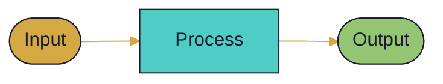

# {{ file.basename }}

```dataviewjs
// Auto-TOC with section map
const content = await dv.io.load(dv.current().file.path);
const lines = content.split('\n');
const headers = [];
let id = 0, inBlock = false;
for (const line of lines) {
    if (line.startsWith('```')) { inBlock = !inBlock; continue; }
    if (inBlock) continue;
    const m = line.match(/^(#{2,4})\s+(.+)$/);
    if (m) headers.push({ level: m[1].length, text: m[2].replace(/[`*[\]]/g,'').trim(), id:'N'+(id++) });
}
const FILL = { 2:'#D4A843', 3:'#4ECDC4', 4:'#93C572' };
let mmd = '```mermaid\ngraph LR\n';
headers.forEach(h => {
    const lbl = h.text.length > 25 ? h.text.slice(0,22)+'…' : h.text;
    mmd += `  ${h.id}["${lbl}"]\n  style ${h.id} fill:${FILL[h.level]||'#aaa'},color:#1a1a2e\n`;
});
const stack = [];
headers.forEach(h => {
    while (stack.length && stack[stack.length-1].level >= h.level) stack.pop();
    if (stack.length) mmd += `  ${stack[stack.length-1].id} --> ${h.id}\n`;
    stack.push(h);
});
mmd += '```';
dv.paragraph(mmd);
```

---


<!-- What are we trying to solve? What breaks without this? 2-4 sentences. -->



- <!-- What can we NOT do? -->
- <!-- What must stay the same? -->
- <!-- Time, budget, or compatibility limits -->




### Approach

<!-- The chosen solution in plain language. What does it do? How does it work? -->

### Flow



### What Changes

| Before | After |
|--------|-------|
| | |





| Option | Why rejected |
|--------|-------------|
| | |




- **{{ moment().format('YYYY-MM-DD') }}** —



- [ ]
- [ ]



<!-- Human notes, corrections, ideas — append-only -->

