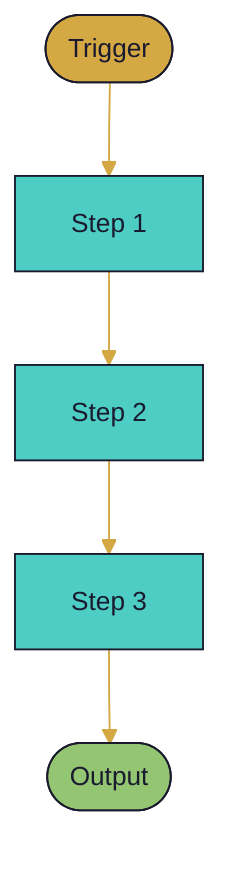

# How {{NAME}} Works

> One sentence: what does this process accomplish from end to end?

```dataviewjs
// Auto-TOC with section map
const content = await dv.io.load(dv.current().file.path);
const lines = content.split('\n');
const headers = [];
let id = 0, inBlock = false;
for (const line of lines) {
    if (line.startsWith('```')) { inBlock = !inBlock; continue; }
    if (inBlock) continue;
    const m = line.match(/^(#{2,4})\s+(.+)$/);
    if (m) headers.push({ level: m[1].length, text: m[2].replace(/[`*[\]]/g,'').trim(), id:'N'+(id++) });
}
const FILL = { 2:'#D4A843', 3:'#4ECDC4', 4:'#93C572' };
let mmd = '```mermaid\ngraph TD\n';
headers.forEach(h => {
    const lbl = h.text.length > 22 ? h.text.slice(0,19)+'…' : h.text;
    mmd += `  ${h.id}["${lbl}"]\n  style ${h.id} fill:${FILL[h.level]||'#aaa'},color:#1a1a2e\n`;
});
const stack = [];
headers.forEach(h => {
    while (stack.length && stack[stack.length-1].level >= h.level) stack.pop();
    if (stack.length) mmd += `  ${stack[stack.length-1].id} --> ${h.id}\n`;
    stack.push(h);
});
mmd += '```';
dv.paragraph(mmd);
```

---

## Overview

<!-- 2-3 sentences: what happens at a high level, what triggers it, what it produces. -->

## The Full Flow



## Phase Breakdown

### Phase 1 — <!-- name -->

**What happens:** <!-- description -->
**Inputs:** <!-- what it reads -->
**Outputs:** <!-- what it writes or produces -->

### Phase 2 — <!-- name -->

**What happens:**
**Inputs:**
**Outputs:**

### Phase 3 — <!-- name -->

**What happens:**
**Inputs:**
**Outputs:**

## Data Flow

| Component | Reads | Writes |
|-----------|-------|--------|
| | | |
| | | |

## Key Files

| File / Path | What it is |
|-------------|-----------|
| | |
| | |

## Error Handling

| What fails | What happens |
|-----------|-------------|
| | |

## Verify It's Working

```bash
# command to check status
```

---

*See also: [[<!-- related -->]]*
