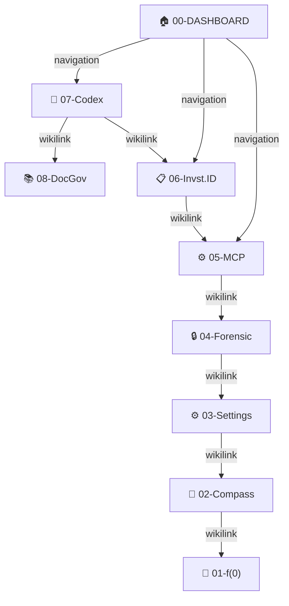

# 🧬 Vault Architecture — Braiding, Discovery & Visualization

**ARCHIVED:** This document has been consolidated into [[01-forensic-governance.md]]. See that document for the current, authoritative version.

**Breadcrumb:** [[00-DASHBOARD]] > [[01-forensic-governance]] > Vault Architecture section

---

# 🧬 Vault Architecture — Braiding, Discovery & Visualization

**Breadcrumb:** [[00-DASHBOARD]] > [[09-vault-architecture]]

> **Purpose:** How to organize, link, and visualize vault docs so they form a coherent knowledge graph.

---

## 🕸️ The Braiding Pattern (Wikilinks + Breadcrumbs)

Every vault doc is braided via wikilinks. This creates a traversable web, not a linear list.

```
                        ┌─────────────────────┐
                        │  00-DASHBOARD       │
                        │  (Navigation Hub)   │
                        └────────┬────────────┘
                                 │
         ┌───────────────────────┼───────────────────────┐
         │                       │                       │
         ▼                       ▼                       ▼
   ┌──────────────┐       ┌──────────────┐       ┌──────────────┐
   │ 07-Codex     │       │ 06-Invst.ID  │       │ 05-MCP-Arch  │
   │ (Core Terms) │       │ (Governance) │       │ (Live Deploy)│
   └─────┬────────┘       └──────┬───────┘       └──────┬───────┘
         │                       │                      │
         │ wikilink:             │ wikilink:            │ wikilink:
         │ "phase vs gate"       │ "earned status"      │ "latency SLA"
         │                       │                      │
         ▼                       ▼                      ▼
   ┌──────────────┐       ┌──────────────┐       ┌──────────────┐
   │ 08-DocGov    │       │ 03-Settings  │       │ 04-Forensic  │
   │ (Cascade)    │       │ (Sync)       │       │ (COC)        │
   └──────────────┘       └──────────────┘       └──────────────┘
         │                       │                      │
         └───────────────────────┼──────────────────────┘
                                 │
                        ┌────────▼─────────┐
                        │ 02-Compass Nav   │
                        │ (Routing Logic)  │
                        └────────┬─────────┘
                                 │
                        ┌────────▼──────────────┐
                        │ 01-f(0) Orch.        │
                        │ (Context Burden)     │
                        └──────────────────────┘
```

---

## 📑 Canonical Doc Relationships

Each canonical doc states its **wikilinks** (upward and sideways) and **related docs** (downward).

| Doc | Type | Links To | Related By |
|---|---|---|---|
| **07-Codex** | Reference | 08-DocGov, 06-Invst.ID | Defines all terms |
| **08-DocGov** | System | 07-Codex, 00-Dashboard | Enforces document cascade |
| **06-Invst.ID** | Governance | 07-Codex, 05-MCP | Lifecycle + validation |
| **05-MCP** | Architecture | 06-Invst.ID, 04-Forensic | Live deployment |
| **04-Forensic** | Governance | 05-MCP, 03-Settings | Write permissions + COC |
| **03-Settings** | Architecture | 04-Forensic, 02-Compass | Global/project sync |
| **02-Compass** | Navigation | 07-Codex, 01-f(0) | Phase gates + routing |
| **01-f(0)** | Theory | 02-Compass | Context burden formula |

---

## 🔍 Discoverability — Three Patterns

### Pattern 1: Breadcrumb Navigation
Every doc has a breadcrumb at the top:

```markdown
**Breadcrumb:** [[00-DASHBOARD]] > [[07-work-hierarchy-codex]] > [optional-subsection]
```

Readers can navigate UP to parent docs or across to siblings.

### Pattern 2: Wikilinks (Inline References)
When one doc mentions a concept from another, it wikilinks:

```markdown
See [[06-investigation-id-governance]] for how investigation_label earns status.
Phase gates (SEED/DEEPEN/EXTEND) are orthogonal to phases (N/S/E/W) — see [[07-work-hierarchy-codex]].
```

Readers follow wikilinks to deepen understanding.

### Pattern 3: Related Section (Footer)
Every canonical doc ends with:

```markdown
---
**Related:** [[doc1]], [[doc2]], [[doc3]]
**Status:** Canonical | LOCKED | Last Updated: YYYY-MM-DD HH:MM UTC
```

---

## 📊 Knowledge Graph Structure (Concept Map)

The vault forms a **concept map**. Nodes are docs. Edges are wikilinks. Two visualization levels:

### Level 1: Doc-to-Doc (Macro Structure)
```
┌─────────────────────────────────────────┐
│ Vault as a DAG                          │
│                                         │
│ ROOT: 00-DASHBOARD (navigation entry)   │
│ ├─ TIER-1: 07 Codex, 06 Invst.ID        │
│ ├─ TIER-2: 08 DocGov, 05 MCP, 04 Forc   │
│ ├─ TIER-3: 03 Settings, 02 Compass      │
│ └─ TIER-4: 01 f(0)                      │
│                                         │
│ Edges: Wikilinks + "Related" sections   │
└─────────────────────────────────────────┘
```

**Query:** `grep -r "\[\[.*\]\]" CT_VAULT/2026-04-28/*.md | sort | uniq` = All wikilinks (graph edges)

### Level 2: Concept-to-Concept (Micro Structure)
Within each doc, concepts are tagged and linked:

```markdown
## 🎯 MISSION (investigation_label + coherence + status)
**Tags:** #mission #investigation-label #coherence #canonical

Cross-references:
- See [[06-investigation-id-governance]] for validation criteria
- See [[07-work-hierarchy-codex#LL.EOF]] for hierarchy definition
- See [[08-documentation-governance]] for canonical vs. derived docs
```

---

## 🎨 Narrative Review — "How We Got Here" Story

When vault achieves critical mass, create a **narrative walkthrough** doc:

```markdown
# Narrative: How Faerie2 Came To Be (Braided Vault Story)

## Chapter 1: Terminology Crisis (Why 07-Codex?)
  Background: Agents used "phase", "stage", "task", "step" inconsistently → amnesia
  Solution: Create canonical codex defining all terms
  Doc: [[07-work-hierarchy-codex]]

## Chapter 2: Investigation Drift (Why 06-Invst.ID?)
  Problem: investigation_labels were arbitrary, no validation
  Solution: Earn status through validation + selection pressure
  Doc: [[06-investigation-id-governance]]

## Chapter 3: Document Explosion (Why 08-DocGov?)
  Problem: 10+ docs, no one knew which was canonical
  Solution: Single source of truth + cascade to repo/droplets
  Doc: [[08-documentation-governance]]

## Chapter 4: MCP Server Visibility (Why 05-MCP?)
  Need: Live dashboard available to beta testers
  Design: Stateless read-only server on VPS/ZimaBoard
  Doc: [[05-mcp-server-architecture]]

[... etc for chapters 5, 6, 7, 8 ...]
```

**Purpose:** Shows HOW the system was designed, not just WHAT it is.

---

## 📈 Graph Visualization (Using Mission Graph Folder)

To visualize the vault as a graph:

### Step 1: Create Vault Manifest Files
Generate manifest files for each canonical doc in `forensics/manifests/`:

```json
{
  "task_id": "doc-07-codex",
  "investigation_label": "canonical-vault-architecture",
  "agent_type": "documentation-engineer",
  "status": "completed",
  "dashboard_line": "Work hierarchy codex: defines mission/phase/task/artifact terminology",
  "compass_edge": "S",
  "next_task": "doc-08-docgov",
  "artifacts": ["CT_VAULT/2026-04-28/07-work-hierarchy-codex.md"],
  "relationships": {
    "wikilinks_to": ["06-investigation-id-governance", "08-documentation-governance"],
    "wikilinks_from": ["00-dashboard", "06-investigation-id-governance"],
    "related": ["08-documentation-governance", "06-investigation-id-governance"]
  },
  "metadata": {
    "doc_type": "canonical",
    "tier": 1,
    "locked": true,
    "concept_tags": ["terminology", "hierarchy", "codex", "mission", "phase", "task"]
  }
}
```

### Step 2: Run Graph Visualization Query
Use mission graph to render doc relationships:

```bash
python3 0x_mission_graph.py --query topology --filter investigation_label=canonical-vault-architecture
```

**Output:** Shows doc DAG with concepts and edges.

### Step 3: Generate GraphViz or Mermaid Diagram
Agent can parse manifests and generate visualization:

```bash
python3 scripts/vault_graph_renderer.py --format mermaid --output vault-graph.md
```

**Generated:**


---

## 🔗 Obsidian Configuration (For Vault Viewing)

To maximize vault clarity in Obsidian:

### 1. Graph View Settings
```
// In Obsidian settings > Community Plugins > Graph

{
  "showAttachments": false,
  "hideUnresolved": false,
  "colorGroups": [
    { "query": "tag:#canonical", "color": "#00ff00" },
    { "query": "tag:#system-dynamics", "color": "#ff9900" },
    { "query": "tag:#ephemeral", "color": "#cccccc" }
  ]
}
```

### 2. Dataview Queries (For Tables)
```markdown
### Canonical Docs Index
\`\`\`dataview
table file.mtime as "Updated", tags as "Tags", description as "Purpose"
from "CT_VAULT/2026-04-28"
where file.name contains "-"
sort file.mtime desc
\`\`\`

### Wikilink Map
\`\`\`dataview
table rows.L.text as "Links To", length(rows) as "Count"
from "CT_VAULT/2026-04-28"
where outgoing([[07-work-hierarchy-codex]])
\`\`\`
```

### 3. Metabind Buttons (For Quick Actions)
```markdown
[[+hidden+]]
<!-- Create Investigation Template -->
---
\`\`\`button
name Create New Investigation
type note
action newPage
template "CT_VAULT/00-SHARED/Templates/investigation.md"
templater true
\`\`\`
```

---

## 📂 Vault Folder Structure (For Organization)

```
CT_VAULT/
├── 2026-04-28/                          (Daily session folder)
│   ├── 00-DASHBOARD.md                  (Navigation hub)
│   ├── 01-f0-orchestration.md           (Canonical: theory)
│   ├── 02-compass-navigation.md         (Canonical: routing)
│   ├── 03-settings-sync.md              (Canonical: infrastructure)
│   ├── 04-forensic-governance.md        (Canonical: governance)
│   ├── 05-mcp-architecture.md           (Canonical: deployment)
│   ├── 06-investigation-id.md           (Canonical: governance)
│   ├── 07-work-hierarchy-codex.md       (Canonical: terminology)
│   ├── 08-documentation-governance.md   (Canonical: system)
│   ├── 09-vault-architecture.md         (Canonical: organization)
│   └── (future 10+)
│
├── 00-SHARED/
│   ├── Droplets/                        (Ephemeral insights, session-to-session)
│   │   ├── 2026-04-25-093000_clustering.md
│   │   ├── 2026-04-26-142200_gates.md
│   │   └── ...
│   ├── Templates/
│   │   ├── investigation.md             (Metabind template for /new investigations)
│   │   ├── task-report.md               (Agent task template)
│   │   └── ...
│   └── Archive/
│       ├── 2026-04-23-PREV/             (Previous day's docs, archived)
│       └── ...
```

---

## 🎯 Braiding Quality Metrics

How to measure if vault is well-braided:

| Metric | Good | Bad |
|--------|------|-----|
| **Avg wikilinks per doc** | 3-5 | 0 or >10 |
| **Doc discoverability** | Reachable in ≤3 hops from 00-DASHBOARD | Dead-end docs, >5 hops to find |
| **Concept coverage** | Every core concept appears in multiple docs (cross-referenced) | Concepts siloed in one doc |
| **Narrative coherence** | Docs form a story (Chapter 1→2→3) | Random ordering, no logical flow |
| **Backlink coverage** | Most docs are referenced from elsewhere | Many orphaned docs |
| **Concept tag usage** | Consistent tags across docs | Inconsistent, no indexing |

---

## 🚀 Evolution Roadmap

| Phase | Milestone | Effort |
|---|---|---|
| **Phase 1 (DONE)** | Create core canonical docs (07, 06, 08) | 3 sessions |
| **Phase 2 (NEXT)** | Complete canonical stack (05, 04, 03, 02, 01) | 5 sessions |
| **Phase 3** | Build narrative walkthrough (show "how we got here") | 1 session |
| **Phase 4** | Generate graph visualization (GraphViz/Mermaid) | 1 session |
| **Phase 5** | Obsidian graph view optimization + dataview tables | 1 session |
| **Phase 6** | Publish derived repo docs (sanitized summaries) | 2 sessions |

---

## 🔗 References

- [[00-DASHBOARD]] — Vault entry point
- [[07-work-hierarchy-codex]] — Terminology foundation
- [[08-documentation-governance]] — Cascade rules
- `forensics/investigations-registry.json` — Doc relationships as mission graph

---

**Last Updated:** 2026-04-28 14:45 UTC  
**Status:** ARCHITECTURE GUIDE — How to organize and visualize vault content  
**Related:** [[00-DASHBOARD]], [[08-documentation-governance]], [[07-work-hierarchy-codex]]
